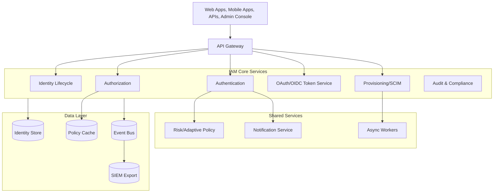

# Architecture Diagram

```mermaid
flowchart TB
    Channels[Web Apps, Mobile Apps, APIs, Admin Console] --> Edge[API Gateway]

    subgraph IAMCore[IAM Core Services]
      Identity[Identity Lifecycle]
      Authentication[Authentication]
      Authorization[Authorization]
      Token[OAuth/OIDC Token Service]
      Provisioning[Provisioning/SCIM]
      Audit[Audit & Compliance]
    end

    Edge --> Identity
    Edge --> Authentication
    Edge --> Authorization
    Edge --> Token
    Edge --> Provisioning

    subgraph Shared[Shared Services]
      Risk[Risk/Adaptive Policy]
      Notify[Notification Service]
      Jobs[Async Workers]
    end

    Authentication --> Risk
    Authentication --> Notify
    Provisioning --> Jobs

    subgraph Data[Data Layer]
      DB[(Identity Store)]
      Cache[(Policy Cache)]
      MQ[(Event Bus)]
      SIEM[(SIEM Export)]
    end

    IAMCore --> DB
    Authorization --> Cache
    IAMCore --> MQ
    MQ --> SIEM
```
