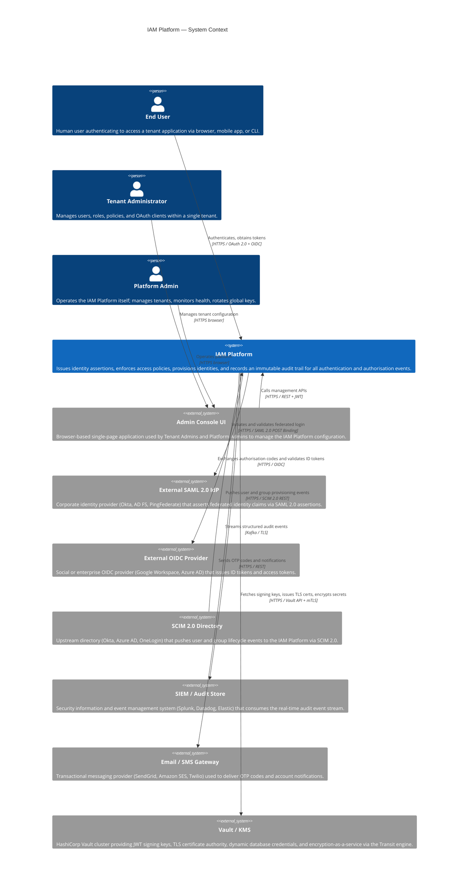

# IAM Platform — C4 Diagrams

## Level 1 — System Context

The System Context diagram shows the IAM Platform as a single black-box system, the external users who interact with it, and the external systems it depends on or integrates with.

---

## Level 2 — Container Diagram

The Container diagram decomposes the IAM Platform into its deployable units, showing how they communicate internally and where they store data.

```mermaid
C4Container
    title IAM Platform — Container Diagram

    Person(endUser, "End User", "Authenticates via browser, mobile, or CLI")
    Person(tenantAdmin, "Tenant / Platform Admin", "Manages configuration via Admin Console")

    System_Boundary(iam, "IAM Platform") {

        Container(apiGateway, "API Gateway", "Kong / AWS API Gateway, Lua plugins", "Single ingress point. Terminates TLS, validates JWTs, enforces rate limits, routes to upstream services. Hosts the Policy Enforcement Point plugin.")

        Container(authService, "Auth Service", "Go 1.22, gRPC + REST, Kubernetes Deployment", "Handles credential-based login, bcrypt password verification, account status checks, MFA orchestration, and co-ordinates session and token issuance. Stateless.")

        Container(mfaService, "MFA Service", "Go 1.22, gRPC, Kubernetes Deployment", "Manages MFA factor enrolment (TOTP, FIDO2/WebAuthn, SMS, Email OTP), generates and validates challenges, enforces anti-replay nonces, and reports assurance level.")

        Container(policyService, "Policy Service (PDP + PAP)", "Go 1.22 + OPA 0.63, gRPC + REST, Kubernetes Deployment", "Policy Decision Point evaluates ABAC/RBAC policies using OPA. Policy Administration Point provides CRUD APIs for policy authoring, versioning, and dry-run simulation.")

        Container(tokenService, "Token Service", "Go 1.22, gRPC + REST, Kubernetes Deployment", "Issues and validates JWTs (RS256 / ES256) and opaque refresh tokens. Manages refresh token families, rotation, and reuse detection. Signs tokens via Vault Transit engine.")

        Container(userService, "User Service", "Go 1.22, gRPC + REST, Kubernetes Deployment", "User lifecycle CRUD, bcrypt password management, account status transitions (active / suspended / locked), group membership, and password policy enforcement.")

        Container(sessionManager, "Session Manager", "Go 1.22, gRPC + REST, Kubernetes Deployment", "Creates, validates, and revokes distributed sessions stored in Redis. Enforces idle and absolute timeouts. Supports concurrent-session limits per tenant policy.")

        Container(scimService, "SCIM Adapter", "Go 1.22, REST (SCIM 2.0), Kubernetes Deployment", "Accepts inbound SCIM 2.0 requests from upstream directories. Validates schemas, checks idempotency, resolves conflicts, and delegates to User Service for persistence.")

        Container(federationService, "Federation Service", "Go 1.22, REST, Kubernetes Deployment", "SAML 2.0 Service Provider and Identity Provider roles. OIDC Relying Party. Validates assertions, maps claims, performs JIT provisioning, and issues a platform session.")

        Container(auditService, "Audit Service", "Go 1.22, Kafka producer, Kubernetes Deployment", "Serialises structured audit events (Avro schema) and publishes them to Kafka. Buffers events in-process on transient broker failure with bounded memory. Does not block the request path.")

        Container(adminUI, "Admin Console UI", "React 18, TypeScript, Nginx, Kubernetes Deployment", "Browser SPA for tenant administrators and platform operators. Calls IAM REST APIs using a machine-to-machine OAuth 2.0 client credential flow with a scoped access token.")

        ContainerDb(postgres, "PostgreSQL 15", "PostgreSQL, 1 Primary + 2 Read Replicas, PgBouncer", "Persistent store for users, tenants, roles, policies, OAuth clients, refresh token families, SCIM state, and SAML/OIDC provider configurations. Row Level Security enforces tenant isolation.")

        ContainerDb(redis, "Redis Cluster 7", "Redis Cluster, 3 Shards × 2 Replicas", "Volatile cache for active sessions, token revocation lists, OTP anti-replay nonces, policy decision cache, and per-client rate-limit counters. All keys namespaced by tenant_id.")

        ContainerDb(kafka, "Kafka Cluster", "Apache Kafka 3.6, 3 Brokers, RF=3", "Durable event bus. Topics: iam.audit (append-only, 7-year retention), iam.policy.changes (trigger PDP cache invalidation), iam.provisioning (SCIM events), iam.tokens (token issuance events).")

        ContainerDb(vault, "HashiCorp Vault", "HashiCorp Vault 1.15, 3-node Raft HA", "JWT signing keys via Transit engine (RS256 + ES256). Internal TLS PKI with 24-hour certificate TTL. Dynamic PostgreSQL credentials (1-hour TTL). TOTP seed encryption. Auto-unseal via cloud KMS.")
    }

    System_Ext(samlIdp, "External SAML IdP", "Okta / AD FS")
    System_Ext(oidcProvider, "External OIDC Provider", "Google / Azure AD")
    System_Ext(scimDirectory, "SCIM Directory", "Okta / Azure AD")
    System_Ext(siemStore, "SIEM", "Splunk / Datadog")
    System_Ext(emailSmsGw, "Email / SMS Gateway", "SendGrid / Twilio")

    %% External users to edge
    Rel(endUser, apiGateway, "POST /auth/login, POST /auth/token, GET /userinfo", "HTTPS / OAuth 2.0")
    Rel(tenantAdmin, adminUI, "Browser interaction", "HTTPS")
    Rel(adminUI, apiGateway, "Management API calls", "HTTPS / REST + JWT")

    %% Gateway routing
    Rel(apiGateway, authService, "Route /auth/**", "gRPC / mTLS")
    Rel(apiGateway, federationService, "Route /federation/**", "HTTP / mTLS")
    Rel(apiGateway, scimService, "Route /scim/**", "HTTP / mTLS")
    Rel(apiGateway, policyService, "PEP policy check on every request", "gRPC / mTLS")
    Rel(apiGateway, tokenService, "Route /auth/introspect, /auth/refresh", "gRPC / mTLS")

    %% Auth Service dependencies
    Rel(authService, userService, "Validate credentials, fetch account status", "gRPC / mTLS")
    Rel(authService, mfaService, "Initiate and verify MFA challenge", "gRPC / mTLS")
    Rel(authService, sessionManager, "Create session", "gRPC / mTLS")
    Rel(authService, tokenService, "Issue access and refresh tokens", "gRPC / mTLS")
    Rel(authService, auditService, "Emit LoginAttempt, LoginSuccess, LoginFailure events", "gRPC / mTLS")
    Rel(mfaService, emailSmsGw, "Send OTP via email or SMS", "HTTPS / REST")

    %% Federation
    Rel(federationService, samlIdp, "SAMLRequest / SAMLResponse", "HTTPS / SAML 2.0")
    Rel(federationService, oidcProvider, "Authorization code exchange, JWKS fetch", "HTTPS / OIDC")
    Rel(federationService, userService, "JIT provision or link account", "gRPC / mTLS")
    Rel(federationService, sessionManager, "Create federated session", "gRPC / mTLS")

    %% SCIM
    Rel(scimDirectory, scimService, "SCIM 2.0 Create/Update/Delete user + group", "HTTPS / SCIM 2.0")
    Rel(scimService, userService, "Provision, update, deprovision users", "gRPC / mTLS")

    %% Data stores
    Rel(userService, postgres, "R/W user records (primary + replica reads)", "PostgreSQL wire / TLS")
    Rel(policyService, postgres, "R/W policy definitions", "PostgreSQL wire / TLS")
    Rel(tokenService, postgres, "R/W refresh token families", "PostgreSQL wire / TLS")
    Rel(sessionManager, redis, "R/W session TTL entries", "Redis cluster / TLS")
    Rel(tokenService, redis, "Write revocation list, read token cache", "Redis cluster / TLS")
    Rel(policyService, redis, "Read/write policy decision cache", "Redis cluster / TLS")
    Rel(tokenService, vault, "Sign and verify JWT via Transit engine", "HTTPS / Vault API + mTLS")
    Rel(auditService, kafka, "Publish to iam.audit topic", "Kafka protocol / TLS")
    Rel(policyService, kafka, "Publish PolicyChanged; consume to invalidate cache", "Kafka protocol / TLS")
    Rel(kafka, siemStore, "Stream iam.audit events", "Kafka Connect / TLS")
```

---

## 3. C4 Quality Attributes

### 3.1 Availability Targets

| Container | Availability Target | Mechanism |
|---|---|---|
| API Gateway | 99.95% | Multi-AZ deployment; rolling updates with zero-downtime drain; health checks on every upstream |
| Auth Service | 99.95% | HPA min 3 replicas; PodDisruptionBudget max-unavailable=1; readiness probe on Vault and PostgreSQL |
| MFA Service | 99.90% | HPA min 2 replicas; SMS provider circuit-breaker falls back to email OTP |
| Policy Service (PDP) | 99.95% | HPA min 3 replicas; 60 s warm Redis cache serves decisions during brief PDP unavailability |
| Token Service | 99.95% | HPA min 3 replicas; Vault connection pool with retry; refuses to issue tokens if Vault unreachable |
| User Service | 99.95% | HPA min 2 replicas; read queries directed to PG replicas |
| Session Manager | 99.95% | HPA min 2 replicas; all state in Redis Cluster (no local state) |
| SCIM Adapter | 99.90% | HPA min 2 replicas; idempotent operations safe to retry |
| Federation Service | 99.90% | HPA min 2 replicas; SAML/OIDC provider metadata cached in Redis |
| Audit Service | 99.99% | HPA min 3 replicas; in-memory bounded buffer absorbs transient Kafka broker failure |
| PostgreSQL | 99.95% | Streaming replication to 2 replicas; automated failover via Patroni / RDS Multi-AZ |
| Redis Cluster | 99.95% | 3 shards × 2 replicas; automatic slot migration on node failure |
| Kafka | 99.95% | 3 brokers; RF=3; min ISR=2; rack-aware partition assignment |
| HashiCorp Vault | 99.99% | 3-node Raft HA; auto-unseal via AWS KMS / GCP Cloud KMS |

### 3.2 Latency Budgets

| Container | p50 Target | p99 Target | Notes |
|---|---|---|---|
| API Gateway | 2 ms | 10 ms | Routing + JWT validation only |
| Auth Service (password login) | 80 ms | 250 ms | Dominated by bcrypt cost factor 12 (≈ 60–80 ms CPU) |
| MFA Service (TOTP verify) | 5 ms | 20 ms | HMAC-SHA1 is sub-millisecond; latency from Redis nonce check |
| Policy Decision Point (cache hit) | 1 ms | 5 ms | OPA partial eval + Redis read |
| Policy Decision Point (cache miss) | 10 ms | 40 ms | PostgreSQL query + OPA evaluation |
| Token Service (JWT sign) | 5 ms | 15 ms | Vault Transit encrypt latency |
| Session Manager (create) | 3 ms | 10 ms | Single Redis HSET + EXPIRE |
| Session Manager (validate) | 1 ms | 5 ms | Single Redis HGET |
| User Service (read) | 5 ms | 20 ms | PostgreSQL replica read |
| User Service (write) | 10 ms | 30 ms | PostgreSQL primary write + replication |
| End-to-end login (password + TOTP) | 120 ms | 350 ms | Sum of Auth + MFA + Session + Token + Audit paths |
| End-to-end token refresh | 20 ms | 60 ms | Token Service + Session Manager + Audit |

### 3.3 Scaling Approach

| Container | Scaling Trigger | Min Replicas | Max Replicas | Notes |
|---|---|---|---|---|
| API Gateway | RPS per pod > 5 000 | 3 | 20 | Kong DP nodes; CP is separate and not on hot path |
| Auth Service | CPU > 70% | 3 | 30 | bcrypt is CPU-bound; scale on CPU |
| MFA Service | CPU > 60% | 2 | 10 | Scale on CPU; provider connection pool per pod |
| Policy Service (PDP) | CPU > 65% or QPS > 2 000 | 3 | 20 | Scale aggressively; PEP latency budget is tight |
| Token Service | CPU > 60% | 3 | 15 | Vault Transit throughput is the primary constraint |
| User Service | CPU > 70% | 2 | 10 | Read-heavy; replicas absorb read scale |
| Session Manager | CPU > 60% | 2 | 10 | All state external; horizontal trivially safe |
| SCIM Adapter | Queue depth > 1 000 | 2 | 8 | Scale on Kafka consumer lag for batch jobs |
| Federation Service | CPU > 60% | 2 | 10 | Assertion validation is CPU-bound (RSA verify) |
| Audit Service | Kafka producer lag > 500 ms | 3 | 15 | Scale on producer buffer latency |
