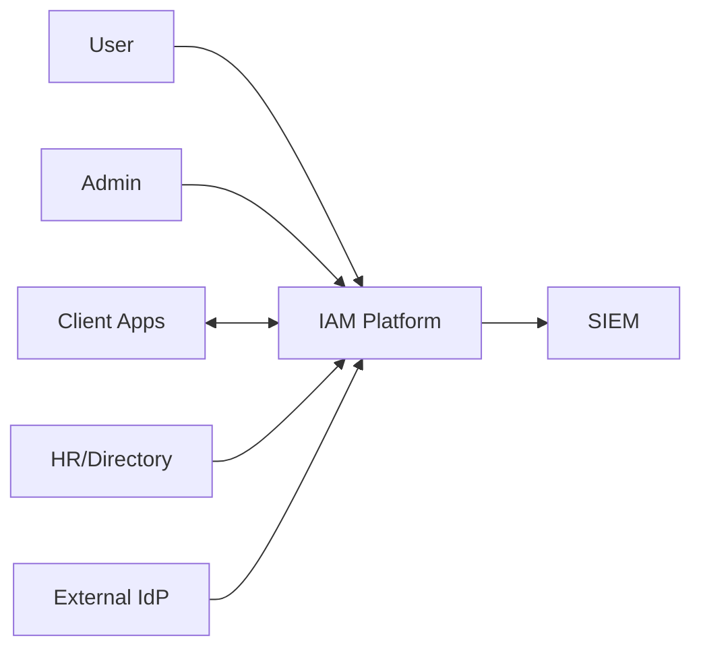
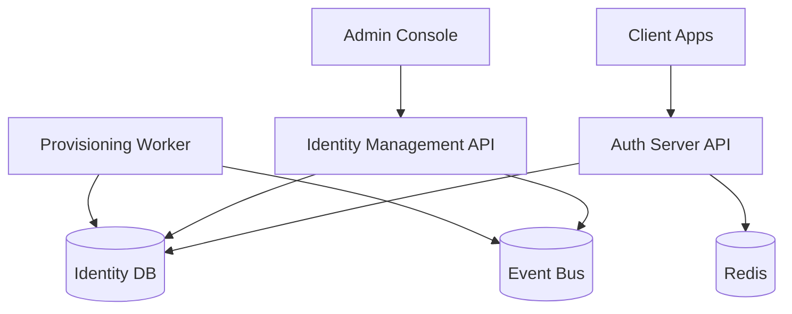

# C4 Diagrams

## C1 Context

```mermaid
flowchart LR
    User[User] --> IAM[IAM Platform]
    Admin[Admin] --> IAM
    Apps[Client Apps] <--> IAM
    HR[HR/Directory] --> IAM
    IAM --> SIEM[SIEM]
    IdP[External IdP] --> IAM
```

## C2 Containers

```mermaid
flowchart TB
    Console[Admin Console]
    AS[Auth Server API]
    Mgmt[Identity Management API]
    Worker[Provisioning Worker]
    DB[(Identity DB)]
    Cache[(Redis)]
    MQ[(Event Bus)]

    Console --> Mgmt
    Apps[Client Apps] --> AS
    AS --> DB
    Mgmt --> DB
    AS --> Cache
    Mgmt --> MQ
    Worker --> MQ
    Worker --> DB
```
