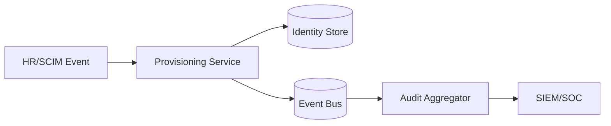

# Data Flow Diagrams

## Authentication and Token Flow
```mermaid
flowchart LR
    Client[Client App] --> Authz[/authorize]
    Authz --> Login[Credential + MFA Validation]
    Login --> Code[Authorization Code]
    Code --> Token[/token Exchange]
    Token --> Access[(Access/Refresh Tokens)]
    Access --> Resource[Protected API]
```

## Provisioning and Audit Flow

