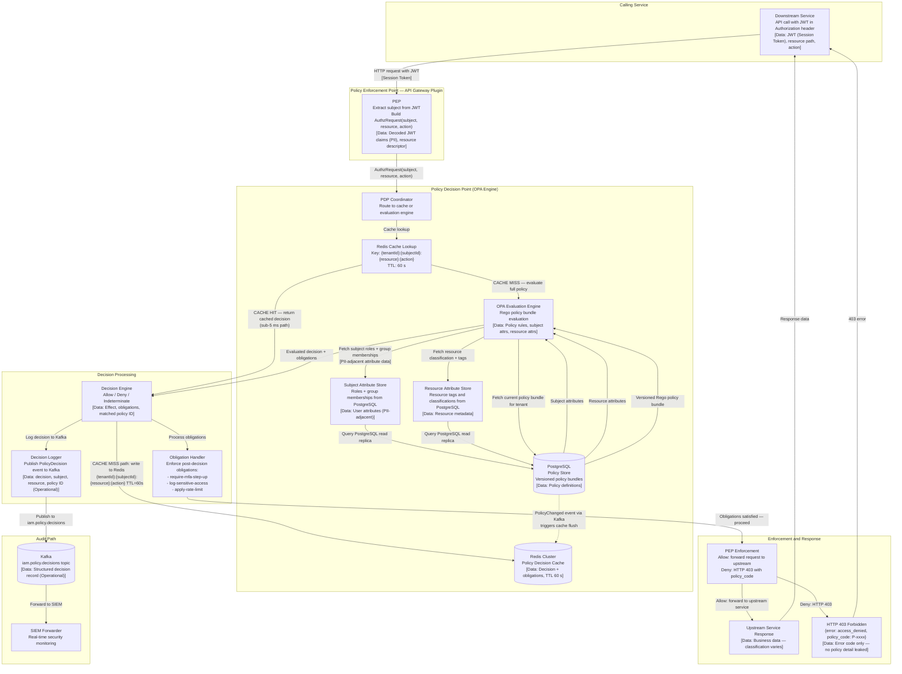
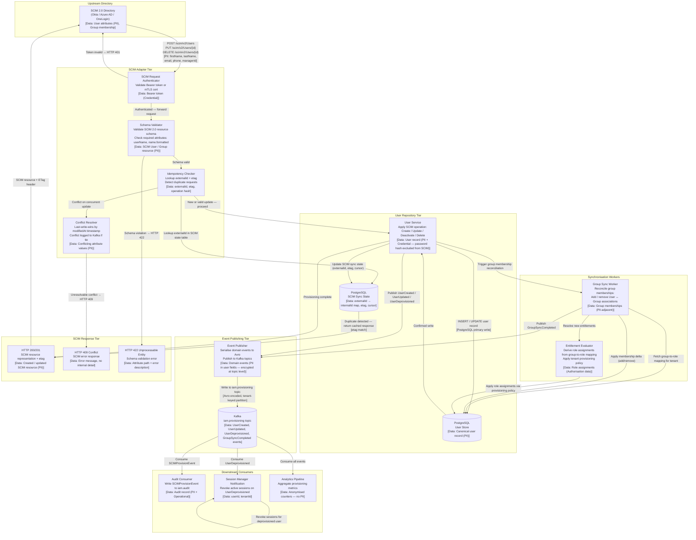

# IAM Platform — Data Flow Diagrams

## 1. Authentication Data Flow

This diagram shows how a credential-based authentication request travels through the system from initial client submission to final token delivery. Data classification labels indicate the sensitivity of each data element in transit.

```mermaid
flowchart TD
    subgraph CLIENT["Client Tier"]
        C["Browser / Mobile App / CLI\n[Data: Username + Password (PII + Credential)]"]
    end

    subgraph EDGE["Edge Tier"]
        GW["API Gateway\n[Kong / AWS API GW]\nTLS Termination · Rate Limit · WAF Rules"]
        RATELIMIT["Rate Limiter\nPer-IP sliding window counter\n[Data: IP address (PII)]"]
    end

    subgraph AUTH_TIER["Authentication Tier"]
        AC["Auth Controller\n[Data: Normalised email, bcrypt hash (Credential)]"]
        CV["Credential Validator\ncompare(bcrypt, hash, cost=12)\n[Data: Password hash (Credential — never stored in plaintext)]"]
        RE["Risk Engine\nDevice fingerprint · IP geo · Velocity\n[Data: Behavioural signals (PII-adjacent)]"]
        MFA_ORCH["MFA Orchestrator\nTOTP · FIDO2 · SMS · Email OTP\n[Data: OTP code (Credential), TOTP seed (Credential — encrypted at rest)]"]
    end

    subgraph SESSION_TOKEN["Session and Token Tier"]
        SM["Session Manager\nCreate session record\n[Data: Session ID (Session Token), user context]"]
        TS["Token Service\nSign JWT via Vault Transit (RS256)\n[Data: JWT (Session Token), Refresh Token (Credential-class token)]"]
    end

    subgraph STORAGE["Storage Tier"]
        PG_USER[("PostgreSQL\nUser Store\n[Data: User record, password hash, MFA config (PII + Credential)]")]
        REDIS_SESSION[("Redis Cluster\nSession + Token Cache\n[Data: Session record (Session Token), revocation list]")]
        VAULT_KEY[("HashiCorp Vault\nJWT Signing Keys\n[Data: RSA/EC private key (Credential — never leaves Vault)]")]
        KAFKA_AUDIT[("Kafka\niam.audit topic\n[Data: Structured audit events (PII + Operational)]")]
    end

    subgraph RESPONSE["Response Tier"]
        RESP["HTTP 200 Response\n[Data: access_token (JWT), refresh_token (Opaque),\ntoken_type, expires_in, session_id]"]
        ERR401["HTTP 401 / 403\n[Data: error code only — no credential detail leaked]"]
    end

    %% Request ingress
    C -->|"POST /auth/login\n{email, password}\nHTTPS · TLS 1.3"| GW
    GW -->|"Check rate limit counter"| RATELIMIT
    RATELIMIT -->|"429 Too Many Requests"| C
    RATELIMIT -->|"Within limit — forward request"| AC

    %% Credential validation
    AC -->|"Fetch user record by normalised email\n[PostgreSQL read replica]"| PG_USER
    PG_USER -->|"User record + password hash\n[Credential — in-memory only]"| AC
    AC -->|"bcrypt.Compare(provided, storedHash)"| CV
    CV -->|"Credential mismatch → increment failed_login_count"| PG_USER
    CV -->|"Mismatch after N attempts → lock account"| PG_USER
    CV -->|"Credential invalid"| ERR401

    %% Risk scoring (parallel with account status check)
    AC -->|"IP, user-agent, device fingerprint\n[Behavioural signals]"| RE
    RE -->|"Risk score (0.0–1.0) + risk signals"| AC

    %% MFA decision
    AC -->|"High risk score OR tenant MFA policy requires it"| MFA_ORCH
    MFA_ORCH -->|"Fetch enrolled MFA devices\n[Credential — encrypted TOTP seed]"| PG_USER
    MFA_ORCH -->|"TOTP: HMAC-SHA1 challenge response\nAnti-replay nonce SETNX in Redis"| REDIS_SESSION
    MFA_ORCH -->|"SMS/Email: OTP delivery request"| C
    MFA_ORCH -->|"MFA failed → 401 with mfa_required context"| ERR401
    MFA_ORCH -->|"MFA verified — assurance level confirmed"| AC

    %% Session creation
    AC -->|"CreateSession(userId, tenantId, assuranceLevel, ip, ua)"| SM
    SM -->|"HSET session:{id} ... EXPIRE 28800\n[Session Token — scoped TTL]"| REDIS_SESSION
    SM -->|"Session ID"| AC

    %% Token issuance
    AC -->|"IssueTokens(userId, sessionId, scopes, tenantId)"| TS
    TS -->|"Sign JWT claims via Transit encrypt\n[Private key never leaves Vault]"| VAULT_KEY
    VAULT_KEY -->|"Signed JWT bytes\n[Session Token — short-lived 15 min]"| TS
    TS -->|"Store refresh token family record\n[Credential-class token]"| PG_USER
    TS -->|"Cache token JTI in revocation set\n[Session Token metadata]"| REDIS_SESSION
    TS -->|"access_token + refresh_token"| AC

    %% Audit event
    AC -->|"Emit LoginSucceeded event\n[PII: userId, tenantId, ip, ua, timestamp]"| KAFKA_AUDIT

    %% Successful response
    AC -->|"HTTP 200 + token payload\n[Session Token — transmitted over TLS only]"| RESP
    RESP -->|"Set-Cookie: refresh_token (HttpOnly, Secure, SameSite=Strict)\nBody: access_token, expires_in"| C
```

---

## 2. Authorization / Policy Evaluation Data Flow

This diagram shows how a downstream service request is authorised using the Policy Decision Point. The cache-hit path (left branch) and cache-miss path (right branch) are shown distinctly.

---

## 3. SCIM Provisioning Data Flow

This diagram shows how user and group lifecycle events from an upstream SCIM 2.0 directory flow through the platform to update user records, synchronise group memberships, and publish downstream events.

---

## 4. Data Protection Controls

### 4.1 Authentication Data Flow — Controls

| Data Element | Classification | In-Transit Control | At-Rest Control | Handling Constraint |
|---|---|---|---|---|
| Username (email) | PII | TLS 1.3 mandatory | Stored as normalised lowercase; not additionally encrypted | Never logged to application logs in plaintext |
| Password (raw) | Credential | TLS 1.3 mandatory | Never persisted; compared in-memory only | Zeroed from memory after bcrypt.Compare returns; not included in any log or trace |
| Password hash (bcrypt) | Credential | TLS 1.3 (DB wire) | Stored as bcrypt hash (cost 12) in PostgreSQL; column encrypted via Vault Transit | Never returned in any API response |
| TOTP seed | Credential | TLS 1.3 (DB wire) | AES-256-GCM via Vault Transit; stored as ciphertext | Never exposed outside the MFA Service; not included in audit events |
| Session ID | Session Token | TLS 1.3 · HttpOnly Secure cookie | Redis value encrypted with per-tenant key | 128-bit random; no user-inferrable data |
| JWT (access token) | Session Token | TLS 1.3 | Not stored; verified via public key | Claims must not include raw PII beyond `sub`, `email` (if requested scope) |
| Refresh token | Credential-class Token | TLS 1.3 · HttpOnly Secure cookie | PostgreSQL token family record; token value is SHA-256 hashed before storage | Rotated on every use; family revoked on reuse detection |
| Risk signals (IP, UA, fingerprint) | PII-adjacent | TLS 1.3 internal | Not persisted beyond risk score evaluation | Risk score stored; raw signals retained in audit only |

### 4.2 Authorization Data Flow — Controls

| Data Element | Classification | In-Transit Control | At-Rest Control | Handling Constraint |
|---|---|---|---|---|
| JWT claims (subject, tenant, scope) | PII + Session Token | mTLS between PEP and PDP | Not stored in PDP; passed as evaluation context | JWT must be re-validated on every request; PDP must not cache raw tokens |
| Policy rules (Rego bundles) | Operational | mTLS (PostgreSQL wire) | PostgreSQL encryption at rest | Policy bundles may not be returned in API responses to non-admin callers |
| Policy decision (Allow/Deny) | Operational | mTLS (gRPC) | Stored in Redis cache (60 s), then Kafka | Decision record must include policy ID for auditability |
| Resource path and parameters | Operational | mTLS | Included in Kafka decision record | Must be normalised before cache key generation to prevent cache-key injection |

### 4.3 SCIM Provisioning Data Flow — Controls

| Data Element | Classification | In-Transit Control | At-Rest Control | Handling Constraint |
|---|---|---|---|---|
| SCIM User resource (name, email, phone) | PII | TLS 1.3 (external) · mTLS (internal) | PostgreSQL column-level encryption for sensitive fields | PII fields must not appear in Kafka event payloads in plaintext; events use opaque IDs |
| SCIM Bearer token | Credential | TLS 1.3 | Stored as SHA-256 hash | Rotated every 90 days or on suspected compromise |
| External user ID (externalId) | PII-adjacent | TLS 1.3 (DB wire) | PostgreSQL; hashed for use as cache key | Must never be used as an authentication credential |
| SCIM sync cursor | Operational | TLS 1.3 (DB wire) | PostgreSQL | Cursor value is opaque; not derived from user data |
| Group membership delta | PII-adjacent | mTLS (internal) | Derived from user/group records; not independently stored | Group names must not be PII (e.g., do not name groups after individuals) |
