# IAM Platform — Domain Model

## 1. Bounded Contexts

The IAM Platform domain is partitioned into five bounded contexts. Each context owns its aggregates, domain events, and persistence. Cross-context communication is asynchronous via domain events published to Kafka or synchronous via narrow anti-corruption-layer interfaces.

### 1.1 Authentication Context

**Responsibility:** validates credentials presented by users and service accounts, orchestrates multi-factor verification, and manages the session lifecycle that results from a successful authentication.

**Aggregates:** `Session`, `MFADevice`, `BreakGlassAccount`

**Key domain events:** `LoginAttempted`, `LoginSucceeded`, `LoginFailed`, `MFAChallengeIssued`, `MFAVerified`, `MFAFailed`, `SessionCreated`, `SessionRevoked`, `SessionExpired`, `BreakGlassActivated`

**External dependencies (consumed):** `UserVerified` (from Identity Lifecycle Context) to confirm account status before completing authentication.

### 1.2 Authorization Context

**Responsibility:** evaluates whether a subject (user or service account) is permitted to perform an action on a resource, manages the policy lifecycle, and enforces obligations attached to decisions.

**Aggregates:** `Policy`, `PolicyStatement`, `Role`, `Permission`

**Key domain events:** `PolicyCreated`, `PolicyUpdated`, `PolicyDeleted`, `PolicyDecisionMade`, `PolicyEvaluationFailed`, `RoleAssigned`, `RoleRevoked`, `PermissionGranted`, `PermissionRevoked`

**External dependencies (consumed):** `UserAttributesChanged` (from Identity Lifecycle Context) to invalidate subject attribute caches. `TenantPolicyUpdated` to propagate org-level policy to tenant PDP instances.

### 1.3 Identity Lifecycle Context

**Responsibility:** manages the full lifecycle of users and service accounts including creation, attribute management, group membership, provisioning from external directories, deprovisioning, and SCIM synchronisation state.

**Aggregates:** `User`, `ServiceAccount`, `Group`, `Organization`, `Tenant`

**Key domain events:** `UserCreated`, `UserUpdated`, `UserSuspended`, `UserDeleted`, `UserDeprovisioned`, `GroupMemberAdded`, `GroupMemberRemoved`, `ServiceAccountCreated`, `ServiceAccountKeyRotated`, `SCIMSyncCompleted`, `SCIMConflictResolved`

**External dependencies (consumed):** `SessionRevoked` (from Authentication Context) to clear active sessions when a user is suspended or deleted.

### 1.4 Federation Context

**Responsibility:** establishes and maintains trust relationships with external identity providers (SAML 2.0 IdPs and OIDC Providers), validates inbound assertions and tokens, maps external claims to internal identity attributes, and performs just-in-time (JIT) provisioning of accounts that do not yet exist in the platform.

**Aggregates:** `SAMLProvider`, `OIDCProvider` (modelled as `OAuthClient` with federation flag), `FederationSession`

**Key domain events:** `SAMLProviderRegistered`, `SAMLProviderUpdated`, `OIDCProviderRegistered`, `FederatedLoginInitiated`, `FederatedAssertionValidated`, `FederatedAssertionRejected`, `JITUserProvisioned`, `FederatedAccountLinked`

**External dependencies (consumed):** `UserCreated` to detect JIT-provisioned account completion. Publishes `JITUserProvisioned` consumed by Identity Lifecycle Context to track externally sourced accounts.

### 1.5 Audit Context

**Responsibility:** provides an immutable, tamper-evident record of every security-relevant event across all other bounded contexts. Manages event retention policies, supports compliance export, and detects anomalous event sequences.

**Aggregates:** `AuditEvent`, `RetentionPolicy`, `ComplianceExport`

**Key domain events:** `AuditEventRecorded`, `ComplianceExportRequested`, `ComplianceExportCompleted`, `RetentionPolicyApplied`, `TamperDetected`

**External dependencies (consumed):** All domain events from all other contexts are forwarded to the Audit Context via the `iam.audit` Kafka topic.

---

## 2. Class Diagram

```mermaid
classDiagram
    class Tenant {
        +UUID id
        +String name
        +String slug
        +TenantStatus status
        +SessionPolicy sessionPolicy
        +MFAPolicy mfaPolicy
        +PasswordPolicy passwordPolicy
        +DateTime createdAt
        +DateTime updatedAt
        +suspend() void
        +activate() void
        +updatePolicies(policies) void
    }

    class Organization {
        +UUID id
        +UUID tenantId
        +String name
        +String displayName
        +UUID parentOrgId
        +DateTime createdAt
        +addMember(userId) void
        +removeMember(userId) void
    }

    class User {
        +UUID id
        +UUID tenantId
        +UUID orgId
        +String email
        +String normalizedEmail
        +String displayName
        +String passwordHash
        +UserStatus status
        +IdentitySource source
        +DateTime lastLoginAt
        +DateTime passwordChangedAt
        +int failedLoginCount
        +DateTime lockedUntil
        +DateTime createdAt
        +DateTime updatedAt
        +verifyPassword(raw) bool
        +changePassword(oldRaw, newRaw) void
        +lock(until) void
        +unlock() void
        +suspend() void
        +activate() void
        +recordLoginAttempt(success) void
    }

    class ServiceAccount {
        +UUID id
        +UUID tenantId
        +String name
        +String description
        +ServiceAccountStatus status
        +DateTime createdAt
        +DateTime expiresAt
        +rotateKey() void
        +revoke() void
    }

    class Role {
        +UUID id
        +UUID tenantId
        +String name
        +String description
        +RoleType type
        +bool isSystemRole
        +DateTime createdAt
        +addPermission(permissionId) void
        +removePermission(permissionId) void
        +assignToUser(userId) void
    }

    class Permission {
        +UUID id
        +UUID tenantId
        +String resource
        +String action
        +String description
        +bool isSystemPermission
        +DateTime createdAt
    }

    class Policy {
        +UUID id
        +UUID tenantId
        +String name
        +String description
        +PolicyEffect defaultEffect
        +int version
        +PolicyStatus status
        +DateTime createdAt
        +DateTime updatedAt
        +String createdBy
        +activate() void
        +deprecate() void
        +createNewVersion() Policy
        +simulate(subject, resource, action) Decision
    }

    class PolicyStatement {
        +UUID id
        +UUID policyId
        +PolicyEffect effect
        +List~String~ actions
        +List~String~ resources
        +Map~String,Any~ conditions
        +int priority
        +evaluate(context) Decision
    }

    class Group {
        +UUID id
        +UUID tenantId
        +String name
        +String description
        +GroupType type
        +String externalId
        +DateTime createdAt
        +addMember(userId) void
        +removeMember(userId) void
        +syncFromSCIM(scimGroup) void
    }

    class Session {
        +UUID id
        +UUID tenantId
        +UUID userId
        +AuthContext authContext
        +AssuranceLevel assuranceLevel
        +String ipAddress
        +String userAgent
        +DateTime createdAt
        +DateTime lastActivityAt
        +DateTime expiresAt
        +SessionStatus status
        +String tokenFamilyId
        +validate() bool
        +revoke() void
        +touch() void
        +isExpired() bool
    }

    class Token {
        +UUID jti
        +UUID sessionId
        +UUID userId
        +UUID tenantId
        +TokenType type
        +String familyId
        +DateTime issuedAt
        +DateTime expiresAt
        +bool revoked
        +int generationNumber
        +verify() bool
        +revoke() void
        +rotate() Token
    }

    class MFADevice {
        +UUID id
        +UUID userId
        +UUID tenantId
        +MFAType type
        +String name
        +String encryptedSecret
        +bool verified
        +DateTime enrolledAt
        +DateTime lastUsedAt
        +int failedAttempts
        +verify(code) bool
        +revoke() void
        +generateChallenge() Challenge
    }

    class OAuthClient {
        +UUID id
        +UUID tenantId
        +String clientId
        +String clientSecretHash
        +List~String~ redirectUris
        +List~String~ scopes
        +List~GrantType~ grantTypes
        +ClientType type
        +bool isFederation
        +DateTime createdAt
        +validateRedirectUri(uri) bool
        +rotateSecret() String
    }

    class SAMLProvider {
        +UUID id
        +UUID tenantId
        +String entityId
        +String metadataUrl
        +String ssoUrl
        +String x509Certificate
        +ClaimMapping claimMapping
        +bool jitProvisioningEnabled
        +JITProvisioningPolicy jitPolicy
        +DateTime metadataRefreshedAt
        +validateAssertion(assertion) ClaimSet
        +refreshMetadata() void
        +mapClaims(rawClaims) IdentityAttributes
    }

    class SCIMDirectory {
        +UUID id
        +UUID tenantId
        +String directoryUrl
        +String bearerToken
        +SCIMStatus status
        +DateTime lastSyncAt
        +String syncCursor
        +sync() SyncResult
        +provision(user) void
        +deprovision(externalId) void
    }

    class AuditEvent {
        +UUID id
        +UUID tenantId
        +String eventType
        +UUID actorId
        +String actorType
        +UUID subjectId
        +String subjectType
        +String action
        +String resource
        +String outcome
        +String ipAddress
        +String userAgent
        +Map~String,Any~ metadata
        +String hmacSignature
        +DateTime occurredAt
        +verify() bool
        +toAvro() bytes
    }

    class BreakGlassAccount {
        +UUID id
        +UUID tenantId
        +String username
        +String passwordHash
        +bool isActive
        +DateTime lastUsedAt
        +String lastUsedBy
        +activate(reason, activatedBy) void
        +deactivate() void
        +auditUse(actor, reason) void
    }

    %% Tenant owns everything
    Tenant "1" *-- "0..*" Organization : contains
    Tenant "1" *-- "0..*" User : owns
    Tenant "1" *-- "0..*" ServiceAccount : owns
    Tenant "1" *-- "0..*" Role : defines
    Tenant "1" *-- "0..*" Policy : governs with
    Tenant "1" *-- "0..*" Group : organises via
    Tenant "1" *-- "0..*" OAuthClient : registers
    Tenant "1" *-- "0..*" SAMLProvider : trusts
    Tenant "1" *-- "0..*" SCIMDirectory : syncs from
    Tenant "1" *-- "0..*" BreakGlassAccount : holds

    %% Organization hierarchy
    Organization "0..1" o-- "0..*" Organization : parent of

    %% User associations
    User "1" *-- "0..*" MFADevice : enrolls
    User "1" *-- "0..*" Session : owns
    User "0..*" o-- "0..*" Role : assigned
    User "0..*" o-- "0..*" Group : member of
    User "0..1" o-- "0..1" SAMLProvider : federated via
    User "0..1" o-- "0..1" SCIMDirectory : provisioned by
    User "0..1" o-- "1" Organization : belongs to

    %% Session → Token
    Session "1" *-- "0..*" Token : contains

    %% Role → Permission
    Role "0..*" o-- "0..*" Permission : grants

    %% Policy → PolicyStatement
    Policy "1" *-- "1..*" PolicyStatement : composed of

    %% ServiceAccount associations
    ServiceAccount "0..*" o-- "0..*" Role : assigned
    ServiceAccount "1" *-- "0..*" Token : holds
```

---

## 3. Domain Invariants

The following invariants must hold at all times. Violations are programming errors, not recoverable business exceptions, and must cause an immediate transaction rollback.

1. **Tenant uniqueness of slug.** A tenant's `slug` must be globally unique and immutable once set. No two tenants may share the same slug. This invariant is enforced by a unique index at the database level and validated in the Tenant aggregate before persistence.

2. **Email uniqueness within tenant.** Within a single tenant, no two `User` records may share the same `normalizedEmail` value. Cross-tenant uniqueness is not required. Enforced by a partial unique index `UNIQUE(tenant_id, normalized_email)`.

3. **Non-empty policy statement.** A `Policy` must contain at least one `PolicyStatement`. A policy with zero statements is logically meaningless and must not be persisted. The `Policy` aggregate enforces this in its invariant check before calling the repository.

4. **Active session requires valid user.** A `Session` may only exist in `ACTIVE` status if the associated `User` also has `status = ACTIVE`. On user suspension or deletion, the `SessionManager` must be notified synchronously (before returning to the caller) to revoke all sessions belonging to that user.

5. **Token family monotonicity.** The `generationNumber` field on a `Token` within a given `familyId` must be strictly monotonically increasing. A refresh token can only be issued with `generationNumber = current + 1`. Any attempt to use a token with a `generationNumber` lower than the maximum recorded for its family is treated as a reuse attack, triggering revocation of the entire family.

6. **MFA device ownership.** A `MFADevice` must belong to exactly one `User` within the same `Tenant`. A device cannot be shared between users or transferred between tenants. This is enforced by the composite foreign key `(tenant_id, user_id)` on the `mfa_devices` table.

7. **SAML assertion audience validation.** During SAML assertion processing, the `<Audience>` element in the `<AudienceRestriction>` condition must match the platform's registered Service Provider `entityId` for that tenant. An assertion with a missing, empty, or non-matching audience must be rejected with a `SAMLAudienceMismatch` error regardless of signature validity.

8. **Immutability of audit events.** Once an `AuditEvent` has been published to Kafka and acknowledged by the broker, it must never be modified or deleted by application code. The `AuditEvent` aggregate has no `update()` method. Any correction to a mis-recorded event must be represented as a new `AuditEventCorrection` event that references the original event's `id`.

9. **Break-glass account must be audited on activation.** Every invocation of `BreakGlassAccount.activate()` must synchronously write an `AuditEvent` of type `BreakGlassActivated` containing the activating actor's ID, timestamp, and stated reason before the break-glass credentials are returned. Activation without a corresponding audit record is a violation.

10. **OAuth client redirect URI must be registered.** An authorization request specifying a `redirect_uri` that is not present in the `OAuthClient.redirectUris` list must be rejected immediately at the API Gateway before any authentication step begins. Redirect URIs may not contain wildcards except for the registered loopback addresses (`127.0.0.1` and `[::1]`) as defined in RFC 8252.

11. **Federated user must map to a tenant.** A federated login assertion from an external IdP must resolve to exactly one tenant via the `SAMLProvider` or `OIDCProvider` registration. An assertion that does not match any registered provider's `entityId` or `issuer` claim must be rejected with a `ProviderNotFound` error before any session or token is created.

12. **Password policy compliance on change.** When a `User` changes their password, the new password must satisfy all constraints defined in the `Tenant.passwordPolicy` (minimum length, character classes, breach-list check via HaveIBeenPwned API in async shadow mode) and must not match any of the last `N` password hashes retained in the `password_history` table (default N=10). A password change that violates policy must be rejected atomically; the old password remains valid.

---

## 4. Context Integration

Bounded contexts communicate through domain events published to Kafka and through narrow synchronous RPC interfaces. The following table describes the integration contracts.

| Publisher Context | Event | Consumer Context | Consumer Action |
|---|---|---|---|
| Authentication | `LoginFailed` | Audit | Record immutable audit event |
| Authentication | `LoginSucceeded` | Audit | Record immutable audit event with session and token IDs |
| Authentication | `SessionRevoked` | Authorization | Purge any cached policy decisions for the user's session |
| Identity Lifecycle | `UserSuspended` | Authentication | Revoke all active sessions for the suspended user |
| Identity Lifecycle | `UserDeleted` | Authentication | Revoke all active sessions; mark tokens as revoked |
| Identity Lifecycle | `UserAttributesChanged` | Authorization | Invalidate subject attribute cache entries for the user |
| Identity Lifecycle | `GroupMemberAdded` | Authorization | Invalidate group-based policy cache entries |
| Identity Lifecycle | `GroupMemberRemoved` | Authorization | Invalidate group-based policy cache entries |
| Authorization | `PolicyChanged` | Authorization (PDP) | Expire policy decision cache; reload policy bundle from PostgreSQL |
| Federation | `JITUserProvisioned` | Identity Lifecycle | Record externally sourced user; apply JIT provisioning policy |
| Federation | `FederatedAssertionRejected` | Audit | Record security event with assertion details for forensics |
| All contexts | All security events | Audit | Record immutable `AuditEvent`; forward to SIEM topic |

**Synchronous anti-corruption layer interfaces:**

- Authentication Context calls Identity Lifecycle Context (User Service) via gRPC to validate credentials and fetch account status. This is the only synchronous cross-context dependency on the hot authentication path.
- Federation Context calls Identity Lifecycle Context (User Service) via gRPC to perform JIT provisioning during the federated login flow.
- Authorization Context (PDP) has a read-only synchronous interface to Identity Lifecycle Context to resolve subject attributes (roles, group memberships) not yet cached in Redis. This call is on the authorization hot path and is guarded by a 10 ms timeout.
