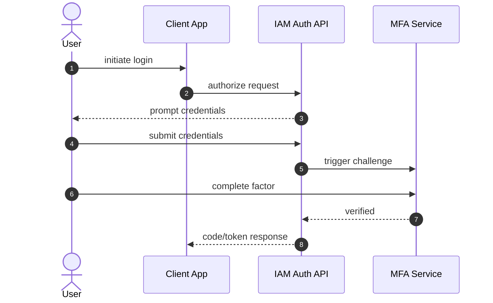
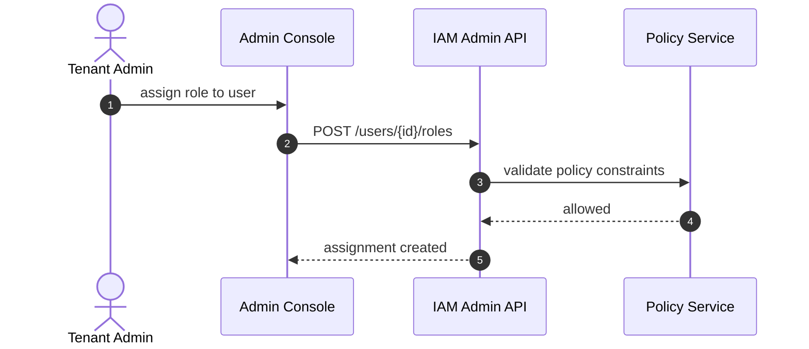

# System Sequence Diagrams

## System Sequence: User Login

```mermaid
sequenceDiagram
    autonumber
    actor U as User
    participant App as Client App
    participant IAM as IAM Auth API
    participant MFA as MFA Service

    U->>App: initiate login
    App->>IAM: authorize request
    IAM-->>U: prompt credentials
    U->>IAM: submit credentials
    IAM->>MFA: trigger challenge
    U->>MFA: complete factor
    MFA-->>IAM: verified
    IAM-->>App: code/token response
```

## System Sequence: Admin Role Assignment

```mermaid
sequenceDiagram
    autonumber
    actor A as Tenant Admin
    participant UI as Admin Console
    participant API as IAM Admin API
    participant POL as Policy Service

    A->>UI: assign role to user
    UI->>API: POST /users/{id}/roles
    API->>POL: validate policy constraints
    POL-->>API: allowed
    API-->>UI: assignment created
```
