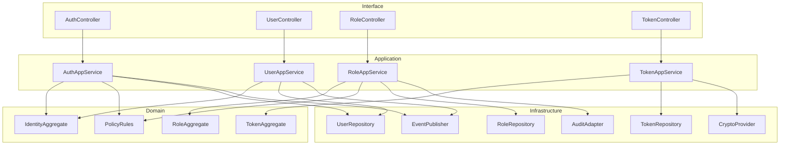

# C4 Code Diagram

```mermaid
flowchart TB
    subgraph Interface
      AuthController
      UserController
      RoleController
      TokenController
    end

    subgraph Application
      AuthAppService
      UserAppService
      RoleAppService
      TokenAppService
    end

    subgraph Domain
      IdentityAggregate
      RoleAggregate
      TokenAggregate
      PolicyRules
    end

    subgraph Infrastructure
      UserRepository
      RoleRepository
      TokenRepository
      CryptoProvider
      EventPublisher
      AuditAdapter
    end

    AuthController --> AuthAppService --> IdentityAggregate
    UserController --> UserAppService --> IdentityAggregate
    RoleController --> RoleAppService --> RoleAggregate
    TokenController --> TokenAppService --> TokenAggregate

    AuthAppService --> PolicyRules
    RoleAppService --> PolicyRules

    AuthAppService --> UserRepository
    UserAppService --> UserRepository
    RoleAppService --> RoleRepository
    TokenAppService --> TokenRepository

    TokenAppService --> CryptoProvider
    AuthAppService --> EventPublisher
    UserAppService --> EventPublisher
    RoleAppService --> AuditAdapter
```
