# C4 Code Diagram

This code-level view decomposes the backend into implementation modules that can be
assigned to teams and built independently while preserving clear IAM boundaries.

```mermaid
flowchart TB
    subgraph Interface["Interface layer"]
        AuthHTTP["auth_http handlers"]
        AdminHTTP["admin_http handlers"]
        ScimHTTP["scim_http handlers"]
        FederationHTTP["federation_http handlers"]
        WorkerEntrypoints["worker entrypoints"]
    end

    subgraph Authn["Authentication context"]
        LoginUC["login_use_case"]
        SessionSvc["session_service"]
        MfaSvc["mfa_orchestrator"]
        TokenSvc["token_service"]
        RevocationProj["revocation_projector"]
    end

    subgraph Authz["Authorization context"]
        DecisionUC["decision_use_case"]
        ContextBuilder["decision_context_builder"]
        PolicyCompiler["policy_bundle_compiler"]
        ObligationSvc["obligation_dispatcher"]
        ExplainSvc["decision_explain_serializer"]
    end

    subgraph Lifecycle["Lifecycle and entitlement context"]
        IdentitySvc["identity_service"]
        EntitlementSvc["entitlement_service"]
        ConflictSvc["entitlement_conflict_resolver"]
        DeprovWorker["deprovision_worker"]
        BreakGlassSvc["break_glass_service"]
    end

    subgraph Federation["Federation and SCIM context"]
        OidcSvc["oidc_federation_service"]
        SamlSvc["saml_federation_service"]
        ClaimMapper["claim_mapping_engine"]
        ScimSync["scim_sync_service"]
        DriftSvc["drift_reconciliation_service"]
    end

    subgraph Platform["Platform services"]
        AuditLib["audit_envelope_writer"]
        Outbox["outbox_publisher"]
        RiskAdapter["risk_signal_adapter"]
        KeyMgr["signing_key_manager"]
        DeviceAdapter["device_posture_adapter"]
    end

    subgraph Storage["Repositories and adapters"]
        PgRepo["postgres repositories"]
        RedisRepo["redis repositories"]
        EventBus["event_bus adapter"]
        IdpAdapter["idp client adapters"]
        Archive["immutable archive adapter"]
    end

    AuthHTTP --> LoginUC
    AdminHTTP --> DecisionUC
    AdminHTTP --> BreakGlassSvc
    ScimHTTP --> ScimSync
    FederationHTTP --> OidcSvc
    FederationHTTP --> SamlSvc
    WorkerEntrypoints --> DeprovWorker
    WorkerEntrypoints --> RevocationProj
    WorkerEntrypoints --> DriftSvc

    LoginUC --> SessionSvc
    LoginUC --> MfaSvc
    LoginUC --> TokenSvc
    LoginUC --> RiskAdapter
    LoginUC --> DeviceAdapter

    DecisionUC --> ContextBuilder
    DecisionUC --> ObligationSvc
    DecisionUC --> ExplainSvc
    ContextBuilder --> EntitlementSvc
    ContextBuilder --> RiskAdapter
    ContextBuilder --> DeviceAdapter
    DecisionUC --> PolicyCompiler

    IdentitySvc --> EntitlementSvc
    EntitlementSvc --> ConflictSvc
    DeprovWorker --> IdentitySvc
    DeprovWorker --> RevocationProj
    BreakGlassSvc --> SessionSvc
    BreakGlassSvc --> DecisionUC

    OidcSvc --> ClaimMapper
    SamlSvc --> ClaimMapper
    ClaimMapper --> IdentitySvc
    ScimSync --> IdentitySvc
    ScimSync --> EntitlementSvc
    DriftSvc --> ConflictSvc

    TokenSvc --> KeyMgr
    TokenSvc --> SessionSvc
    TokenSvc --> Outbox
    RevocationProj --> RedisRepo
    PolicyCompiler --> PgRepo
    SessionSvc --> RedisRepo
    IdentitySvc --> PgRepo
    EntitlementSvc --> PgRepo
    DriftSvc --> PgRepo
    OidcSvc --> IdpAdapter
    SamlSvc --> IdpAdapter
    ScimSync --> IdpAdapter
    Outbox --> EventBus
    AuditLib --> EventBus
    AuditLib --> Archive
```

## Code Organization Rules
- Transport adapters must remain thin; business decisions live in use-case and domain-service packages.
- Shared primitives such as tenant context, correlation ID, audit envelope, idempotency keys, and signed operator identity live in the platform layer.
- Domain services never call UI code, and they never emit events directly; all event publication goes through the outbox abstraction.
- Every worker must be replay-safe, side-effect idempotent, and explicit about the entity key it owns for ordering.

## Module Responsibility Guide

| Module | Primary responsibility | Must not own |
|---|---|---|
| `login_use_case` | Orchestrate primary auth, adaptive MFA, session creation, and token issuance | Policy publication, entitlement writes |
| `token_service` | Access-token signing, refresh-family rotation, reuse detection, revocation event creation | Direct UI responses, SCIM logic |
| `decision_use_case` | PDP entry point, deny precedence, obligation collection, explainability payload | Token minting, identity mutation |
| `policy_bundle_compiler` | Compile approved policy definitions into immutable bundles and cache payloads | Runtime request handling |
| `identity_service` | Subject lifecycle transitions, suspension, archival metadata | Federation parsing, device challenges |
| `entitlement_service` | Grant and revoke lifecycle, effective permission expansion | Token validation |
| `claim_mapping_engine` | Deterministic OIDC and SAML claim transformation and validation | Local entitlement conflict resolution |
| `drift_reconciliation_service` | SCIM or claim drift analysis, remediation planning, escalation creation | Primary login decisions |
| `break_glass_service` | Emergency access request, approval, scoped session issuance, expiry closure | Normal entitlement grants |

## Dependency Rules
- Authentication modules may depend on platform adapters, session repositories, and risk or device adapters, but not on admin UI packages.
- Authorization modules may read entitlements and resource attributes; they must not mutate grants during policy evaluation.
- Federation modules may create or update identities only through `identity_service` and `entitlement_service`.
- Break-glass workflows may call policy evaluation to verify scope, but they use distinct storage and audit types from standard grants.
- Audit writing is cross-cutting and mandatory for every externally visible mutation and every privileged decision.
