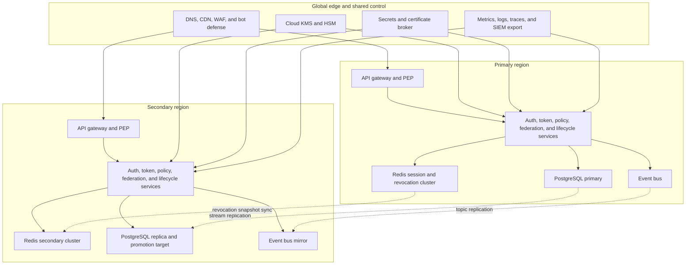

# Cloud Architecture

This document maps the IAM platform onto concrete cloud primitives. It covers the
regional topology, key-management boundaries, stateful stores, and failure-containment
rules required for authentication, authorization, provisioning, and compliance.

## Account and Environment Strategy
- Separate cloud accounts or subscriptions per environment and security boundary: `shared`, `nonprod`, `prod`, and `security`.
- Production has isolated break-glass roles, separate key hierarchies, separate VPC networks, and session recording on all operator entry points.
- Shared services account hosts build artifacts, container registry, central observability, and documentation validation pipelines, but never production secrets.
- Tenant data never crosses environments; lower environments use synthetic or anonymized fixture data only.

## Regional Topology

## Runtime Services

| Service class | Platform choice | State profile | Scaling pattern | Notes |
|---|---|---|---|---|
| API gateway and PEP | Managed ingress plus Kubernetes gateway pods | Stateless | Horizontal on requests per second | Enforces JWT, mTLS, rate limits, and obligation headers |
| Auth, token, policy, federation, SCIM, lifecycle APIs | Kubernetes deployment per bounded context | Mostly stateless | Horizontal on CPU plus latency | Pods use workload identity, no static credentials |
| PostgreSQL | Managed HA PostgreSQL with read replicas | Strongly consistent primary write | Vertical plus replica fan-out | Stores identities, policies, entitlements, token families, and audit shadow rows |
| Redis | Managed Redis cluster with shard replicas | Low-latency mutable state | Horizontal by shard count | Stores session truth, revocation entries, replay nonces, and policy cache |
| Event bus | Managed Kafka compatible service | Durable streaming state | Broker auto-scale where available | Carries audit, revocation, policy, SCIM, and entitlement events |
| Object archive | WORM-enabled object storage | Immutable evidence | Virtually infinite | Stores signed audit export, break-glass evidence, and reconciliation proof |

## Data and Key Management

### Signing Keys and Certificate Strategy
- Access tokens are signed with asymmetric keys in cloud HSM or KMS-backed signing service. Key IDs are versioned and published through JWKS.
- New signing keys are generated every `30 days`, activated after health checks, and old keys remain verification-only for at least the longest token lifetime plus `24 hours`.
- SCIM connectors, SAML signing keys, and outbound mTLS certificates use separate key rings from JWT signing keys.
- TOTP seeds, recovery codes, and federation secrets are envelope-encrypted with distinct data-encryption contexts.

### Stateful Store Assignments
- **PostgreSQL primary**: identities, groups, entitlements, policy bundles, token families, workload identities, admin approvals, and audit shadow indexes.
- **Redis source-of-truth sets**: active session records, step-up grants, replay nonces, revocation hot set, and per-gateway watermark caches.
- **Event bus**: outbox relay topics, immutable audit topics, policy publication topic, revocation topic, SCIM drift topic, and entitlement reconciliation topic.
- **Object archive**: immutable audit exports, simulation artifacts, break-glass evidence packages, and quarterly compliance attestations.

## Session, Token, and Revocation Propagation
- Session status is written synchronously to Redis and shadowed to PostgreSQL for forensic and analytical queries.
- Refresh-token family updates commit in PostgreSQL; the corresponding revocation or rotation event is emitted via outbox relay before the caller receives success.
- Gateway nodes subscribe to revocation events and keep a per-tenant watermark so stale nodes can self-detect lag.
- PDP decision caches are invalidated by policy and entitlement events and must not outlive revocation or suspension signals.

## Resilience and Disaster Recovery

| Concern | Design choice | Target |
|---|---|---|
| Authentication availability | Active-active gateway and service fleet across two regions | `99.95 percent` |
| Database recovery | Regional primary plus warm secondary replica with tested promotion playbook | `RPO < 1 minute`, `RTO < 15 minutes` |
| Revocation continuity | Secondary Redis plus revocation snapshot sync and replay from event bus | `RPO < 5 seconds`, `RTO < 5 minutes` |
| Audit durability | Event bus retention plus immutable object archive in separate account | Zero tolerated loss |
| Policy recovery | Compiled bundles reproduced from PostgreSQL plus signed diff history | Rollback in `< 10 minutes` |

During regional failover:
- New token issuance switches to the promoted region only after the signing-key registry and revocation consumer watermark are healthy.
- Existing access tokens remain valid until expiry, but refresh exchange is paused if family state cannot be proven current.
- Admin policy publication is frozen during failover unless the promoted region has caught up to the latest approved bundle hash.

## Security Controls
- Workload identity federation is mandatory for service-to-service calls; static cloud keys are prohibited.
- Kubernetes namespaces, network policy, and cloud firewalls isolate authn, authz, lifecycle, and audit workloads.
- Infrastructure-as-code guardrails enforce encryption, private networking, approved regions, and log-export requirements.
- Break-glass cloud roles are time-bounded, human-only, hardware-key protected, and recorded with command transcripts.
- Continuous posture scanning checks public exposure, certificate expiry, IAM drift, unencrypted storage, and stale security groups.
