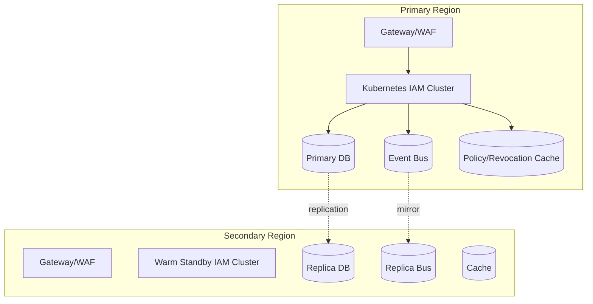

# Deployment Diagram

## Deployment Notes
- Blue/green deployment for gateway and IAM services.
- DB migration guardrails: expand/contract strategy with rollback script.
- Regional failover drills executed quarterly.
## Cross-Cutting Implementation Baselines

### Token and Session Standards
- Access tokens: JWT signed with asymmetric keys (kid rotation every 30 days), TTL 10 minutes default, audience-restricted.
- Refresh tokens: opaque, one-time use with rotation; reuse detection revokes the token family and active device session.
- Session store: strongly consistent source of truth for session status (`active`, `step_up_required`, `revoked`, `expired`, `terminated`).
- Revocation SLA: propagation to introspection/cache layers within 5 seconds P95.

### Policy Evaluation Standards
- Decision result set: `permit`, `deny`, `not_applicable`, `indeterminate`.
- Precedence: explicit deny > permit > not-applicable; indeterminate fails closed for write/privileged operations.
- Policy model: hybrid RBAC + ABAC (+ relationship/group expansion where required).
- Explainability: every decision returns policy IDs, matched rules, and obligation set for audit.

### Identity Lifecycle Standards
- Human: `invited -> active -> suspended/locked -> deprovisioned -> archived`.
- Workload: `registered -> attested -> active -> compromised/quarantined -> retired`.
- Mandatory transition fields: actor, reason code, source system, request ID, timestamp.
- Offboarding control: immediate session kill + async entitlement revocation with reconciliation proof.

### Federation and SCIM Assumptions
- Federation protocols: OIDC/SAML inbound; OIDC/OAuth outbound for relying parties.
- Trust controls: metadata signature validation, cert rollover overlap, issuer/audience pinning, nonce/state replay defense.
- SCIM ownership: source-of-truth matrix by attribute domain; drift jobs run every 15 minutes.
- JIT provisioning: allowed only for approved IdP/tenant mappings and minimal role bootstrap.

### Threat Model and Auditability
- High-priority threats: token replay, assertion forgery, privilege escalation, stale entitlement abuse, break-glass misuse.
- Required controls: rate limits, adaptive MFA, device/risk signals, signed admin actions, immutable audit log.
- Audit minimum fields: tenant, actor, target, action, decision, policy hash, client app, IP/device posture, correlation ID.
- Retention: 13 months hot search + 7 years archive (compliance profile dependent).

## Implementation Deep-Dive Addendum

### Deployment Operations
- Canary strategy includes policy decision accuracy and deny-rate drift checks.
- Multi-region failover includes token key availability and revocation consistency tests.
- Deployment rollback criteria are pre-defined with automated trigger thresholds.
