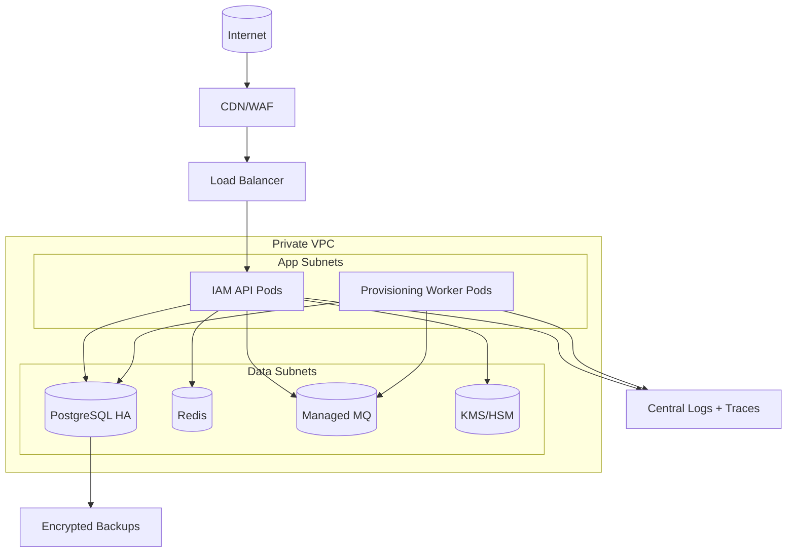
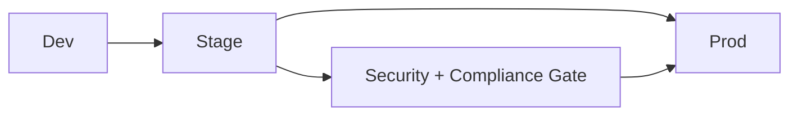

# Deployment Diagram

## Production Deployment

```mermaid
flowchart TB
    Internet[(Internet)] --> CDN[CDN/WAF]
    CDN --> LB[Load Balancer]

    subgraph VPC[Private VPC]
      subgraph AppTier[App Subnets]
        API[IAM API Pods]
        Worker[Provisioning Worker Pods]
      end

      subgraph DataTier[Data Subnets]
        DB[(PostgreSQL HA)]
        Redis[(Redis)]
        MQ[(Managed MQ)]
        KMS[(KMS/HSM)]
      end
    end

    LB --> API
    API --> DB
    API --> Redis
    API --> MQ
    API --> KMS
    Worker --> DB
    Worker --> MQ

    API --> Obs[Central Logs + Traces]
    Worker --> Obs
    DB --> Backup[Encrypted Backups]
```

## Promotion Flow

```mermaid
flowchart LR
    Dev --> Stage --> Prod
    Stage --> Gate[Security + Compliance Gate]
    Gate --> Prod
```
