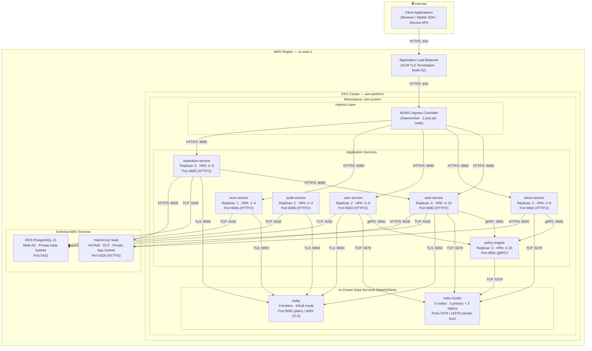

# Kubernetes Deployment Diagram — IAM Platform

## Overview

This document describes the complete Kubernetes deployment topology for the Identity and Access
Management (IAM) Platform running on Amazon EKS. It covers all workload placements, networking
flows, resource specifications, autoscaling policies, health probes, and RBAC configuration
required for a production deployment.

---

## 1. Cluster Topology Diagram



---

## 2. Kubernetes Manifest Specifications

### 2.1 Deployment Resource Requests and Limits

Resource budgets are derived from load-test profiles at 10,000 req/s sustained throughput. Limits
are 4× requests to absorb short CPU bursts without OOM-killing adjacent pods.

```yaml
# auth-service — CPU-bound during bcrypt verification and JWT signing
apiVersion: apps/v1
kind: Deployment
metadata:
  name: auth-service
  namespace: iam-system
  labels:
    app: auth-service
    version: "1.0.0"
    component: authentication
spec:
  replicas: 3
  selector:
    matchLabels:
      app: auth-service
  strategy:
    type: RollingUpdate
    rollingUpdate:
      maxSurge: 1
      maxUnavailable: 0
  template:
    metadata:
      labels:
        app: auth-service
        version: "1.0.0"
      annotations:
        prometheus.io/scrape: "true"
        prometheus.io/port: "9090"
        prometheus.io/path: "/metrics"
    spec:
      serviceAccountName: auth-service
      securityContext:
        runAsNonRoot: true
        runAsUser: 1000
        fsGroup: 1000
        seccompProfile:
          type: RuntimeDefault
      containers:
        - name: auth-service
          image: <ECR_REGISTRY>/iam/auth-service:1.0.0
          imagePullPolicy: Always
          ports:
            - name: http
              containerPort: 8080
              protocol: TCP
            - name: metrics
              containerPort: 9090
              protocol: TCP
          resources:
            requests:
              cpu: "500m"
              memory: "512Mi"
            limits:
              cpu: "2000m"
              memory: "2Gi"
          readinessProbe:
            httpGet:
              path: /health/ready
              port: 8080
            initialDelaySeconds: 10
            periodSeconds: 5
            failureThreshold: 3
            successThreshold: 1
          livenessProbe:
            httpGet:
              path: /health/live
              port: 8080
            initialDelaySeconds: 30
            periodSeconds: 10
            failureThreshold: 3
          startupProbe:
            httpGet:
              path: /health/startup
              port: 8080
            initialDelaySeconds: 5
            periodSeconds: 5
            failureThreshold: 12
          envFrom:
            - configMapRef:
                name: auth-service-config
          env:
            - name: DB_PASSWORD
              valueFrom:
                secretKeyRef:
                  name: auth-service-db-secret
                  key: password
          volumeMounts:
            - name: vault-secrets
              mountPath: /vault/secrets
              readOnly: true
      volumes:
        - name: vault-secrets
          emptyDir:
            medium: Memory
      topologySpreadConstraints:
        - maxSkew: 1
          topologyKey: topology.kubernetes.io/zone
          whenUnsatisfiable: DoNotSchedule
          labelSelector:
            matchLabels:
              app: auth-service
      affinity:
        podAntiAffinity:
          requiredDuringSchedulingIgnoredDuringExecution:
            - labelSelector:
                matchExpressions:
                  - key: app
                    operator: In
                    values: [auth-service]
              topologyKey: kubernetes.io/hostname
---
# policy-engine — OPA evaluation; CPU-heavy during complex attribute-based policy bundles
apiVersion: apps/v1
kind: Deployment
metadata:
  name: policy-engine
  namespace: iam-system
spec:
  replicas: 3
  selector:
    matchLabels:
      app: policy-engine
  strategy:
    type: RollingUpdate
    rollingUpdate:
      maxSurge: 2
      maxUnavailable: 0
  template:
    metadata:
      labels:
        app: policy-engine
      annotations:
        prometheus.io/scrape: "true"
        prometheus.io/port: "9090"
    spec:
      serviceAccountName: policy-engine
      securityContext:
        runAsNonRoot: true
        runAsUser: 1000
      containers:
        - name: policy-engine
          image: <ECR_REGISTRY>/iam/policy-engine:1.0.0
          ports:
            - name: grpc
              containerPort: 8081
            - name: metrics
              containerPort: 9090
          resources:
            requests:
              cpu: "1000m"
              memory: "1Gi"
            limits:
              cpu: "4000m"
              memory: "4Gi"
          readinessProbe:
            exec:
              command: ["/bin/grpc_health_probe", "-addr=:8081"]
            initialDelaySeconds: 15
            periodSeconds: 5
            failureThreshold: 3
          livenessProbe:
            exec:
              command: ["/bin/grpc_health_probe", "-addr=:8081"]
            initialDelaySeconds: 30
            periodSeconds: 10
            failureThreshold: 3
          startupProbe:
            exec:
              command: ["/bin/grpc_health_probe", "-addr=:8081"]
            initialDelaySeconds: 5
            periodSeconds: 5
            failureThreshold: 18
---
# token-service — JWT signing and validation; I/O-bound (Vault round-trips); memory-optimized
apiVersion: apps/v1
kind: Deployment
metadata:
  name: token-service
  namespace: iam-system
spec:
  replicas: 2
  selector:
    matchLabels:
      app: token-service
  template:
    metadata:
      labels:
        app: token-service
      annotations:
        prometheus.io/scrape: "true"
        prometheus.io/port: "9090"
    spec:
      serviceAccountName: token-service
      securityContext:
        runAsNonRoot: true
        runAsUser: 1000
      containers:
        - name: token-service
          image: <ECR_REGISTRY>/iam/token-service:1.0.0
          ports:
            - containerPort: 8082
            - name: metrics
              containerPort: 9090
          resources:
            requests:
              cpu: "250m"
              memory: "256Mi"
            limits:
              cpu: "1000m"
              memory: "1Gi"
```

### 2.2 Horizontal Pod Autoscaler

```yaml
# auth-service HPA — dual-metric: CPU utilization and per-pod HTTP request rate
apiVersion: autoscaling/v2
kind: HorizontalPodAutoscaler
metadata:
  name: auth-service-hpa
  namespace: iam-system
spec:
  scaleTargetRef:
    apiVersion: apps/v1
    kind: Deployment
    name: auth-service
  minReplicas: 3
  maxReplicas: 10
  metrics:
    - type: Resource
      resource:
        name: cpu
        target:
          type: Utilization
          averageUtilization: 65
    - type: Resource
      resource:
        name: memory
        target:
          type: Utilization
          averageUtilization: 75
    - type: Pods
      pods:
        metric:
          name: http_requests_per_second
        target:
          type: AverageValue
          averageValue: "500"
  behavior:
    scaleUp:
      stabilizationWindowSeconds: 60
      policies:
        - type: Pods
          value: 2
          periodSeconds: 60
    scaleDown:
      stabilizationWindowSeconds: 300
      policies:
        - type: Pods
          value: 1
          periodSeconds: 120
---
# policy-engine HPA — wider ceiling because evaluation load is highly bursty
apiVersion: autoscaling/v2
kind: HorizontalPodAutoscaler
metadata:
  name: policy-engine-hpa
  namespace: iam-system
spec:
  scaleTargetRef:
    apiVersion: apps/v1
    kind: Deployment
    name: policy-engine
  minReplicas: 3
  maxReplicas: 15
  metrics:
    - type: Resource
      resource:
        name: cpu
        target:
          type: Utilization
          averageUtilization: 60
    - type: Pods
      pods:
        metric:
          name: grpc_requests_per_second
        target:
          type: AverageValue
          averageValue: "200"
  behavior:
    scaleUp:
      stabilizationWindowSeconds: 30
      policies:
        - type: Pods
          value: 3
          periodSeconds: 60
    scaleDown:
      stabilizationWindowSeconds: 300
      policies:
        - type: Pods
          value: 1
          periodSeconds: 120
```

### 2.3 PodDisruptionBudgets

```yaml
apiVersion: policy/v1
kind: PodDisruptionBudget
metadata:
  name: auth-service-pdb
  namespace: iam-system
spec:
  minAvailable: 2
  selector:
    matchLabels:
      app: auth-service
---
apiVersion: policy/v1
kind: PodDisruptionBudget
metadata:
  name: policy-engine-pdb
  namespace: iam-system
spec:
  minAvailable: 2
  selector:
    matchLabels:
      app: policy-engine
---
apiVersion: policy/v1
kind: PodDisruptionBudget
metadata:
  name: token-service-pdb
  namespace: iam-system
spec:
  minAvailable: 1
  selector:
    matchLabels:
      app: token-service
---
apiVersion: policy/v1
kind: PodDisruptionBudget
metadata:
  name: federation-service-pdb
  namespace: iam-system
spec:
  minAvailable: 1
  selector:
    matchLabels:
      app: federation-service
---
apiVersion: policy/v1
kind: PodDisruptionBudget
metadata:
  name: redis-cluster-pdb
  namespace: iam-system
spec:
  maxUnavailable: 1
  selector:
    matchLabels:
      app: redis-cluster
---
apiVersion: policy/v1
kind: PodDisruptionBudget
metadata:
  name: kafka-pdb
  namespace: iam-system
spec:
  maxUnavailable: 1
  selector:
    matchLabels:
      app: kafka
```

### 2.4 NetworkPolicy

```yaml
# Default-deny all traffic in iam-system; every allowed flow must be declared explicitly
apiVersion: networking.k8s.io/v1
kind: NetworkPolicy
metadata:
  name: default-deny-all
  namespace: iam-system
spec:
  podSelector: {}
  policyTypes:
    - Ingress
    - Egress
---
# auth-service: inbound from NGINX and federation-service; outbound to policy-engine,
# Redis, Kafka, RDS (CIDR), and Vault (CIDR)
apiVersion: networking.k8s.io/v1
kind: NetworkPolicy
metadata:
  name: auth-service-netpol
  namespace: iam-system
spec:
  podSelector:
    matchLabels:
      app: auth-service
  policyTypes:
    - Ingress
    - Egress
  ingress:
    - from:
        - podSelector:
            matchLabels:
              app.kubernetes.io/name: ingress-nginx
      ports:
        - port: 8080
          protocol: TCP
    - from:
        - podSelector:
            matchLabels:
              app: federation-service
      ports:
        - port: 8080
          protocol: TCP
  egress:
    - to:
        - podSelector:
            matchLabels:
              app: policy-engine
      ports:
        - port: 8081
          protocol: TCP
    - to:
        - podSelector:
            matchLabels:
              app: redis-cluster
      ports:
        - port: 6379
          protocol: TCP
    - to:
        - podSelector:
            matchLabels:
              app: kafka
      ports:
        - port: 9093
          protocol: TCP
    - to:
        - ipBlock:
            cidr: 10.0.21.0/24
      ports:
        - port: 5432
          protocol: TCP
    - to:
        - ipBlock:
            cidr: 10.0.11.0/24
      ports:
        - port: 8200
          protocol: TCP
    - ports:
        - port: 53
          protocol: UDP
        - port: 53
          protocol: TCP
---
# audit-service: consumes Kafka events; writes summaries to RDS; no inbound HTTP
apiVersion: networking.k8s.io/v1
kind: NetworkPolicy
metadata:
  name: audit-service-netpol
  namespace: iam-system
spec:
  podSelector:
    matchLabels:
      app: audit-service
  policyTypes:
    - Ingress
    - Egress
  ingress:
    - from:
        - podSelector:
            matchLabels:
              app.kubernetes.io/name: ingress-nginx
      ports:
        - port: 8086
          protocol: TCP
  egress:
    - to:
        - podSelector:
            matchLabels:
              app: kafka
      ports:
        - port: 9093
          protocol: TCP
    - to:
        - ipBlock:
            cidr: 10.0.21.0/24
      ports:
        - port: 5432
          protocol: TCP
    - ports:
        - port: 53
          protocol: UDP
        - port: 53
          protocol: TCP
```

### 2.5 ServiceAccount and RBAC

```yaml
# auth-service ServiceAccount — annotated for Vault role binding and IRSA
apiVersion: v1
kind: ServiceAccount
metadata:
  name: auth-service
  namespace: iam-system
  annotations:
    vault.hashicorp.com/role: "auth-service"
    eks.amazonaws.com/role-arn: "arn:aws:iam::<ACCOUNT_ID>:role/iam-platform-auth-service-irsa"
---
apiVersion: rbac.authorization.k8s.io/v1
kind: Role
metadata:
  name: auth-service-role
  namespace: iam-system
rules:
  - apiGroups: [""]
    resources: ["configmaps"]
    resourceNames: ["auth-service-config"]
    verbs: ["get", "watch"]
  - apiGroups: [""]
    resources: ["secrets"]
    resourceNames: ["auth-service-db-secret"]
    verbs: ["get"]
---
apiVersion: rbac.authorization.k8s.io/v1
kind: RoleBinding
metadata:
  name: auth-service-rolebinding
  namespace: iam-system
subjects:
  - kind: ServiceAccount
    name: auth-service
    namespace: iam-system
roleRef:
  kind: Role
  apiGroup: rbac.authorization.k8s.io
  name: auth-service-role
```

---

## 3. ConfigMap and Secret Management

### 3.1 What Belongs in ConfigMap

ConfigMaps hold non-sensitive, environment-specific configuration. Values are plain text, safe to
commit to Git when environment-specific values are templated via Helm values files.

| Key | Example Value | Purpose |
|-----|---------------|---------|
| `APP_ENV` | `production` | Runtime environment identifier |
| `LOG_LEVEL` | `info` | Logging verbosity |
| `LOG_FORMAT` | `json` | Structured logging for CloudWatch Logs Insights |
| `SERVER_PORT` | `8080` | Primary HTTP listener port |
| `GRPC_PORT` | `8081` | gRPC listener port |
| `DB_HOST` | `iam-db.cluster-xxxx.us-east-1.rds.amazonaws.com` | RDS cluster writer endpoint |
| `DB_PORT` | `5432` | PostgreSQL port |
| `DB_NAME` | `iam_platform` | Database name |
| `DB_MAX_CONNECTIONS` | `25` | Connection pool ceiling per pod |
| `DB_MIN_CONNECTIONS` | `5` | Connection pool floor per pod |
| `DB_CONNECTION_TIMEOUT_MS` | `5000` | Pool acquisition timeout |
| `REDIS_CLUSTER_NODES` | `redis-0.redis:6379,redis-1.redis:6379,redis-2.redis:6379` | Cluster seed nodes |
| `REDIS_MAX_RETRIES` | `3` | Retry attempts before circuit-break |
| `KAFKA_BROKERS` | `kafka-0.kafka:9093,kafka-1.kafka:9093,kafka-2.kafka:9093` | Bootstrap server list |
| `KAFKA_CONSUMER_GROUP` | `auth-service-cg` | Consumer group identifier |
| `VAULT_ADDR` | `https://vault.iam-system.svc.cluster.local:8200` | Vault API endpoint |
| `VAULT_AUTH_METHOD` | `kubernetes` | Vault authentication backend |
| `VAULT_NAMESPACE` | `iam` | Vault namespace for multi-tenancy isolation |
| `TOKEN_ACCESS_TTL` | `900` | Access token lifetime (15 min) |
| `TOKEN_REFRESH_TTL` | `86400` | Refresh token lifetime (24 h) |
| `TOKEN_SIGNING_ALGORITHM` | `RS256` | JWT signing algorithm |
| `RATE_LIMIT_WINDOW_SECONDS` | `60` | Sliding window duration |
| `RATE_LIMIT_MAX_REQUESTS` | `100` | Max requests per window per client |
| `OTEL_EXPORTER_OTLP_ENDPOINT` | `http://otel-collector.observability:4317` | Tracing collector endpoint |
| `OTEL_SERVICE_NAME` | `auth-service` | Service name in distributed traces |
| `OTEL_TRACES_SAMPLER` | `parentbased_traceidratio` | Sampling strategy |
| `OTEL_TRACES_SAMPLER_ARG` | `0.1` | 10% trace sampling in production |

### 3.2 What Belongs in HashiCorp Vault

Secrets requiring dynamic generation, automatic rotation, or fine-grained access auditing are stored
exclusively in Vault. The Vault Agent sidecar injects rendered secret files into an in-memory
`emptyDir` volume at container startup. Raw secret values are never stored in Kubernetes etcd.

| Vault Path | Description | Rotation Policy |
|------------|-------------|-----------------|
| `iam/data/auth-service/db-credentials` | PostgreSQL username and password | 90-day automatic rotation via Vault dynamic secrets |
| `iam/data/auth-service/redis-auth` | Redis AUTH token | 30-day rotation |
| `pki_int/issue/iam-service` | mTLS leaf certificate (SPIFFE URI SAN) | 24-hour TTL; Vault Agent auto-renews at 2/3 lifetime |
| `iam/data/token-service/jwt-rsa-private-key` | RSA-4096 private key for RS256 JWT signing | 365-day rotation with 48-hour overlap window |
| `iam/data/token-service/jwt-rsa-private-key-prev` | Previous private key retained for token validation | Purged 48 hours after rotation |
| `iam/data/token-service/jwt-ec-private-key` | EC P-256 private key for ES256 signing | 365-day rotation |
| `iam/data/federation-service/saml-sp-private-key` | SAML SP private key (RSA-2048) | 365-day rotation; SAML metadata re-published on rotation |
| `iam/data/federation-service/oidc-client-secrets` | Per-tenant OIDC IdP client secrets | Rotated on demand per tenant; expiry alerts via Vault TTL |
| `iam/data/kafka/client-keystore` | Kafka mTLS PKCS12 keystore | 90-day TTL |
| `iam/data/shared/pii-encryption-key` | AES-256-GCM key for PII field-level encryption | Annual rotation with background re-encryption job |
| `iam/data/shared/session-hmac-key` | HMAC-SHA256 key for session cookie signing | 180-day rotation |

### 3.3 External Secrets Operator Integration

Kubernetes Secrets are provisioned by the External Secrets Operator (ESO), which synchronizes
values from AWS Secrets Manager on a 1-hour refresh cycle. Raw Secret manifests are never
committed to Git.

```yaml
apiVersion: external-secrets.io/v1beta1
kind: ExternalSecret
metadata:
  name: auth-service-db-secret
  namespace: iam-system
spec:
  refreshInterval: 1h
  secretStoreRef:
    name: aws-secrets-manager-store
    kind: ClusterSecretStore
  target:
    name: auth-service-db-secret
    creationPolicy: Owner
    template:
      type: Opaque
  data:
    - secretKey: password
      remoteRef:
        key: /iam/prod/auth-service/db-password
        version: AWSCURRENT
    - secretKey: username
      remoteRef:
        key: /iam/prod/auth-service/db-username
        version: AWSCURRENT
```

---

## 4. Health Check Endpoints

All services expose three probe endpoints on their primary HTTP port. The `/health/startup`
endpoint returns 200 only after completing schema migrations, cache warm-up, and Vault secret
loading. Liveness failures trigger pod restart. Readiness failures remove the pod from the Service
endpoint slice without restart.

| Service | Liveness | Readiness | Startup | Liveness Delay | Readiness Delay | Startup Max Wait |
|---------|----------|-----------|---------|:-:|:-:|:-:|
| auth-service | `GET /health/live` | `GET /health/ready` | `GET /health/startup` | 30 s | 10 s | 60 s |
| policy-engine | gRPC health probe `:8081` | gRPC health probe `:8081` | gRPC health probe `:8081` | 30 s | 15 s | 90 s |
| token-service | `GET /health/live` | `GET /health/ready` | `GET /health/startup` | 20 s | 10 s | 60 s |
| user-service | `GET /health/live` | `GET /health/ready` | `GET /health/startup` | 30 s | 10 s | 60 s |
| scim-service | `GET /health/live` | `GET /health/ready` | `GET /health/startup` | 20 s | 10 s | 50 s |
| federation-service | `GET /health/live` | `GET /health/ready` | `GET /health/startup` | 30 s | 15 s | 70 s |
| audit-service | `GET /health/live` | `GET /health/ready` | `GET /health/startup` | 20 s | 10 s | 50 s |

**Readiness gate criteria — all must pass:**

- Database connection pool has at least one live connection (verified via `SELECT 1`)
- Redis cluster has quorum: at least 2 of 3 primary nodes report `cluster_state:ok`
- Vault token is valid and not within 60 seconds of expiry
- Kafka consumer group has been assigned at least one partition (event-consuming services only)
- Policy bundle fully loaded and at least one evaluation query succeeded (policy-engine only)

**Liveness gate criteria — all must pass:**

- HTTP or gRPC server goroutine responds within 1 second
- Internal watchdog heartbeat received within the last 30 seconds
- Heap memory below 90% of the container memory limit

---

## 5. Autoscaling Triggers

HPA evaluations run every 15 seconds. Custom metrics (`http_requests_per_second`,
`grpc_requests_per_second`, `kafka_consumer_lag`) are published to Prometheus and exposed to the
Kubernetes control plane via the Prometheus Adapter as `custom.metrics.k8s.io` resources.

| Service | Scale-Up Trigger | Scale-Down Trigger | Min | Max | Stabilization Up / Down |
|---------|-----------------|-------------------|:---:|:---:|:---:|
| auth-service | CPU > 65% **or** RPS/pod > 500 | CPU < 40% **and** RPS/pod < 200 | 3 | 10 | 60 s / 300 s |
| policy-engine | CPU > 60% **or** gRPC/pod > 200 | CPU < 35% **and** gRPC/pod < 80 | 3 | 15 | 30 s / 300 s |
| token-service | CPU > 70% **or** RPS/pod > 400 | CPU < 45% **and** RPS/pod < 150 | 2 | 8 | 60 s / 300 s |
| user-service | CPU > 65% **or** RPS/pod > 300 | CPU < 40% **and** RPS/pod < 100 | 2 | 6 | 60 s / 300 s |
| scim-service | CPU > 60% **or** queue depth > 1,000 | CPU < 30% **and** queue depth < 100 | 1 | 4 | 120 s / 600 s |
| federation-service | CPU > 65% **or** RPS/pod > 200 | CPU < 40% **and** RPS/pod < 80 | 2 | 6 | 60 s / 300 s |
| audit-service | Kafka consumer lag > 50,000 msgs | Kafka consumer lag < 5,000 msgs | 2 | 4 | 60 s / 300 s |

**Node Autoscaler (Karpenter)** provisions `m6i.2xlarge` (8 vCPU / 32 GB) On-Demand nodes for
latency-sensitive services (auth, token, federation) and Spot nodes for fault-tolerant workloads
(policy-engine, scim, audit). New nodes are available within 90 seconds of a pending pod event.
Nodes are recycled every 30 days via `ttlSecondsUntilExpired` to enforce AMI patching.

```yaml
apiVersion: karpenter.sh/v1alpha5
kind: Provisioner
metadata:
  name: iam-platform-on-demand
spec:
  requirements:
    - key: karpenter.sh/capacity-type
      operator: In
      values: ["on-demand"]
    - key: node.kubernetes.io/instance-type
      operator: In
      values: ["m6i.2xlarge", "m6i.4xlarge"]
    - key: topology.kubernetes.io/zone
      operator: In
      values: ["us-east-1a", "us-east-1b"]
  limits:
    resources:
      cpu: "200"
      memory: "800Gi"
  providerRef:
    name: iam-platform-nodepool
  ttlSecondsAfterEmpty: 120
  ttlSecondsUntilExpired: 2592000
---
apiVersion: karpenter.sh/v1alpha5
kind: Provisioner
metadata:
  name: iam-platform-spot
spec:
  requirements:
    - key: karpenter.sh/capacity-type
      operator: In
      values: ["spot"]
    - key: node.kubernetes.io/instance-type
      operator: In
      values: ["m6i.2xlarge", "m6a.2xlarge", "m5.2xlarge", "m5a.2xlarge"]
    - key: topology.kubernetes.io/zone
      operator: In
      values: ["us-east-1a", "us-east-1b"]
  limits:
    resources:
      cpu: "128"
      memory: "512Gi"
  providerRef:
    name: iam-platform-nodepool
  ttlSecondsAfterEmpty: 60
  ttlSecondsUntilExpired: 604800
```
