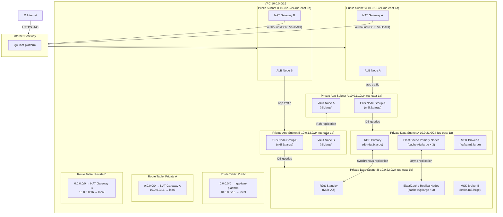
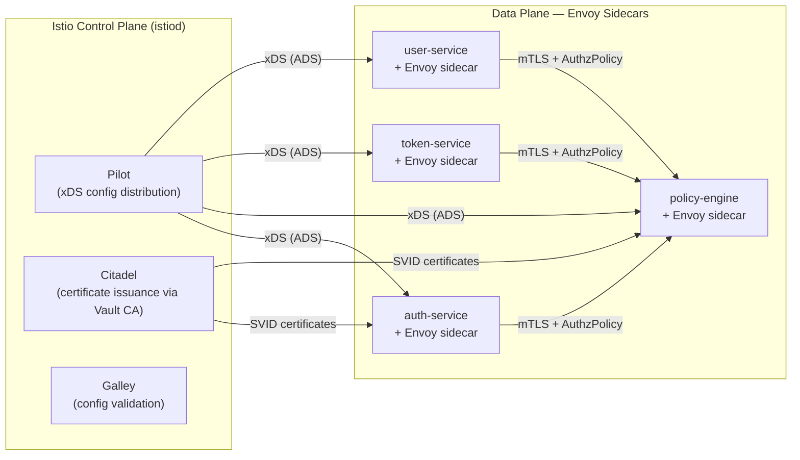

# Network Infrastructure — IAM Platform

## Overview

This document defines the complete network security architecture for the IAM Platform deployed on
AWS. It covers VPC topology, subnet allocation, security group rules, AWS WAF configuration, TLS
policy, DDoS protection, network monitoring, and the Zero Trust service mesh model.

---

## 1. VPC Architecture

### 1.1 CIDR Allocation

| Subnet | CIDR | AZ | Layer | Hosts |
|--------|------|----|-------|-------|
| Public Subnet A | 10.0.1.0/24 | us-east-1a | Load Balancers, NAT Gateway | 254 |
| Public Subnet B | 10.0.2.0/24 | us-east-1b | Load Balancers, NAT Gateway | 254 |
| Private App Subnet A | 10.0.11.0/24 | us-east-1a | EKS nodes, Vault | 254 |
| Private App Subnet B | 10.0.12.0/24 | us-east-1b | EKS nodes, Vault | 254 |
| Private Data Subnet A | 10.0.21.0/24 | us-east-1a | RDS, ElastiCache, MSK | 254 |
| Private Data Subnet B | 10.0.22.0/24 | us-east-1b | RDS, ElastiCache, MSK | 254 |

### 1.2 VPC Topology Diagram



### 1.3 VPC Endpoints (Private Connectivity — no NAT required)

| AWS Service | Endpoint Type | Purpose |
|-------------|--------------|---------|
| ECR API | Interface | Pull container image metadata without NAT |
| ECR Docker | Interface | Pull container image layers without NAT |
| S3 | Gateway | Audit log archival to S3, ECR layer storage |
| Secrets Manager | Interface | ESO secret sync without NAT |
| KMS | Interface | Envelope decryption without NAT |
| CloudWatch Logs | Interface | Log shipping without NAT |
| STS | Interface | IRSA token exchange without NAT |
| EC2 | Interface | Node bootstrapping without NAT |

---

## 2. Security Group Rules

### 2.1 ALB Security Group (`sg-alb-iam-platform`)

| Direction | Protocol | Port | Source / Destination | Description |
|-----------|----------|------|---------------------|-------------|
| Inbound | TCP | 443 | 0.0.0.0/0 | HTTPS from internet |
| Inbound | TCP | 443 | ::/0 | HTTPS from internet (IPv6) |
| Outbound | TCP | 8080–8086 | sg-eks-nodes | HTTP/2 to EKS NGINX pods |
| Outbound | TCP | 443 | 0.0.0.0/0 | Health check callbacks |

### 2.2 EKS Node Security Group (`sg-eks-nodes-iam-platform`)

| Direction | Protocol | Port | Source / Destination | Description |
|-----------|----------|------|---------------------|-------------|
| Inbound | TCP | 8080–8086 | sg-alb-iam-platform | App traffic from ALB |
| Inbound | TCP | 10250 | sg-eks-control-plane | Kubelet API (control plane) |
| Inbound | TCP | 443 | sg-eks-control-plane | Webhook admission calls |
| Inbound | All | All | sg-eks-nodes-iam-platform | Pod-to-pod intra-node traffic |
| Outbound | TCP | 5432 | sg-rds-iam-platform | PostgreSQL queries |
| Outbound | TCP | 6379 | sg-elasticache-iam-platform | Redis cluster traffic |
| Outbound | TCP | 9092–9093 | sg-msk-iam-platform | Kafka producer/consumer |
| Outbound | TCP | 8200 | sg-vault-iam-platform | Vault API calls |
| Outbound | TCP | 443 | 0.0.0.0/0 | ECR, Secrets Manager, KMS (via VPC endpoint or NAT) |
| Outbound | UDP | 53 | 10.0.0.2/32 | DNS (VPC resolver) |

### 2.3 RDS Security Group (`sg-rds-iam-platform`)

| Direction | Protocol | Port | Source / Destination | Description |
|-----------|----------|------|---------------------|-------------|
| Inbound | TCP | 5432 | sg-eks-nodes-iam-platform | PostgreSQL from EKS nodes only |
| Inbound | TCP | 5432 | sg-vault-iam-platform | Vault dynamic secrets credential creation |
| Outbound | — | — | — | No outbound rules (RDS initiates no outbound connections) |

### 2.4 ElastiCache Security Group (`sg-elasticache-iam-platform`)

| Direction | Protocol | Port | Source / Destination | Description |
|-----------|----------|------|---------------------|-------------|
| Inbound | TCP | 6379 | sg-eks-nodes-iam-platform | Redis from EKS nodes only |
| Inbound | TCP | 16379 | sg-elasticache-iam-platform | Redis cluster bus (intra-cluster) |
| Outbound | TCP | 16379 | sg-elasticache-iam-platform | Redis cluster bus (intra-cluster) |

### 2.5 MSK (Kafka) Security Group (`sg-msk-iam-platform`)

| Direction | Protocol | Port | Source / Destination | Description |
|-----------|----------|------|---------------------|-------------|
| Inbound | TCP | 9092 | sg-eks-nodes-iam-platform | Kafka plaintext (disabled in prod; TLS only) |
| Inbound | TCP | 9093 | sg-eks-nodes-iam-platform | Kafka TLS from EKS nodes |
| Inbound | TCP | 2181 | sg-msk-iam-platform | ZooKeeper (KRaft mode: not used) |
| Inbound | TCP | 9094 | sg-msk-iam-platform | Kafka inter-broker replication |
| Outbound | TCP | 9094 | sg-msk-iam-platform | Inter-broker replication |

### 2.6 Vault Security Group (`sg-vault-iam-platform`)

| Direction | Protocol | Port | Source / Destination | Description |
|-----------|----------|------|---------------------|-------------|
| Inbound | TCP | 8200 | sg-eks-nodes-iam-platform | Vault API from EKS nodes |
| Inbound | TCP | 8201 | sg-vault-iam-platform | Raft cluster replication (intra-Vault) |
| Outbound | TCP | 5432 | sg-rds-iam-platform | Vault dynamic secrets for PostgreSQL |
| Outbound | TCP | 443 | 0.0.0.0/0 | AWS KMS seal/unseal |

---

## 3. AWS WAF Configuration

The IAM Platform WAF WebACL is attached to the Application Load Balancer. Rules are evaluated in
priority order; the first matching terminating rule wins.

### 3.1 Rule Set

| Priority | Rule Name | Action | Description |
|----------|-----------|--------|-------------|
| 1 | `AdminIPAllowlist` | Allow | Permits traffic to `/admin/*` and `/api/v1/internal/*` from corporate IP ranges (203.0.113.0/24, 198.51.100.0/24) only; blocks all other sources for those paths |
| 2 | `AWSManagedRulesCommonRuleSet` | Block | OWASP Core Rule Set — SQLi, XSS, LFI, RFI, RCE patterns |
| 3 | `AWSManagedRulesKnownBadInputsRuleSet` | Block | Log4Shell, SSRF, and known-bad request patterns |
| 4 | `AWSManagedRulesSQLiRuleSet` | Block | Targeted SQL injection protection |
| 5 | `AWSManagedRulesLinuxRuleSet` | Block | Path traversal and Linux-specific exploits |
| 6 | `IPReputationList` | Block | AWS-managed IP reputation list (Tor exit nodes, botnets, scanners) |
| 7 | `AuthEndpointRateLimit` | Block | Rate limit `/api/v1/auth/*` to 300 requests per 5-minute window per IP |
| 8 | `GlobalRateLimit` | Block | Rate limit all endpoints to 10,000 requests per 5-minute window per IP |
| 9 | `GeoBlock` | Block | Block traffic from sanctioned countries (OFAC list) |
| Default | — | Allow | All traffic not matched by the above rules is forwarded to the ALB |

### 3.2 Rate Limiting Details

```
AuthEndpointRateLimit:
  Scope: per source IP
  Evaluated path: /api/v1/auth/*
  Window: 300 seconds (5 minutes)
  Threshold: 300 requests
  Action: BLOCK (returns 429 Too Many Requests)
  Header added on block: Retry-After: 300

GlobalRateLimit:
  Scope: per source IP
  Evaluated path: all
  Window: 300 seconds (5 minutes)
  Threshold: 10,000 requests
  Action: BLOCK
```

### 3.3 WAF Logging

WAF logs are streamed to Amazon Kinesis Data Firehose → S3 (`s3://iam-waf-logs-<account-id>/`) with
AES-256 encryption (SSE-S3) and 90-day retention. Sampled requests are available in the AWS Console
for the last 3 hours. CloudWatch Metrics are enabled for each rule, with alarms on:

- `BlockedRequests` > 100 in 5 minutes → SNS → PagerDuty
- `AllowedRequests` drops > 50% below 15-minute baseline → SNS → PagerDuty

---

## 4. TLS Configuration

### 4.1 External TLS (Client → ALB)

| Parameter | Value |
|-----------|-------|
| Minimum TLS version | TLS 1.2 |
| Preferred TLS version | TLS 1.3 |
| ALB Security Policy | `ELBSecurityPolicy-TLS13-1-2-2021-06` |
| Certificate Provider | AWS ACM (auto-renewing) |
| Certificate Type | RSA 2048-bit (primary); ECDSA P-256 (dual-cert) |
| HSTS | `max-age=31536000; includeSubDomains; preload` |
| OCSP Stapling | Enabled |

**Allowed cipher suites (TLS 1.2 fallback):**

```
TLS_ECDHE_RSA_WITH_AES_128_GCM_SHA256
TLS_ECDHE_RSA_WITH_AES_256_GCM_SHA384
TLS_ECDHE_ECDSA_WITH_AES_128_GCM_SHA256
TLS_ECDHE_ECDSA_WITH_AES_256_GCM_SHA384
```

**TLS 1.3 cipher suites (mandatory):**

```
TLS_AES_128_GCM_SHA256
TLS_AES_256_GCM_SHA384
TLS_CHACHA20_POLY1305_SHA256
```

### 4.2 Internal mTLS (Service-to-Service)

All inter-service communication inside the EKS cluster uses mutual TLS enforced by Istio service
mesh. Services present SPIFFE-compatible X.509 SVIDs issued by Vault's PKI secrets engine.

| Parameter | Value |
|-----------|-------|
| Service mesh | Istio 1.20 (ambient mode) |
| Identity standard | SPIFFE (Secure Production Identity Framework for Everyone) |
| Certificate authority | Vault Intermediate CA (signed by offline root CA) |
| Certificate format | X.509 with SPIFFE URI SAN: `spiffe://iam-platform.internal/<namespace>/<service>` |
| Certificate TTL | 24 hours; Vault Agent auto-renews at 16 hours |
| Cipher suites | TLS_ECDHE_ECDSA_WITH_AES_256_GCM_SHA384, TLS_AES_256_GCM_SHA384 |
| Peer verification | Both client and server certificates required |
| Policy | `STRICT` mode — plaintext inter-service communication is rejected |

```yaml
# Istio PeerAuthentication — enforce mTLS cluster-wide
apiVersion: security.istio.io/v1beta1
kind: PeerAuthentication
metadata:
  name: default
  namespace: iam-system
spec:
  mtls:
    mode: STRICT
---
# Istio AuthorizationPolicy — auth-service may only call policy-engine
apiVersion: security.istio.io/v1beta1
kind: AuthorizationPolicy
metadata:
  name: policy-engine-authz
  namespace: iam-system
spec:
  selector:
    matchLabels:
      app: policy-engine
  rules:
    - from:
        - source:
            principals:
              - "cluster.local/ns/iam-system/sa/auth-service"
              - "cluster.local/ns/iam-system/sa/token-service"
              - "cluster.local/ns/iam-system/sa/user-service"
      to:
        - operation:
            methods: ["POST"]
            paths: ["/iam.v1.PolicyService/*"]
```

### 4.3 Kafka TLS

MSK brokers require TLS for all client connections. Clients present mTLS certificates issued by the
same Vault Intermediate CA. PLAINTEXT listener is disabled on all brokers.

```
listeners=CLIENT_TLS://0.0.0.0:9093,REPLICATION://0.0.0.0:9094
advertised.listeners=CLIENT_TLS://<broker-hostname>:9093,REPLICATION://<broker-hostname>:9094
ssl.client.auth=required
ssl.truststore.location=/etc/kafka/ssl/truststore.jks
ssl.keystore.location=/etc/kafka/ssl/keystore.jks
```

---

## 5. DDoS Protection

### 5.1 AWS Shield Advanced

AWS Shield Advanced is enabled at the account level and provides:

| Protection | Details |
|-----------|---------|
| Network-layer DDoS (L3/L4) | Automatic inline mitigation for SYN floods, UDP amplification, and volumetric attacks |
| Application-layer DDoS (L7) | WAF integration with automatic rule creation during active L7 attacks |
| Protected resources | ALB, Route 53 hosted zones, CloudFront distributions |
| DRT access | AWS Shield Response Team (SRT) has `AWSShieldDRTAccessPolicy` IAM role |
| Cost protection | Shield Advanced credits AWS charges incurred during verified DDoS events |
| Attack visibility | Real-time CloudWatch metrics: `DDoSDetected`, `DDoSAttackBitsPerSecond`, `DDoSAttackPacketsPerSecond` |

### 5.2 Application-Layer Protections

Beyond Shield Advanced, the following controls limit the blast radius of application-layer floods:

| Control | Implementation | Threshold |
|---------|---------------|-----------|
| Connection timeout | ALB idle timeout | 60 seconds |
| Request body size limit | ALB + WAF | 10 MB maximum |
| Header count limit | NGINX Ingress | 100 headers per request |
| Slow HTTP protection | NGINX `client_header_timeout` + `client_body_timeout` | 10 seconds |
| Keep-alive limit | ALB | 1,000 requests per connection |
| Circuit breaker | Istio `DestinationRule` | 95th-percentile latency > 500 ms opens circuit |

---

## 6. Network Monitoring

### 6.1 VPC Flow Logs

VPC Flow Logs are enabled for all ENIs with `v3` format, capturing accepted and rejected traffic.

| Parameter | Value |
|-----------|-------|
| Log destination | CloudWatch Logs `/aws/vpc/flowlogs/iam-platform` + S3 archive |
| Format | `${version} ${vpc-id} ${subnet-id} ${instance-id} ${interface-id} ${srcaddr} ${dstaddr} ${srcport} ${dstport} ${protocol} ${packets} ${bytes} ${windowstart} ${windowend} ${action} ${log-status}` |
| Aggregation interval | 1 minute |
| Retention (CloudWatch) | 30 days |
| Retention (S3 archive) | 1 year (Glacier after 90 days) |

### 6.2 Amazon GuardDuty

GuardDuty is enabled with all threat detection modules active:

| Finding Category | Alert Threshold | Response |
|-----------------|----------------|----------|
| `UnauthorizedAccess:EC2/SSHBruteForce` | Any finding | Block source IP in Security Group; notify PagerDuty |
| `CryptoCurrency:EC2/BitcoinTool` | Any finding | Isolate instance; notify Security team |
| `Recon:EC2/PortProbeUnprotectedPort` | Any finding | Log to SIEM; review after 1 hour |
| `UnauthorizedAccess:IAMUser/ConsoleLoginSuccess` | Login from non-corporate IP | Require MFA challenge; alert Security team |
| `Trojan:EC2/DGADomainRequest` | Any finding | Quarantine pod; snapshot EBS; notify incident commander |
| `PenTest:IAMUser/KaliLinux` | Any finding | Revoke IAM credentials; notify Security team immediately |

### 6.3 CloudWatch Alarms

| Alarm Name | Metric | Threshold | Period | Action |
|------------|--------|-----------|--------|--------|
| `iam-alb-5xx-high` | `ALB HTTPCode_Target_5XX_Count` | > 50 per minute | 5 min | SNS → PagerDuty |
| `iam-alb-latency-high` | `ALB TargetResponseTime p99` | > 2 seconds | 5 min | SNS → PagerDuty |
| `iam-rds-cpu-high` | `RDS CPUUtilization` | > 80% | 10 min | SNS → Slack #iam-ops |
| `iam-rds-connections-high` | `RDS DatabaseConnections` | > 800 | 5 min | SNS → Slack #iam-ops |
| `iam-redis-cpu-high` | `ElastiCache CPUUtilization` | > 70% | 5 min | SNS → Slack #iam-ops |
| `iam-kafka-consumer-lag` | Custom metric `kafka_consumer_lag` | > 100,000 | 5 min | SNS → PagerDuty |
| `iam-waf-blocked-requests` | `WAF BlockedRequests` | > 1,000 per 5 min | 5 min | SNS → PagerDuty |
| `iam-nat-bytes-high` | `VPC NatGatewayBytesIn` | > 1 GB per minute | 5 min | SNS → Slack #iam-ops |

### 6.4 Network Reachability Analysis

AWS Network Access Analyzer runs daily to verify:

- No unintended paths from internet to data subnets (10.0.21.0/24, 10.0.22.0/24)
- No unintended paths from data subnets to internet
- All EKS → RDS paths traverse only approved security groups
- No EC2 instances have 0.0.0.0/0 inbound on port 22 or 3389

---

## 7. Zero Trust Network Architecture

### 7.1 Principles

The IAM Platform network follows Zero Trust principles: no implicit trust based on network
location, every connection is authenticated and authorized, and access is granted with least
privilege.

| Principle | Implementation |
|-----------|--------------|
| Verify explicitly | Every service-to-service call requires a valid SPIFFE SVID; JWT bearer token for external API calls |
| Least privilege access | Kubernetes NetworkPolicy default-deny + Istio AuthorizationPolicy per-service |
| Assume breach | East-west traffic is encrypted (mTLS); blast radius limited by Istio circuit breaking |
| Continuous verification | Vault certificates expire in 24 hours and must be renewed; no long-lived credentials |

### 7.2 Service Mesh Topology



### 7.3 Identity Propagation

External JWTs issued by the IAM Platform are forwarded via `Authorization: Bearer <token>` header.
Within the cluster, Istio extracts the JWT from the header and validates it against the token-service
JWKS endpoint before forwarding. The original JWT is never stripped — downstream services can
re-validate the token independently.

```yaml
# Istio RequestAuthentication — validate JWT on all API traffic entering iam-system
apiVersion: security.istio.io/v1beta1
kind: RequestAuthentication
metadata:
  name: jwt-validation
  namespace: iam-system
spec:
  jwtRules:
    - issuer: "https://auth.iam-platform.internal"
      jwksUri: "http://token-service.iam-system.svc.cluster.local:8082/.well-known/jwks.json"
      audiences:
        - "iam-platform-api"
      forwardOriginalToken: true
```

### 7.4 Egress Control

All outbound traffic from EKS pods is routed through NAT Gateways with fixed Elastic IP addresses.
These IPs are allowlisted by external partners (e.g., OIDC Identity Providers, SAML metadata
endpoints). Unauthorized egress destinations are blocked at the security group level; Istio
`ServiceEntry` resources control which external hosts each service may reach.

```yaml
# ServiceEntry — allow federation-service to call an external OIDC provider
apiVersion: networking.istio.io/v1beta1
kind: ServiceEntry
metadata:
  name: okta-oidc-endpoint
  namespace: iam-system
spec:
  hosts:
    - "dev-123456.okta.com"
  ports:
    - number: 443
      name: https
      protocol: HTTPS
  resolution: DNS
  location: MESH_EXTERNAL
---
# Sidecar — restrict federation-service egress to declared hosts only
apiVersion: networking.istio.io/v1beta1
kind: Sidecar
metadata:
  name: federation-service-sidecar
  namespace: iam-system
spec:
  workloadSelector:
    labels:
      app: federation-service
  egress:
    - hosts:
        - "iam-system/auth-service.iam-system.svc.cluster.local"
        - "iam-system/policy-engine.iam-system.svc.cluster.local"
        - "istio-system/*"
        - "./*"
      port:
        number: 443
        protocol: HTTPS
        name: external-https
```
