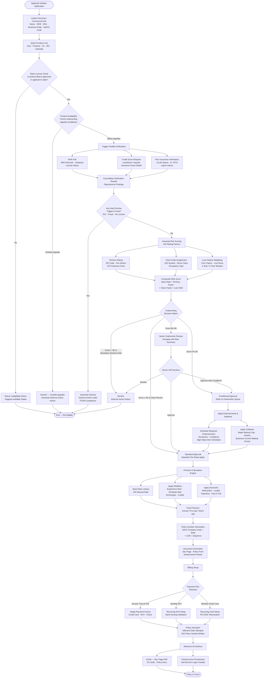

# Activity Diagrams

## Policy Application & Underwriting Flow

## Claims FNOL to Settlement

```mermaid
flowchart TD
    A([Loss Event Occurs]) --> B{FNOL Channel}
    B -- Web Portal --> B1[Online FNOL Form\nStructured Data Capture]
    B -- Phone --> B2[Call Center Agent\nGuided Script · Recorded]
    B -- Mobile App --> B3[Mobile FNOL\nPhoto Upload · GPS Location]
    B -- Agent --> B4[Agency-Submitted FNOL\nAMS360 / Applied Integration]

    B1 & B2 & B3 & B4 --> C[Claim Record Created\nTimestamp · Channel · Reporter]

    C --> D[Coverage Verification\nPolicy In-Force Check\nEffective Date vs. Loss Date]
    D --> D1{Policy Active\nat Time of Loss?}
    D1 -- No --> D2[Coverage Gap Notice\nRefer to Reinstatement\nor Denial Queue]
    D2 --> Z1([End — No Coverage])
    D1 -- Yes --> E[Claim Number Assignment\nCompany Prefix + Year\n+ LOB + Sequence]

    E --> F[Acknowledgment Sent ≤ 24 hrs\nEmail · SMS · Portal Notification]

    F --> G{Claim Type\nRouting}
    G -- Auto --> G1[Auto Claims Unit\nVehicle Damage · Bodily Injury]
    G -- Property --> G2[Property Claims Unit\nDwelling · Contents · ALE]
    G -- General Liability --> G3[Liability Claims Unit\nThird-Party BI/PD]
    G -- Workers Comp --> G4[WC Claims Unit\nMedical · Indemnity · Vocational]
    G -- Health --> G5[Health Claims Unit\nEOB Processing · Provider Direct]

    G1 & G2 & G3 & G4 & G5 --> H[Initial Reserve Set\nExpected Indemnity + LAE]

    H --> I{Complexity\nAssessment}
    I -- Simple / Low-Value --> I1[Desk Review\nDocumentary Adjustment]
    I -- Complex / High-Value\nor Catastrophe --> I2[Field Adjuster Dispatch\nXactimate / CoreLogic]
    I -- Bodily Injury\nor Large Loss --> I3[Specialist Assignment\nMedical Case Manager\nLitigation Analyst]

    I1 & I2 & I3 --> J[Investigation Phase]

    J --> K1[Recorded Statement\nInsured / Claimant / Witnesses]
    J --> K2[Scene Inspection\nPhotos · Measurements\n3D Scan if Applicable]
    J --> K3[Medical Records Request\nHIPAA Authorization\nTreatment Notes / Bills]
    J --> K4[Police / Fire Report\nObtain Official Records]

    K1 & K2 & K3 & K4 --> L[Fraud Score Evaluation\nSee Fraud Detection Flow]

    L --> M{Fraud Score\nResult}
    M -- Score > 70 --> M1[SIU Referral\nHold Payments\nPending Investigation]
    M1 --> N1{SIU Outcome}
    N1 -- Fraudulent --> N2[Claim Denial\nFraud Referral to DA\nReport to NICB]
    N2 --> Z2([Claim Closed — Denied])
    N1 -- Legitimate --> M2[Resume Normal Adjustment]
    M -- Score ≤ 70 --> M2

    M2 --> O[Coverage Determination]
    O --> O1{Coverage\nDecision}
    O1 -- Fully Covered --> P[Full Indemnity Path]
    O1 -- Partially Covered --> Q[Partial Coverage Path\nApply Exclusions · Sublimits\nDeductible Calculation]
    O1 -- Denied --> R[Denial Letter\nStatutory Timeframe\nAppraisal / Arbitration Rights]
    R --> Z2

    Q --> P
    P --> S[Subrogation Evaluation\nThird-Party Liability\nRight of Recovery Assessment]
    S --> S1{Subrogation\nPotential?}
    S1 -- Yes --> S2[Subrogation Hold\nPreserve Evidence\nDemand Letter to TP Carrier]
    S1 -- No --> T[Settlement Valuation]
    S2 --> T

    T --> T1[Itemized Loss Estimate\nACV or RCV · Depreciation\nCode Upgrade Allowance]
    T --> T2[Medical Bill Review\nFee Schedule · UCR Rates\nRe-pricing Network]
    T1 & T2 --> U[Settlement Offer Prepared]

    U --> V{Claimant\nAccepts Offer?}
    V -- Accepts --> W[Payment Approval Workflow]
    V -- Disputes --> V1[Negotiation / Appraisal\nPublic Adjuster Involvement]
    V1 --> V2{Resolved?}
    V2 -- Yes --> W
    V2 -- No --> V3[Litigation Hold\nAssign Defense Counsel\nReserve Adjustment]
    V3 --> V4{Litigation\nOutcome}
    V4 -- Judgment / Settlement --> W
    V4 -- Dismissed / Verdict for Insurer --> Z2

    W --> W1{Payment Amount\nThreshold}
    W1 -- ≤ $25,000 --> W2[Adjuster Authorizes\nPayment]
    W1 -- $25,001 – $100,000 --> W3[Supervisor Approval\nRequired]
    W1 -- > $100,000 --> W4[VP / Executive\nApproval Required]
    W2 & W3 & W4 --> X[Payment Disbursement]

    X --> X1{Payment\nMethod}
    X1 -- Check --> X2[Physical Check Issued\nMailed to Payee]
    X1 -- EFT --> X3[ACH Transfer\n1–2 Business Days]
    X1 -- Direct to Provider --> X4[Provider Draft / EFT\nHealthcare or Repair Shop]
    X2 & X3 & X4 --> Y[Claim File Documentation\nFinal Reserve Reconciliation]

    Y --> AA[Claim Closure\nClosed Date Stamped]
    AA --> AB{Subrogation\nRecovery Pending?}
    AB -- Yes --> AB1[Subrogation Recovery Unit\nDemand · Arbitration · Recovery]
    AB1 --> AB2[Recovery Applied\nNet Paid Loss Updated\nSalvage Credited]
    AB2 --> AC([Claim Fully Closed])
    AB -- No --> AC
```

## Policy Renewal

```mermaid
flowchart TD
    A([Renewal Cycle Trigger\n60 Days Pre-Expiration]) --> B[Pull Expiring Policy Data\nCurrent Terms · Limits · Premium\nLoss History · Tier]

    B --> C[Loss History Evaluation\nCurrent vs. Prior Term\nFrequency & Severity Score]
    C --> D[Market Rate Update\nISO Loss Cost Multiplier\nFiled Rate Changes]
    D --> E[Tier Re-evaluation\nIncidents · Payment History\nCredit Re-score if Applicable]

    E --> F{Renewal\nEligibility Check}
    F -- Mandatory Non-Renewal\nStatutory Reason --> G[Non-Renewal Processing]
    F -- Eligible for Renewal --> H[Recalculate Renewal Premium\nBase Rate × Updated Factors\n± Loss Surcharge / Credit]

    G --> G1[Generate Non-Renewal Notice\n30-Day State-Mandated Notice]
    G1 --> G2[File Notice with State DOI\nif Required by Jurisdiction]
    G2 --> G3[Send Notice to Insured\n& Mortgagee / Lienholder]
    G3 --> Z1([Policy Expires — Non-Renewed])

    H --> I{Premium Change\nThreshold}
    I -- Increase > 25% --> I1[Underwriter Review\nJustification Required]
    I1 --> I2{UW Approves\nRate Change?}
    I2 -- Yes --> J[Renewal Offer Prepared]
    I2 -- No / Adjust --> H
    I -- Change ≤ 25% --> J

    J --> K[Carry Forward Mid-Term\nEndorsements]
    K --> K1[Review Active Endorsements\nVerify Still Applicable]
    K --> K2[Apply Schedule\nChanges Automatically]
    K1 & K2 --> L[Generate Renewal Documents\nDec Page · Updated Forms\nEndorsement Schedule]

    L --> M[Deliver Renewal Offer\n60-Day Notice Window]
    M --> M1[Email — PDF Packet\nPortal Notification]
    M --> M2[USPS First-Class Mail\nMortgagee Copy if Applicable]
    M1 & M2 --> N[Start 30-Day Response Window]

    N --> O{Customer\nResponse}

    O -- Accepts Online / App --> P1[Collect Payment Online\nCard · ACH · Saved Method]
    O -- Accepts via Agent --> P2[Agent Collects Payment\nReceipts Issued via AMS]
    O -- Accepts via Mail --> P3[Check Payment Received\nLockbox Processing]
    O -- Explicitly Declines --> Q[Customer-Requested\nNon-Renewal]
    O -- No Response by\nDay 30 --> R[No-Response Path]

    P1 & P2 & P3 --> S[Payment Validated\nNSF / Decline Check]
    S --> S1{Payment\nCleared?}
    S1 -- NSF / Declined --> S2[Payment Retry\nNotice to Insured]
    S2 --> S3{Retry\nSuccessful?}
    S3 -- Yes --> T[Renewal Confirmed]
    S3 -- No after 2 Attempts --> R
    S1 -- Cleared --> T

    T --> U[New Policy Term Activated\nEffective Date = Expiration\nof Prior Term]
    U --> V[New Term Documents Issued\nDec Page · ID Cards\nUpdated Billing Schedule]
    V --> W([Policy Renewed — In Force])

    Q --> Q1[Process Non-Renewal\nCompute Earned Premium\nReturn Unearned if Any]
    Q1 --> Q2[Notify Mortgagee\n/ Lienholder]
    Q2 --> Z1

    R --> R1{Within Grace\nPeriod?\nTypically 10–30 Days\nby State}
    R1 -- Yes — Grace Period Active --> R2[Lapse Notice Sent\nReinstatement Offer\nProrated Premium Due]
    R2 --> R3{Insured\nReinstatement\nRequest?}
    R3 -- Yes within Grace --> R4[Collect Back Premium\nReinstate Policy\nNo Lapse on Record]
    R4 --> W
    R3 -- No / Expired Grace --> R5[Policy Lapses\nCoverage Terminated]
    R5 --> Z2([Policy Lapsed])
    R1 -- Past Grace Period --> R5

    Z2 --> R6[Notify State Motor\nVehicle Dept if Auto\nFR-44 / SR-22 Lapses]
    R6 --> Z3([Process Complete])
```

## Fraud Detection Flow

```mermaid
flowchart TD
    A([Claim Received\nFNOL Logged]) --> B[Data Aggregation\nClaim Details · Policy Data\nClaimant History · Loss Location]

    B --> C[Parallel Fraud Signal\nCollection]

    C --> C1[ISO ClaimSearch Query\nPrior Claims Across Carriers\nMultiple-Claim Flag]
    C --> C2[NICB Database Check\nNational Insurance Crime Bureau\nVehicle / Theft Registries]
    C --> C3[Internal Claims History\nSame Insured / Address / Phone\nRecent Policy Inception]
    C --> C4[Social Media OSINT Scan\nPublic Profiles · Geolocation\nPost-Loss Activity Inconsistency]
    C --> C5[Third-Party Analytics\nVerisk / LexisNexis\nAnomaly Flags]

    C1 & C2 & C3 & C4 & C5 --> D[ML Fraud Scoring Model\nGBM Ensemble Model\nFeature Vector Assembly]

    D --> D1[Frequency Features\nClaims per Policy Year\nSame-Address Clusters]
    D --> D2[Severity Features\nEstimate vs. Historical Avg\nSupplemental Request Rate]
    D --> D3[Behavioral Features\nFNOL Timing Relative to\nPolicy Inception · Payment Due]
    D --> D4[Network Features\nShared Providers · Attorneys\nBody Shops · Contractors]

    D1 & D2 & D3 & D4 --> E[Composite Fraud Score\n0 – 100 Scale\nModel Version Logged]

    E --> F{Score\nThreshold\nEvaluation}

    F -- Score < 30\nLow Risk --> G[Auto-Proceed\nStandard Adjustment\nNo Delay to Claimant]
    G --> G1[Score Logged\nModel Feedback Tag:\nLow-Risk Baseline]
    G1 --> Z1([Claim Proceeds Normally])

    F -- Score 30 – 70\nModerate Risk --> H[Enhanced Review Queue\nSenior Adjuster Assigned]
    H --> H1[Expanded Document\nRequest]
    H1 --> H2[Receipts · Repair Invoices\nMedical Records · Wage Stubs]
    H --> H3[Statement Verification\nRecorded Statement\nTimeline Cross-Check]
    H2 & H3 --> I{Enhanced Review\nOutcome}
    I -- Concerns Resolved --> I1[Proceed to Settlement\nScore Logged: False Positive]
    I1 --> Z1
    I -- Unresolved Red Flags\nor Score Revised > 70 --> J[Escalate to SIU]

    F -- Score > 70\nHigh Risk --> J[SIU Referral\nSpecial Investigations Unit\nPayments Suspended]

    J --> K[SIU Case Opened\nCase Number · Lead Investigator\nState DOI Notification if Required]

    K --> L[SIU Investigation Workplan]
    L --> L1[ISO ClaimSearch\nDeep Dive · Cross-Match\nAll Known Associates]
    L --> L2[Social Media &\nPublic Records Deep Scan\nCourt Records · Property Deeds]
    L --> L3[Examination Under Oath\nEUO Scheduling\nAttorney Notification]
    L --> L4[Field Investigation\nSurveillance Authorization\nScene Re-Inspection]
    L --> L5[Provider Audit\nBilling Pattern Review\nLicensure Verification]

    L1 & L2 & L3 & L4 & L5 --> M[SIU Investigation Report\nFindings Summary\nEvidence Inventory]

    M --> N{Investigation\nDetermination}

    N -- Legitimate Claim\nFraud Unsubstantiated --> O[Lift Payment Hold\nPay in Full\nApologize for Delay\nUpdate Model: True Negative]
    O --> Z1

    N -- Legitimate but\nOverstated --> P[Partial Payment\nAdjust to Verified Amount\nDocument Reduction Basis]
    P --> P1[Issue Explanation of\nPartial Settlement\nState Supplement Rights]
    P1 --> Z2([Claim Partially Settled])

    N -- Fraudulent Claim\nSubstantiated --> Q[Claim Denial\nDenial Letter with\nSpecific Basis Cited]
    Q --> Q1[Report to NICB\nISO ClaimSearch Update\nCarrier Fraud Database]
    Q --> Q2[Policy Rescission Review\nMaterial Misrepresentation\nUW Notification]
    Q1 & Q2 --> Q3{Criminal\nReferral\nThreshold Met?}
    Q3 -- Yes → Evidence\nPackage Meets Standard --> Q4[Refer to State DA\nor AG Office\nSWORN Statement Prepared]
    Q4 --> Z3([Claim Denied — Criminal Referral])
    Q3 -- No / Insufficient\nEvidence for Criminal --> Z4([Claim Denied — Civil Record])

    N -- Organized Ring\nIndicators --> R[Cross-Carrier Alert\nISO / NICB Industry Bulletin]
    R --> R1[Law Enforcement\nCoordination\nMulti-Jurisdiction Task Force]
    R1 --> Q

    O & P --> S[ML Model Feedback Loop]
    Q & Q4 --> S
    Z3 & Z4 --> S

    S --> S1[Label Outcome:\nTrue Positive · True Negative\nFalse Positive · False Negative]
    S1 --> S2[Append to Training Dataset\nQuarterly Model Retraining\nChampion / Challenger Eval]
    S2 --> S3[Model Performance Metrics\nPrecision · Recall · AUC-ROC\nFalse Positive Rate vs. SLA]
    S3 --> S4{Model Drift\nDetected?}
    S4 -- Yes → Retrain Immediately --> S5[Emergency Retraining\nA/B Test New Weights\nCompliance Sign-Off]
    S5 --> Z5([Model Updated])
    S4 -- No / Within\nAcceptable Bounds --> Z5
```

## Notes on Diagram Conventions

All four diagrams use `flowchart TD` (top-down) layout. Parallel branches are joined using the `&` operator to represent synchronization gates — execution continues only after all parallel paths complete. Decision diamonds (`{}`) represent exclusive gateways. Rounded rectangles (`([...])` or `([...])`) mark start and terminal events. Error and exception paths are rendered as separate branches leading to dedicated terminal nodes, ensuring that every failure mode is reachable from the happy path without back-edges that would create infinite loops in static diagrams.

### Domain Terminology Reference

| Abbreviation | Meaning |
|---|---|
| FNOL | First Notice of Loss |
| MVR | Motor Vehicle Record |
| CLUE | Comprehensive Loss Underwriting Exchange |
| ISO | Insurance Services Office |
| NICB | National Insurance Crime Bureau |
| SIU | Special Investigations Unit |
| EUO | Examination Under Oath |
| ACV | Actual Cash Value |
| RCV | Replacement Cost Value |
| ALE | Additional Living Expense |
| LAE | Loss Adjustment Expense |
| UCR | Usual, Customary, and Reasonable |
| EFT | Electronic Funds Transfer |
| NSF | Non-Sufficient Funds |
| DOI | Department of Insurance |
| FR-44 / SR-22 | Financial Responsibility Certificates |
| GBM | Gradient Boosted Machine (ML model type) |
| OSINT | Open-Source Intelligence |
| AMS | Agency Management System |
| NAICS | North American Industry Classification System |
