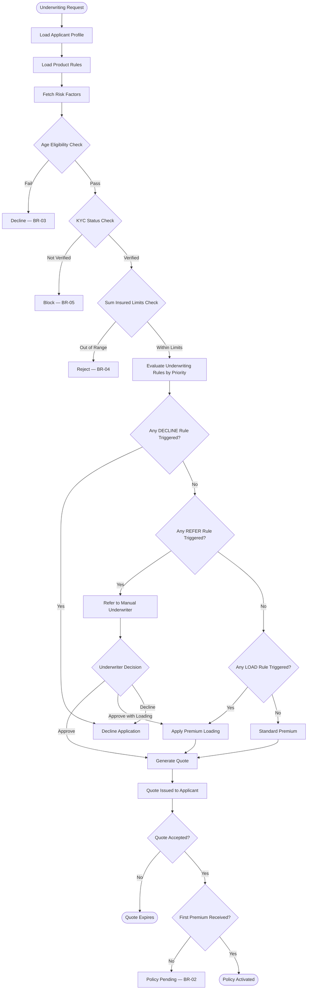

# Business Rules — Insurance Management System

This document defines the enforceable business rules governing all insurance operations within the system. Rules are classified by domain and enforced at the service layer, database layer, and via the underwriting rules engine.

---

## Enforceable Rules

### Policy and Underwriting Rules

**BR-01 — Underwriting Required Before Issuance**
A Policy cannot be issued without a completed underwriting evaluation. Underwriting status must be APPROVED before the policy transitions from QUOTED to ACTIVE.

**BR-02 — Premium Payment Before Activation**
Premium must be paid before policy activation. The first premium installment (or full annual premium) must be confirmed as received before the policy effective date.

**BR-03 — Age Eligibility**
For individual life insurance policies, the insured must be between 18 and 70 years of age at the time of policy issuance. Applications outside this range are automatically declined.

**BR-04 — Sum Insured Within Product Limits**
The sum insured requested in a quote must be within the product's configured minimum and maximum sum insured. Requests outside these limits are rejected at the quoting stage.

**BR-05 — KYC Verification Mandatory**
A PolicyHolder must have KYC status = VERIFIED before a policy can be issued. Policies cannot be issued to unverified or rejected KYC holders.

**BR-06 — Quote Expiry**
A Quote is valid for 30 calendar days from the date of issuance. Expired quotes cannot be accepted or converted to a policy without re-rating.

**BR-07 — No Backdating of Policies**
Policy effective dates cannot be set in the past. The earliest allowed effective date is the current business date.

**BR-08 — Endorsement Requires Active Policy**
A PolicyEndorsement can only be applied to a Policy with status = ACTIVE. Endorsements on LAPSED, CANCELLED, or EXPIRED policies are not permitted.

### Claims Rules

**BR-09 — Claims Must Be Filed Within Notice Period**
Claims must be filed within the policy's notice period. The FNOL date must be within the allowable notice period (typically 30–90 days from loss_date, per product configuration).

**BR-10 — Claim Amount Cannot Exceed Policy Limit**
The approved_amount on a Claim cannot exceed the remaining policy limit (sum_insured minus prior approved claims in the same policy year). Excess amounts are not covered.

**BR-11 — FNOL Date Must Follow Loss Date**
The FNOL submission date/time must be on or after the reported loss_date. Claims with FNOL before loss date are automatically rejected.

**BR-12 — No Claims on Lapsed Policies**
Claims cannot be created or approved against a Policy with status = LAPSED or CANCELLED, unless a reinstatement is completed first.

**BR-13 — Adjuster Authority Limit**
An Adjuster can approve settlements only up to their configured max_authority amount. Settlements exceeding the adjuster's authority require escalation to a senior adjuster or manager approval.

**BR-14 — Fraud High Score Referral**
Any claim with a fraud_score >= 0.75 must be automatically referred to the Special Investigations Unit (SIU) before settlement can be approved.

### Billing and Premium Rules

**BR-15 — Grace Period Enforcement**
If a premium is not paid by the due_date, a grace period (typically 30 days) applies. If payment is not received by grace_period_end, the policy status transitions to LAPSED.

**BR-16 — Refund on Cancellation**
When a policy is cancelled mid-term, a pro-rata refund of the unearned premium must be calculated and issued within 15 business days, subject to any short-rate cancellation penalties.

**BR-17 — No Partial Premium Activation**
A policy cannot be activated on partial premium payment unless the product explicitly supports instalment activation. By default, full first-installment payment is required.

### Reinsurance Rules

**BR-18 — Automatic Cession Within Treaty Limits**
Policies matching a reinsurance treaty's criteria are automatically ceded up to the treaty limit. Risks exceeding the treaty limit require facultative reinsurance placement before issuance.

**BR-19 — Bordereaux Submission Deadline**
Reinsurance bordereau must be submitted to each reinsurer by the 15th of the month following the reporting period. Late submission triggers a compliance alert.

### Summary Numbered Reference List

The following list provides a quick reference to all enforceable rules by number:

1. A Policy cannot be issued without a completed underwriting evaluation. (BR-01)
2. Premium must be paid before policy activation. (BR-02)
3. Claims must be filed within the policy's notice period. (BR-09)
4. Claim amount cannot exceed the remaining policy limit for the policy year. (BR-10)
5. Any claim with a fraud score >= 0.75 must be referred to SIU before settlement. (BR-14)
6. Policy effective dates cannot be backdated — earliest effective date is today. (BR-07)
7. A PolicyHolder must have KYC status VERIFIED before policy issuance. (BR-05)
8. Quotes are valid for 30 calendar days and cannot be accepted after expiry. (BR-06)
9. Endorsements can only be applied to ACTIVE policies. (BR-08)
10. Grace period of 30 days applies for unpaid premiums; lapse follows non-payment. (BR-15)
11. Adjuster settlement authority limits must be enforced; escalation required above limit. (BR-13)
12. Pro-rata refund must be issued within 15 business days of mid-term cancellation. (BR-16)
13. Reinsurance bordereaux must be submitted by the 15th of the following month. (BR-19)
14. No claims allowed on LAPSED or CANCELLED policies without reinstatement. (BR-12)
15. FNOL date must be on or after the reported loss date. (BR-11)

---

## Rule Evaluation Pipeline

The underwriting rules engine evaluates all applicable rules in priority order during quote generation and policy issuance.

### Rule Priority System
Rules are evaluated in ascending priority order (1 = highest priority). Rules with the same priority are evaluated in alphabetical order by rule_code. The first DECLINE rule that matches immediately terminates evaluation and declines the application.

### Rule Actions and Their Effects

| Action | Effect | Priority |
|--------|--------|----------|
| DECLINE | Application rejected; no policy issued | Applied first |
| REFER | Application sent to manual underwriter | Applied second |
| EXCLUDE | Specific coverage excluded from policy | Applied third |
| LOAD | Premium loading factor applied | Applied fourth |
| APPROVE | Explicit approval override | Applied last |

---

## Exception and Override Handling

### Exception Categories

**Underwriting Exceptions**
When an application would normally be declined or referred, a licensed underwriter may raise an exception to override the automated decision. All underwriting exceptions require:
- Documented justification in the underwriting notes
- Supervisor approval if the exception overrides a DECLINE rule
- Recording in the ComplianceRecord entity with the override reason, approving underwriter, and timestamp

**Claim Settlement Exceptions**
When a claim settlement amount exceeds the adjuster's max_authority, an exception workflow is triggered:
1. The adjuster submits the settlement recommendation with justification.
2. The system routes the approval request to the next-level authority (senior adjuster, then claims manager, then VP Claims).
3. The approval chain is recorded in AdjustmentRecord with all approver IDs and timestamps.
4. No settlement payment is released until all required approval levels are obtained.

**Premium Collection Exceptions**
When a policy lapses due to non-payment, the policyholder may request reinstatement within the reinstatement window (typically 90 days from lapse date). Reinstatement exceptions include:
- Payment of all overdue premiums plus any applicable late fees
- Re-underwriting if the reinstatement is beyond 30 days
- No reinstatement is allowed after the maximum reinstatement window has elapsed

**Reinsurance Exceptions**
If no treaty covers a particular risk, a facultative reinsurance placement is required before policy issuance. The facultative placement process includes:
- Risk submission to multiple reinsurers via the Reinsurance Exchange API
- Acceptance recording in the ReinsuranceTreaty (facultative) record
- Manual review by the Reinsurance Manager before policy issuance

### Override Audit Trail
Every override and exception must be immutably recorded. The `compliance_records` table captures:
- The rule or business constraint that was overridden
- The user ID of the person granting the override
- The justification text (minimum 50 characters)
- The timestamp and approval chain
- The outcome of the override decision

Overrides cannot be deleted or modified after recording. If an override was granted in error, a corrective compliance record must be added referencing the original record.

### Escalation Matrix

| Scenario | First Escalation | Second Escalation | Final Authority |
|----------|-----------------|-------------------|-----------------|
| Declined application override | Senior Underwriter | Chief Underwriting Officer | Declined |
| Settlement > adjuster authority | Senior Adjuster | Claims Manager | VP Claims |
| Fraud SIU override | SIU Lead | Chief Claims Officer | Board Audit Committee |
| Lapse reinstatement > 90 days | Policy Admin Manager | COO | Declined |
| Reinsurance capacity breach | Reinsurance Manager | CFO | CEO |
