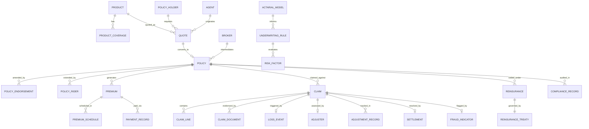

# Data Dictionary — Insurance Management System

This data dictionary defines all major entities, their attributes, data types, constraints, and validation rules used across the Insurance Management System.

---

## Core Entities

### Policy

The central entity representing an insurance contract between the insurer and the policyholder.

| Attribute | Type | Nullable | Description | Validation |
|-----------|------|----------|-------------|------------|
| `policy_id` | `UUID` | No | Primary key. Unique policy identifier. | Auto-generated UUID v4 |
| `policy_number` | `VARCHAR(50)` | No | Human-readable policy reference. | Format: POL-YYYY-XXXXXX |
| `product_id` | `UUID` | No | FK to Product. Insurance product type. | Must reference active Product |
| `policy_holder_id` | `UUID` | No | FK to PolicyHolder. | Must reference verified PolicyHolder |
| `status` | `ENUM` | No | Policy lifecycle status. | DRAFT, QUOTED, ACTIVE, LAPSED, CANCELLED, EXPIRED |
| `effective_date` | `DATE` | No | Date coverage begins. | Must be >= quote_date |
| `expiry_date` | `DATE` | No | Date coverage ends. | Must be > effective_date |
| `sum_insured` | `DECIMAL(18,2)` | No | Total coverage amount. | Must be > 0; within product limits |
| `premium_amount` | `DECIMAL(18,2)` | No | Annual premium before adjustments. | Must be > 0 |
| `currency` | `CHAR(3)` | No | ISO 4217 currency code. | Must be supported currency |
| `underwriting_status` | `ENUM` | No | Underwriting decision. | PENDING, APPROVED, REFERRED, DECLINED |
| `created_at` | `TIMESTAMPTZ` | No | Record creation timestamp. | System-generated |
| `updated_at` | `TIMESTAMPTZ` | No | Last modification timestamp. | System-generated, auto-updated |

### PolicyHolder

Represents the individual or entity that owns the insurance policy.

| Attribute | Type | Nullable | Description | Validation |
|-----------|------|----------|-------------|------------|
| `policy_holder_id` | `UUID` | No | Primary key. | Auto-generated UUID v4 |
| `holder_type` | `ENUM` | No | Individual or corporate. | INDIVIDUAL, CORPORATE |
| `first_name` | `VARCHAR(100)` | Yes | First name (individual). | Required if INDIVIDUAL |
| `last_name` | `VARCHAR(100)` | Yes | Last name (individual). | Required if INDIVIDUAL |
| `company_name` | `VARCHAR(200)` | Yes | Company name (corporate). | Required if CORPORATE |
| `date_of_birth` | `DATE` | Yes | Date of birth (individual). | Must be in past; age 18-85 |
| `national_id` | `VARCHAR(50)` | Yes | National ID or passport number. | Unique per country |
| `email` | `VARCHAR(255)` | No | Primary contact email. | Valid RFC 5322 email |
| `phone` | `VARCHAR(20)` | Yes | Primary contact phone. | E.164 format |
| `address_id` | `UUID` | No | FK to Address. | Must reference verified Address |
| `kyc_status` | `ENUM` | No | KYC verification status. | PENDING, VERIFIED, REJECTED |
| `created_at` | `TIMESTAMPTZ` | No | Record creation timestamp. | System-generated |

### Product

Defines an insurance product offering including coverages, exclusions, and pricing rules.

| Attribute | Type | Nullable | Description | Validation |
|-----------|------|----------|-------------|------------|
| `product_id` | `UUID` | No | Primary key. | Auto-generated UUID v4 |
| `product_code` | `VARCHAR(20)` | No | Short code identifier. | Unique; alphanumeric |
| `product_name` | `VARCHAR(200)` | No | Display name. | Max 200 chars |
| `line_of_business` | `ENUM` | No | Insurance line. | LIFE, HEALTH, AUTO, HOME, COMMERCIAL, LIABILITY |
| `is_active` | `BOOLEAN` | No | Whether product is available. | Default true |
| `min_sum_insured` | `DECIMAL(18,2)` | No | Minimum coverage amount. | Must be > 0 |
| `max_sum_insured` | `DECIMAL(18,2)` | No | Maximum coverage amount. | Must be > min_sum_insured |
| `base_rate` | `DECIMAL(10,6)` | No | Base premium rate. | Must be > 0 |
| `effective_from` | `DATE` | No | Product availability start. | Must be valid date |
| `effective_to` | `DATE` | Yes | Product availability end. | Must be > effective_from if set |

### Claim

Represents a formal claim submission against an insurance policy.

| Attribute | Type | Nullable | Description | Validation |
|-----------|------|----------|-------------|------------|
| `claim_id` | `UUID` | No | Primary key. | Auto-generated UUID v4 |
| `claim_number` | `VARCHAR(50)` | No | Human-readable claim reference. | Format: CLM-YYYY-XXXXXX |
| `policy_id` | `UUID` | No | FK to Policy. | Must reference active Policy |
| `claimant_id` | `UUID` | No | FK to PolicyHolder or Beneficiary. | Must be covered party |
| `loss_date` | `DATE` | No | Date the loss event occurred. | Must be within policy period |
| `fnol_date` | `TIMESTAMPTZ` | No | Date/time FNOL was received. | Must be >= loss_date |
| `claim_type` | `ENUM` | No | Type of claim. | DEATH, DISABILITY, MEDICAL, PROPERTY, LIABILITY, AUTO |
| `claimed_amount` | `DECIMAL(18,2)` | No | Amount claimed by claimant. | Must be > 0 |
| `approved_amount` | `DECIMAL(18,2)` | Yes | Amount approved after adjudication. | Must be <= policy limit |
| `status` | `ENUM` | No | Claim lifecycle status. | FNOL, INVESTIGATION, ASSESSMENT, APPROVED, DENIED, SETTLED, CLOSED |
| `adjuster_id` | `UUID` | Yes | FK to Adjuster. | Assigned after FNOL |
| `fraud_score` | `DECIMAL(5,4)` | Yes | ML fraud score (0.0-1.0). | Range: 0.0000 to 1.0000 |
| `settlement_date` | `DATE` | Yes | Date settlement was paid. | Must be after approval |
| `created_at` | `TIMESTAMPTZ` | No | Record creation timestamp. | System-generated |

### Premium

Represents the premium obligation for a policy.

| Attribute | Type | Nullable | Description | Validation |
|-----------|------|----------|-------------|------------|
| `premium_id` | `UUID` | No | Primary key. | Auto-generated UUID v4 |
| `policy_id` | `UUID` | No | FK to Policy. | Must reference active Policy |
| `premium_type` | `ENUM` | No | Type of premium component. | BASE, RIDER, ENDORSEMENT, LOADING, DISCOUNT |
| `amount` | `DECIMAL(18,2)` | No | Premium amount. | Must be > 0 |
| `frequency` | `ENUM` | No | Billing frequency. | MONTHLY, QUARTERLY, SEMI_ANNUAL, ANNUAL |
| `due_date` | `DATE` | No | Payment due date. | Must be in future at creation |
| `status` | `ENUM` | No | Premium payment status. | PENDING, PAID, OVERDUE, WAIVED, LAPSED |
| `grace_period_end` | `DATE` | Yes | End of grace period. | due_date + product grace_period_days |

### Quote

A premium quote generated for a prospective policyholder.

| Attribute | Type | Nullable | Description | Validation |
|-----------|------|----------|-------------|------------|
| `quote_id` | `UUID` | No | Primary key. | Auto-generated UUID v4 |
| `quote_number` | `VARCHAR(50)` | No | Human-readable quote reference. | Format: QTE-YYYY-XXXXXX |
| `product_id` | `UUID` | No | FK to Product. | Must reference active Product |
| `applicant_id` | `UUID` | No | FK to PolicyHolder. | Must be valid applicant |
| `quoted_premium` | `DECIMAL(18,2)` | No | Calculated premium amount. | Must be > 0 |
| `sum_insured` | `DECIMAL(18,2)` | No | Requested coverage amount. | Within product limits |
| `valid_until` | `DATE` | No | Quote expiry date. | quote_date + 30 days default |
| `status` | `ENUM` | No | Quote status. | DRAFT, ISSUED, ACCEPTED, EXPIRED, WITHDRAWN |
| `underwriting_notes` | `TEXT` | Yes | Underwriter comments. | Max 5000 chars |

### UnderwritingRule

Defines a business rule applied during the underwriting process.

| Attribute | Type | Nullable | Description | Validation |
|-----------|------|----------|-------------|------------|
| `rule_id` | `UUID` | No | Primary key. | Auto-generated UUID v4 |
| `rule_code` | `VARCHAR(50)` | No | Unique rule identifier. | Format: UWR-XXX |
| `rule_name` | `VARCHAR(200)` | No | Descriptive rule name. | Max 200 chars |
| `line_of_business` | `ENUM` | Yes | Applicable LOB, null = all. | LIFE, HEALTH, AUTO, HOME, etc. |
| `condition_expression` | `TEXT` | No | Rule condition (DSL or JSON). | Valid rule DSL syntax |
| `action` | `ENUM` | No | Rule outcome action. | APPROVE, DECLINE, REFER, LOAD, EXCLUDE |
| `loading_factor` | `DECIMAL(5,4)` | Yes | Premium loading multiplier. | Required if action = LOAD |
| `is_active` | `BOOLEAN` | No | Whether rule is active. | Default true |
| `priority` | `INTEGER` | No | Rule evaluation order. | Must be >= 1 |
| `effective_from` | `DATE` | No | Rule validity start. | Must be valid date |

### Adjuster

An insurance adjuster assigned to investigate and assess claims.

| Attribute | Type | Nullable | Description | Validation |
|-----------|------|----------|-------------|------------|
| `adjuster_id` | `UUID` | No | Primary key. | Auto-generated UUID v4 |
| `employee_id` | `VARCHAR(50)` | No | Internal employee identifier. | Unique within organization |
| `first_name` | `VARCHAR(100)` | No | First name. | Min 1 char |
| `last_name` | `VARCHAR(100)` | No | Last name. | Min 1 char |
| `specialization` | `ENUM` | No | Claim type specialization. | AUTO, PROPERTY, MEDICAL, LIABILITY, LIFE |
| `license_number` | `VARCHAR(50)` | Yes | Professional license number. | Required for licensed jurisdictions |
| `max_authority` | `DECIMAL(18,2)` | No | Maximum settlement authority. | Must be > 0 |
| `is_active` | `BOOLEAN` | No | Whether adjuster is available. | Default true |

### ReinsuranceTreaty

Defines a reinsurance treaty agreement with a reinsurer.

| Attribute | Type | Nullable | Description | Validation |
|-----------|------|----------|-------------|------------|
| `treaty_id` | `UUID` | No | Primary key. | Auto-generated UUID v4 |
| `treaty_reference` | `VARCHAR(50)` | No | Treaty reference number. | Unique; alphanumeric |
| `reinsurer_name` | `VARCHAR(200)` | No | Reinsurer company name. | Max 200 chars |
| `treaty_type` | `ENUM` | No | Treaty structure type. | QUOTA_SHARE, SURPLUS, EXCESS_OF_LOSS, STOP_LOSS |
| `line_of_business` | `ENUM` | No | Covered line of business. | LIFE, HEALTH, AUTO, HOME, COMMERCIAL, LIABILITY |
| `cession_percentage` | `DECIMAL(5,2)` | Yes | Cession % for quota share. | Required for QUOTA_SHARE; 0-100 |
| `retention_limit` | `DECIMAL(18,2)` | Yes | Retained risk per risk. | Required for SURPLUS, XL |
| `treaty_limit` | `DECIMAL(18,2)` | No | Maximum reinsurer liability. | Must be > retention_limit |
| `effective_from` | `DATE` | No | Treaty start date. | Must be valid date |
| `effective_to` | `DATE` | No | Treaty end date. | Must be > effective_from |

---

## Canonical Relationship Diagram

---

## Data Quality Controls

### Referential Integrity Rules
- All foreign key relationships must have corresponding database-level FK constraints with `ON DELETE RESTRICT` to prevent orphaned records.
- `policy_id` on Claim must always reference an existing, non-deleted Policy.
- `adjuster_id` assignments must reference only active adjusters with appropriate specialization.

### Uniqueness Constraints
- `policy_number` must be globally unique across all policies.
- `claim_number` must be globally unique across all claims.
- `quote_number` must be globally unique across all quotes.
- `policy_holder.national_id` must be unique per `country_code`.

### Date Validation Rules
- `effective_date` must always precede `expiry_date` on Policy.
- `loss_date` on Claim must fall within the policy's `effective_date` to `expiry_date` window.
- `fnol_date` must be on or after `loss_date`.
- `settlement_date` must be on or after claim `approved_date`.

### Financial Precision Rules
- All monetary amounts use `DECIMAL(18,2)` — two decimal places, never `FLOAT` or `DOUBLE` to avoid rounding errors.
- `fraud_score` uses `DECIMAL(5,4)` for four-decimal precision between 0.0000 and 1.0000.
- `base_rate` and `loading_factor` use `DECIMAL(10,6)` for actuarial precision.

### Status Transition Guards
- Policy `status` transitions must follow the defined state machine: DRAFT → QUOTED → ACTIVE → (LAPSED | CANCELLED | EXPIRED).
- Claim `status` transitions must follow: FNOL → INVESTIGATION → ASSESSMENT → (APPROVED | DENIED) → (SETTLED | CLOSED).
- Any status transition that violates the allowed transitions must be rejected with a `422 Unprocessable Entity` error.

### Soft Delete Pattern
- No core insurance records are hard-deleted. All entities use `deleted_at TIMESTAMPTZ NULL` for soft deletion.
- Deleted records are excluded from all application queries using a global filter.
- Physical deletion is only performed by a scheduled data archival job in compliance with data retention policies.

### Audit Trail Requirements
- All INSERT, UPDATE, and DELETE operations on Policy, Claim, Premium, and PaymentRecord tables are logged to an immutable `audit_log` table.
- Audit records include: `entity_type`, `entity_id`, `action`, `changed_by`, `changed_at`, `old_value` (JSONB), `new_value` (JSONB).
- Audit log records cannot be updated or deleted by application users.

### Data Masking Rules
- `national_id`, `date_of_birth`, and `bank_account_number` fields are masked in non-production environments.
- API responses for sensitive fields apply field-level masking based on the requesting user's role.
- Logs must never contain unmasked PII fields.
