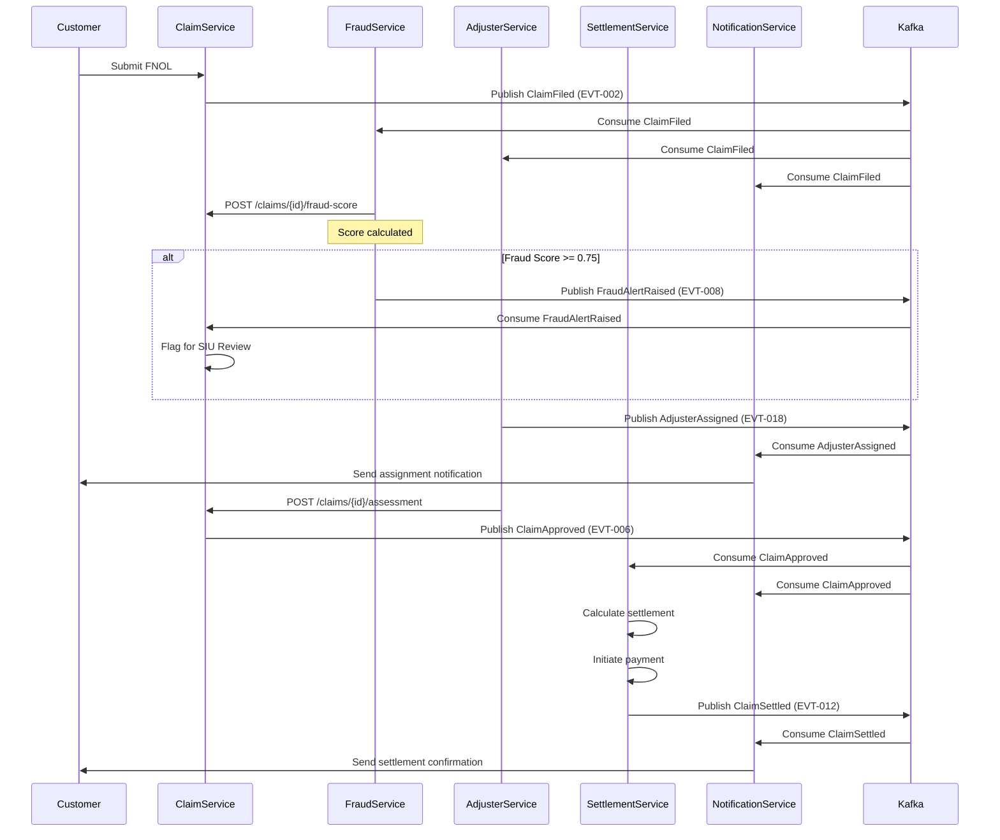

# Event Catalog — Insurance Management System

This catalog defines all domain events published by the Insurance Management System, their schemas, routing conventions, consumers, and operational SLOs.

---

## Contract Conventions

### Event Envelope Schema

All events conform to a standard CloudEvents v1.0 envelope:

```json
{
  "specversion": "1.0",
  "id": "uuid-v4",
  "source": "urn:insurance:policy-service",
  "type": "insurance.policy.issued",
  "datacontenttype": "application/json",
  "time": "2025-01-15T10:30:00Z",
  "dataschema": "https://schemas.insurance.internal/v1/policy-issued.json",
  "correlationid": "req-uuid-v4",
  "partitionkey": "policy-id",
  "data": { }
}
```

### Naming Convention
- **Topic format**: `{domain}.{aggregate}.{event}` — e.g., `insurance.policy.issued`
- **Event type format**: PascalCase noun phrase — e.g., `PolicyIssued`, `ClaimFiled`
- **Version**: Breaking schema changes require a new event type version suffix, e.g., `PolicyIssuedV2`

### Schema Registry
All event schemas are registered in the internal Confluent Schema Registry under the subject name format: `{topic}-value`. Schema evolution follows FULL_TRANSITIVE compatibility.

### Delivery Guarantees
- **At-least-once delivery**: All events are published with producer `acks=all`
- **Idempotent consumers**: All consumers implement idempotent processing using the `id` field as a deduplication key
- **Ordering**: Events within the same aggregate (e.g., all events for a policy) are guaranteed in-order via the `partitionkey` field

---

## Domain Events

| Event ID | Event Type | Topic | Source Service | Trigger | Key Consumers |
|----------|-----------|-------|----------------|---------|---------------|
| EVT-001 | PolicyIssued | insurance.policy.issued | Policy Service | Policy activated after premium payment | Billing Service, Notification Service, Reinsurance Service, Compliance Service |
| EVT-002 | ClaimFiled | insurance.claim.filed | Claim Service | FNOL received and validated | Fraud Service, Adjuster Assignment, Notification Service |
| EVT-003 | PremiumDue | insurance.premium.due | Billing Service | Scheduled job: premium due date reached | Payment Service, Notification Service |
| EVT-004 | PremiumPaid | insurance.premium.paid | Payment Service | Payment confirmation received from gateway | Policy Service, Billing Service, Notification Service |
| EVT-005 | PolicyLapsed | insurance.policy.lapsed | Billing Service | Grace period expired without payment | Policy Service, Notification Service, Agent Portal |
| EVT-006 | ClaimApproved | insurance.claim.approved | Claim Service | Adjudicator approves claim | Settlement Service, Notification Service, Reinsurance Service |
| EVT-007 | ClaimDenied | insurance.claim.denied | Claim Service | Adjudicator denies claim | Notification Service, Compliance Service |
| EVT-008 | FraudAlertRaised | insurance.fraud.alert | Fraud Service | Fraud score >= 0.75 | Claim Service, SIU System, Notification Service |
| EVT-009 | PolicyRenewed | insurance.policy.renewed | Policy Service | Renewal processed and premium collected | Billing Service, Notification Service, Reinsurance Service |
| EVT-010 | PolicyCancelled | insurance.policy.cancelled | Policy Service | Cancellation requested and processed | Billing Service, Notification Service, Reinsurance Service |
| EVT-011 | EndorsementApplied | insurance.policy.endorsed | Policy Service | Endorsement applied to active policy | Billing Service, Reinsurance Service, Notification Service |
| EVT-012 | ClaimSettled | insurance.claim.settled | Settlement Service | Settlement payment disbursed | Policy Service, Finance Service, Notification Service |
| EVT-013 | QuoteIssued | insurance.quote.issued | Quote Service | Quote generated for applicant | Notification Service, Agent Portal |
| EVT-014 | QuoteExpired | insurance.quote.expired | Quote Service | Quote validity window elapsed | Notification Service, CRM Service |
| EVT-015 | ReinsuranceCeded | insurance.reinsurance.ceded | Reinsurance Service | Policy ceded to reinsurer | Finance Service, Compliance Service |
| EVT-016 | UnderwritingReferred | insurance.underwriting.referred | Underwriting Service | Manual referral required | Underwriter Workbench, Notification Service |
| EVT-017 | PolicyholderKYCVerified | insurance.kyc.verified | KYC Service | KYC check passed | Policy Service, Notification Service |
| EVT-018 | AdjusterAssigned | insurance.claim.adjuster_assigned | Claim Service | Adjuster assigned to claim | Adjuster Portal, Notification Service |

### Event Payload Examples

#### PolicyIssued (EVT-001)
```json
{
  "policy_id": "3f7a1c2d-...",
  "policy_number": "POL-2025-000123",
  "product_id": "8b2e4f9a-...",
  "policy_holder_id": "1a3c5e7f-...",
  "effective_date": "2025-02-01",
  "expiry_date": "2026-01-31",
  "sum_insured": 500000.00,
  "annual_premium": 12500.00,
  "currency": "USD",
  "line_of_business": "LIFE"
}
```

#### ClaimFiled (EVT-002)
```json
{
  "claim_id": "9d8c7b6a-...",
  "claim_number": "CLM-2025-000045",
  "policy_id": "3f7a1c2d-...",
  "claimant_id": "1a3c5e7f-...",
  "loss_date": "2025-01-10",
  "fnol_date": "2025-01-12T09:15:00Z",
  "claim_type": "MEDICAL",
  "claimed_amount": 15000.00,
  "currency": "USD"
}
```

---

## Publish and Consumption Sequence

The following sequence diagram illustrates the event flow for a complete FNOL-to-Settlement process:



---

## Operational SLOs

### Event Delivery SLOs

| Event | Max Publish Latency | Max E2E Consumer Latency | At-Least-Once | Retention Period |
|-------|---------------------|-------------------------|---------------|-----------------|
| PolicyIssued | 500ms | 5s | Yes | 7 days |
| ClaimFiled | 500ms | 3s | Yes | 7 days |
| PremiumDue | 1s | 30s | Yes | 7 days |
| PremiumPaid | 500ms | 5s | Yes | 7 days |
| PolicyLapsed | 1s | 10s | Yes | 7 days |
| ClaimApproved | 500ms | 5s | Yes | 7 days |
| FraudAlertRaised | 200ms | 2s | Yes | 30 days |
| ClaimSettled | 500ms | 10s | Yes | 7 days |
| PolicyRenewed | 1s | 30s | Yes | 7 days |

### Consumer Group SLOs

| Consumer Group | Max Lag | Alert Threshold | Recovery SLA |
|----------------|---------|-----------------|--------------|
| fraud-service | 100 msgs | 500 msgs | 5 minutes |
| billing-service | 500 msgs | 2000 msgs | 15 minutes |
| notification-service | 1000 msgs | 5000 msgs | 30 minutes |
| reinsurance-service | 200 msgs | 1000 msgs | 30 minutes |
| compliance-service | 500 msgs | 2000 msgs | 60 minutes |

### Dead Letter Queue Policy
- Events failing consumer processing after 3 retries (with exponential backoff: 1s, 5s, 25s) are routed to the corresponding DLQ topic: `{original-topic}.dlq`
- DLQ topics have a 30-day retention period
- Alerts are sent to the on-call engineer when any DLQ has more than 10 messages
- DLQ messages are reviewed and either replayed or discarded within the consumer SLA window

### Schema Evolution Policy
- All schema changes must be BACKWARD_COMPATIBLE (new optional fields only)
- Breaking schema changes require a new versioned event type and a migration window of at least 30 days during which both versions are published
- Schema registry access is restricted to CI/CD pipelines; manual schema registration is not permitted in production
