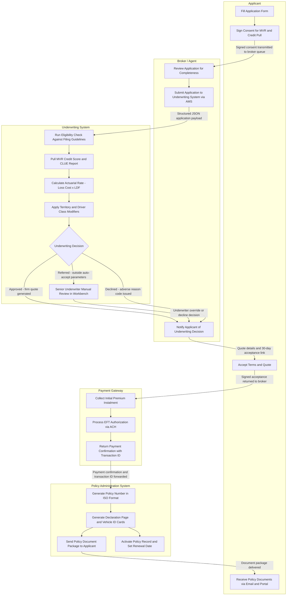
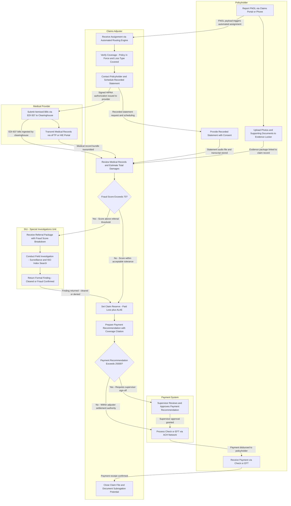

# Swimlane Diagrams

These diagrams model the end-to-end workflows of two core insurance operations: policy issuance and claims processing. Each swimlane corresponds to a system actor or organisational role. Arrows represent data transfers, system events, and human handoffs. Decision diamonds encode branching logic for exception paths, referral queues, and approval gates. Both diagrams use the `flowchart TB` layout with `subgraph`-based lane boundaries. Happy-path flows are shown alongside every material exception path so that both operational teams and system architects can trace the full state space of each workflow.

---

## Policy Issuance

### Process Overview

The policy issuance workflow spans five actors — the Applicant, the Broker/Agent, the Underwriting System, the Payment Gateway, and the Policy Administration System (PAS) — and covers the complete lifecycle from initial application submission through final policy activation and document delivery.

The process begins when a prospective insured completes an application form capturing personal demographics, coverage selections, vehicle or property details, prior insurance history, and prior carrier information. Before any third-party data can be retrieved, the applicant must provide explicit written consent authorising the insurer to pull Motor Vehicle Records (MVR), a credit-based insurance score, and a Comprehensive Loss Underwriting Exchange (CLUE) report. This consent is both a regulatory requirement under the Fair Credit Reporting Act (FCRA) and a technical prerequisite for accurate risk assessment; without it the Underwriting System will not initiate external data calls.

### Broker / Agent Processing

Once consent is captured, the Broker or Agent reviews the application for completeness — validating that all required fields are populated, that VINs are properly formatted, that coverage combinations are internally consistent, and that the agent's binding authority covers the requested risk class. The broker then submits the structured payload to the Underwriting System via the carrier's agency management system (AMS) REST interface. The payload includes applicant demographics, vehicle identification numbers, prior loss history as self-reported by the applicant, selected coverage limits and deductibles, and the broker's agent code and binding authority tier.

### Underwriting System Processing

The Underwriting System is the core automated decision engine. Upon receiving the application, it runs a deterministic multi-step evaluation pipeline:

**Eligibility Check**: The system validates the risk against current underwriting guidelines, checking for disqualifying factors such as suspended licences, mandatory state exclusions, unacceptable prior-carrier cancellation reasons, and jurisdiction-specific filing requirements. Eligibility is adjudicated within 15 seconds; a failed eligibility check results in an immediate automated decline with an adverse action reason code.

**Third-Party Data Pulls**: Concurrently, the system retrieves the MVR from the state DMV clearinghouse, the credit-based insurance score from LexisNexis or Equifax, and the CLUE report from LexisNexis. Each pull is logged with a timestamp, vendor response code, and a SHA-256 hash of the raw response for audit and FCRA-compliance purposes. If any bureau is unavailable, the system queues the application for a retry with exponential backoff; after three failures the risk is automatically referred to a senior underwriter.

**Actuarial Rating**: Using the retrieved third-party data, the system calculates a base loss cost by applying frequency and severity factors from the carrier's state-filed rate manual. Territory codes derived from the garaging ZIP code, vehicle use class, driver class, and credit tier modifiers are then applied multiplicatively to produce the final actuarial premium. The rating engine supports both ISO and carrier-proprietary rating algorithms and is parameterised by line of business and state jurisdiction.

**Underwriting Decision**: The rated risk is evaluated against the carrier's underwriting appetite through a rules engine (implemented as a Drools or FICO Blaze Advisor ruleset). Risks within pre-defined acceptance parameters are automatically approved and a firm quote is generated. Risks outside appetite thresholds but not triggering hard-stop decline rules are flagged as referrals and routed to a senior underwriter queue. Risks triggering hard-stop rules receive a decline decision with applicable adverse action codes within the same synchronous API response.

### Referral and Manual Review

When a referral is triggered, a licensed senior underwriter receives the application in the underwriting workbench alongside the system-generated rate, all third-party data responses, and the rules engine output identifying which referral criteria were triggered. The underwriter may approve with standard terms, approve with modified terms (coverage restrictions, premium surcharge, exclusion endorsements), issue a counteroffer, or decline. All decisions must be documented with a written rationale in the underwriting workbench. Personal lines referral SLA: 4 business hours. Commercial lines referral SLA: 24 business hours.

### Broker Notification and Applicant Acceptance

Regardless of the decision — approved, referred-and-approved, or declined — the Broker receives a notification through the agent portal within 15 minutes of the underwriting decision. For approved applications, the notification includes the quoted premium, coverage details, applicable endorsements, and a 30-day quote acceptance link. For declined applications, the notification includes FCRA-required adverse action reason codes and any applicable state fair-access-to-insurance disclosures.

When the applicant accepts the quote within the 30-day validity window, the broker records the signed acceptance, and the workflow proceeds to premium collection.

### Payment Collection

The Payment Gateway handles two distinct operations. First, it collects the initial premium instalment — either the first monthly instalment or the full policy-term premium depending on the selected billing plan. Second, it processes an EFT (ACH) authorisation if the insured elects recurring bank-account billing. Collected premium funds are swept into the carrier's premium trust account in compliance with state insurance department regulations governing premium handling and trust accounting. The gateway returns a payment confirmation carrying a unique transaction ID that cryptographically binds the premium receipt to the pending policy record.

### Policy Issuance and Activation

The Policy Administration System receives the payment confirmation and initiates the final issuance sequence: generating a policy number conforming to the carrier's ISO numbering format, producing the declarations page with all coverage endorsements and exclusions, generating vehicle ID cards for auto policies, and transmitting the full document package to the applicant via email and the insured self-service portal. The PAS then activates the policy record in the production database — setting status to `ACTIVE` — and schedules the renewal workflow by computing the renewal effective date from the policy expiration date and configuring renewal pre-notice communications.

### Exception Paths

- **Auto-Decline**: The workflow terminates at the broker notification step. No payment is collected and no policy record is created. The adverse action notice is generated and delivered within 30 days as required by the FCRA.
- **Referral — Declined by Senior Underwriter**: Same termination path as auto-decline; the underwriter's rationale is preserved in the underwriting workbench.
- **Payment Authorization Failure (NSF / Declined Card)**: The Payment Gateway returns a failure code; the broker is notified within 5 minutes to contact the applicant for an alternative payment method. The policy is not issued until a successful payment confirmation is returned. The quote remains valid for the remainder of its 30-day window.
- **Document Delivery Failure**: If electronic document delivery fails, the PAS retries delivery up to three times at 15-minute intervals and falls back to postal mail if electronic delivery remains unconfirmed after 48 hours. Regulatory compliance requires that policy documents be delivered within the state-mandated timeframe (commonly 30 days of policy inception).

### Diagram

### Handoff and SLA Reference

**Applicant → Broker/Agent**
- Trigger: Completed application form and signed consent submitted through the agent portal or e-signature platform
- SLA: Broker reviews within 1 business hour
- Data transferred: Application JSON payload, signed consent document reference (PDF SHA-256 hash)

**Broker/Agent → Underwriting System**
- Trigger: Broker confirms application completeness and initiates submission
- SLA: Submission acknowledged within 30 seconds (synchronous API response)
- Data transferred: Structured application payload, agent ID, binding authority code, timestamp

**Underwriting System — Eligibility Check**
- SLA: Completed within 15 seconds of payload receipt
- Failure mode: Bureau unavailability triggers queued retry with exponential backoff; three consecutive failures escalate to senior underwriter queue

**Underwriting System — Third-Party Data Pulls**
- MVR SLA: Response within 3 seconds from state DMV clearinghouse
- Credit score SLA: Response within 2 seconds from LexisNexis or Equifax
- CLUE report SLA: Response within 5 seconds from LexisNexis
- Combined SLA: All pulls completed within 10 seconds; partial results trigger a referral flag

**Underwriting System — Actuarial Rating**
- SLA: Rate calculation completed within 5 seconds after all data pulls return

**Underwriting System → Broker (Decision)**
- Auto-approve or auto-decline SLA: Decision returned within 30 seconds of submission
- Referred: Routed to senior underwriter queue within 2 minutes of referral trigger

**Senior Underwriter Manual Review**
- Personal lines SLA: 4 business hours
- Commercial lines SLA: 24 business hours
- Escalation: If no decision within SLA, supervisor notification triggered automatically

**Broker → Applicant (Notification)**
- SLA: Notification delivered within 15 minutes of underwriting decision

**Applicant → Payment Gateway (Acceptance)**
- Quote validity window: 30 days from quote generation date
- Payment processing SLA: Authorization result returned within 10 seconds

**Payment Gateway → Policy Administration System**
- Trigger: Successful payment confirmation issued
- SLA: Confirmation payload forwarded to PAS within 5 seconds

**Policy Administration System — Document Issuance**
- Policy number generation: Within 2 seconds of payment confirmation receipt
- Declaration page generation: Within 30 seconds of policy number assignment
- Electronic document delivery: Email and portal link active within 5 minutes of generation
- Postal fallback: Triggered after 48 hours of unconfirmed electronic delivery

---

## Claims Processing

### Process Overview

The claims processing workflow governs the full lifecycle of an insurance claim from First Notice of Loss (FNOL) through payment disbursement and file closure. Five actors participate: the Policyholder, the Claims Adjuster, the Medical Provider (relevant for bodily injury, personal injury protection, and health liability claims), the Special Investigations Unit (SIU), and the Payment System.

Claims processing is one of the most operationally complex workflows in the insurance industry. It involves concurrent data streams from multiple sources, regulatory-mandated acknowledgment and settlement timelines, anti-fraud controls with escalation paths, and multi-tier approval gates for large disbursements. The workflow must accommodate both routine property-damage-only claims that close in days and complex bodily injury claims that span months of medical documentation, negotiation, and litigation support.

### FNOL and Initial Assignment

The workflow begins when the policyholder reports a loss through one of the available intake channels: the self-service claims portal, the interactive voice response (IVR) phone system, or a live claims intake agent. The FNOL intake captures the date, time, and location of the loss; a first-party narrative of what occurred; the names and contact details of any involved third parties; the names of any witnesses; and whether emergency services or law enforcement were contacted. A claim number is generated immediately upon FNOL submission.

Simultaneously, the policyholder is directed to upload supporting documentation through the secure evidence locker within the claims portal — photographs of property damage, a police or incident report, medical treatment records if immediately available, and any repair estimates already obtained. All uploaded files are tagged with the claim number, upload timestamp, and file hash for chain-of-custody integrity.

The FNOL event triggers an automated assignment engine that routes the claim to an available Claims Adjuster based on claim type (auto, property, liability, bodily injury), complexity score derived from initial FNOL data, adjuster's geographic territory, adjuster licensing (some states require a resident adjuster), and current workload. Assignment confirmation is delivered to the adjuster via push notification and email within 5 minutes of FNOL submission.

### Coverage Verification

Upon receiving the assignment, the Claims Adjuster queries the Policy Administration System in real time to verify: that the policy was in force on the date and time of loss; that the reported loss type is a covered cause of loss under the selected policy forms and endorsements; that no applicable exclusions apply (e.g., intentional acts, excluded drivers, non-covered vehicle uses, business-use exclusions); and the applicable limits, deductibles, and sublimits for each relevant coverage line. Coverage determinations are documented in the claims management system with specific policy form and endorsement citations.

### Recorded Statement

Following coverage verification, the adjuster contacts the policyholder to obtain a recorded statement — a formal, verbatim, time-stamped account of the loss from the insured's perspective. The recorded statement is a critical component of the claim file used to assess liability, identify potential fraud indicators, and establish the factual basis for the reserve. Recording consent must be obtained before the statement begins; consent requirements vary by state jurisdiction. The audio recording and a system-generated transcript are both stored in the claim file.

### Medical Documentation (Bodily Injury and Health Claims)

For claims involving personal injury, the Medical Provider submits itemised bills using the EDI 837 transaction set — the HIPAA-mandated electronic format for healthcare claim billing. Bills are transmitted to the carrier's EDI clearinghouse and automatically ingested into the claims management system. Medical records are transmitted separately via secure sFTP or through a Health Information Exchange (HIE) portal following the claimant's signed HIPAA authorisation.

The Claims Adjuster reviews both the bills and the underlying medical records to assess the medical reasonableness and necessity of treatment, identify any pre-existing conditions relevant to the claimed injury, evaluate causation between the insured loss and the reported treatment, and calculate the medical special damages component of the total claim value. For complex bodily injury claims, the adjuster may request an Independent Medical Examination (IME) or a peer review through a contracted medical review vendor.

### Fraud Detection and SIU Referral

After reviewing all available evidence — the recorded statement, uploaded documentation, medical records, and third-party data — the adjuster's workstation runs the claim through the carrier's fraud detection scoring model. This is typically a gradient-boosted ensemble or deep learning model trained on historical claim outcomes and evaluating dozens of fraud indicators: claim timing relative to policy inception, treatment patterns inconsistent with the reported mechanism of injury, attorney representation timing, prior claim frequency, social network connections to known fraud rings (via ISO ClaimSearch), and geographic clustering of claims by provider or body shop.

If the fraud score returned by the model exceeds 70 (the carrier's referral threshold), the claim is automatically referred to the Special Investigations Unit. The SIU receives a referral package containing the claim summary, the full fraud score breakdown with contributing factor weights, all flagged indicators, and links to all supporting documentation in the evidence locker. SIU investigators conduct a field investigation that may include ISO ClaimSearch index bureau queries, re-interviews under oath, covert surveillance operations, coordination with law enforcement agencies, and social media open-source intelligence (OSINT) gathering. The SIU returns a formal written finding to the adjuster within the SIU investigation SLA. If the finding confirms fraud or material misrepresentation, the claim is denied and referred to the state's insurance fraud bureau. If the claim is cleared, processing resumes.

### Reserve Setting and Payment Recommendation

Once all evidence has been reviewed and any SIU investigation resolved, the adjuster sets the claim reserve — the total estimated ultimate cost of the claim, comprising paid losses, allocated loss adjustment expenses (ALAE), and any anticipated subrogation recovery. The reserve is entered into the claims management system and triggers a reserve adequacy review by the adjuster's supervisor if the reserve exceeds the supervisor-review threshold configured for the line of business.

The adjuster then prepares a payment recommendation documenting: the settlement basis and coverage citation for each payment component; any applicable deductibles or self-insured retention amounts; coordination of benefits adjustments for health-related claims; comparative negligence reductions based on liability determination; and the total recommended disbursement amount.

If the total recommended payment exceeds $25,000, the claim requires supervisor approval before disbursement can proceed. The supervisor reviews the adjuster's recommendation alongside the full claim file, coverage analysis, and supporting documentation, then approves, modifies, or denies the payment recommendation. If the supervisor is unavailable within the 4-hour SLA, escalation proceeds automatically to the next management tier.

### Payment Disbursement and Claim Closure

The Payment System processes the approved disbursement via check or EFT depending on the payee's registered payment preferences. EFT payments are processed through the ACH network with a standard 1–2 business day settlement window. Physical checks are produced by the print-and-mail vendor and dispatched within 24 hours of approval confirmation; postal delivery typically takes 3–5 business days.

Following payment confirmation, the Claims Adjuster closes the claim file, documents any identified subrogation potential with the at-fault party's information and applicable recovery theory (negligence, strict liability, contractual indemnification), and schedules any subrogation follow-up actions. Files with material subrogation potential are flagged for assignment to the carrier's recovery unit.

### Exception Paths

- **Coverage Denial**: If coverage verification reveals the loss is not a covered cause or an exclusion applies, the adjuster issues a coverage denial letter with specific policy citations and applicable state fair-claims-practices language and closes the claim without payment.
- **SIU Fraud Confirmed**: Claim denied; formal denial letter issued with required statutory language; file referred to state insurance fraud bureau if criminal conduct is suspected; carrier reserves right of rescission if material misrepresentation affected policy issuance.
- **Disputed Settlement**: If the policyholder disputes the settlement amount, the claim enters an alternative dispute resolution track: appraisal (property), mediation, or arbitration as specified in the policy or applicable state statute. Litigation may follow if ADR fails.
- **EFT Payment Returned**: If an ACH payment is returned (incorrect account number, account closed, or insufficient funds), the Payment System retries disbursement via physical check and notifies the adjuster within 24 hours.
- **Statute of Limitations Monitoring**: The claims management system tracks applicable statutes of limitations for first-party and third-party claims by jurisdiction and alerts the adjuster 90 days before expiry if the file remains open.

### Diagram

### Handoff and SLA Reference

**Policyholder — FNOL Submission**
- Portal acknowledgment SLA: Automated confirmation within 30 seconds of submission
- Phone intake SLA: Live agent acknowledgment within 4 minutes; IVR acknowledgment immediate
- Regulatory SLA: Written acknowledgment letter to policyholder within 10 days of FNOL (varies by state; some require 15 days)

**FNOL → Claims Adjuster Assignment**
- SLA: Assignment completed by automated routing engine within 5 minutes of FNOL submission
- Data transferred: Claim number, full policy details from PAS, FNOL loss description, initial documentation inventory

**Claims Adjuster — Coverage Verification**
- SLA: Coverage determination documented within 4 business hours of assignment
- System integration: Real-time API query to Policy Administration System for policy details, endorsements, exclusions, and billing status

**Claims Adjuster — Recorded Statement**
- Contact attempt SLA: Within 1 business day of assignment
- Statement obtained SLA: Within 3 business days of first contact
- Compliance note: Recording consent language must comply with applicable state wiretapping statutes before recording begins

**Medical Provider — Bill Submission**
- EDI 837 submission SLA: Providers are contractually required to submit within 30 days of date of service
- Medical records SLA: Transmitted within 15 business days of signed HIPAA authorisation
- Adjuster acknowledgment SLA: Medical bill receipt acknowledged within the state-mandated timeframe, commonly 10–30 days

**Fraud Scoring → SIU Referral**
- Fraud model scoring SLA: Score returned within 5 seconds of triggering the inference endpoint
- SIU referral package delivery SLA: Compiled and delivered within 30 minutes of score threshold breach
- SIU preliminary finding SLA: 30 days for standard investigations; complex or criminal referrals up to 90 days

**Claims Adjuster — Reserve Setting**
- Initial reserve SLA: Set within 15 days of FNOL (regulatory requirement in most U.S. states)
- Reserve adequacy review: Triggered automatically if reserve exceeds the supervisor-review threshold configured per line of business

**Claims Adjuster — Payment Recommendation**
- SLA: Recommendation documented within 3 business days of reserve finalisation and all evidence reviewed

**Supervisor Approval Gate (Payment Exceeding 25000)**
- SLA: Supervisor review and decision within 4 business hours of recommendation submission
- Escalation: If no response within SLA, claim auto-escalates to next management tier with alert

**Payment System — Disbursement**
- EFT settlement SLA: ACH payment settled within 1–2 business days of processing
- Check dispatch SLA: Check produced and mailed within 24 hours of approval; delivery within 3–5 business days
- Regulatory settlement SLA: Payment issued within state-mandated timeframe from date of agreement (commonly 30–45 days; varies significantly by state and claim type)

**Claims Adjuster — File Closure**
- Closure SLA: File formally closed within 5 business days of payment confirmation
- Subrogation documentation: Subrogation potential documented and recovery unit notified within 30 days of closure where applicable

---

## Cross-Diagram Data Dependencies

The policy issuance and claims processing workflows share several critical data dependencies that couple the two processes operationally and create systemic risks when data quality degrades in either pipeline.

**Policy Data at FNOL**: When a policyholder reports a loss, the FNOL system queries the Policy Administration System in real time to retrieve active policy details. The Claims Adjuster's coverage verification step depends entirely on the accuracy and completeness of the policy record produced during issuance — including coverage selections, named endorsements, exclusions, scheduled drivers, and listed vehicles or properties. Errors or omissions introduced during the issuance workflow propagate directly into coverage determination accuracy during claims.

**Billing Status at Coverage Verification**: Before coverage can be confirmed, the claims system checks whether the policy is current — verifying that premiums collected through the Payment Gateway during issuance and all subsequent billing cycles have not lapsed. A policy with a returned EFT, missed instalment, or active cancellation notice may be in a grace period or may have been cancelled at the time of loss, fundamentally altering coverage availability. The billing status feed from the Payment Gateway to the PAS must remain current within minutes, not hours.

**Underwriting Data Referenced in Claims Context**: The MVR, credit score, and CLUE data retrieved during underwriting are persisted in the policy file and may be referenced during claims processing — for example, to assess whether a driver involved in a reported loss was a rated driver on the policy, to identify discrepancies between the CLUE prior-loss history and the claimant's recorded statement, or to support fraud scoring input features.

**Fraud Model Training Data**: Claim outcomes documented at closure — whether a claim was paid, denied, referred to SIU, or resulted in subrogation recovery — feed back into the carrier's actuarial data warehouse and are used to retrain the fraud scoring model on a periodic basis. The quality of closed-claim documentation directly affects the predictive accuracy of future fraud detections.

**Subrogation Recovery and Actuarial Feedback**: Subrogation recoveries recovered at claim closure are incorporated into the carrier's net loss ratios and feed into the annual rate filing process. Loss trends identified in closed claims data drive updates to the Underwriting System's territory factors, class relativities, and eligibility rules — completing the data feedback loop from claims back to underwriting.

---

## Exception Path Summary

The following table consolidates all exception paths documented across both diagrams, including the triggering condition, the responsible actor, and the operational outcome.

| Workflow          | Exception Trigger                              | Responsible Actor                     | Outcome                                                          |
|-------------------|------------------------------------------------|---------------------------------------|------------------------------------------------------------------|
| Policy Issuance   | Eligibility check fails on hard-stop rule      | Underwriting System                   | Auto-decline issued; adverse action reason codes generated       |
| Policy Issuance   | Risk flagged as referral outside auto-accept   | Senior Underwriter                    | Manual review; may approve, approve with restrictions, or decline |
| Policy Issuance   | Bureau unavailable during data pulls           | Underwriting System / Senior UW Queue | Retry with backoff; escalation to manual referral after 3 failures |
| Policy Issuance   | Payment authorization fails (NSF or declined) | Payment Gateway / Broker              | Broker notified; applicant provides alternate payment method      |
| Policy Issuance   | Applicant does not accept within 30 days       | Broker / Agent                        | Quote expires; new application required if risk still desired     |
| Policy Issuance   | Electronic document delivery fails             | Policy Administration System          | Retry three times; fall back to postal mail after 48 hours       |
| Claims Processing | Coverage not in force on date of loss          | Claims Adjuster                        | Coverage denial letter issued with policy citations; file closed  |
| Claims Processing | Loss type excluded under policy form           | Claims Adjuster                        | Coverage denial letter issued; exclusion language cited           |
| Claims Processing | Fraud score exceeds threshold of 70            | SIU                                   | Field investigation initiated; processing suspended during review  |
| Claims Processing | SIU finds fraud or material misrepresentation  | Claims Adjuster / Legal               | Claim denied; referral to state insurance fraud bureau            |
| Claims Processing | Payment recommendation exceeds 25000           | Supervisor / Payment System           | Supervisor approval required before disbursement proceeds         |
| Claims Processing | Supervisor unavailable beyond 4-hour SLA       | Next Management Tier                  | Auto-escalation with alert; next tier completes approval          |
| Claims Processing | EFT payment returned by ACH network            | Payment System                         | Retry via physical check; adjuster notified within 24 hours       |
| Claims Processing | Policyholder disputes settlement amount        | Claims Adjuster / Legal               | ADR track initiated — appraisal, mediation, or arbitration        |
| Claims Processing | Statute of limitations approaching on open file | Claims Adjuster                       | 90-day alert generated; adjuster must resolve or reserve rights   |
