# System Context Diagram

## Insurance Management System — System Context Overview

The **Insurance Management System (IMS)** is the core operational platform for a multi-line insurance carrier. It manages the full insurance lifecycle: policy origination, underwriting decisioning, premium billing, claims intake, adjudication, reinsurance cession, regulatory compliance, and fraud detection. The platform serves direct consumers through a self-service web portal and mobile application, licensed agents and brokers through a dedicated agent portal, and internal staff (underwriters, claims adjusters, compliance officers) through role-gated workstation interfaces.

The IMS acts as the system of record for all in-force policies, open claims, payment histories, and regulatory filings. It orchestrates data exchange with a constellation of external providers — from payment processors and credit bureaus to state regulators and reinsurers — and must satisfy strict financial-grade SLAs, HIPAA/SOC 2 Type II compliance mandates, and state-level regulatory requirements across all licensed jurisdictions.

---

## C4 System Context Diagram

```mermaid
C4Context
  title System Context Diagram — Insurance Management System

  Person(policyholder, "Policyholder", "Purchases and manages policies, files claims, makes premium payments via web portal or mobile app.")
  Person_Ext(agent, "Agent / Broker", "Quotes, binds, and services policies on behalf of policyholders through the Agent Portal.")
  Person(underwriter, "Underwriter", "Reviews applications, sets coverage terms, applies manual rating overrides, and approves non-standard risks.")
  Person(adjuster, "Claims Adjuster", "Investigates and adjudicates claims, authorises payments, and coordinates with medical and legal providers.")

  System(ims, "Insurance Management System", "Core platform managing policy lifecycle, underwriting, billing, claims adjudication, reinsurance cession, compliance reporting, and fraud orchestration.")

  System_Ext(payment, "Payment Gateway", "Stripe (card) and ACH/Plaid (bank transfer) for premium collection and claims disbursement.")
  System_Ext(credit, "Credit Bureau", "Experian, Equifax, and LexisNexis CLUE — credit scoring, insurance scores, and claims history reports.")
  System_Ext(reinsurer, "Reinsurer", "Treaty and facultative reinsurance partners; catastrophe model integrations (AIR, RMS).")
  System_Ext(regulator, "State Insurance Regulators", "NAIC SERFF and state DOI portals for rate/form filings, compliance reporting, and statutory data calls.")
  System_Ext(medrecords, "Medical Records Provider", "HL7 FHIR R4 / CommonWell Health Alliance — retrieval of claimant medical records for health and disability claims.")
  System_Ext(fraud, "Fraud Detection Service", "NICB (National Insurance Crime Bureau), ISO ClaimSearch, and external ML scoring APIs for claims fraud analytics.")
  System_Ext(pbm, "Pharmacy Benefit Manager", "Express Scripts and CVS Caremark — prescription drug eligibility, formulary checks, and PBM adjudication for health policies.")
  System_Ext(docstorage, "Document Storage", "AWS S3 — durable object storage for policy documents, claim photos, signed forms, and audit logs.")
  System_Ext(iso, "ISO Rating Bureau", "ISO/Verisk actuarial rate filings, advisory loss costs, and circular updates used in rate calculation.")

  Rel(policyholder, ims, "Manages policies, files claims, pays premiums", "HTTPS/REST")
  Rel(agent, ims, "Quotes, binds, endorses, and services policies", "HTTPS/REST")
  Rel(underwriter, ims, "Reviews risks, sets terms, approves exceptions", "HTTPS/REST")
  Rel(adjuster, ims, "Investigates claims, authorises settlement", "HTTPS/REST")

  Rel(ims, payment, "Tokenised premium collection; claims cheque / ACH disbursement", "HTTPS/REST")
  Rel(payment, ims, "Payment confirmation, webhook events, refund status", "HTTPS Webhook")

  Rel(ims, credit, "Requests insurance score, CLUE report, MVR during underwriting", "HTTPS/REST")
  Rel(credit, ims, "Returns scored report, adverse action codes, claims history", "HTTPS/REST")

  Rel(ims, reinsurer, "Cession bordereau, facultative submissions, catastrophe exposure data", "SFTP / HTTPS")
  Rel(reinsurer, ims, "Reinsurance premium confirmations, loss recoveries, cat model output", "SFTP / HTTPS")

  Rel(ims, regulator, "Rate/form filings, statistical reports, surplus lines attestations", "HTTPS / SERFF API")
  Rel(regulator, ims, "Filing approval status, compliance directives, market conduct findings", "HTTPS / SERFF API")

  Rel(ims, medrecords, "Claimant consent + record retrieval requests", "HL7 FHIR R4 / HTTPS")
  Rel(medrecords, ims, "FHIR Bundle: clinical notes, diagnoses, treatment history", "HL7 FHIR R4 / HTTPS")

  Rel(ims, fraud, "Claim attributes, claimant identifiers, loss details for scoring", "HTTPS/REST")
  Rel(fraud, ims, "Fraud score, alert flags, matched prior-claim records", "HTTPS/REST")

  Rel(ims, pbm, "Member eligibility check, prior-authorisation request, formulary query", "HTTPS/REST + X12 270/271")
  Rel(pbm, ims, "Eligibility response, formulary tier, PA decision, EOB data", "HTTPS/REST + X12 835")

  Rel(ims, docstorage, "Upload policy PDFs, claim evidence, signed e-forms", "HTTPS / AWS SDK")
  Rel(docstorage, ims, "Pre-signed download URLs, object metadata, lifecycle events", "HTTPS / S3 Event Notifications")

  Rel(ims, iso, "Rate revision requests, loss cost lookups, circular subscriptions", "HTTPS/REST + Batch FTP")
  Rel(iso, ims, "Advisory loss costs, filed rates, ISO circular bulletins", "HTTPS/REST + Batch FTP")

  UpdateLayoutConfig($c4ShapeInRow="4", $c4BoundaryInRow="2")
```

---

## Integration Details

### 1. Policyholder ↔ Insurance Management System

**Integration Protocol:** HTTPS/REST, TLS 1.3, OAuth 2.0 + PKCE (web); OAuth 2.0 + biometric assertion (mobile). WebSocket push for real-time claim status notifications.

**Data Flows:**
- **Inbound to IMS:** New application submissions (personal details, coverage selections, declarations), premium payments (tokenised card/bank reference), first notice of loss (FNOL), document uploads (photos, police reports), endorsement requests, beneficiary changes.
- **Outbound to Policyholder:** Policy declarations page, premium invoices, payment receipts, claim status updates, renewal offers, coverage change confirmations, push notifications.

**Business Purpose:** Enables direct-to-consumer self-service across the full policy lifecycle, reducing agent-assisted transaction costs and improving policyholder retention through 24/7 account access.

**SLA Requirements:**
- API response latency: p95 < 800 ms for read operations, p95 < 1.5 s for write operations.
- Portal availability: 99.9% monthly uptime.
- Mobile push notification delivery: < 30 s from triggering event.
- RTO: 4 hours; RPO: 1 hour.

**Security Requirements:**
- OAuth 2.0 with PKCE; refresh tokens rotated on each use.
- Field-level encryption for SSN, date of birth, and bank account numbers at rest (AES-256).
- OWASP Top 10 controls enforced at the API gateway layer.
- MFA enforced for all account-level changes (beneficiary, coverage, payment method).
- Session idle timeout: 15 minutes.

---

### 2. Agent / Broker ↔ Insurance Management System

**Integration Protocol:** HTTPS/REST, TLS 1.3, OAuth 2.0 with agent role claims. SAML 2.0 federation for large broker management systems (Applied Epic, Vertafore AMS360).

**Data Flows:**
- **Inbound to IMS:** Quote requests (risk details, coverage parameters), bind orders, endorsement submissions, cancellation requests, premium finance agreements.
- **Outbound to Agent Portal:** Real-time quote responses, policy issuance confirmations, commission statements, book-of-business reports, renewal pipeline dashboard data.

**Business Purpose:** Supports the independent agency and captive agent distribution channels. Agents drive the majority of new business volume; the portal must match or exceed competitor quoting speed to prevent mid-journey abandonment.

**SLA Requirements:**
- Quote response latency (automated eligibility): p95 < 3 s.
- Bind confirmation: p95 < 5 s.
- Commission statement generation: daily batch, available by 06:00 local time.
- Portal availability: 99.9% monthly uptime during business hours (07:00–22:00 in each US time zone).
- RTO: 2 hours; RPO: 30 minutes.

**Security Requirements:**
- SAML 2.0 / OIDC federation; producer appointment status verified against state licensing databases at each login.
- Role-based access control (RBAC) scoped to individual producer NPN and agency code.
- IP allowlisting for agency management system server-to-server integrations.
- All API requests logged with producer NPN for E&O audit trail.

---

### 3. Underwriter ↔ Insurance Management System

**Integration Protocol:** HTTPS/REST, TLS 1.3, internal IdP (Okta) with SAML 2.0. Desktop workstation UI served over the corporate intranet; API-driven underwriting workbench.

**Data Flows:**
- **Inbound to IMS:** Manual rating overrides, referral decisions (approve/decline/counter-offer), endorsement approvals, credit exception grants, reinsurance facultative referrals.
- **Outbound to Underwriter:** Flagged applications exceeding automated authority limits, risk summaries, bureau reports, loss runs, exposure aggregates, cat model output.

**Business Purpose:** Ensures non-standard and complex risks receive human expert review. Underwriters maintain binding authority thresholds, and the IMS enforces escalation rules so no policy outside those limits is issued without manual sign-off.

**SLA Requirements:**
- Risk referral presentation latency: < 2 s.
- Underwriter decision write-back: synchronous, < 1 s confirmation.
- System availability during core underwriting hours (08:00–18:00 ET): 99.95%.
- RTO: 2 hours; RPO: 15 minutes.

**Security Requirements:**
- MFA required for all logins; hardware token or authenticator app.
- Fine-grained RBAC: line of business, state, and dollar authority limits enforced by the IMS, not just the UI.
- All override decisions recorded with underwriter ID, timestamp, and justification for regulatory audit.
- Screen recording disabled; copy-paste restrictions on PII fields.

---

### 4. Claims Adjuster ↔ Insurance Management System

**Integration Protocol:** HTTPS/REST, TLS 1.3, internal IdP. Real-time WebSocket subscription for incoming FNOL assignment events.

**Data Flows:**
- **Inbound to IMS:** Claim notes, coverage determinations, reserve changes, payment authorisations, subrogation referrals, salvage disposition instructions, litigation flags.
- **Outbound to Adjuster:** Claim queues, policy coverage summaries, claimant medical records (retrieved via FHIR integration), fraud scores, ISO ClaimSearch results, payment history, repair estimates.

**Business Purpose:** Central workspace for claim investigation and settlement. Accurate reserve-setting and timely payment authorisation are critical to combined ratio management and regulatory compliance (most states mandate first contact within 24 hours and settlement within 30–45 days of coverage determination).

**SLA Requirements:**
- FNOL-to-adjuster assignment notification: < 60 s.
- Reserve update propagation to financial ledger: < 5 s.
- Payment authorisation to disbursement initiation: < 10 s.
- System availability: 99.9% monthly uptime.
- RTO: 2 hours; RPO: 15 minutes.

**Security Requirements:**
- Role-scoped access: adjusters see only claims in their assigned queue and territory.
- Payment authorisation above authority limits requires dual-control (adjuster + supervisor e-signature).
- HIPAA: claimant medical data accessible only to adjusters with an active open claim assignment; access logged.
- All field-level changes to reserves and payments are immutably audit-logged.

---

### 5. IMS ↔ Payment Gateway (Stripe / ACH/Plaid)

**Integration Protocol:** HTTPS/REST, TLS 1.3, HMAC-SHA256 signed webhook payloads. Stripe API v1; Plaid Link for bank account verification; ACH via Plaid Transfer.

**Data Flows:**
- **IMS → Payment Gateway:** Payment intent creation (premium amount, policy number, billing cycle), refund requests, ACH transfer initiation, payout (claim cheque) creation.
- **Payment Gateway → IMS:** Payment succeeded/failed webhooks, refund confirmation, ACH return codes (R01–R29), payout delivery confirmation, dispute (chargeback) notifications.

**Business Purpose:** Collects premium on a recurring or on-demand basis and disburses claim settlements, covering both card-based and bank-transfer payment rails. Plaid enables account ownership verification before ACH debit to reduce return rates.

**SLA Requirements:**
- Payment intent creation response: p99 < 500 ms.
- Webhook delivery (Stripe): guaranteed at-least-once with retry within 72 hours.
- ACH settlement: T+1 for next-day ACH; same-day ACH where applicable.
- Availability dependency: Stripe offers 99.99% API uptime SLA; IMS must queue retries during outages.
- RTO: 4 hours (graceful degradation: collect payments, process once gateway restored); RPO: 0 (no payment data loss).

**Security Requirements:**
- Card data never touches IMS servers; Stripe.js / Stripe Elements tokenises on the client.
- Stripe Connect restricted API keys scoped per environment; rotated every 90 days.
- Plaid webhook signatures verified with HMAC-SHA256.
- All payment events stored immutably in the IMS audit log with masked PAN (last 4 digits).
- PCI DSS SAQ A compliance for card flows; SOC 2 Type II for ACH flows.

---

### 6. IMS ↔ Credit Bureau (Experian / Equifax / LexisNexis)

**Integration Protocol:** HTTPS/REST, TLS 1.3, mutual TLS (mTLS) with client certificate pinned to carrier's intermediate CA. LexisNexis CLUE accessed via dedicated VPN tunnel + REST API.

**Data Flows:**
- **IMS → Credit Bureau:** Permissioned inquiry request (applicant name, address, date of birth, SSN, policy type, permissible purpose code).
- **Credit Bureau → IMS:** Insurance credit score (0–997), CLUE property/auto loss history, motor vehicle report (MVR), adverse action reason codes, OFAC/sanctions screening result.

**Business Purpose:** Insurance credit scores are statistically predictive of future loss frequency; CLUE and MVR data validate applicant-reported loss history and driving record. Used exclusively at the point of quote and renewal; not used for mid-term coverage decisions.

**SLA Requirements:**
- Synchronous score response: p95 < 3 s (Experian/Equifax); p95 < 5 s (LexisNexis CLUE).
- Availability: bureaus offer 99.9% uptime; IMS must cache last-known score for renewal (max 30-day stale).
- RTO: 8 hours (degraded mode: manual underwriting without bureau data); RPO: 1 hour.

**Security Requirements:**
- mTLS client certificate required; renewed annually.
- SSN transmitted only within the encrypted TLS channel; never logged in plaintext.
- FCRA compliance: permissible purpose code attached to every inquiry; adverse action notices generated automatically by IMS when score results in declination or surcharge.
- Field-level encryption for bureau response payloads at rest.
- Bureau data retained for maximum 7 years per FCRA, then purged automatically by IMS data retention job.

---

### 7. IMS ↔ Reinsurer

**Integration Protocol:** SFTP (primary, for bordereau and bulk cession data) with PGP encryption; HTTPS/REST for real-time facultative referral APIs where partners support it. Catastrophe model output received as structured flat-file (CSV/XML) via SFTP.

**Data Flows:**
- **IMS → Reinsurer:** Monthly cession bordereau (ceded premium, exposure, policy details), catastrophe exposure accumulation reports, facultative submission packages (risk details, loss runs), claims advices exceeding retention thresholds.
- **Reinsurer → IMS:** Acceptance confirmations, ceded premium settlements, loss recovery payments, catastrophe model output (event loss tables, exceedance probability curves), treaty renewal terms.

**Business Purpose:** Reinsurance transfers peak risk (catastrophe, large single risks) off the carrier's balance sheet, satisfying both regulatory capital requirements and rating agency capital adequacy models. The IMS must maintain an accurate real-time view of net retained exposure.

**SLA Requirements:**
- Monthly bordereau delivery: by the 10th business day of each month for the prior month.
- Facultative referral turnaround: IMS delivers submission within 1 hour of underwriter referral; reinsurer SLA typically 24–72 hours.
- Cat model batch processing: < 4 hours from data delivery to updated exposure report.
- RTO: 24 hours; RPO: 4 hours.

**Security Requirements:**
- PGP encryption (4096-bit RSA keys) on all SFTP file transfers; key exchange via secure out-of-band process.
- SFTP host key pinned; key rotation notified 30 days in advance.
- Bordereau files contain masked policy identifiers — no direct policyholder PII transmitted to reinsurers without data-sharing agreement in place.
- IP allowlisting on SFTP server for all reinsurer CIDR ranges.
- Audit log of every file transmitted, with SHA-256 hash for integrity verification.

---

### 8. IMS ↔ State Insurance Regulators (NAIC SERFF / State DOI Portals)

**Integration Protocol:** NAIC SERFF API (HTTPS/REST + SOAP for legacy states); state DOI portals accessed via HTTPS with agency-issued credentials; NAIC statistical reporting via batch flat file (HTTPS upload or SFTP).

**Data Flows:**
- **IMS → Regulator:** Rate and form filing packages (actuarial support, loss cost calculations, rate schedules), surplus lines tax filings, annual statement data (NAIC blank), quarterly financial statements, market conduct self-assessments, complaints register.
- **Regulator → IMS:** Filing approval status and effective date, objection letters, compliance directives, market conduct examination requests, approved rate schedules.

**Business Purpose:** Every state where the carrier is licensed imposes mandatory filing requirements. Rate filings must be approved (or filed-and-used, depending on the state) before implementation. Failure to comply results in regulatory sanctions, fines, and licence revocation risk.

**SLA Requirements:**
- Rate filing submission: IMS must transmit completed filing package within 5 business days of actuarial sign-off.
- Surplus lines tax filing: varies by state (typically monthly or quarterly, 30-day window).
- NAIC annual statement: due March 1; IMS financial reporting module must produce NAIC-formatted output.
- Regulator response ingestion: polling interval ≤ 4 hours for SERFF status updates.
- RTO: 24 hours; RPO: 1 hour for regulatory data.

**Security Requirements:**
- Regulatory credentials stored in secrets manager (HashiCorp Vault); rotated per state DOI password policy (typically 90 days).
- Filing packages digitally signed with carrier's document signing certificate (X.509).
- All submissions logged with submission timestamp, filing number, and submitter ID for exam readiness.
- Network transmission over HTTPS with certificate pinning for SERFF endpoints.
- No third-party sharing of draft filing documents prior to regulatory approval.

---

### 9. IMS ↔ Medical Records Provider (HL7 FHIR R4 / CommonWell)

**Integration Protocol:** HL7 FHIR R4 over HTTPS/REST; SMART on FHIR for consent-gated access; CommonWell Health Alliance network for cross-network record retrieval. Bulk FHIR export ($export operation) for large-volume record pulls.

**Data Flows:**
- **IMS → Medical Records Provider:** Patient identity (name, DOB, member ID), claimant consent token, specific FHIR resource type requests (Condition, Observation, MedicationRequest, Encounter, DiagnosticReport).
- **Medical Records Provider → IMS:** FHIR Bundle containing clinical notes, ICD-10 diagnoses, CPT procedure codes, prescription history, imaging reports, and treating-provider information.

**Business Purpose:** Medical records are essential for health and disability claims adjudication — verifying that treatment is medically necessary, that diagnoses are consistent with the policy coverage, and that billing codes are accurate. FHIR standardises data exchange across disparate EHR systems.

**SLA Requirements:**
- Synchronous FHIR query (single patient, single resource type): p95 < 5 s.
- Bulk export completion for multi-resource pulls: within 30 minutes for a single claimant's full history.
- Record availability: CommonWell network uptime 99.5%; IMS retries with exponential backoff.
- RTO: 8 hours (adjusters fall back to manual record request via fax/mail); RPO: 1 hour for cached records.

**Security Requirements:**
- HIPAA Business Associate Agreement (BAA) in place with all medical records providers.
- SMART on FHIR OAuth 2.0: claimant consent documented and stored before any record retrieval.
- Claimant medical records stored encrypted at rest (AES-256) in IMS; access restricted to adjusters with an active claim assignment.
- FHIR data never written to general-purpose logs; dedicated HIPAA audit log with 6-year retention.
- Minimum necessary principle: IMS requests only the specific FHIR resource types needed for the claim.
- mTLS on all FHIR server connections.

---

### 10. IMS ↔ Fraud Detection Service (NICB / ISO ClaimSearch / External ML)

**Integration Protocol:** HTTPS/REST, TLS 1.3. ISO ClaimSearch accessed via dedicated leased-line VPN + REST API. External ML scoring microservice deployed in carrier's cloud VPC; called synchronously at FNOL and asynchronously during investigation.

**Data Flows:**
- **IMS → Fraud Detection Service:** Claimant identity attributes, claim type, loss date/location, claimed amount, vehicle VIN (auto), property address (property), treating providers, claimant prior-claim history summary.
- **Fraud Detection Service → IMS:** Composite fraud score (0–1000), alert tier (low/medium/high/critical), matched prior ISO claim records, NICB vehicle theft flag, specific fraud indicator codes, recommended investigation actions.

**Business Purpose:** Insurance fraud costs the US industry ~$308 billion annually. Early fraud detection at FNOL and during investigation enables the SIU (Special Investigations Unit) to intercept fraudulent claims before payment, reducing loss ratios and protecting legitimate policyholders from inflated premiums.

**SLA Requirements:**
- Synchronous fraud score at FNOL: p95 < 2 s (blocks claim assignment until score returned).
- ISO ClaimSearch match result: p95 < 4 s.
- Asynchronous deep-scan score update: delivered within 15 minutes of FNOL.
- Service availability: 99.9% monthly uptime; ISO ClaimSearch offers 99.5%.
- RTO: 4 hours; RPO: 1 hour. Degraded mode: claims flagged for manual SIU review if scoring unavailable.

**Security Requirements:**
- Claimant PII minimised: name, hashed SSN (SHA-256 + carrier-specific salt), date of birth transmitted; full SSN never sent.
- ISO ClaimSearch VPN tunnel: IKEv2/IPsec with AES-256-GCM; re-keyed every 8 hours.
- ML model API key rotated every 30 days; stored in secrets manager.
- Fraud scores stored as audit-immutable records; cannot be modified after write.
- SIU referral decisions logged with adjuster ID, score, and decision rationale for litigation defensibility.
- NICB submission of confirmed fraud cases via encrypted batch upload within 30 days of referral.

---

### 11. IMS ↔ Pharmacy Benefit Manager (Express Scripts / CVS Caremark)

**Integration Protocol:** HTTPS/REST for eligibility and formulary APIs; X12 EDI 270/271 (eligibility inquiry/response) and X12 835 (electronic remittance advice) over AS2 or SFTP with PGP encryption.

**Data Flows:**
- **IMS → PBM:** Member ID, group number, date of service, NDC drug code, prescriber NPI for eligibility verification and prior-authorisation requests. X12 270 eligibility inquiry.
- **PBM → IMS:** X12 271 eligibility response (coverage tiers, cost-share, out-of-pocket accumulator), formulary tier and step-therapy requirements, prior-authorisation decision (approved/denied/pended), X12 835 remittance for adjudicated pharmacy claims.

**Business Purpose:** For health insurance policies that include a pharmacy benefit, the PBM manages formulary design, drug pricing contracts, and point-of-sale adjudication at pharmacies. The IMS must synchronise member eligibility files and receive EOB data to maintain accurate claims histories and coordinate benefits with medical coverage.

**SLA Requirements:**
- Eligibility inquiry response: p95 < 3 s (real-time at point of service).
- Prior-authorisation standard decision: 72-hour turnaround per CMS mandate; urgent PA: 24 hours.
- X12 835 remittance files: delivered daily by 08:00 ET for prior-day adjudicated claims.
- Eligibility file transmission to PBM: nightly, by 23:00 ET.
- RTO: 8 hours; RPO: 2 hours.

**Security Requirements:**
- HIPAA BAA in place with each PBM.
- X12 EDI files encrypted with PGP (4096-bit) in transit; AS2 MDN receipts retained for non-repudiation.
- Member eligibility files include only minimum necessary PHI (member ID, effective dates, plan code).
- PBM REST API access via OAuth 2.0 client credentials; scoped to specific endpoints.
- All PBM data classified as PHI; stored in HIPAA-compliant data tier with encryption at rest.
- Coordination of benefits (COB) data handled per HIPAA COB transaction standards.

---

### 12. IMS ↔ Document Storage (AWS S3)

**Integration Protocol:** HTTPS via AWS SDK (S3 API); server-side encryption with AWS KMS customer-managed keys (CMK). S3 Event Notifications via Amazon EventBridge for asynchronous post-upload processing (OCR, virus scan, indexing).

**Data Flows:**
- **IMS → S3:** Policy declaration pages (PDF), signed e-application forms, claim photos and videos, repair estimates, medical records received from providers, correspondence letters, regulatory filing packages, bordereau files (encrypted), audit log archives.
- **S3 → IMS:** Pre-signed GET URLs (15-minute TTL) for document retrieval, S3 Event Notifications (ObjectCreated, ObjectDeleted) triggering downstream workflows (document classification, OCR, virus scan), lifecycle transition notifications.

**Business Purpose:** Centralised durable object storage decouples the IMS application layer from blob storage, enabling independent scaling of document volume. Pre-signed URLs avoid routing large binary payloads through application servers, improving performance and reducing egress costs.

**SLA Requirements:**
- PUT latency (p95): < 500 ms for files up to 10 MB.
- Pre-signed URL generation: p99 < 100 ms.
- S3 standard storage durability: 99.999999999% (11 nines).
- S3 standard availability: 99.99%.
- EventBridge notification delivery: < 5 s from object creation to downstream consumer.
- S3 Intelligent-Tiering: documents older than 90 days transitioned automatically; archived after 7 years.
- RTO: 2 hours (document retrieval via cross-region replication failover); RPO: 0 (S3 replication).

**Security Requirements:**
- Server-side encryption: SSE-KMS with carrier-managed CMK (rotated annually).
- S3 Block Public Access enabled at account and bucket level; no public bucket policies.
- VPC endpoint for S3: all IMS-to-S3 traffic routed via AWS PrivateLink, never over public internet.
- Bucket policies restrict access to IMS application IAM role only; deny from all other principals.
- Object-level logging via AWS CloudTrail S3 data events; shipped to immutable log archive bucket.
- Sensitive documents (medical records, SSN-bearing forms) tagged `data-classification=PHI` or `data-classification=PII`; KMS key policy enforces tag-based access.
- Cross-region replication to DR region with separate CMK.
- MFA Delete enabled on versioned buckets containing regulatory and audit documents.

---

### 13. IMS ↔ ISO Rating Bureau (ISO / Verisk)

**Integration Protocol:** HTTPS/REST for real-time loss cost lookups and circular subscriptions; SFTP with PGP encryption for batch rate filing packages and actuarial data downloads. ISO Risk Analyzer API for property underwriting data.

**Data Flows:**
- **IMS → ISO:** Rate revision filing packages (proposed rates, supporting loss data, actuarial certification), statistical unit data (written/earned premium, incurred losses by state/line/coverage), risk-level data queries (property characteristics, protection class, territory codes).
- **ISO → IMS:** Advisory loss costs by coverage and territory, filed rating algorithms and relativities, ISO circular bulletins (form and rate changes), property risk data (construction class, protection class, roof age), actuarial trend factors.

**Business Purpose:** ISO (Insurance Services Office, now Verisk) provides industry-standard advisory loss costs and rating algorithms that serve as the actuarial foundation for the carrier's own rate filings. State regulators expect carriers using ISO-based rates to demonstrate the linkage to ISO advisory filings. ISO circulars drive mandatory rate and form changes that the IMS must implement on specified effective dates.

**SLA Requirements:**
- Real-time loss cost lookup: p95 < 2 s.
- ISO circular ingestion and IMS rule update: within 30 days of ISO effective date (regulatory requirement in most states).
- Batch statistical data upload to ISO: monthly, due by the 20th of the month.
- Annual policy-level statistical data (NCCI for workers' comp, ISO for property/casualty): due per bureau filing calendar.
- RTO: 24 hours; RPO: 4 hours.

**Security Requirements:**
- ISO SFTP server: client certificate authentication + IP allowlisting of carrier's egress IP range.
- PGP encryption on all batch file transfers; ISO public key obtained through ISO's formal key exchange process.
- ISO REST API: OAuth 2.0 client credentials with scopes limited to rating data endpoints.
- Statistical data files contain aggregate loss data only — no individual policyholder PII transmitted to ISO.
- All ISO circulars version-controlled in IMS with effective-date enforcement; overrides require underwriting management approval.
- Audit log of every rate revision applied in IMS, traceable to the originating ISO filing reference.

---

## Summary: Integration Matrix

| External System | Protocol | Auth Mechanism | PII/PHI in Transit | Criticality |
|---|---|---|---|---|
| Payment Gateway | HTTPS/REST + Webhooks | OAuth 2.0, HMAC-SHA256 | PAN (tokenised) | P1 — Critical |
| Credit Bureau | HTTPS/REST + VPN | mTLS + Client Cert | SSN, DOB, Address | P1 — Critical |
| Reinsurer | SFTP + HTTPS | PGP + IP Allowlist | Masked Policy ID | P2 — High |
| State Regulators | HTTPS/REST + SFTP | Agency Credentials | Aggregate Data | P1 — Critical |
| Medical Records | HL7 FHIR R4 / HTTPS | SMART on FHIR OAuth 2.0 | Full PHI | P1 — Critical |
| Fraud Detection | HTTPS/REST + IPsec VPN | API Key + Hashed PII | Hashed SSN, Identity | P1 — Critical |
| Pharmacy Benefit Mgr | HTTPS + X12/AS2 | OAuth 2.0 + PGP | PHI (minimum necessary) | P2 — High |
| Document Storage | HTTPS / AWS SDK | IAM Role + KMS | PII/PHI (encrypted) | P1 — Critical |
| ISO Rating Bureau | HTTPS/REST + SFTP | OAuth 2.0 + Client Cert | Aggregate Loss Data | P2 — High |

---

## Regulatory and Compliance Context

The Insurance Management System operates under an overlapping set of regulatory frameworks:

- **State Insurance Codes:** Each of the 50 states plus DC maintains its own insurance code. The IMS must enforce jurisdiction-specific rules for rate adequacy, prior approval vs. file-and-use states, cancellation/non-renewal notice periods (typically 10–45 days), and coverage mandates.
- **HIPAA (45 CFR Parts 160/164):** Health and disability lines require full HIPAA Privacy and Security Rule compliance. The IMS is a HIPAA Covered Entity function; all integrations exchanging PHI require BAAs and minimum-necessary data handling.
- **FCRA (15 U.S.C. § 1681):** Credit bureau integrations are governed by the Fair Credit Reporting Act. Permissible purpose, adverse action notices, and 7-year data retention limits are enforced by the IMS workflow engine.
- **GLBA (15 U.S.C. § 6801):** The Gramm-Leach-Bliley Act requires the carrier to maintain a written information security program and provide annual privacy notices to policyholders.
- **PCI DSS v4.0:** Card payment flows require SAQ A compliance at minimum; the IMS achieves this by never touching raw card data (Stripe Elements / tokenisation).
- **SOC 2 Type II:** The IMS platform undergoes annual SOC 2 Type II audit covering Security, Availability, and Confidentiality trust service criteria.
- **NAIC Model Laws:** The IMS implements NAIC model audit rule requirements, including the Model Regulation on Privacy, the Insurance Data Security Model Law (MDL-668), and NAIC cybersecurity event reporting obligations.

---

## Disaster Recovery and Business Continuity

| Tier | Systems | RTO | RPO | Strategy |
|---|---|---|---|---|
| Tier 1 (Mission-Critical) | IMS Core, Payment Gateway, Fraud Detection, Document Storage | 2 hours | 15 minutes | Active-active multi-AZ; cross-region warm standby |
| Tier 2 (Business-Critical) | Credit Bureau, Medical Records, PBM, Regulators | 4–8 hours | 1 hour | Active-passive; automated failover with manual approval |
| Tier 3 (Important) | Reinsurer, ISO Rating Bureau | 24 hours | 4 hours | Batch retry queues; manual re-submission if needed |

All IMS database replicas use synchronous replication within an AWS Region (Multi-AZ RDS) and asynchronous cross-region replication to the DR region. Point-in-time recovery (PITR) is enabled with 35-day retention. Failover runbooks are tested quarterly via tabletop and semi-annually via live DR failover exercises.
