# Use Case Diagram — Insurance Management System

## Overview

The Use Case Diagram for the Insurance Management System (IMS) defines the functional boundary of
the platform and maps all actors — human users and external system integrations — to the core
capabilities they interact with. The IMS is a multi-line insurance platform supporting personal and
commercial lines: life, health, auto, home, and commercial property/liability. It orchestrates the
full insurance lifecycle from initial quote generation and policy issuance, through premium billing
and endorsement processing, to claims FNOL and settlement, reinsurance treaty management, fraud
detection, and regulatory reporting under IFRS 17 and Solvency II frameworks.

This diagram is the primary artefact for stakeholder alignment, sprint planning, and acceptance test
derivation. Each use case represents a discrete, goal-oriented interaction delivering measurable
value to at least one actor. All twelve use cases correspond to detailed descriptions in
`use-case-descriptions.md` and map to backlog epics in the project's Ticketing system.

The system boundary encompasses: the Policy Administration Module, Claims Management Module,
Billing Engine, Underwriting Workbench, Reinsurance Ledger, Fraud Scoring Engine, and Regulatory
Reporting Suite. External parties (payment gateways, credit bureaus, regulatory portals) appear as
boundary actors and are elaborated in `system-context-diagram.md`.

---

## Use Case Diagram

```mermaid
graph TD
    %% ─────────────────────────────────────────────────────
    %% Actors
    %% ─────────────────────────────────────────────────────
    PH((PolicyHolder))
    BR((Broker))
    AG((Agent))
    UW((Underwriter))
    CA((ClaimsAdjuster))
    AC((Actuary))
    AD((Admin))
    RA((RegulatorAPI))

    %% ─────────────────────────────────────────────────────
    %% Use Cases — rounded rectangles denote system functions
    %% ─────────────────────────────────────────────────────
    UC1([UC-001: Get Quote])
    UC2([UC-002: Issue Policy])
    UC3([UC-003: File Claim FNOL])
    UC4([UC-004: Pay Premium])
    UC5([UC-005: Renew Policy])
    UC6([UC-006: Process Endorsement])
    UC7([UC-007: Manage Reinsurance Treaty])
    UC8([UC-008: Generate Regulatory Report])
    UC9([UC-009: Fraud Scoring])
    UC10([UC-010: Policy Cancellation])
    UC11([UC-011: Manage Beneficiaries])
    UC12([UC-012: Upload Documents])

    %% ─────────────────────────────────────────────────────
    %% PolicyHolder associations
    %% ─────────────────────────────────────────────────────
    PH --> UC1
    PH --> UC3
    PH --> UC4
    PH --> UC5
    PH --> UC10
    PH --> UC11
    PH --> UC12

    %% ─────────────────────────────────────────────────────
    %% Broker associations
    %% ─────────────────────────────────────────────────────
    BR --> UC1
    BR --> UC2
    BR --> UC5
    BR --> UC6
    BR --> UC12

    %% ─────────────────────────────────────────────────────
    %% Agent associations
    %% ─────────────────────────────────────────────────────
    AG --> UC1
    AG --> UC2
    AG --> UC4
    AG --> UC6

    %% ─────────────────────────────────────────────────────
    %% Underwriter associations
    %% ─────────────────────────────────────────────────────
    UW --> UC2
    UW --> UC6
    UW --> UC10

    %% ─────────────────────────────────────────────────────
    %% ClaimsAdjuster associations
    %% ─────────────────────────────────────────────────────
    CA --> UC3
    CA --> UC9
    CA --> UC12

    %% ─────────────────────────────────────────────────────
    %% Actuary associations
    %% ─────────────────────────────────────────────────────
    AC --> UC7
    AC --> UC8

    %% ─────────────────────────────────────────────────────
    %% Admin associations
    %% ─────────────────────────────────────────────────────
    AD --> UC2
    AD --> UC8
    AD --> UC10

    %% ─────────────────────────────────────────────────────
    %% RegulatorAPI associations
    %% ─────────────────────────────────────────────────────
    RA --> UC8
```

---

## Use Case Register

| UC ID  | Use Case Name                | Primary Actor(s)                     | Description                                                                                              |
|--------|------------------------------|--------------------------------------|----------------------------------------------------------------------------------------------------------|
| UC-001 | Get Insurance Quote          | PolicyHolder, Broker, Agent          | Generate a risk-rated premium estimate for a requested coverage type and insured profile.                |
| UC-002 | Issue Policy                 | Broker, Agent, Underwriter, Admin    | Formally bind coverage and produce policy schedule documentation after underwriting approval.            |
| UC-003 | File Claim (FNOL)            | PolicyHolder, ClaimsAdjuster         | Submit First Notice of Loss to initiate the claims lifecycle and trigger adjuster assignment.            |
| UC-004 | Pay Premium                  | PolicyHolder, Agent                  | Collect scheduled or ad-hoc premium installments via supported payment channels.                        |
| UC-005 | Renew Policy                 | PolicyHolder, Broker                 | Extend an expiring policy for a new term with updated actuarial rates and amended terms.                 |
| UC-006 | Process Endorsement          | Broker, Agent, Underwriter           | Apply mid-term policy changes: coverage amendments, rider additions, address or vehicle updates.         |
| UC-007 | Manage Reinsurance Treaty    | Actuary                              | Configure, activate, and monitor proportional and non-proportional reinsurance arrangements.             |
| UC-008 | Generate Regulatory Report   | Actuary, Admin, RegulatorAPI         | Produce IFRS 17, Solvency II, and jurisdiction-specific filings for regulatory submission.               |
| UC-009 | Fraud Scoring                | ClaimsAdjuster                       | Execute ML-based fraud probability scoring on submitted claims using behavioral and contextual signals.  |
| UC-010 | Policy Cancellation          | PolicyHolder, Underwriter, Admin     | Terminate an active policy with pro-rata or short-rate refund calculation and cancellation notice.       |
| UC-011 | Manage Beneficiaries         | PolicyHolder                         | Add, update, or remove named beneficiaries and their entitlement splits on life and health policies.     |
| UC-012 | Upload Documents             | PolicyHolder, Broker, ClaimsAdjuster | Attach supporting documents (KYC, claim evidence, medical records) to policies or active claims.        |

---

## Actor Descriptions

### PolicyHolder

The individual or legal entity that owns one or more insurance policies within the IMS. A
policyholder may be a natural person (personal lines: auto, home, life, health) or a corporate
entity (commercial lines: property, liability, marine cargo). They access the self-service web
portal or mobile application to obtain quotes, pay premiums, submit claims, update beneficiary
records, request cancellations, and upload supporting documentation. The policyholder is the
primary coverage beneficiary and the central customer entity in the IMS data model. Identity
verification (KYC) and sanctions screening are applied at onboarding.

### Broker

An independent intermediary licensed and regulated by the relevant financial services authority to
place insurance business on behalf of clients with one or more insurers. Brokers hold elevated
portal access rights to quote across multiple product lines, bind policies, process mid-term
endorsements, and manage client renewal pipelines. They are contractually responsible for accurate
risk disclosure, client suitability assessments, and AML/KYC due diligence. Brokers operate under a
Terms of Business Agreement (TOBA) with the insurer and earn brokerage commission calculated on net
written premium. The IMS tracks broker-of-record assignments per policy.

### Agent

A captive or tied producer who represents the insurer exclusively and distributes its products
through direct or face-to-face channels. Agents share core portal capabilities with brokers —
quoting, policy binding, endorsement processing, premium collection — but operate within more
restrictive underwriting appetite constraints defined by insurer guidelines. Agents are compensated
via commission schedules in the producer agreement and are subject to conduct monitoring, mandatory
training certification, and licensing renewal tracking within the IMS.

### Underwriter

A licensed insurance professional responsible for assessing risk, determining insurability, and
setting policy terms and pricing. Underwriters review applications that exceed automated acceptance
criteria (referrals), apply judgment to non-standard or complex risks, impose special conditions or
exclusions, and authorise policy issuance decisions. They also approve endorsements outside
self-service delegation limits and authorise cancellations requiring adjusted premium return. In
commercial lines, underwriters may negotiate bespoke wording with brokers.

### ClaimsAdjuster

A specialist responsible for investigating, evaluating, and settling insurance claims from first
notice through to final closure. Claims adjusters validate policy coverage against the notified
loss, assess loss quantum using internal reserves and external expert inputs, manage the fraud
scoring workflow, appoint loss assessors or medical professionals as required, and make approval or
denial decisions within their delegated authority limits. They are the primary users of the IMS
claims management module and are accountable for claims cycle time and leakage metrics.

### Actuary

A credentialed professional (Fellow of an actuarial institute) who applies statistical and financial
mathematics to insurance risk management. Within the IMS, the actuary manages reinsurance treaty
configurations (quota share, surplus share, excess of loss, stop loss), performs reserving
calculations, models IFRS 17 insurance contract liability measurements under the General Measurement
Model (GMM), Premium Allocation Approach (PAA), and Variable Fee Approach (VFA), and produces
Solvency II Solvency Capital Requirement (SCR) and Minimum Capital Requirement (MCR) reports. The
actuary is accountable for the technical accuracy of all financial and regulatory outputs.

### Admin

A platform operations or system administration user responsible for IMS configuration management,
user lifecycle administration, product catalog maintenance, and operational exception handling.
Admins can override automated system decisions within defined authorisation matrices, trigger
on-demand regulatory report generation, manage policy cancellations escalated beyond normal
operational workflow, and execute bulk data correction operations. All admin actions are subject to
four-eyes segregation-of-duties controls and written to the immutable audit log for compliance
purposes.

### RegulatorAPI

An external system interface operated by insurance supervisory authorities such as the Prudential
Regulation Authority (PRA) in the UK, the European Insurance and Occupational Pensions Authority
(EIOPA) for Solvency II submissions, or state Departments of Insurance (DOI) in the United States.
The IMS submits machine-readable regulatory filings to this API: Solvency II Pillar III XBRL
taxonomy reports, IFRS 17 actuarial data packages, domestic premium and claims bordereaux, and
periodic financial condition reports (FCR). The RegulatorAPI is a purely outbound integration target
from the IMS perspective and does not initiate inbound transactions.

---

## Diagram Notes

- Use cases shared across Broker and Agent (UC-001, UC-002, UC-006) indicate both actor types
  execute the same underlying system function, but with different data scope: brokers see all
  clients in their portfolio; agents see only their assigned book of business, enforced by
  row-level security policies.
- UC-009 (Fraud Scoring) is invoked automatically during claims adjudication but can also be
  manually re-triggered by a ClaimsAdjuster after new evidence is submitted, or by a supervisor
  conducting a quality audit of a settled claim.
- UC-008 (Generate Regulatory Report) supports both scheduled automated generation at reporting
  period close and on-demand generation initiated by Admin or Actuary users with the appropriate
  role permission.
- Include and extend relationships from standard UML use case notation are documented as Main Flow
  sub-steps and Alternative Flows respectively within `use-case-descriptions.md` for each use case.
- The RegulatorAPI actor represents a family of regulatory submission endpoints; exact endpoint URLs,
  authentication mechanisms, and submission formats are detailed in the integration specifications
  within `system-context-diagram.md`.

---

*Document Version: 1.0 | Last Updated: 2025 | Owner: Business Analysis | Status: Baselined*
