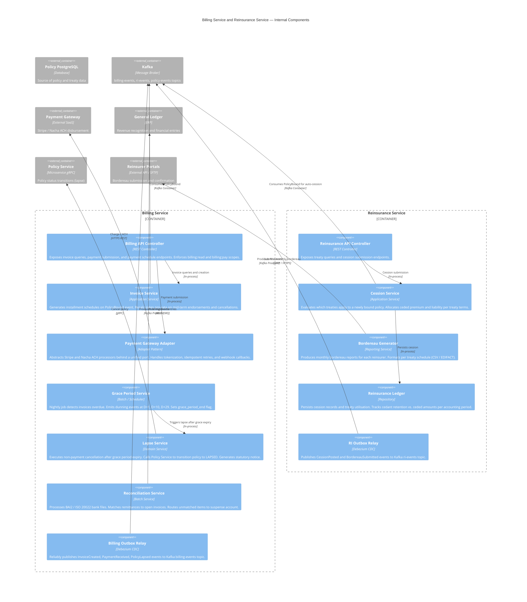
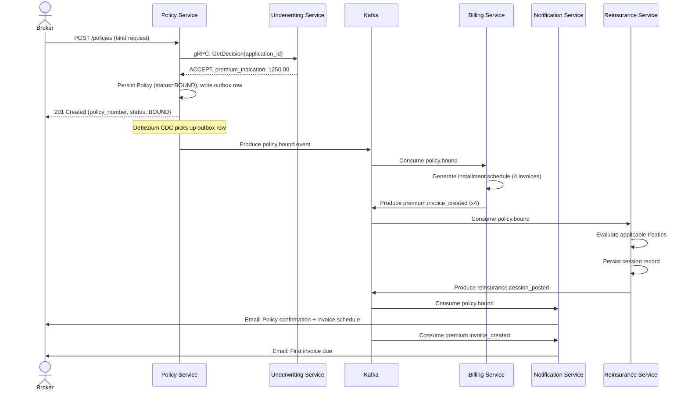

# C4 Component Diagrams — Insurance Management System

## C4 Component Diagram: Policy Administration Service

```mermaid
C4Component
    title Policy Administration Service — Internal Components

    Container_Boundary(pas, "Policy Administration Service") {

        Component(apiGateway, "API Gateway Controller", "Spring MVC / FastAPI", "Validates JWT, enforces OAuth2 scopes, routes requests to application services. Handles rate limiting via token bucket.")

        Component(policyAppSvc, "Policy Application Service", "Domain Service", "Orchestrates policy lifecycle use-cases: submit quote, bind, endorse, cancel, renew. Manages distributed transaction boundaries via Saga coordinator.")

        Component(policyDomainSvc, "Policy Domain Service", "Domain Model", "Enforces aggregate invariants: valid state transitions (QUOTED→BOUND→ACTIVE), coverage consistency, effective-date logic.")

        Component(coverageCalc, "Coverage Calculator", "Calculation Engine", "Applies product-specific coverage rules, computes sublimits, coinsurance percentages, and deductible structures from actuarial rate tables.")

        Component(rulesEngine, "Underwriting Rules Engine", "Drools / OPA", "Evaluates eligibility, appetite, and mandatory exclusion rules. Returns ACCEPT, REFER, or DECLINE with structured reason codes.")

        Component(policyReadModel, "Policy Read Model", "CQRS Query Side", "Materialised views serving list/search queries. Updated by event handlers consuming policy-events Kafka topic. Served from Redis.")

        Component(policyWriteRepo, "Policy Write Repository", "Repository Pattern", "Persists Policy and Coverage aggregates to PostgreSQL. Implements optimistic locking via version column.")

        Component(outboxRelay, "Transactional Outbox Relay", "Debezium CDC", "Captures INSERT/UPDATE on outbox table via CDC. Reliably publishes domain events to Kafka without dual-write risk.")

        Component(endorseWF, "Endorsement Workflow", "State Machine", "Manages endorsement approval workflow: PENDING → APPROVED → APPLIED. Supports multi-level approval for high-premium changes.")

        Component(renewalEngine, "Renewal Engine", "Batch Scheduler", "Identifies policies expiring in T-90/T-60/T-30 days. Generates renewal quotes applying updated rates and optional coverage rollover.")
    }

    Container_Ext(uwService, "Underwriting Service", "Microservice", "Provides underwriting decisions and risk scores")
    Container_Ext(billingService, "Billing Service", "Microservice", "Creates invoice schedules on policy bind")
    Container_Ext(policyDB, "Policy PostgreSQL", "Database", "Source-of-truth for policy write model")
    Container_Ext(redisCache, "Redis", "Cache", "Policy read model projections and session state")
    Container_Ext(kafka, "Kafka", "Message Broker", "policy-events, endorsement-events topics")
    Container_Ext(authServer, "Keycloak", "Auth Server", "OAuth2 / JWT token validation")
    Container_Ext(notifService, "Notification Service", "Microservice", "Sends policy confirmation and renewal notices")

    Rel(apiGateway, authServer, "Validates JWT", "HTTPS/JWKS")
    Rel(apiGateway, policyAppSvc, "Delegates use-cases", "In-process")
    Rel(policyAppSvc, policyDomainSvc, "Enforces invariants", "In-process")
    Rel(policyAppSvc, rulesEngine, "Evaluates rules", "In-process")
    Rel(policyAppSvc, coverageCalc, "Computes coverage", "In-process")
    Rel(policyAppSvc, policyWriteRepo, "Persists aggregate", "In-process")
    Rel(policyAppSvc, endorseWF, "Orchestrates endorsement", "In-process")
    Rel(policyWriteRepo, policyDB, "Reads/Writes", "JDBC/pgx")
    Rel(outboxRelay, policyDB, "CDC reads outbox", "Debezium/WAL")
    Rel(outboxRelay, kafka, "Publishes events", "Kafka Producer")
    Rel(policyReadModel, kafka, "Consumes events", "Kafka Consumer")
    Rel(policyReadModel, redisCache, "Writes projections", "Redis HSET")
    Rel(apiGateway, policyReadModel, "Read queries", "In-process")
    Rel(policyAppSvc, uwService, "Requests UW decision", "gRPC")
    Rel(outboxRelay, billingService, "PolicyBound triggers invoice", "Kafka → Billing consumer")
    Rel(outboxRelay, notifService, "PolicyBound / Cancelled", "Kafka → Notification consumer")
    Rel(renewalEngine, policyWriteRepo, "Reads expiring policies", "In-process")
    Rel(renewalEngine, policyAppSvc, "Initiates renewal", "In-process")
```



---

## C4 Component Diagram: Claims Service

```mermaid
C4Component
    title Claims Service — Internal Components

    Container_Boundary(cms, "Claims Service") {

        Component(claimsApi, "Claims API Controller", "REST Controller", "Accepts FNOL intake, reserve adjustments, status transitions, settlement approvals. Enforces adjuster and supervisor roles.")

        Component(fnolSvc, "FNOL Service", "Application Service", "Validates first notice of loss against active policy and applicable coverage. Creates claim record, assigns initial reserve, triggers fraud pre-screen.")

        Component(investigationSvc, "Investigation Service", "Workflow Service", "Manages adjuster assignment, inspection scheduling, document collection checklist. Tracks SLA compliance for acknowledgement and investigation milestones.")

        Component(reserveCalc, "Reserve Calculator", "Actuarial Engine", "Computes case reserve using actuarial benchmarks by loss type and territory. Supports Bornhuetter-Ferguson and Chain Ladder methodologies for IBNR.")

        Component(fraudEngine, "Fraud Detection Engine", "Rules + ML", "Applies SIU screening rules (staged loss patterns, duplicate claimants, BI soft tissue velocity). Calls external ML scoring API. Routes high-risk claims to SIU queue.")

        Component(settlementSvc, "Settlement Service", "Application Service", "Calculates net payment after deductibles and coinsurance. Validates against policy limits. Generates EFT/check instructions via Payment Gateway Adapter.")

        Component(subrogationSvc, "Subrogation Service", "Domain Service", "Identifies subrogation potential (liable third parties). Tracks recovery demand letters, litigation status, and posts recovery credits to claim.")

        Component(claimsWriteRepo, "Claims Write Repository", "Repository", "Persists Claim aggregate to PostgreSQL. Maintains full reserve change history and status transition audit log.")

        Component(claimsReadModel, "Claims Read Model", "CQRS Query Side", "Materialised views for adjuster queues, supervisor dashboards, and NAIC loss development reports. Refreshed via Kafka event consumers.")

        Component(claimsOutbox, "Claims Outbox Relay", "Debezium CDC", "Reliably publishes ClaimOpened, ReserveChanged, ClaimSettled, FraudFlagged events to Kafka.")
    }

    Container_Ext(policyService2, "Policy Service", "Microservice", "Validates coverage applicability for reported loss")
    Container_Ext(claimsDB, "Claims PostgreSQL", "Database", "Partitioned by fnol_date")
    Container_Ext(mlApi, "ML Fraud Scoring", "External API", "Verisk Fraud Focus / proprietary ML model")
    Container_Ext(payGW, "Payment Gateway", "External API", "ACH/EFT payment disbursement")
    Container_Ext(kafka2, "Kafka", "Message Broker", "claims-events, siu-events topics")
    Container_Ext(notifSvc2, "Notification Service", "Microservice", "Claimant and broker notifications")
    Container_Ext(glSystem, "General Ledger", "ERP", "Financial posting for settlements and reserves")
    Container_Ext(reinsuSvc, "Reinsurance Service", "Microservice", "Triggered by large-loss events for facultative cession")

    Rel(claimsApi, fnolSvc, "Delegates FNOL", "In-process")
    Rel(claimsApi, investigationSvc, "Delegates investigation actions", "In-process")
    Rel(claimsApi, settlementSvc, "Delegates settlement", "In-process")
    Rel(fnolSvc, policyService2, "Verifies coverage", "gRPC")
    Rel(fnolSvc, reserveCalc, "Requests initial reserve", "In-process")
    Rel(fnolSvc, fraudEngine, "Pre-screens FNOL", "In-process")
    Rel(fraudEngine, mlApi, "Scores claim", "HTTPS REST")
    Rel(investigationSvc, reserveCalc, "Revises reserve on new info", "In-process")
    Rel(settlementSvc, payGW, "Dispatches payment", "HTTPS REST")
    Rel(claimsWriteRepo, claimsDB, "Reads/Writes", "JDBC/pgx")
    Rel(claimsOutbox, claimsDB, "CDC reads outbox", "Debezium/WAL")
    Rel(claimsOutbox, kafka2, "Publishes events", "Kafka Producer")
    Rel(claimsReadModel, kafka2, "Consumes events", "Kafka Consumer")
    Rel(claimsOutbox, notifSvc2, "ClaimOpened / Settled", "Kafka → Notification consumer")
    Rel(claimsOutbox, glSystem, "Settlement financial posting", "Kafka → GL consumer")
    Rel(claimsOutbox, reinsuSvc, "Large loss facultative trigger", "Kafka → Reinsurance consumer")
```



---

## Component Interaction Table

| Component | Interacts With | Protocol | Purpose |
|---|---|---|---|
| Policy API Controller | Keycloak Auth Server | HTTPS / JWKS | JWT introspection and scope validation |
| Policy Application Service | Underwriting Service | gRPC | Request binding authorization (UW decision check) |
| Policy Application Service | Policy Write Repository | In-process | Persist policy aggregate |
| Policy Application Service | Coverage Calculator | In-process | Compute coverage limits and deductibles |
| Policy Application Service | Underwriting Rules Engine | In-process | Evaluate eligibility and appetite rules |
| Transactional Outbox Relay | Policy PostgreSQL | Debezium CDC (WAL) | Capture domain events without dual-write |
| Transactional Outbox Relay | Kafka `policy-events` | Kafka Producer | At-least-once event delivery |
| Policy Read Model | Kafka `policy-events` | Kafka Consumer | Rebuild read-side projections |
| Policy Read Model | Redis | Redis HSET | Serve low-latency list/search queries |
| Renewal Engine | Policy Write Repository | In-process | Query policies expiring in T-90 / T-60 / T-30 |
| Endorsement Workflow | Policy Domain Service | In-process | Validate endorsement state transitions |
| FNOL Service | Policy Service | gRPC | Verify active coverage for loss type and date |
| FNOL Service | Reserve Calculator | In-process | Set initial case reserve on claim creation |
| FNOL Service | Fraud Detection Engine | In-process | Pre-screen for SIU indicators on intake |
| Fraud Detection Engine | ML Fraud Scoring API | HTTPS REST | Real-time ML fraud score (< 500 ms SLA) |
| Investigation Service | Reserve Calculator | In-process | Revise reserve after inspection or new evidence |
| Settlement Service | Payment Gateway | HTTPS REST | Disburse EFT/ACH to claimant or repair shop |
| Subrogation Service | Claims Write Repository | In-process | Post third-party recovery credits |
| Claims Outbox Relay | General Ledger (ERP) | Kafka → GL Consumer | Financial posting for reserve changes and settlements |
| Claims Outbox Relay | Reinsurance Service | Kafka → RI Consumer | Trigger facultative cession for large losses |
| Invoice Service | Policy Service | Kafka Consumer (`policy-events`) | Create invoice schedule on `PolicyBound` event |
| Grace Period Service | Notification Service | Kafka → Notification Consumer | Send dunning notices at D+1, D+10, D+29 |
| Lapse Service | Policy Service | gRPC | Cancel policy for non-payment after grace period |
| Reconciliation Service | General Ledger (ERP) | SFTP / ISO 20022 | Post matched payments and exceptions to GL |
| Actuarial Factor Service | Rate Table Store (S3) | S3 GetObject | Retrieve versioned rating factors and tables |
| UW Decision Service | Policy Service | gRPC | Authorize bind on ACCEPT decision |

---

## Key Design Patterns

### CQRS for Policy and Claims Reads

The write model (command side) persists the full Policy or Claim aggregate to PostgreSQL using the Repository pattern. The read model (query side) is a separate projection maintained in Redis, updated asynchronously by Kafka consumers processing domain events. This separation allows the query side to be independently scaled and schema-optimised without burdening the write path.

```
Write Path:  Controller → AppService → Domain Model → Write Repo → PostgreSQL
                                                                     ↓ (CDC via Debezium)
Read Path:   Kafka Consumer → Read Model Projector → Redis Hash
             Controller → Read Model → Redis GET
```

### Saga Pattern for Claims Settlement

The settlement workflow spans multiple services (Claims, Payment Gateway, General Ledger, Reinsurance). A choreography-based Saga coordinates compensating transactions:

| Step | Service | Compensating Action |
|---|---|---|
| 1. Reserve final settlement | Claims Service | Reverse to PENDING_SETTLEMENT |
| 2. Dispatch payment | Payment Gateway | Initiate payment reversal |
| 3. Post financial entry | General Ledger | Post reversal journal |
| 4. Notify cession | Reinsurance Service | Reverse cession posting |
| 5. Close claim | Claims Service | Reopen to RESERVED |

On step failure, Kafka tombstone events trigger upstream compensating handlers to roll back committed steps.

### Event Sourcing for Audit Trail

All state-changing domain events are appended to an `event_store` table (append-only log). The current aggregate state is derived by replaying events from the beginning or from a snapshot. This provides:

- **Complete audit trail** required for NAIC regulatory reporting and litigation
- **Time travel** — reconstruct policy or claim state at any point in time
- **Replay** — reprocess events through updated business logic without data migration

```sql
CREATE TABLE event_store (
    id              UUID            PRIMARY KEY DEFAULT gen_random_uuid(),
    aggregate_id    UUID            NOT NULL,
    aggregate_type  VARCHAR(50)     NOT NULL,   -- 'Policy', 'Claim', 'Premium'
    event_type      VARCHAR(100)    NOT NULL,
    event_version   INT             NOT NULL,
    payload         JSONB           NOT NULL,
    metadata        JSONB,
    occurred_at     TIMESTAMPTZ     NOT NULL DEFAULT NOW(),
    causation_id    UUID,
    correlation_id  UUID
);

CREATE INDEX idx_event_store_aggregate ON event_store (aggregate_id, event_version);
```

---

## External Dependency Contracts

| Component | External System | Dependency Type | Contract / SLA |
|---|---|---|---|
| Underwriting Rules Engine | ISO / Verisk Loss History (CLUE) | Synchronous HTTP | Prior 5-year loss history per applicant. Response < 2 s. 99.5% availability. |
| Risk Scoring Engine | LexisNexis Credit Bureau | Synchronous HTTP | Credit score and insurance score. Response < 1 s. Consent required per FCRA. |
| Risk Scoring Engine | MVR API (state DMVs) | Synchronous HTTP | Motor vehicle records per driver. Response < 3 s. State-specific data availability. |
| Fraud Detection Engine | ML Scoring API (Verisk Fraud Focus) | Synchronous HTTP | Fraud probability 0–1. < 500 ms. Fallback: rule-only scoring if API unavailable. |
| Settlement Service | Payment Gateway (Stripe / Nacha ACH) | Synchronous HTTPS | ACH settlement T+1. Card settlement T+2. 99.99% availability. Idempotency required. |
| Reconciliation Service | Bank (BAI2 / ISO 20022) | File-based SFTP | Daily remittance file delivered by 06:00 local. Retry window: same day. |
| Actuarial Factor Service | Rate Table Store (S3) | Object Storage | Versioned rate table bundles. Read-only. Cache TTL: 1 h. Updated on product filing. |
| Outbox Relay (all services) | Kafka Cluster | Message Broker | At-least-once delivery. Retention: 14 days. Partition count aligned to consumer group size. |
| Policy Read Model | Redis Cluster | In-memory Cache | Cache-aside pattern. TTL: 5 min per key. Eviction policy: allkeys-lru. |
| All Services | Keycloak (Auth Server) | JWKS / Token Introspect | JWKS cached locally with 5 min refresh. Fallback: reject all requests if JWKS unreachable > 30 s. |
| Claims Outbox Relay | General Ledger (SAP / Oracle ERP) | Kafka → Outbound Adapter | Financial posting within 1 h of event. Idempotent posting via external reference ID. |
| Reinsurance Service | Reinsurer Bordereau API | Async SFTP / API | Monthly bordereau submission. Cession confirmation within 5 business days. |
| NAIC Reporting Module | State regulatory portals | Scheduled batch SFTP | Annual statement data (Schedule P, Schedule F). Submission deadline: March 1. |

---

## C4 Component Diagram: Billing and Reinsurance Services



---

## Deployment View — Component-to-Container Mapping

| Component | Container | Scaling Strategy | Resilience |
|---|---|---|---|
| Policy API Controller | Policy Service (K8s Deployment) | HPA on CPU ≥ 70% | 3 replicas minimum; circuit breaker on UW Service |
| Policy Read Model | Policy Service (K8s Deployment) | HPA on RPS | Redis Cluster (3 shards); fallback to DB on cache miss |
| Transactional Outbox Relay | Debezium Connector (K8s) | Single instance + standby | Automatic failover; WAL log-based recovery |
| FNOL Service | Claims Service (K8s Deployment) | HPA on queue depth | Idempotent on `Idempotency-Key`; dead-letter queue for failed FNOL |
| Fraud Detection Engine | Claims Service (K8s Deployment) | Co-located with FNOL | ML API timeout 500 ms; fallback to rule-only scoring |
| Reserve Calculator | Claims Service (K8s Deployment) | Co-located | Actuarial tables cached in-memory; refresh on product change event |
| Settlement Service | Claims Service (K8s Deployment) | HPA | Saga coordinator persisted to Redis; compensating handlers on Kafka |
| Grace Period Service | Billing Service (K8s CronJob) | Single instance nightly | Idempotent batch; re-runnable without duplicating dunning notices |
| Lapse Service | Billing Service (K8s CronJob) | Single instance | Exactly-once semantics via DB lock on policy_id |
| Renewal Engine | Policy Service (K8s CronJob) | Single instance | Paginates large renewal cohorts; resumable on failure via cursor |
| Bordereau Generator | Reinsurance Service (K8s CronJob) | Single instance monthly | Generates per-reinsurer files; retry on SFTP failure |
| Cession Service | Reinsurance Service (K8s Deployment) | HPA | Idempotent cession via (policy_id, treaty_id, accounting_period) unique key |

---

## Data Flow: End-to-End Policy Bind to First Invoice



