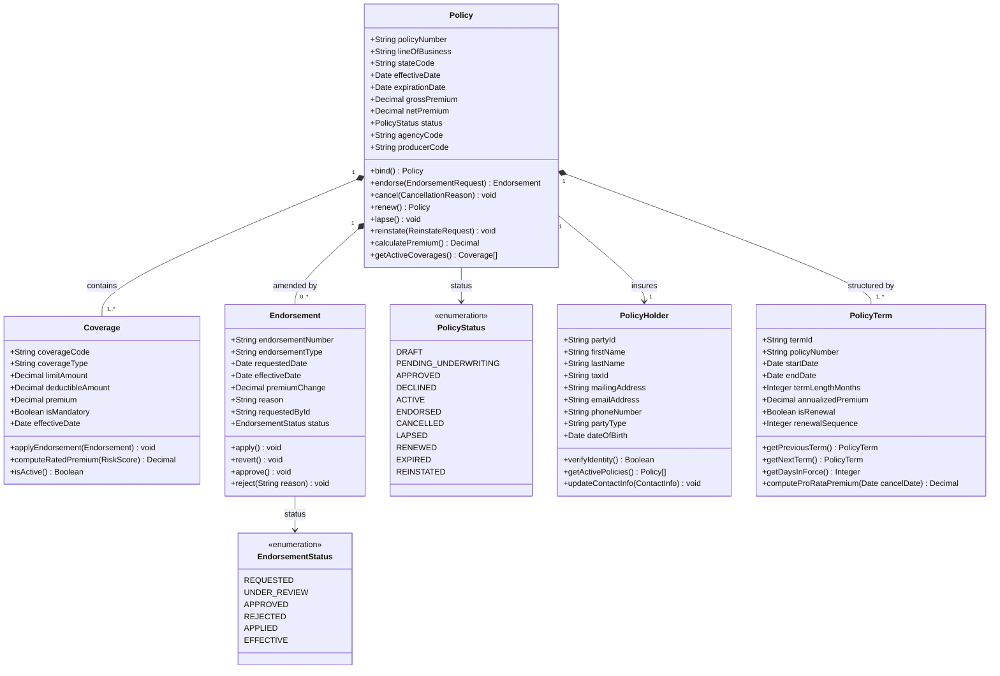
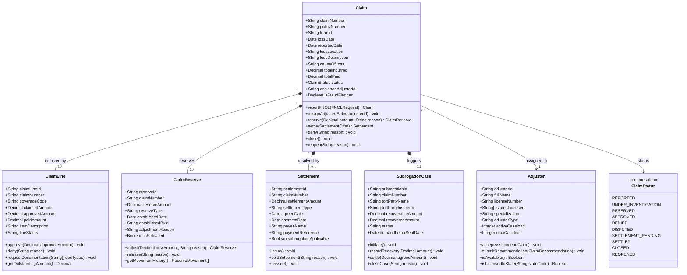
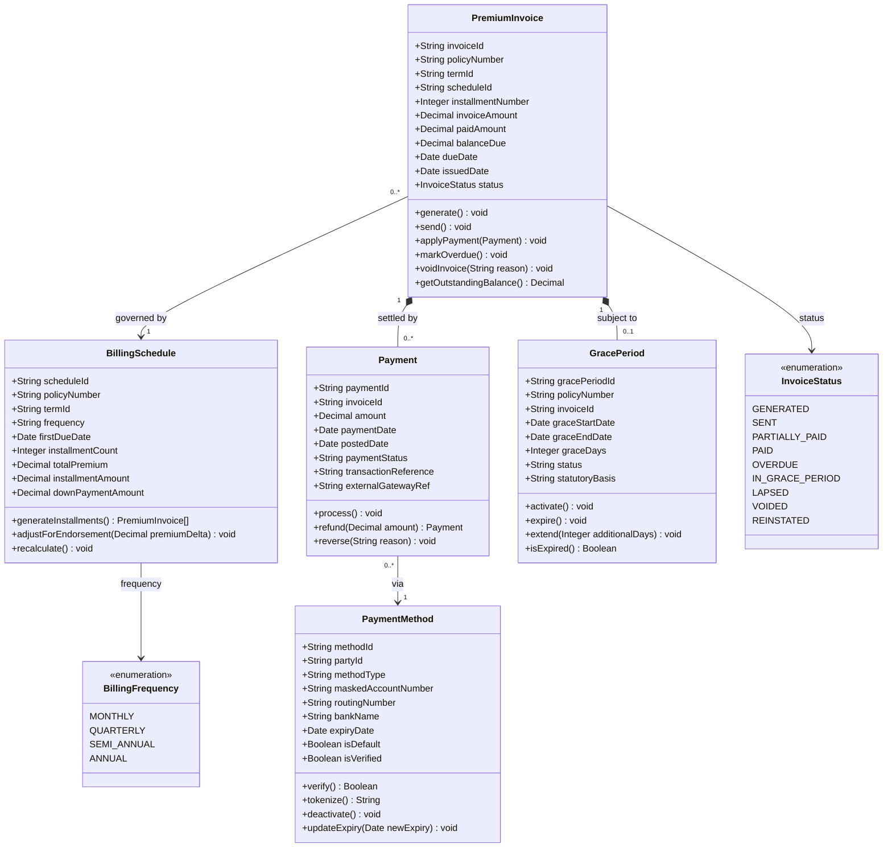
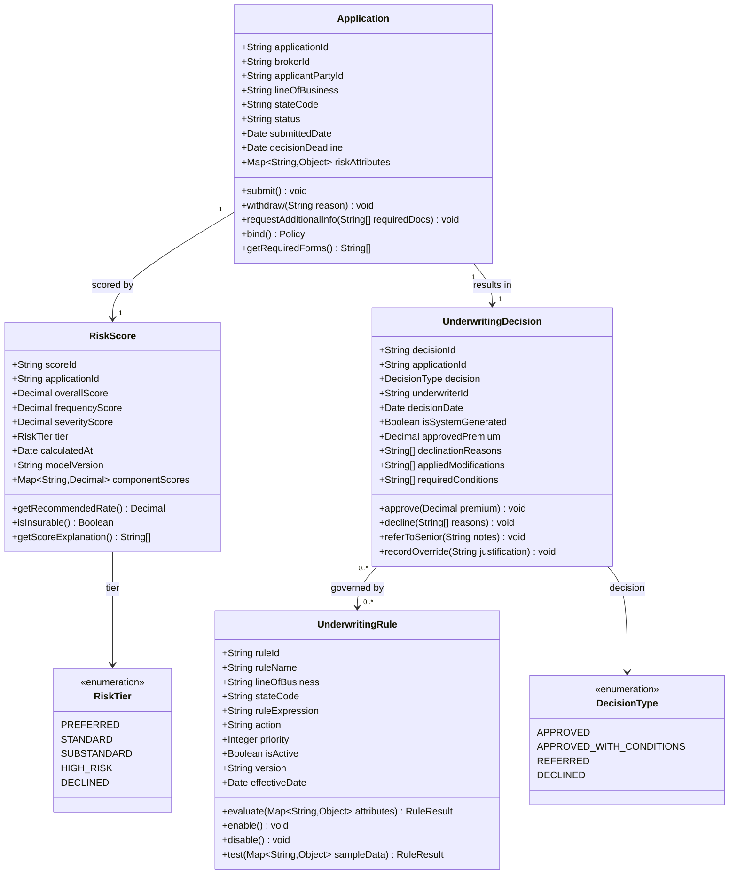
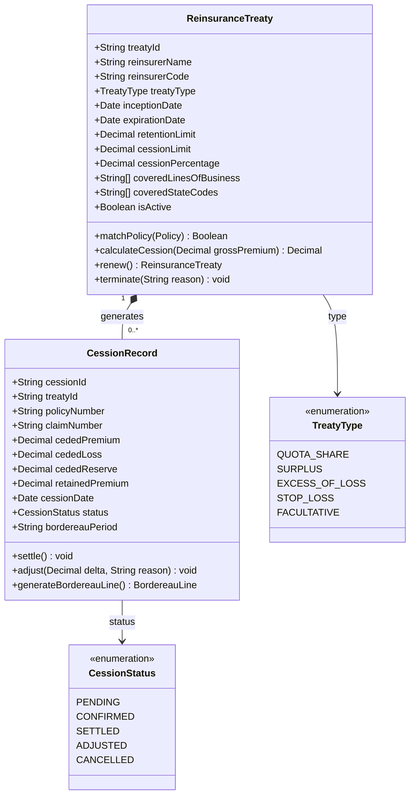

# Class Diagrams — Insurance Management System

This document defines the static domain model for the P&C Insurance SaaS platform using UML class notation rendered via Mermaid. Diagrams are organized around five bounded contexts following Domain-Driven Design (DDD) principles. Each bounded context exposes a single aggregate root; all state mutations must pass through the root to preserve business invariants. Cross-context references use string identifiers only — never object references — to allow independent deployment and eventual consistency via domain events.

---

## Policy Domain

The `Policy` aggregate root governs all coverage data and endorsement history. `PolicyHolder` captures the insured party. `PolicyTerm` models the renewal chain, enabling pro-rata calculations and historical auditing. `Endorsement` records mid-term contract changes without overwriting the original coverage data.

**Key design decisions:**
- `Policy` is the aggregate root; all state transitions are enforced through its methods, preventing direct manipulation of child entities and ensuring minimum coverage invariants are checked.
- `Endorsement.premiumChange` records a delta value rather than recalculating gross premium, providing a complete audit trail of each incremental change across the policy term.
- `PolicyTerm` explicitly models the renewal chain; `getPreviousTerm()` allows retroactive auditing and `computeProRataPremium(cancelDate)` supports accurate mid-term cancellation refunds.
- `EndorsementStatus` is a separate enum from `PolicyStatus` because endorsements carry their own underwriting review cycle that runs in parallel to the policy lifecycle.
- `stateCode` on `Policy` drives rate/form selection and regulatory filing obligations at the domain service level without polluting individual coverages.

---

## Claims Domain

The `Claim` aggregate root manages the full FNOL-to-closure lifecycle. `ClaimLine` itemizes covered losses per coverage type. `ClaimReserve` models financial exposure using an append-only ledger pattern. `Settlement` captures agreed payment terms. `SubrogationCase` runs as a semi-independent lifecycle linked by claim reference.

**Key design decisions:**
- `ClaimReserve` is append-only; `adjust()` creates a new record rather than mutating the existing one. This pattern is required for NAIC Schedule P statutory reporting, which tracks reserve development over time (cumulative paid vs. incurred by accident year).
- `Claim.totalIncurred` is a computed aggregate of active reserve amounts and settlement amounts, recalculated on every reserve movement to keep the claim-level exposure figure current.
- `SubrogationCase` is linked to `Claim` by string ID only; the subrogation lifecycle can outlive a closed claim and must not be blocked by claim closure rules.
- `isFraudFlagged` on `Claim` triggers an asynchronous domain event consumed by `FraudDetectionService`, avoiding synchronous coupling in the critical FNOL path.
- `Adjuster` is a shared entity (not part of the Claim aggregate); caseload limits and state licensing checks are enforced by `AssignmentService` before assignment is written to the claim.

---

## Billing Domain

Premium collection is modeled around `BillingSchedule` as the installment plan and `PremiumInvoice` as individual payment demands. `GracePeriod` is a statutory first-class entity rather than a boolean flag, capturing the regulatory basis for each activation separately for audit purposes.

**Key design decisions:**
- `PremiumInvoice.balanceDue` is stored for query performance but recalculated from `invoiceAmount - SUM(appliedPayments)` on every payment application to prevent ledger drift.
- Payment reversals never delete records; a compensating negative-amount `Payment` is created with the original `transactionReference`, satisfying double-entry ledger requirements for insurance statutory accounting.
- `GracePeriod.statutoryBasis` captures the state statute or regulation that mandates the grace period, enabling compliance reporting and defending lapse disputes with regulators.
- `BillingSchedule.adjustForEndorsement()` redistributes the premium delta across remaining unpaid installments rather than modifying historical invoices.

---

## Underwriting Domain

The underwriting context evaluates submitted applications against risk appetite rules. `RiskScore` is the structured output of an external rating engine. `UnderwritingRule` uses a DSL expression engine to support compliance officer updates without engineering deployments.

**Key design decisions:**
- `Application.riskAttributes` is an untyped `Map` rather than a fixed schema, supporting diverse lines of business (personal auto, homeowners, commercial GL) without a per-LOB class hierarchy or schema migration for new risk factors.
- `UnderwritingRule.ruleExpression` stores a DSL string evaluated by the `RuleEngine` service at runtime, enabling compliance officers to modify underwriting rules without engineering deployments. Rules carry a `version` field for backward-compatible rollback.
- `RiskScore.modelVersion` records the exact rating model version used at scoring time, supporting future recalibration impact analysis and regulatory model documentation requirements.
- `UnderwritingDecision.isSystemGenerated` distinguishes automated decisions from manual overrides; overrides require a recorded `justification` for the SOX audit trail.

---

## Reinsurance Domain

Reinsurance captures risk transfer agreements (`ReinsuranceTreaty`) and individual cession events (`CessionRecord`). Treaty matching logic lives in the `TreatyMatchingEngine` domain service, not within the treaty entity, to support multi-treaty stacking with configurable priority ordering.

**Key design decisions:**
- `CessionRecord` stores both premium and loss cessions in a single record to support monthly bordereau reporting to each reinsurer without requiring a separate join between premium and loss tables.
- `cessionPercentage` applies only to quota-share and surplus treaties; XOL treaties use `retentionLimit` and `cessionLimit` exclusively — the treaty entity enforces which fields are applicable by `treatyType`.
- `bordereauPeriod` (YYYYMM format) groups cession records for the monthly bordereau batch, making it straightforward to aggregate all cessions for a given reinsurer and reporting period.
- Treaty matching is delegated to `TreatyMatchingEngine` (a domain service) to support priority-ordered multi-treaty stacking scenarios that cannot be expressed within a single treaty's methods.

---

## Cross-Domain Design Principles

**Aggregate boundaries:** All cross-context references use `String` identifiers (`policyNumber`, `claimNumber`) and never object references, enabling independent service deployment and eventual consistency through domain events published to a shared event bus.

**Monetary precision:** All `Decimal` monetary fields are backed by `BigDecimal` at the implementation level using `ROUND_HALF_EVEN` (banker's rounding). This minimizes systematic accumulation error across large premium portfolios and satisfies statutory accounting accuracy requirements.

**Audit trail enforcement:** All aggregate roots extend an `AuditableEntity` base providing `createdAt`, `createdBy`, `modifiedAt`, `modifiedBy`, and `changeReason` fields, enforced via an ORM interceptor rather than per-aggregate boilerplate.

**Statutory immutability:** `ClaimReserve`, `CessionRecord`, and `GracePeriod` are append-only. Corrections are expressed as compensating records rather than in-place updates, meeting NAIC data retention requirements and SSAP No. 55 loss reserve standards.

**Event-driven integration:** State changes on `Policy`, `Claim`, and `PremiumInvoice` emit named domain events (`PolicyBound`, `ClaimFNOLReceived`, `InvoiceOverdue`) consumed by downstream bounded contexts as decoupled subscribers, avoiding synchronous cross-aggregate calls.

**NAIC reporting alignment:** The schema reflects NAIC statistical reporting categories — `lineOfBusiness` maps to NAIC line codes, `causeOfLoss` maps to NAIC cause-of-loss codes, and `CessionRecord.bordereauPeriod` aligns with Schedule F reinsurance reporting cycles.
