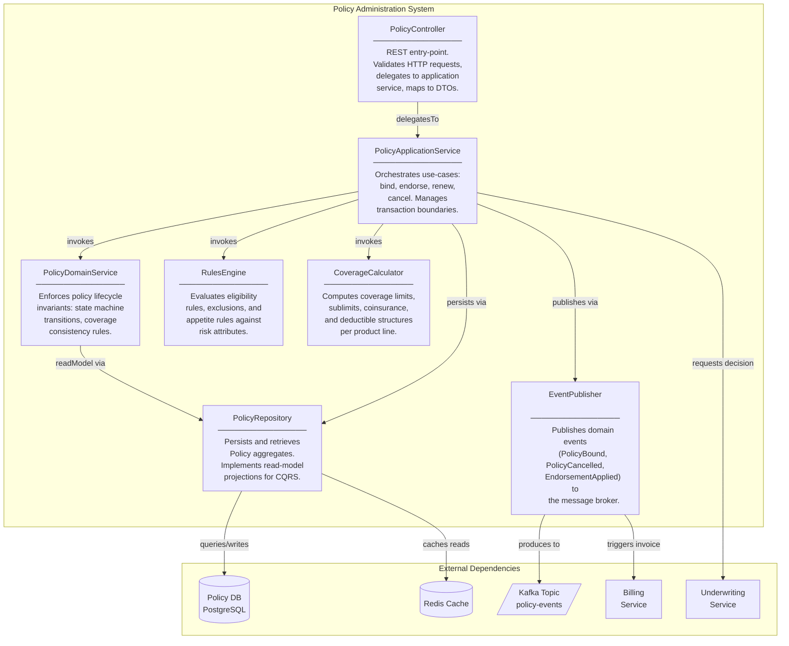
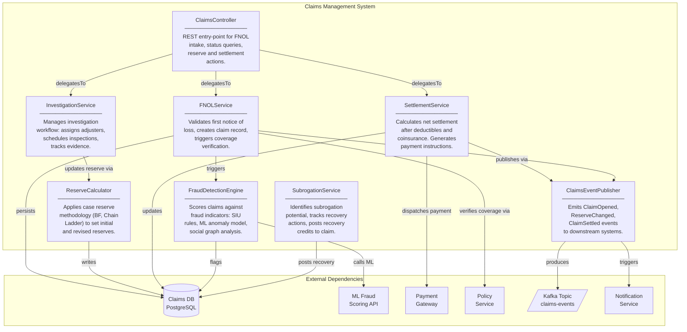
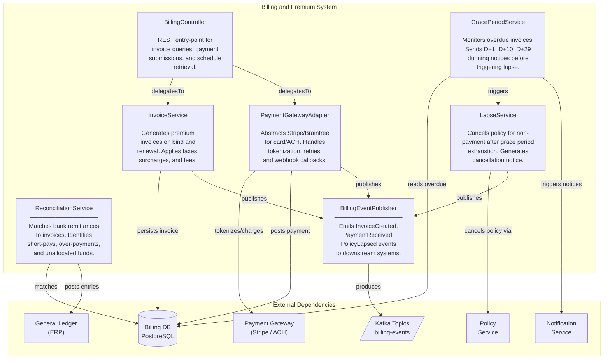
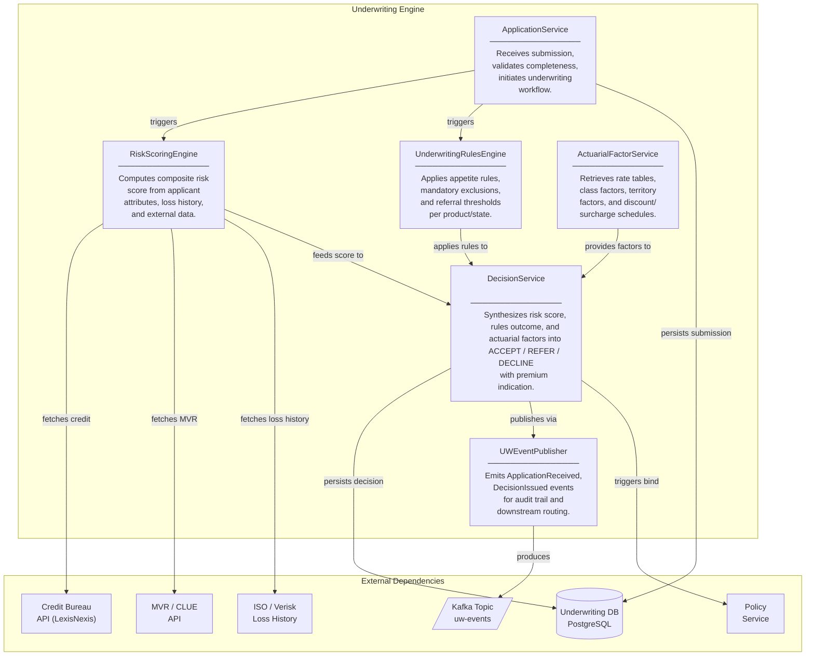
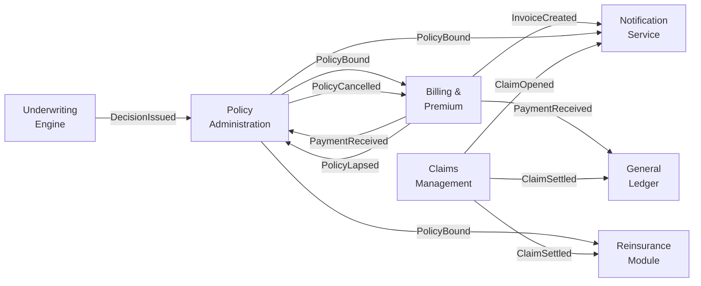

# Component Diagrams — Insurance Management System

## Policy Administration System

### Component Diagram

### Component Responsibilities

| Component | Responsibility |
|---|---|
| **PolicyController** | Accepts and validates inbound REST calls. Performs auth-scope enforcement. Returns structured API responses. |
| **PolicyApplicationService** | Coordinates multi-step use-cases (bind → issue → invoice) using domain services. Owns transaction boundaries. |
| **PolicyDomainService** | Enforces lifecycle state machine (QUOTED → BOUND → ACTIVE → RENEWED / CANCELLED). Validates domain invariants. |
| **PolicyRepository** | Ports interface for persistence. Write-model writes to PostgreSQL. Read-model projections served from Redis. |
| **RulesEngine** | Evaluates Drools-based eligibility and appetite rules. Returns decision: ACCEPT, REFER, DECLINE with reason codes. |
| **CoverageCalculator** | Applies actuarial rating factors to determine coverage limits, deductibles, and premium components. |
| **EventPublisher** | Ensures reliable at-least-once delivery of domain events to Kafka. Uses the transactional outbox pattern. |

---

## Claims Management System

### Component Diagram

### Component Responsibilities

| Component | Responsibility |
|---|---|
| **ClaimsController** | Routes FNOL intake, reserve actions, settlement approvals. Enforces role-based access (adjuster, supervisor, public portal). |
| **FNOLService** | Validates that loss date falls within policy effective period, coverage applies to reported loss type, deductible not exhausted. |
| **InvestigationService** | Manages adjuster assignment queue, inspection scheduling, document requests, and investigation timeline tracking. |
| **ReserveCalculator** | Computes initial reserve using actuarial benchmarks by loss type. Triggers reserve adequacy review on status change. |
| **SettlementService** | Applies deductibles and coinsurance, checks aggregate limits, generates EFT/check payment instructions via Payment Gateway. |
| **FraudDetectionEngine** | Runs rule-based SIU screening and calls ML scoring API. Escalates high-score claims to SIU queue automatically. |
| **SubrogationService** | Identifies liable third parties, tracks demand letters and legal proceedings, posts subrogation recoveries. |
| **ClaimsEventPublisher** | Reliably emits domain events for downstream consumers (reinsurance cession, financial posting, notification dispatch). |

---

## Billing and Premium System

### Component Diagram

### Component Responsibilities

| Component | Responsibility |
|---|---|
| **BillingController** | Exposes invoice lookup, payment submission, schedule generation, and direct-bill/agency-bill mode switching. |
| **InvoiceService** | Creates installment schedules on policy bind. Recalculates invoices on mid-term endorsements with pro-rata adjustments. |
| **PaymentGatewayAdapter** | Implements adapter pattern over multiple payment processors. Handles idempotent retries and reconciliation callbacks. |
| **GracePeriodService** | Runs nightly batch to detect invoices overdue past grace threshold. Queues dunning notifications via Notification Service. |
| **LapseService** | Executes policy cancellation workflow after grace period exhaustion. Generates statutory cancellation notices. |
| **ReconciliationService** | Processes daily bank statement files (BAI2/ISO 20022), matches remittances to open invoices, flags exceptions. |
| **BillingEventPublisher** | Produces events consumed by GL for revenue recognition and by Policy Service for lapse-triggered status updates. |

---

## Underwriting Engine

### Component Diagram

### Component Responsibilities

| Component | Responsibility |
|---|---|
| **ApplicationService** | Accepts new business submissions and renewal applications. Validates required fields per state filing requirements. |
| **RiskScoringEngine** | Aggregates credit score, prior loss history (CLUE), motor vehicle record (MVR), and property inspection data into a composite risk score (0–100). |
| **UnderwritingRulesEngine** | Evaluates mandatory decline rules (e.g., FAIR Plan referrals), referral conditions (score > 70), and appetite restrictions by state/territory. |
| **ActuarialFactorService** | Retrieves versioned rate tables. Applies ISO/NCCI base rates, class codes, territory multipliers, credits, and surcharges. |
| **DecisionService** | Produces underwriting decision with premium indication. Straight-Through-Processing (STP) for low-risk; queue for manual referral. |
| **UWEventPublisher** | Emits events consumed by Broker Portal (decision notification), Policy Service (bind authorization), and Compliance (audit log). |

---

## Cross-System Event Flow

