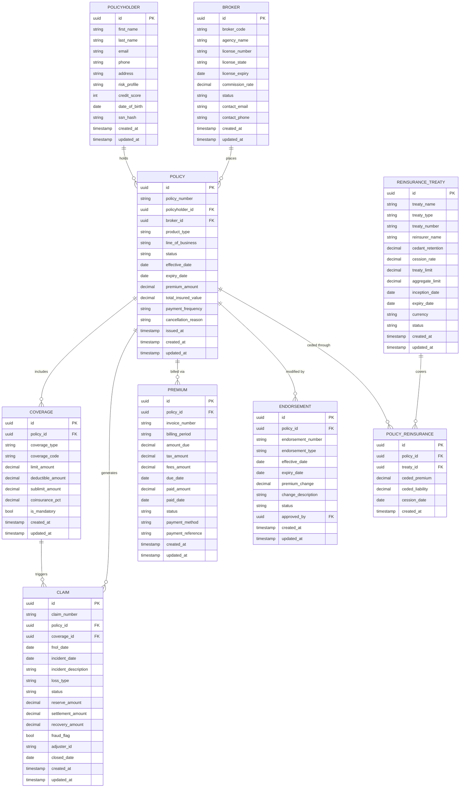

# ERD and Database Schema — Insurance Management System

## Entity Relationship Diagram



---

## Table Definitions (DDL)

### `policyholders`

```sql
CREATE TABLE policyholders (
    id                  UUID            PRIMARY KEY DEFAULT gen_random_uuid(),
    first_name          VARCHAR(100)    NOT NULL,
    last_name           VARCHAR(100)    NOT NULL,
    email               VARCHAR(255)    NOT NULL UNIQUE,
    phone               VARCHAR(20),
    address_line1       VARCHAR(200),
    address_line2       VARCHAR(200),
    city                VARCHAR(100),
    state               CHAR(2),
    zip_code            VARCHAR(10),
    country             CHAR(2)         NOT NULL DEFAULT 'US',
    date_of_birth       DATE,
    ssn_hash            VARCHAR(64),                          -- SHA-256 of SSN
    risk_profile        VARCHAR(20)     NOT NULL DEFAULT 'STANDARD'
                            CHECK (risk_profile IN ('LOW', 'STANDARD', 'HIGH', 'DECLINED')),
    credit_score        SMALLINT        CHECK (credit_score BETWEEN 300 AND 850),
    kyc_status          VARCHAR(20)     NOT NULL DEFAULT 'PENDING'
                            CHECK (kyc_status IN ('PENDING', 'VERIFIED', 'FAILED')),
    is_active           BOOLEAN         NOT NULL DEFAULT TRUE,
    created_at          TIMESTAMPTZ     NOT NULL DEFAULT NOW(),
    updated_at          TIMESTAMPTZ     NOT NULL DEFAULT NOW()
);
```

### `brokers`

```sql
CREATE TABLE brokers (
    id                  UUID            PRIMARY KEY DEFAULT gen_random_uuid(),
    broker_code         VARCHAR(20)     NOT NULL UNIQUE,
    agency_name         VARCHAR(255)    NOT NULL,
    license_number      VARCHAR(50)     NOT NULL,
    license_state       CHAR(2)         NOT NULL,
    license_expiry      DATE            NOT NULL,
    commission_rate     NUMERIC(5,4)    NOT NULL CHECK (commission_rate BETWEEN 0 AND 1),
    contact_first_name  VARCHAR(100),
    contact_last_name   VARCHAR(100),
    contact_email       VARCHAR(255)    NOT NULL UNIQUE,
    contact_phone       VARCHAR(20),
    status              VARCHAR(20)     NOT NULL DEFAULT 'ACTIVE'
                            CHECK (status IN ('ACTIVE', 'SUSPENDED', 'TERMINATED')),
    appointed_date      DATE            NOT NULL,
    terminated_date     DATE,
    created_at          TIMESTAMPTZ     NOT NULL DEFAULT NOW(),
    updated_at          TIMESTAMPTZ     NOT NULL DEFAULT NOW()
);
```

### `policies`

```sql
CREATE TABLE policies (
    id                      UUID            PRIMARY KEY DEFAULT gen_random_uuid(),
    policy_number           VARCHAR(30)     NOT NULL UNIQUE,
    policyholder_id         UUID            NOT NULL REFERENCES policyholders(id),
    broker_id               UUID            REFERENCES brokers(id),
    product_type            VARCHAR(50)     NOT NULL,           -- e.g., AUTO, HOME, COMMERCIAL_GL
    line_of_business        VARCHAR(50)     NOT NULL,           -- e.g., PERSONAL_LINES, COMMERCIAL_LINES
    status                  VARCHAR(30)     NOT NULL DEFAULT 'QUOTED'
                                CHECK (status IN (
                                    'QUOTED','BOUND','ACTIVE','RENEWED',
                                    'CANCELLED','EXPIRED','LAPSED','RESCINDED'
                                )),
    effective_date          DATE            NOT NULL,
    expiry_date             DATE            NOT NULL,
    issued_at               TIMESTAMPTZ,
    premium_amount          NUMERIC(14,2)   NOT NULL CHECK (premium_amount >= 0),
    total_insured_value     NUMERIC(16,2),
    payment_frequency       VARCHAR(20)     NOT NULL DEFAULT 'ANNUAL'
                                CHECK (payment_frequency IN ('ANNUAL','SEMI_ANNUAL','QUARTERLY','MONTHLY')),
    cancellation_reason     VARCHAR(255),
    cancellation_date       DATE,
    underwriter_id          UUID,
    underwriting_score      NUMERIC(5,2),
    created_at              TIMESTAMPTZ     NOT NULL DEFAULT NOW(),
    updated_at              TIMESTAMPTZ     NOT NULL DEFAULT NOW(),
    CONSTRAINT chk_dates CHECK (expiry_date > effective_date)
) PARTITION BY RANGE (effective_date);

CREATE TABLE policies_2023 PARTITION OF policies
    FOR VALUES FROM ('2023-01-01') TO ('2024-01-01');

CREATE TABLE policies_2024 PARTITION OF policies
    FOR VALUES FROM ('2024-01-01') TO ('2025-01-01');

CREATE TABLE policies_2025 PARTITION OF policies
    FOR VALUES FROM ('2025-01-01') TO ('2026-01-01');
```

### `coverages`

```sql
CREATE TABLE coverages (
    id                  UUID            PRIMARY KEY DEFAULT gen_random_uuid(),
    policy_id           UUID            NOT NULL REFERENCES policies(id) ON DELETE CASCADE,
    coverage_type       VARCHAR(50)     NOT NULL,
    coverage_code       VARCHAR(20)     NOT NULL,
    description         TEXT,
    limit_amount        NUMERIC(14,2)   NOT NULL CHECK (limit_amount > 0),
    deductible_amount   NUMERIC(14,2)   NOT NULL DEFAULT 0 CHECK (deductible_amount >= 0),
    sublimit_amount     NUMERIC(14,2),
    coinsurance_pct     NUMERIC(5,4)    CHECK (coinsurance_pct BETWEEN 0 AND 1),
    is_mandatory        BOOLEAN         NOT NULL DEFAULT FALSE,
    is_active           BOOLEAN         NOT NULL DEFAULT TRUE,
    created_at          TIMESTAMPTZ     NOT NULL DEFAULT NOW(),
    updated_at          TIMESTAMPTZ     NOT NULL DEFAULT NOW(),
    UNIQUE (policy_id, coverage_code)
);
```

### `endorsements`

```sql
CREATE TABLE endorsements (
    id                  UUID            PRIMARY KEY DEFAULT gen_random_uuid(),
    policy_id           UUID            NOT NULL REFERENCES policies(id),
    endorsement_number  VARCHAR(30)     NOT NULL UNIQUE,
    endorsement_type    VARCHAR(50)     NOT NULL
                            CHECK (endorsement_type IN (
                                'COVERAGE_CHANGE','LIMIT_CHANGE','DEDUCTIBLE_CHANGE',
                                'ADDRESS_CHANGE','NAMED_INSURED_CHANGE',
                                'VEHICLE_CHANGE','EXCLUSION_ADD','EXCLUSION_REMOVE'
                            )),
    effective_date      DATE            NOT NULL,
    expiry_date         DATE,
    premium_change      NUMERIC(12,2)   NOT NULL DEFAULT 0,
    change_description  TEXT,
    status              VARCHAR(20)     NOT NULL DEFAULT 'PENDING'
                            CHECK (status IN ('PENDING','APPROVED','REJECTED','APPLIED')),
    approved_by         UUID,
    approved_at         TIMESTAMPTZ,
    created_at          TIMESTAMPTZ     NOT NULL DEFAULT NOW(),
    updated_at          TIMESTAMPTZ     NOT NULL DEFAULT NOW()
);
```

### `claims`

```sql
CREATE TABLE claims (
    id                      UUID            PRIMARY KEY DEFAULT gen_random_uuid(),
    claim_number            VARCHAR(30)     NOT NULL UNIQUE,
    policy_id               UUID            NOT NULL REFERENCES policies(id),
    coverage_id             UUID            REFERENCES coverages(id),
    fnol_date               DATE            NOT NULL,
    incident_date           DATE            NOT NULL,
    incident_description    TEXT,
    loss_location           VARCHAR(255),
    loss_type               VARCHAR(50)     NOT NULL,
    status                  VARCHAR(30)     NOT NULL DEFAULT 'FNOL'
                                CHECK (status IN (
                                    'FNOL','ASSIGNED','UNDER_INVESTIGATION',
                                    'RESERVED','PENDING_SETTLEMENT','SETTLED',
                                    'CLOSED','DENIED','SUBROGATION'
                                )),
    reserve_amount          NUMERIC(14,2)   CHECK (reserve_amount >= 0),
    settlement_amount       NUMERIC(14,2)   CHECK (settlement_amount >= 0),
    recovery_amount         NUMERIC(14,2)   DEFAULT 0,
    fraud_flag              BOOLEAN         NOT NULL DEFAULT FALSE,
    fraud_score             NUMERIC(5,4),
    adjuster_id             UUID,
    public_adjuster_name    VARCHAR(200),
    attorney_name           VARCHAR(200),
    closed_date             DATE,
    denial_reason           TEXT,
    created_at              TIMESTAMPTZ     NOT NULL DEFAULT NOW(),
    updated_at              TIMESTAMPTZ     NOT NULL DEFAULT NOW(),
    CONSTRAINT chk_incident_before_fnol CHECK (incident_date <= fnol_date)
) PARTITION BY RANGE (fnol_date);

CREATE TABLE claims_2023 PARTITION OF claims
    FOR VALUES FROM ('2023-01-01') TO ('2024-01-01');

CREATE TABLE claims_2024 PARTITION OF claims
    FOR VALUES FROM ('2024-01-01') TO ('2025-01-01');

CREATE TABLE claims_2025 PARTITION OF claims
    FOR VALUES FROM ('2025-01-01') TO ('2026-01-01');
```

### `premiums`

```sql
CREATE TABLE premiums (
    id                  UUID            PRIMARY KEY DEFAULT gen_random_uuid(),
    policy_id           UUID            NOT NULL REFERENCES policies(id),
    invoice_number      VARCHAR(30)     NOT NULL UNIQUE,
    billing_period      VARCHAR(20)     NOT NULL,              -- e.g., '2025-Q1'
    billing_period_start DATE           NOT NULL,
    billing_period_end  DATE            NOT NULL,
    amount_due          NUMERIC(12,2)   NOT NULL CHECK (amount_due >= 0),
    tax_amount          NUMERIC(10,2)   NOT NULL DEFAULT 0,
    fees_amount         NUMERIC(10,2)   NOT NULL DEFAULT 0,
    due_date            DATE            NOT NULL,
    paid_amount         NUMERIC(12,2)   NOT NULL DEFAULT 0,
    paid_date           DATE,
    status              VARCHAR(20)     NOT NULL DEFAULT 'PENDING'
                            CHECK (status IN (
                                'PENDING','PAID','PARTIAL','OVERDUE',
                                'CANCELLED','WAIVED','REFUNDED'
                            )),
    payment_method      VARCHAR(30)     CHECK (payment_method IN (
                                'ACH','CREDIT_CARD','CHECK','WIRE','ESCROW'
                            )),
    payment_reference   VARCHAR(100),
    grace_period_end    DATE,
    created_at          TIMESTAMPTZ     NOT NULL DEFAULT NOW(),
    updated_at          TIMESTAMPTZ     NOT NULL DEFAULT NOW()
) PARTITION BY RANGE (due_date);

CREATE TABLE premiums_2023 PARTITION OF premiums
    FOR VALUES FROM ('2023-01-01') TO ('2024-01-01');

CREATE TABLE premiums_2024 PARTITION OF premiums
    FOR VALUES FROM ('2024-01-01') TO ('2025-01-01');

CREATE TABLE premiums_2025 PARTITION OF premiums
    FOR VALUES FROM ('2025-01-01') TO ('2026-01-01');
```

### `reinsurance_treaties`

```sql
CREATE TABLE reinsurance_treaties (
    id                  UUID            PRIMARY KEY DEFAULT gen_random_uuid(),
    treaty_name         VARCHAR(200)    NOT NULL,
    treaty_number       VARCHAR(50)     NOT NULL UNIQUE,
    treaty_type         VARCHAR(30)     NOT NULL
                            CHECK (treaty_type IN (
                                'QUOTA_SHARE','SURPLUS_SHARE',
                                'EXCESS_OF_LOSS','STOP_LOSS','FACULTATIVE'
                            )),
    reinsurer_name      VARCHAR(200)    NOT NULL,
    reinsurer_id        UUID,
    cedant_retention    NUMERIC(5,4)    NOT NULL CHECK (cedant_retention BETWEEN 0 AND 1),
    cession_rate        NUMERIC(5,4)    NOT NULL CHECK (cession_rate BETWEEN 0 AND 1),
    treaty_limit        NUMERIC(16,2),
    aggregate_limit     NUMERIC(16,2),
    reinstatement_count SMALLINT        DEFAULT 0,
    inception_date      DATE            NOT NULL,
    expiry_date         DATE            NOT NULL,
    currency            CHAR(3)         NOT NULL DEFAULT 'USD',
    status              VARCHAR(20)     NOT NULL DEFAULT 'ACTIVE'
                            CHECK (status IN ('DRAFT','ACTIVE','EXPIRED','TERMINATED')),
    created_at          TIMESTAMPTZ     NOT NULL DEFAULT NOW(),
    updated_at          TIMESTAMPTZ     NOT NULL DEFAULT NOW(),
    CONSTRAINT chk_retention_cession CHECK (cedant_retention + cession_rate = 1)
);
```

### `policy_reinsurance` (cession ledger)

```sql
CREATE TABLE policy_reinsurance (
    id                  UUID            PRIMARY KEY DEFAULT gen_random_uuid(),
    policy_id           UUID            NOT NULL REFERENCES policies(id),
    treaty_id           UUID            NOT NULL REFERENCES reinsurance_treaties(id),
    ceded_premium       NUMERIC(12,2)   NOT NULL CHECK (ceded_premium >= 0),
    ceded_liability     NUMERIC(14,2)   NOT NULL CHECK (ceded_liability >= 0),
    cession_date        DATE            NOT NULL,
    accounting_period   VARCHAR(10)     NOT NULL,
    created_at          TIMESTAMPTZ     NOT NULL DEFAULT NOW(),
    UNIQUE (policy_id, treaty_id, accounting_period)
);
```

---

## Index Strategy

| Table | Index Name | Columns | Type | Rationale |
|---|---|---|---|---|
| `policies` | `idx_policies_policyholder` | `policyholder_id` | B-Tree | Foreign key lookup, customer 360 |
| `policies` | `idx_policies_broker` | `broker_id` | B-Tree | Broker portal queries |
| `policies` | `idx_policies_status_expiry` | `status, expiry_date` | B-Tree | Renewal queue scans |
| `policies` | `idx_policies_number` | `policy_number` | B-Tree UNIQUE | Direct lookup |
| `policies` | `idx_policies_product_lob` | `product_type, line_of_business` | B-Tree | Portfolio aggregation |
| `coverages` | `idx_coverages_policy` | `policy_id` | B-Tree | Policy coverage list |
| `coverages` | `idx_coverages_type` | `coverage_type` | B-Tree | Coverage analytics |
| `claims` | `idx_claims_policy` | `policy_id` | B-Tree | Policy claim history |
| `claims` | `idx_claims_status` | `status` | B-Tree | Adjuster work queues |
| `claims` | `idx_claims_fraud_flag` | `fraud_flag` WHERE `fraud_flag = TRUE` | Partial B-Tree | Fraud investigation queue |
| `claims` | `idx_claims_fnol_date` | `fnol_date` | B-Tree (partition) | Date range reporting |
| `premiums` | `idx_premiums_policy` | `policy_id` | B-Tree | Policy billing history |
| `premiums` | `idx_premiums_due_status` | `due_date, status` | B-Tree | Collections queue |
| `premiums` | `idx_premiums_invoice` | `invoice_number` | B-Tree UNIQUE | Invoice lookup |
| `policyholders` | `idx_ph_email` | `email` | B-Tree UNIQUE | Auth / portal login |
| `policyholders` | `idx_ph_risk_credit` | `risk_profile, credit_score` | B-Tree | Underwriting segmentation |
| `endorsements` | `idx_endorse_policy` | `policy_id` | B-Tree | Policy change history |
| `endorsements` | `idx_endorse_status` | `status` | B-Tree | Approval workflow queue |
| `reinsurance_treaties` | `idx_ri_type_status` | `treaty_type, status` | B-Tree | Cession eligibility |
| `policy_reinsurance` | `idx_polri_policy` | `policy_id` | B-Tree | Cession lookup per policy |
| `policy_reinsurance` | `idx_polri_treaty` | `treaty_id` | B-Tree | Treaty utilization reports |

---

## Partitioning Strategy

### `claims` Table — Range Partitioning by `fnol_date`

Claims data grows significantly over time and most operational queries are scoped to recent periods (current year + 1 prior year). Range partitioning on `fnol_date` enables:

- **Partition pruning** on adjuster work-queue queries scoped to current year
- **Archival** by dropping or detaching old partitions after statutory retention (typically 7 years)
- **Parallel query execution** across partitions during annual NAIC loss development triangle reporting

```sql
-- Automated partition maintenance (executed monthly via pg_cron)
CREATE OR REPLACE PROCEDURE create_claims_partition(target_year INT)
LANGUAGE plpgsql AS $$
BEGIN
    EXECUTE format(
        'CREATE TABLE IF NOT EXISTS claims_%s PARTITION OF claims
         FOR VALUES FROM (%L) TO (%L)',
        target_year,
        format('%s-01-01', target_year),
        format('%s-01-01', target_year + 1)
    );
END;
$$;
```

### `premiums` Table — Range Partitioning by `due_date`

Premium invoices follow policy billing cycles. Partitioning by `due_date` supports:

- **Collections queue** queries scoped to the current billing month (high frequency, time-bounded)
- **Revenue recognition** reports joining premiums to accounting periods
- **Grace period expiry** batch jobs that only scan the current and trailing partitions

```sql
CREATE OR REPLACE PROCEDURE create_premiums_partition(target_year INT)
LANGUAGE plpgsql AS $$
BEGIN
    EXECUTE format(
        'CREATE TABLE IF NOT EXISTS premiums_%s PARTITION OF premiums
         FOR VALUES FROM (%L) TO (%L)',
        target_year,
        format('%s-01-01', target_year),
        format('%s-01-01', target_year + 1)
    );
END;
$$;
```

### Sub-Partitioning Consideration

For very high-volume commercial lines deployments (>50M claims/year), a composite partition strategy is recommended:

```sql
-- Sub-partition by loss_type within each year partition
CREATE TABLE claims_2025_auto PARTITION OF claims_2025
    FOR VALUES IN ('AUTO_COLLISION', 'AUTO_COMPREHENSIVE', 'AUTO_LIABILITY');

CREATE TABLE claims_2025_property PARTITION OF claims_2025
    FOR VALUES IN ('PROPERTY_FIRE', 'PROPERTY_WIND', 'PROPERTY_FLOOD', 'PROPERTY_THEFT');

CREATE TABLE claims_2025_liability PARTITION OF claims_2025
    FOR VALUES IN ('GL_BODILY_INJURY', 'GL_PROPERTY_DAMAGE', 'WORKERS_COMP');
```
