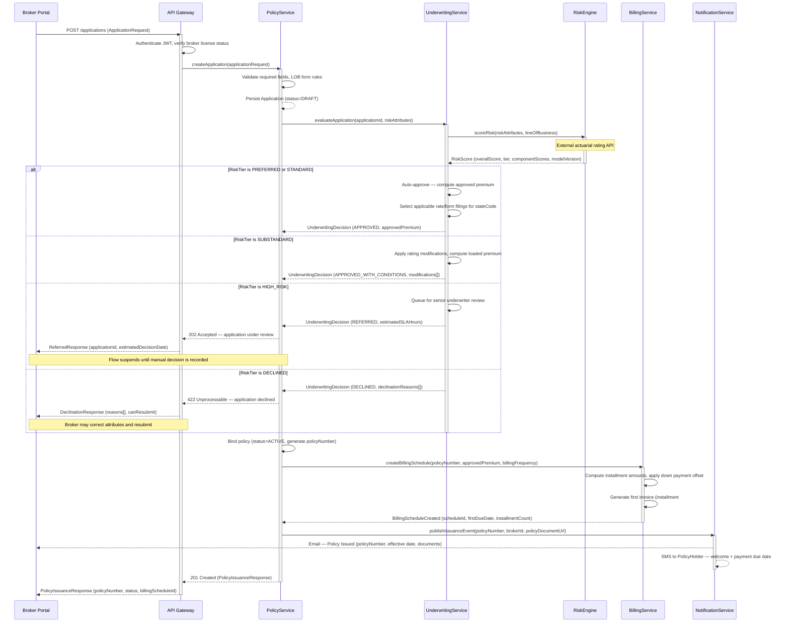

# Sequence Diagrams — Insurance Management System

This document details runtime interaction flows between system components for the four critical P&C insurance workflows. Each diagram uses UML sequence notation and includes alternative paths, error handling branches, and external integration points. Actors map to deployed microservices or external systems. Dashed return arrows represent responses; solid arrows represent initiating calls.

---

## Policy Application and Issuance

**Narrative:** A broker submits a new business application through the Broker Portal. The API Gateway authenticates the JWT token, validates the broker's license status, and routes the request to `PolicyService`. `PolicyService` creates a draft `Application` record with the supplied risk attributes and delegates risk evaluation to `UnderwritingService`. `UnderwritingService` calls the external `RiskEngine` (a third-party actuarial rating service) for a scored risk assessment. Depending on the returned `RiskTier`, the underwriting decision is either system-generated (preferred/standard risk) or routed for manual review by a licensed underwriter (substandard risk), or declined outright. On approval, `PolicyService` binds the policy (status transitions to `ACTIVE`), requests `BillingService` to generate the installment schedule, and dispatches an issuance notification to the broker.

**Error handling:** If `RiskEngine` is unavailable or times out, `UnderwritingService` enqueues the application for manual underwriting and returns a `202 Accepted` with an estimated decision SLA. If the broker's agency code is suspended, the API Gateway rejects the request at authentication with a `403 Forbidden` before `PolicyService` is invoked. If the initial down payment fails at policy binding, the policy remains in `APPROVED` status (not `ACTIVE`) and a payment-pending notification is sent; the policy is not bound until payment clears.

**Alternative path — mid-term application change:** If additional information is requested, `PolicyService` emits a `DocumentationRequested` event; the broker has a configurable window (typically 30 days, state-dependent) to supply the required documents before the application auto-declines.



---

## Claims FNOL and Adjuster Assignment

**Narrative:** A policyholder submits a First Notice of Loss (FNOL) through the claims-facing API. `ClaimsService` validates that the policy was active on the reported loss date and that at least one coverage applies to the reported loss type. A `Claim` record is created with `status=REPORTED` and an initial reserve estimate is calculated based on loss type benchmarks. `FraudDetectionService` is invoked asynchronously to avoid blocking the FNOL confirmation response. In parallel, `AssignmentService` identifies the optimal adjuster by matching state license, claim specialization, and current caseload. The assigned adjuster receives a push notification with the claim summary; the policyholder receives a confirmation with the claim number and adjuster contact.

**Error handling:** If no licensed adjuster is available in the loss state, `AssignmentService` escalates to a supervisor queue and flags the claim `PENDING_ASSIGNMENT`. The claims operations team receives an alert with an SLA countdown. If `FraudDetectionService` returns a high-confidence fraud score, all settlement actions on the claim are blocked until a fraud analyst clears the flag via a separate review workflow.

**Alternative path — catastrophe event:** If the reported loss date falls within a declared CAT event window and total incurred exceeds the CAT threshold, `ClaimsService` bypasses standard assignment routing and routes directly to the CAT response team. A CAT manager is notified by pager.

```mermaid
sequenceDiagram
    participant PH as Policyholder
    participant CA as ClaimsAPI
    participant CS as ClaimsService
    participant FD as FraudDetectionService
    participant AS as AssignmentService
    participant AN as AdjusterNotification

    PH->>CA: POST /claims/fnol (FNOLRequest)
    activate CA
    CA->>CA: Authenticate session, rate-limit check
    CA->>CS: submitFNOL(fnolRequest)
    activate CS
    CS->>CS: Validate policy active on lossDate
    CS->>CS: Confirm coverage applies to causeOfLoss
    CS-->>CS: Persist Claim (status=REPORTED, claimNumber assigned)
    CS->>CS: Compute initial reserve estimate (benchmark tables)

    Note over CS,FD: Fraud check is non-blocking — async event
    CS-)FD: assessFraudRisk(claimId, lossDetails, policyHistory) [async]
    activate FD

    CS->>AS: findBestAdjuster(claimId, lossStateCode, lossType, reserveAmount)
    activate AS
    AS->>AS: Filter adjusters by statesLicensed containing lossStateCode
    AS->>AS: Filter by specialization match (auto/property/liability)
    AS->>AS: Rank by activeCaseload ascending, cap at maxCaseload
    AS->>AS: Check CAT event override flag

    alt Qualified adjuster available
        AS-->>CS: AdjusterAssigned (adjusterId, adjusterName, phone)
        CS->>CS: Update claim.assignedAdjusterId, status=UNDER_INVESTIGATION
        CS->>AN: notifyAdjuster(adjusterId, claimSummary, priority)
        activate AN
        AN->>AN: Push notification to adjuster mobile app
        AN-->>PH: SMS — Claim received, adjuster [name] will contact within 24h
        deactivate AN
    else No qualified adjuster available in state
        AS-->>CS: NoAdjusterAvailable (stateCode)
        CS->>CS: Set claim status = PENDING_ASSIGNMENT
        CS->>AN: alertSupervisorQueue(claimId, stateCode, reserveAmount)
        Note over CS,AN: Supervisor receives alert; SLA clock starts
    end

    deactivate AS

    FD-->>CS: FraudAssessment (fraudScore, flagged, flagReasons[])
    deactivate FD

    alt Fraud score exceeds threshold (configurable per LOB)
        CS->>CS: Set claim.isFraudFlagged = true
        CS->>CS: Restrict settlement and payment actions
        CS->>AN: notifyFraudAnalyticsTeam(claimId, fraudScore, flagReasons)
        Note over CS: Claim enters parallel fraud review workflow
    else Claim passes fraud screening
        CS->>CS: Proceed with standard investigation workflow
    end

    CS-->>CA: FNOLResponse (claimNumber, status, adjusterId, nextSteps)
    deactivate CS
    CA-->>PH: 201 Created (claimNumber, portalTrackingUrl)
    deactivate CA
```

---

## Premium Collection and Policy Lapse

**Narrative:** `BillingService` executes a nightly scheduled job that queries all invoices with a `dueDate` in the past and status still in `SENT` or `PARTIALLY_PAID`. For each overdue invoice, it retrieves the policyholder's default tokenized payment method and submits a charge to the `PaymentGateway`. On success, the invoice status advances to `PAID` and the policy remains `ACTIVE`. On failure, `BillingService` records the failed attempt and calls `GracePeriodService` to activate the statutory grace period applicable to the policy's state and line of business. `GracePeriodService` looks up the statutory minimum grace days and sets the grace window. Daily retry attempts continue during the grace period. If the grace period expires without successful payment, `PolicyService` lapses the policy and `NotificationService` sends statutory lapse notices via certified mail and email.

**Error handling:** Payment gateway timeouts trigger automatic retry with exponential backoff (3 attempts: +5 min, +20 min, +60 min). If all retries fail within the batch window, the invoice is marked `OVERDUE` and the grace period starts. Partial payments received during the grace period are applied to the invoice balance; if they reduce the balance to zero, the grace period is closed and the policy is not lapsed. If a reinstatement payment is received after lapse within the statutory reinstatement window, `PolicyService` can reinstate the policy with no coverage gap if the state mandates it.

```mermaid
sequenceDiagram
    participant BS as BillingService
    participant PG as PaymentGateway
    participant GPS as GracePeriodService
    participant PS as PolicyService
    participant NS as NotificationService

    Note over BS: Nightly batch — 02:00 UTC scheduled job
    BS->>BS: Query invoices WHERE dueDate < today AND status IN (SENT, PARTIALLY_PAID)
    BS->>BS: Load default PaymentMethod token per policy

    BS->>PG: chargePayment(methodToken, amount, invoiceId, idempotencyKey)
    activate PG

    alt Payment succeeds
        PG-->>BS: PaymentSuccess (transactionRef, postedDate)
        deactivate PG
        BS->>BS: Create Payment record (status=POSTED)
        BS->>BS: Apply payment to invoice, recalculate balanceDue
        BS->>BS: Set invoice status = PAID
        BS->>NS: publishPaymentConfirmedEvent(policyNumber, amount, invoiceId)
        NS-->>NS: Email receipt to policyholder
        Note over BS,NS: Policy remains ACTIVE — no further action
    else Payment fails — declined / insufficient funds
        PG-->>BS: PaymentFailed (failureCode, failureReason)
        deactivate PG
        BS->>BS: Record failed Payment attempt (status=FAILED)
        BS->>BS: Increment retryCount on invoice
        BS->>NS: sendPaymentFailedNotice(policyNumber, invoiceId, dueAmount)
        NS-->>NS: Email/SMS — payment failed, action required

        BS->>GPS: activateGracePeriod(policyNumber, invoiceId)
        activate GPS
        GPS->>GPS: Look up statutory grace days (stateCode + lineOfBusiness)
        GPS->>GPS: graceStartDate = today; graceEndDate = today + graceDays
        GPS->>GPS: Persist GracePeriod (status=ACTIVE, statutoryBasis)
        GPS->>BS: Set invoice status = IN_GRACE_PERIOD
        GPS-->>BS: GracePeriodActivated (gracePeriodId, graceEndDate)
        deactivate GPS

        BS->>NS: sendGracePeriodWarning(policyNumber, graceEndDate, amountDue)
        NS-->>NS: Email — grace period notice with final payment deadline

        loop Daily retry during grace period
            BS->>PG: retryPayment(methodToken, amount, invoiceId, idempotencyKey)
            activate PG

            alt Payment received during grace period
                PG-->>BS: PaymentSuccess (transactionRef)
                deactivate PG
                BS->>BS: Apply payment, set invoice status = PAID
                BS->>GPS: closeGracePeriod(gracePeriodId, reason=PAID)
                BS->>NS: sendReinstatementConfirmation(policyNumber)
                Note over BS: Grace period closed — policy remains ACTIVE
            else Grace period expires without payment
                PG-->>BS: PaymentFailed or GraceExpired
                deactivate PG
                GPS->>GPS: Set gracePeriod status = EXPIRED
                GPS->>PS: lapsePolicyForNonPayment(policyNumber, lapseDate)
                activate PS
                PS->>PS: Set policy status = LAPSED
                PS->>PS: Record lapseDate and lapseReason
                PS-->>GPS: PolicyLapsed (policyNumber)
                deactivate PS
                GPS->>NS: sendLapseNotice(policyNumber, lapseDate, reinstateDeadline)
                NS-->>NS: Certified mail + email statutory lapse notice
                Note over GPS,NS: Reinstatement window begins per state rules
            end
        end
    end
```

---

## Reinsurance Cession

**Narrative:** When `PolicyService` binds a policy, it publishes a `PolicyBound` domain event to the shared event bus. `ReinsuranceService` is a subscriber to this event. Upon receipt, it calls `TreatyMatchingEngine` to identify all active treaties whose scope covers the policy's line of business, state, and gross premium level. Treaties are returned in priority order. For each matched treaty, `ReinsuranceService` computes the ceded and retained premium split and persists a `CessionRecord`. `FinanceService` receives each cession synchronously to post the corresponding general ledger entries (debit ceded premium written, credit reinsurance payable). At month-end, a separate bordereau batch job aggregates all `CessionRecord` entries for the reporting period and dispatches them to each reinsurer for reconciliation.

**Error handling:** If `TreatyMatchingEngine` finds no matching treaty (e.g., the policy's state or LOB is outside treaty scope), `ReinsuranceService` routes the policy to a facultative placement queue for manual reinsurer negotiation. If `FinanceService` is unavailable, cession records are queued for asynchronous GL posting. Idempotency keys on GL entries prevent double-posting if the retry fires after a partial success.

**Alternative path — loss cession:** When a claim settlement is issued on a reinsured policy, `ClaimsService` publishes a `ClaimSettled` event. `ReinsuranceService` processes this event and creates a loss `CessionRecord` linked to the same `treatyId`, updating `CessionRecord.cededLoss` in the bordereau for that settlement period.

```mermaid
sequenceDiagram
    participant PS as PolicyService
    participant RS as ReinsuranceService
    participant TM as TreatyMatchingEngine
    participant CR as CessionRecord Store
    participant FS as FinanceService

    PS-)RS: PolicyBound event (policyNumber, grossPremium, LOB, stateCode) [async]
    activate RS
    Note over PS,RS: Event consumed from shared domain event bus

    RS->>TM: findApplicableTreaties(LOB, stateCode, grossPremium)
    activate TM
    TM->>TM: Load active treaties covering LOB and stateCode
    TM->>TM: Sort by treaty.priority ascending
    TM->>TM: Apply retention and cession limit filters per treaty type

    alt Matching treaties found
        TM-->>RS: MatchedTreaties[] (ordered by priority)
        deactivate TM

        loop For each matched treaty (priority order)
            RS->>RS: calculateCession(treaty, grossPremium)
            Note over RS: Quota-share: apply cessionPercentage
            Note over RS: XOL: apply retentionLimit and cessionLimit
            RS->>CR: createCessionRecord(treatyId, policyNumber, cededPremium, retainedPremium, bordereauPeriod)
            activate CR
            CR-->>RS: CessionRecord (cessionId, status=PENDING)
            deactivate CR

            RS->>FS: postCessionGLEntry(cessionId, cededPremium, retainedPremium, idempotencyKey)
            activate FS
            FS->>FS: Debit ceded-premium-written account
            FS->>FS: Credit reinsurance-payable account
            FS-->>RS: GLPosted (journalEntryId, postedAt)
            deactivate FS

            RS->>CR: confirmCession(cessionId, journalEntryId)
            Note over CR: CessionRecord status = CONFIRMED
        end

        RS-->>PS: CessionComplete (cessionIds[], totalCededPremium, totalRetainedPremium)

    else No treaty matches policy scope
        TM-->>RS: NoMatchFound (unmatched LOB or stateCode)
        deactivate TM
        RS->>RS: Create facultative placement request
        RS->>RS: Route to manual facultative underwriting queue
        RS-->>PS: CessionPending (requiresFacultativePlacement=true)
        Note over RS,PS: Facultative underwriter manually places risk with reinsurer
    end

    deactivate RS

    Note over CR,FS: Month-end bordereau batch — runs on last business day
    RS->>CR: aggregateCessionRecords(bordereauPeriod, reinsurerCode)
    activate CR
    CR-->>RS: CessionRecords[] for period and reinsurer
    deactivate CR
    RS->>RS: Generate bordereau document per reinsurer
    RS->>FS: submitBordereau(reinsurerCode, bordereauData, period)
    activate FS
    FS->>FS: Record bordereau submission, update reinsurance payable balance
    FS-->>RS: BordereauAcknowledged (submissionId, totalCeded)
    deactivate FS
    Note over RS,FS: Loss cessions follow same path via ClaimSettled event
```

---

## Cross-Flow Design Notes

**Idempotency:** Every write operation that touches an external system (`PaymentGateway`, `FinanceService`, `NotificationService`) carries an `idempotencyKey` derived from the domain entity ID and operation type. This ensures that network retries following a timeout do not produce duplicate charges, double GL entries, or duplicate notification sends.

**Asynchronous vs. synchronous boundaries:** Fraud detection (Flow 2) and reinsurance cession (Flow 4) are event-driven and asynchronous. Policy binding (Flow 1) and grace period activation (Flow 3) are synchronous within the request scope because downstream consumers (broker, policyholder) require an immediate confirmation. This distinction is intentional and should be preserved during service decomposition.

**Observability:** Each service call in these flows emits a distributed trace span with the `policyNumber` or `claimNumber` as a span attribute, enabling end-to-end latency analysis and failure correlation across the entire workflow in the observability platform.

**Regulatory timing constraints:** FNOL acknowledgement (Flow 2) must be issued within 10 days of receipt per most state insurance codes; the `ClaimsService` response includes `acknowledgedAt` to start the regulatory clock. Lapse notices (Flow 3) must be sent a minimum number of days before lapse takes effect (typically 10–30 days depending on state), enforced by `GracePeriodService` before invoking `PolicyService.lapsePolicyForNonPayment`.
