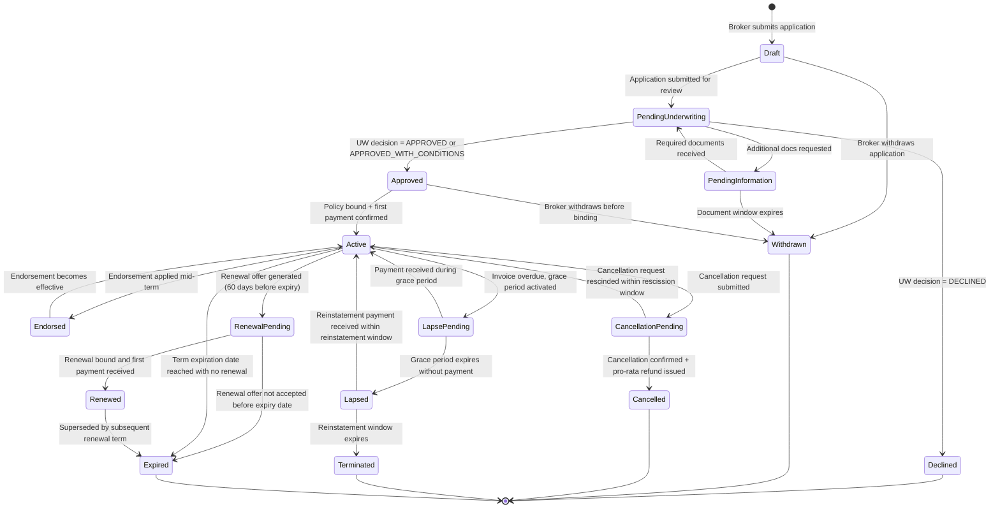
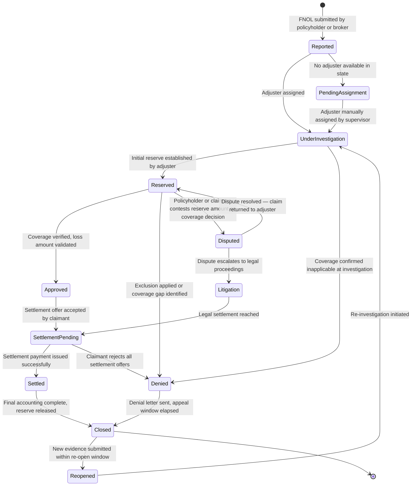
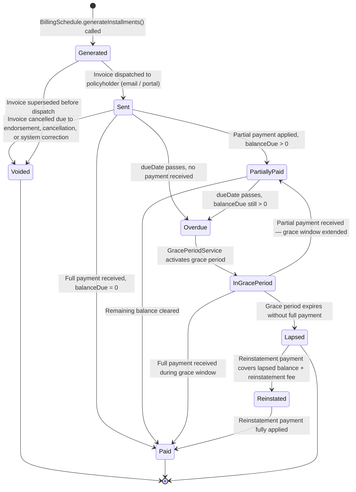
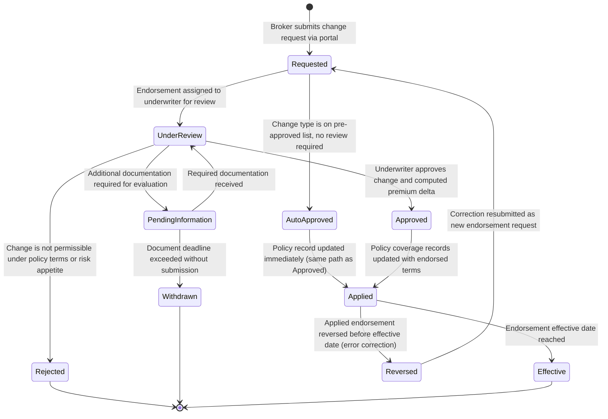

# State Machine Diagrams — Insurance Management System

This document captures the formal lifecycle state machines for the four most critical stateful entities in the P&C Insurance SaaS platform. Each diagram uses Mermaid `stateDiagram-v2` notation. For every state machine, the diagrams are followed by a detailed description of each state, the trigger that causes each transition, guard conditions that must be true for the transition to fire, and the actions executed on entry or exit.

---

## Policy Lifecycle

The policy lifecycle governs how a policy contract moves from initial submission through binding, in-force management, and ultimate termination. It is the most consequential state machine in the platform because coverage obligations, billing, claims eligibility, and regulatory reporting all depend on the current policy status.

### State Descriptions

**Draft** — The initial state created when a broker submits an application. The `Application` record exists but no policy number has been assigned. Risk attributes are editable. The broker can withdraw at no cost.

**PendingUnderwriting** — The application has been submitted to the underwriting queue. `RiskEngine` scoring runs automatically on entry. If risk tier is `HIGH_RISK`, the application is routed to a licensed underwriter for manual review.

**PendingInformation** — The underwriter has requested additional documentation (e.g., loss runs, inspection report, financial statements). A document deadline is set on entry; expiry triggers auto-withdrawal.

**Approved** — The underwriting decision has been recorded as `APPROVED` or `APPROVED_WITH_CONDITIONS`. A policy number is generated on entry. No coverage is in force yet — binding requires down payment confirmation.

**Declined** — The underwriting decision was `DECLINED`. The reason codes are recorded. The application is archived; a new application may be submitted with corrected attributes after a cooling-off period.

**Active** — The policy is fully in force. Coverage obligations exist. Claims can be reported. Billing invoices are generated. This is the only state from which claims are eligible.

**Endorsed** — A mid-term endorsement has been applied but its effective date has not yet been reached. The prior coverage terms remain in effect until the endorsement effective date triggers the transition back to `Active`.

**CancellationPending** — A cancellation request has been filed (policyholder-initiated or company-initiated). Pro-rata or short-rate premium calculations run on entry. A regulatory notice period starts; cancellation cannot be effective until the notice period elapses.

**Cancelled** — The policy has been terminated before its expiry date. Earned premium is calculated, unearned premium refund is issued. Coverage obligations cease as of the cancellation effective date.

**LapsePending** — The premium invoice is overdue and the statutory grace period has been activated. Coverage technically remains in force during this window per state insurance code.

**Lapsed** — Premium was not received by grace period expiry. Coverage obligations cease. A reinstatement window (typically 30–180 days, state-dependent) opens on entry. A statutory lapse notice is dispatched.

**RenewalPending** — A renewal offer has been generated and sent to the broker. The offer includes updated rates. If the broker does not act before the expiry date, the policy expires without renewal.

**Renewed** — The renewal has been bound. The prior term's status transitions to `Expired`. A new `PolicyTerm` record is created. The new term inherits endorsements from the prior term unless excluded.

**Expired** — The policy term reached its natural end date without renewal or cancellation. No coverage obligations exist. The policy is archived and reportable for NAIC historical data submissions.

**Terminated** — The lapsed policy's reinstatement window has elapsed. The policy is permanently closed with no path to reinstatement without a new application.

### Transition Guards and Actions

| Transition | Guard Condition | Action on Fire |
|---|---|---|
| `Draft → PendingUnderwriting` | All required risk attributes populated | Invoke `RiskEngine.scoreRisk()`, set `Application.status = SUBMITTED` |
| `PendingUnderwriting → Approved` | `UnderwritingDecision.decision != DECLINED` | Generate `policyNumber`; assign rate/form filings |
| `Approved → Active` | Down payment confirmed by `PaymentGateway` | Create `PolicyTerm`; generate `BillingSchedule`; emit `PolicyBound` event |
| `Active → LapsePending` | Invoice past due AND no payment received | `GracePeriodService.activate()`; set statutory grace days |
| `LapsePending → Lapsed` | Grace period `graceEndDate < today` | Emit `PolicyLapsed` event; cancel pending claims payments; open reinstatement window |
| `Lapsed → Active` | Reinstatement payment received AND within reinstatement window | Reinstate coverage (may require gap waiver per state law); create new installment schedule |
| `Active → Cancelled` | Cancellation notice period elapsed | Compute pro-rata refund; emit `PolicyCancelled` event; suspend billing |

---

## Claim Lifecycle

The claim lifecycle governs a loss event from initial report through final settlement or denial. Multiple parallel sub-processes (reserve management, fraud review, subrogation) interact with claim states but do not own the state machine; they influence it through domain events.

### State Descriptions

**Reported** — The FNOL has been received and a `Claim` record created with a `claimNumber`. An initial reserve estimate is set automatically based on loss-type benchmarks. Coverage verification has not yet occurred. The claim acknowledgement timestamp starts the regulatory clock (typically 10 days to acknowledge, 30–45 days to resolve per state code).

**PendingAssignment** — No adjuster licensed in the loss state with available capacity was found. The claim is in the supervisor queue. An SLA timer is running; escalation alerts fire at configurable intervals.

**UnderInvestigation** — An adjuster is actively investigating. Documentation requests, recorded statements, and field inspections occur in this state. Reserve amounts may be adjusted multiple times. Fraud screening runs asynchronously. This is the longest-lived state for complex claims.

**Reserved** — A formal `ClaimReserve` record has been established with an IBNR-compliant amount. This state signals that the financial exposure is recognized on the balance sheet. The reserve is visible in NAIC Schedule P reporting.

**Approved** — The adjuster has confirmed coverage applies and loss amount is validated. A settlement offer is prepared. On entry, the claim is eligible for settlement processing.

**Denied** — Coverage has been determined inapplicable (exclusion, policy condition not met, misrepresentation). A denial letter is issued on entry. An appeal window (typically 60 days) is tracked; the claimant may dispute the denial.

**Disputed** — The claimant formally contests the denial or reserve amount. The claim is assigned to a specialist or escalated to a supervisor. All settlement processing is paused. An external mediator may be engaged.

**Litigation** — The dispute has escalated to legal proceedings. A defense attorney is assigned. All claim actions require legal review before execution. Settlement negotiations continue in parallel.

**SettlementPending** — A settlement agreement has been reached but the payment has not yet been disbursed. The payment is in the payment processing pipeline. This state prevents duplicate settlements.

**Settled** — The settlement payment has been issued and confirmed by `PaymentGateway`. If subrogation applies, a `SubrogationCase` is initiated on entry.

**Closed** — Final accounting is complete. All reserves have been released or converted to paid amounts. The claim is archived. A limited re-open window remains open (typically 2–3 years per state statute of limitations).

**Reopened** — New evidence (e.g., delayed medical bills, additional damaged property discovered) has been submitted within the re-open window. A re-investigation adjuster is assigned. The prior reserve is re-evaluated.

### Transition Guards and Actions

| Transition | Guard Condition | Action on Fire |
|---|---|---|
| `Reported → UnderInvestigation` | Adjuster found, licensed in loss state, below max caseload | Emit `AdjusterAssigned` event; start investigation SLA timer |
| `UnderInvestigation → Reserved` | `ClaimReserve.reserveAmount > 0` established | Post reserve to IBNR ledger; update `Claim.totalIncurred` |
| `Reserved → Denied` | Coverage exclusion confirmed by adjuster recommendation | Trigger denial letter workflow; start appeal window timer |
| `Reserved → Disputed` | Claimant submits formal written dispute | Escalate to dispute resolution team; pause settlement actions |
| `Approved → SettlementPending` | Claimant accepts settlement offer in writing | Lock settlement amount; initiate payment processing |
| `Settled → Closed` | All reserve balances released; no pending `ClaimLine` | Release remaining reserve; emit `ClaimClosed` event |
| `Closed → Reopened` | New evidence received AND within re-open window | Create new `ClaimLine` for additional loss items; assign adjuster |

---

## Premium Invoice Lifecycle

The invoice lifecycle tracks the payment status of a single installment from generation through collection or lapse. Each `PremiumInvoice` is independent; partial payment of one invoice does not affect sibling invoices in the billing schedule.

### State Descriptions

**Generated** — The invoice record has been created by `BillingSchedule.generateInstallments()` but has not yet been sent to the policyholder. At this point, the `dueDate` is set and the amount is calculated. The invoice may be voided here if a policy cancellation or endorsement supersedes it before dispatch.

**Sent** — The invoice has been dispatched to the policyholder via their preferred channel (email, portal, postal mail). The payment collection window is now open. The `issuedDate` is recorded. A `dueDate` reminder notification fires at a configurable lead time (e.g., 5 days before due).

**PartiallyPaid** — One or more payments have been applied but the `balanceDue` is greater than zero. The policyholder has until `dueDate` to clear the remaining balance. If the due date passes with a balance, the invoice transitions to `Overdue`.

**Paid** — The invoice balance has been fully cleared (`balanceDue = 0`). This is a terminal satisfied state. No further payment actions can be applied. The policy's coverage remains fully active.

**Overdue** — The `dueDate` has passed without full payment. A payment failure notice is sent to the policyholder. The billing system attempts automatic retry. `GracePeriodService` is notified to evaluate grace period activation.

**InGracePeriod** — The statutory grace period has been activated. Grace days are determined by state law and line of business (typically 10–30 days). The policy coverage technically remains in force during this window. Partial payments extend the grace window proportionally. All payment retry attempts continue daily.

**Lapsed** — The grace period expired without sufficient payment. The corresponding policy transitions to `LAPSED`. This invoice is now in a closed-delinquent state. The outstanding balance is transferred to a reinstatement receivable ledger.

**Reinstated** — A reinstatement payment covering the overdue balance plus any applicable reinstatement fee has been received. The invoice is credited fully. The policy transitions back to `Active` upon confirmation.

**Voided** — The invoice has been cancelled. This occurs on mid-term policy cancellation (remaining installments are voided), endorsement premium adjustments that replace the invoice, or data correction by an operations administrator. Voided invoices are retained for audit purposes and cannot be deleted.

### Transition Guards and Actions

| Transition | Guard Condition | Action on Fire |
|---|---|---|
| `Generated → Sent` | Valid contact information on file for policyholder | Dispatch via preferred channel; record `issuedDate`; schedule due-date reminder |
| `Sent → Overdue` | `today > dueDate` AND `balanceDue > 0` | Emit `InvoiceOverdue` event; schedule payment gateway retry |
| `Overdue → InGracePeriod` | Policy status is `Active` or `Endorsed` AND state grace law applicable | `GracePeriodService.activate()`; set `graceEndDate`; send grace period notice |
| `InGracePeriod → Lapsed` | `today > graceEndDate` AND `balanceDue > 0` | Emit `InvoiceLapsed` event; trigger `PolicyService.lapsePolicyForNonPayment()` |
| `InGracePeriod → PartiallyPaid` | Partial payment received AND `balanceDue > 0` after application | Extend `graceEndDate` proportionally to partial payment; send updated notice |
| `Lapsed → Reinstated` | Reinstatement payment received AND within reinstatement window | Apply reinstatement fee; emit `PolicyReinstated` event |

---

## Endorsement Lifecycle

The endorsement lifecycle manages the review and application of mid-term policy changes. An endorsement may change coverage limits, add or remove coverages, update insured property details, or modify premium amounts. All endorsements are subject to underwriting review before becoming effective.

### State Descriptions

**Requested** — The broker or policyholder has submitted a change request specifying the type of endorsement, desired effective date, and changed attributes. The `Endorsement` record is created with a unique `endorsementNumber`. The request is logged in the policy audit trail. A business rule check runs immediately to determine if auto-approval applies.

**UnderReview** — A licensed underwriter is evaluating the requested change. The underwriter reviews the updated risk profile and determines whether the change materially alters the risk (e.g., adding a high-value scheduled item, changing the principal driver on an auto policy). The premium delta is computed in this state.

**PendingInformation** — The underwriter requires supporting documentation before completing the review (e.g., a home renovation permit for a dwelling limit increase, a vehicle inspection report for a vehicle change). A deadline is set; missing the deadline causes auto-withdrawal.

**AutoApproved** — The endorsement type is on the pre-approved list (e.g., address correction, lienholder update, additional insured add under a blanket endorsement form). No underwriting review is required. The system validates the change against rule constraints and proceeds directly to `Applied`.

**Approved** — The underwriter has confirmed the endorsement is acceptable and has computed the premium delta. A premium change notification is sent to the broker. The endorsement moves to application.

**Rejected** — The underwriter has determined the change cannot be accommodated (e.g., the requested coverage increase exceeds the policy form maximum, or the new risk exceeds the carrier's appetite). A rejection letter is generated with specific reasons. The broker may submit a modified request.

**Applied** — The policy coverage records have been updated to reflect the endorsed terms. A new `Coverage` record is created (or modified) within the `Policy` aggregate. The billing schedule is adjusted for any premium delta across remaining installments. The endorsement `effectiveDate` may be future-dated.

**Effective** — The endorsement's effective date has been reached. The new coverage terms are now legally operative. The endorsement is stamped with the `effectiveAt` timestamp. From this point, claims are evaluated against the endorsed coverage terms.

**Reversed** — An applied endorsement has been administratively reversed before the effective date (e.g., the broker discovered an input error after submission). The policy coverage records are restored to pre-endorsement state. The premium delta is reversed on the billing schedule. A correction request must be submitted as a new endorsement.

### Transition Guards and Actions

| Transition | Guard Condition | Action on Fire |
|---|---|---|
| `Requested → AutoApproved` | Endorsement type is in pre-approved-list AND rule validation passes | Skip underwriting queue; immediately proceed to coverage update |
| `Requested → UnderReview` | Endorsement type requires underwriting review per LOB rules | Assign to underwriting queue; start review SLA timer (typically 2–5 business days) |
| `UnderReview → Approved` | Premium delta computed AND within policy form limits AND risk acceptable | Notify broker of approval and premium adjustment; prepare endorsement document |
| `UnderReview → Rejected` | Change violates policy terms, form limits, or underwriting guideline | Generate rejection letter; record reason codes; increment rejection counter |
| `Approved → Applied` | Broker accepts endorsement terms and premium adjustment | Update `Policy.coverage[]`; adjust `BillingSchedule` for premium delta; emit `EndorsementApplied` event |
| `Applied → Effective` | `today >= endorsement.effectiveDate` | Stamp `effectiveAt`; update policy document version; emit `EndorsementEffective` event |
| `Applied → Reversed` | Administrative reversal request within reversal window AND effective date not yet reached | Restore prior coverage state; reverse premium delta on billing; emit `EndorsementReversed` event |

---

## Cross-State-Machine Interactions

The four state machines do not operate in isolation. The following interactions are enforced through domain events and are critical to system correctness:

**Policy Lapse → Invoice Lapse:** When `PolicyService` transitions a policy to `Lapsed`, it emits a `PolicyLapsed` event. `BillingService` subscribes and transitions all open `PremiumInvoice` records for that policy to `Lapsed`, preventing any further payment collection attempts on the now-lapsed term.

**Policy Cancellation → Invoice Voiding:** When a policy transitions to `Cancelled`, `BillingService` subscribes to `PolicyCancelled` and voids all future-dated unpaid invoices. Only the earned-premium invoice for the partial term remains active for collection.

**Claim Eligibility Guard:** `ClaimsService` enforces at FNOL that the associated policy's state is `Active` or `Endorsed` on the reported loss date. Claims reported against policies in `Lapsed`, `Cancelled`, `Expired`, or `Terminated` states are rejected with a coverage-denial reason code.

**Endorsement → Billing Sync:** When an endorsement transitions to `Applied`, the premium delta triggers `BillingService` to recalculate open installments. If the delta is negative (e.g., a coverage reduction), a credit memo invoice is generated. If positive, the delta is spread pro-rata across remaining unpaid installments.

**Renewal Continuity:** When a policy transitions to `Renewed`, the prior term transitions to `Expired`. Open claims against the prior term remain open and continue to their own lifecycle independently — claim eligibility is determined by the policy state at the `lossDate`, not at the time of adjudication.
