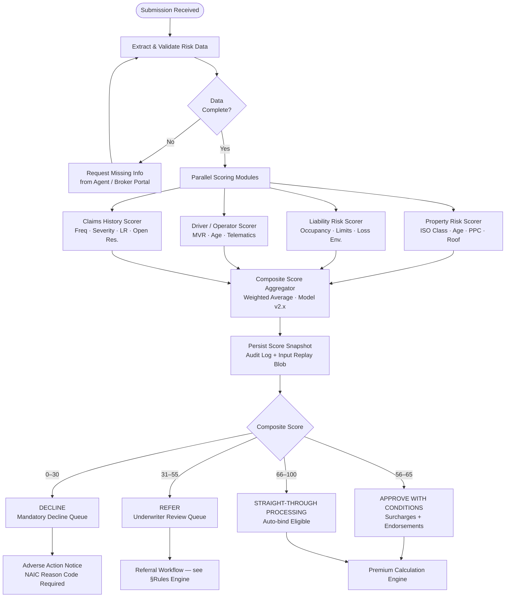
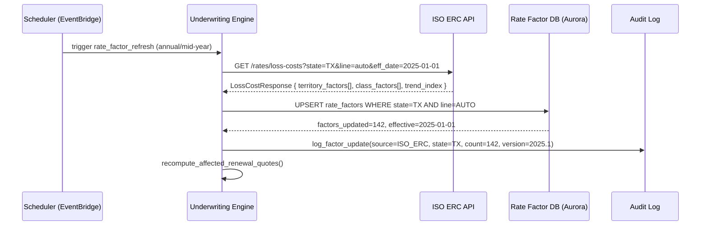
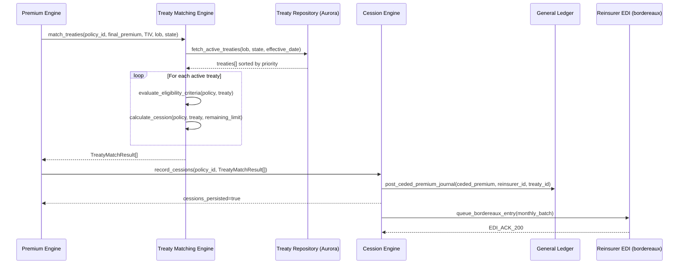
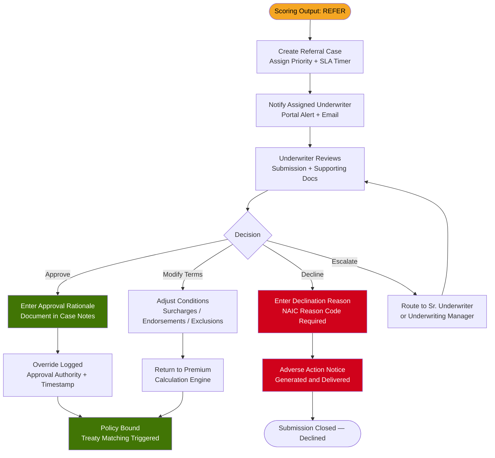

# Underwriting and Risk Engine

## Overview

The Underwriting and Risk Engine (URE) is the actuarial core of the P&C Insurance SaaS platform. It combines multi-factor risk scoring, bureau-integrated actuarial factors, a rule-driven underwriting workflow, and automated reinsurance treaty matching to produce bindable quotes within the carrier's defined risk appetite. All scoring is reproducible and audit-logged for NAIC regulatory review.

---

## Risk Scoring Architecture

### Multi-Factor Risk Model

The URE evaluates each submission against four primary risk dimensions. Each dimension is scored 0–100 and then weighted to produce a composite risk score.

| Dimension | Sub-factors | Weight |
|---|---|---|
| Property Risk | Construction type, age, protection class, roof material, distance to fire station | 35% |
| Liability Risk | Occupancy type, limit requested, prior losses, umbrella alignment, hazard operations | 25% |
| Driver / Operator Risk | MVR points, age, years licensed, telematics score, prior DUI convictions | 25% |
| Prior Claims History | Frequency, severity, loss ratio, open reserves, subrogation history | 15% |

#### Property Risk Sub-scorer

```python
def score_property_risk(prop: PropertyInput) -> float:
    base = 50.0

    construction_scores = {
        "ISO_CLASS_1_FRAME":               0,
        "ISO_CLASS_2_JOISTED_MASONRY":    -5,
        "ISO_CLASS_3_NON_COMBUSTIBLE":   -10,
        "ISO_CLASS_4_MASONRY_NC":        -15,
        "ISO_CLASS_5_MOD_FIRE_RESIST":   -20,
        "ISO_CLASS_6_FIRE_RESISTIVE":    -25,
    }
    base += construction_scores.get(prop.iso_construction_class, 0)

    age_years = current_year() - prop.year_built
    base += min(age_years * 0.3, 20)           # cap at +20 pts

    base += (prop.protection_class - 5) * 1.5  # PPC 1=best → PPC 10=worst

    if prop.roof_material in ["WOOD_SHAKE", "WOOD_SHINGLE"]:
        base += 10
    elif prop.roof_material in ["TILE", "METAL", "SLATE", "CLASS_4_IMPACT"]:
        base -= 5

    return max(0.0, min(100.0, base))
```

### Risk Scoring Pipeline



### Score Bands

| Score Range | Risk Tier | Underwriting Action | Premium Modifier |
|---|---|---|---|
| 0 – 19 | Catastrophic | Mandatory Decline — no exceptions | N/A |
| 20 – 30 | High | Mandatory Decline (appetite override blocked) | N/A |
| 31 – 45 | Elevated | Refer to Senior Underwriter | +35% to +60% |
| 46 – 55 | Moderate-High | Refer to Staff Underwriter | +15% to +35% |
| 56 – 65 | Moderate | Approve with standard surcharges | +5% to +15% |
| 66 – 75 | Standard | Straight-through approval | ±0% |
| 76 – 85 | Preferred | Straight-through + preferred pricing | −5% to −10% |
| 86 – 100 | Super-Preferred | Straight-through + enhanced discounts | −10% to −20% |

---

## Actuarial Factors

### Factor Catalog

The URE integrates with ISO Electronic Rating Content (ERC) and state bureau filings to maintain a version-controlled factor library. Each factor update triggers a carrier notification and a rate impact report.

| Factor | Data Source | Update Frequency | Impact on Premium |
|---|---|---|---|
| Base Loss Cost | ISO ERC / State Bureau | Annual (filing cycle) | Foundation of rate |
| Loss Development Factor (LDF) | Internal actuarial triangle | Quarterly AY review | ±5%–25% on IBNR load |
| Loss Cost Trend | ISO trend indices / Internal GLM | Semi-annual | ±2%–8% per trend year |
| Territorial Rate Factor | Bureau rating territory maps | Annual or mid-year amendment | ±15%–80% vs. state base |
| Construction Classification Factor | ISO Building Code mapping | Annual | ±10%–40% |
| Credibility Weight | Bühlmann-Straub model | Per policy renewal | Blends individual vs. class |
| Experience Modification (EMod) | NCCI / State Rating Bureau mod statement | Annual | 0.50× – 2.00× |
| Schedule Debit / Credit | Underwriter judgment (filed ±25% max) | Per submission | ±25% |
| Increased Limits Factor (ILF) | ISO ILF tables by line | Annual | Scales with limit selection |
| Deductible Credit Factor | ISO / internal study | Annual | −5% to −60% |
| Multi-policy Discount | Internal cross-sell experience study | Annual review | −5% to −15% |

### Credibility Weighting Model

The platform applies Bühlmann-Straub credibility to blend individual risk experience with the class mean:

```
Z  = n / (n + K)
P  = Z × P_individual + (1 − Z) × P_class_mean

Where:
  n  = earned exposure units in experience window
  K  = credibility constant (variance ratio from empirical Bayes estimation)
  Z  = credibility factor  [0, 1]
```

Full credibility (Z ≥ 0.90) is assigned at 1,082 earned car-years (personal auto) or $5M earned premium (commercial property). Credibility parameters are re-estimated annually using the carrier's own three-year loss experience blended with ISO class data.

### ISO ERC Integration



---

## Premium Calculation Engine

### Calculation Pipeline

Premium calculation follows a deterministic, ordered pipeline. Each stage receives the running premium from the prior stage and applies a single multiplicative factor, preserving a full audit trail of intermediate values.

```
Final Premium = Base Rate
              × Territory Factor
              × Classification Factor
              × Increased Limits Factor  (if limits > basic limit)
              × Experience Modification
              × Schedule Debit / Credit   (underwriter judgment, ±25%)
              × Deductible Credit
              × Multi-policy Discount
              ⇒ apply Minimum Premium floor  (state-filed)
```



```mermaid
flowchart LR
    A([Base Rate\nISO Loss Cost × LDF × Trend]) --> B[× Territory Factor\nBureau Rating Territory]
    B --> C[× Classification Factor\nISO Class Code]
    C --> D[× Increased Limits Factor\nSelected Limit vs. Basic]
    D --> E[× Experience Modification\nNAFT / State Bureau EMod]
    E --> F[× Schedule Debit / Credit\nUW Judgment ±25%]
    F --> G[× Deductible Credit\nSelected Deductible]
    G --> H[× Multi-policy Discount\nCross-sell Eligibility]
    H --> I{≥ State\nMinimum?}
    I -- No --> J[Apply Filed Minimum\nPremium Floor]
    I -- Yes --> K([Final Annual Premium])
    J --> K
```

### Example: Personal Auto Policy

**Submission:** 2021 Honda Accord, Texas, Rating Territory 21 (urban Houston), BI $100K/$300K, Comp/Collision with $500 deductible, pleasure use, Household Class 2, clean MVR, 3-year no-loss history.

| Step | Factor | Value | Running Premium |
|---|---|---|---|
| Base Loss Cost (BI, Terr. 21) | ISO TX ERC | $480.00 | $480.00 |
| Territory Factor | Territory 21 — urban Houston | 1.42 | $681.60 |
| Classification Factor | Pleasure use, HH Class 2 | 0.98 | $667.97 |
| Increased Limits Factor ($100K/$300K vs. $25K/$50K basic) | ISO ILF table | 1.28 | $855.00 |
| Experience Modification | Clean record, Bühlmann Z = 0.40 | 0.91 | $778.05 |
| Schedule Credit | No adverse features identified | 1.00 | $778.05 |
| Deductible Credit ($500) | ISO deductible relativities | 0.88 | $684.68 |
| Multi-policy Discount | Homeowners also in-force with carrier | 0.95 | $650.45 |
| Minimum Premium Check | TX filed minimum = $400 | Pass | $650.45 |
| **Final Annual Premium** | | | **$650.45** |

---

## Reinsurance Treaty Matching

### Treaty Types Supported

| Treaty Type | Mechanism | Cession Method | Typical Use Case |
|---|---|---|---|
| Quota Share | Fixed percentage of every risk in scope | Proportional | Surplus relief, new program support |
| Surplus Share | Cede lines above carrier net retention | Proportional | Large single-risk commercial property |
| Per-Risk Excess of Loss (XL) | Losses above per-risk retention cap | Non-proportional | Commercial property, inland marine |
| Per-Occurrence XL | Losses above per-occurrence retention | Non-proportional | General liability, auto |
| Catastrophe XL (Cat XL) | Aggregate losses above catastrophe retention | Non-proportional | Hurricane, earthquake, severe storm |
| Facultative | Individual risk negotiated placement | Either | Non-standard or limit-exceeding risks |
| Stop Loss | Aggregate L/R above threshold | Non-proportional | Small carrier portfolio protection |

### Treaty Matching Algorithm

```python
@dataclass
class TreatyMatchResult:
    treaty_id: str
    treaty_type: TreatyType
    cession_pct: float
    ceded_premium: Decimal
    ceded_limit: Decimal
    retained_premium: Decimal
    retained_limit: Decimal


def match_treaties(policy: Policy, treaties: list[Treaty]) -> list[TreatyMatchResult]:
    results: list[TreatyMatchResult] = []
    remaining_limit = policy.total_insured_value

    # Quota Share executes first; XL treaties ordered by attachment point ascending
    active = sorted(
        [t for t in treaties if t.is_active_for(policy.effective_date)],
        key=lambda t: (t.treaty_type.sort_order, t.attachment_point),
    )

    for treaty in active:
        if not treaty.matches_policy(policy):
            continue

        match treaty.treaty_type:
            case TreatyType.QUOTA_SHARE:
                pct = treaty.quota_share_pct
                results.append(TreatyMatchResult(
                    treaty_id=treaty.id,
                    treaty_type=treaty.treaty_type,
                    cession_pct=pct,
                    ceded_premium=policy.final_premium * pct,
                    ceded_limit=policy.total_insured_value * pct,
                    retained_premium=policy.final_premium * (1 - pct),
                    retained_limit=policy.total_insured_value * (1 - pct),
                ))

            case TreatyType.EXCESS_OF_LOSS:
                excess = min(remaining_limit - treaty.attachment_point, treaty.treaty_limit)
                if excess > 0:
                    roi = excess / policy.total_insured_value
                    results.append(TreatyMatchResult(
                        treaty_id=treaty.id,
                        treaty_type=treaty.treaty_type,
                        cession_pct=roi,
                        ceded_premium=policy.final_premium * roi * treaty.rate_on_line,
                        ceded_limit=excess,
                        retained_premium=policy.final_premium * (1 - roi * treaty.rate_on_line),
                        retained_limit=treaty.attachment_point,
                    ))
                    remaining_limit = treaty.attachment_point

    return results
```

### Treaty Matching Sequence



---

## Rules Engine Design

### Rule Structure

Rules are stored as versioned JSON documents and evaluated by a RETE-based engine. Each rule carries a priority value so that higher-priority rules pre-empt lower ones when multiple rules trigger.

```json
{
  "rule_id": "RUL-AUTO-TX-001",
  "name": "Texas Youthful Driver High-Mileage Referral",
  "line_of_business": "PERSONAL_AUTO",
  "state": "TX",
  "priority": 100,
  "effective_date": "2025-01-01",
  "expiration_date": null,
  "condition": {
    "operator": "AND",
    "criteria": [
      { "field": "primary_driver.age",         "op": "LESS_THAN",     "value": 21 },
      { "field": "vehicle.annual_mileage",      "op": "GREATER_THAN",  "value": 15000 },
      { "field": "policy.coverage_type",        "op": "IN",            "value": ["COMPREHENSIVE", "COLLISION"] }
    ]
  },
  "action": {
    "type": "REFER",
    "queue": "YOUTHFUL_DRIVER_REVIEW",
    "message": "Youthful driver (age < 21) with high mileage exceeds straight-through threshold.",
    "required_docs": ["MVR_FULL_3YR", "DRIVER_TRAINING_CERT"]
  },
  "override_allowed": true,
  "override_roles": ["SR_UNDERWRITER", "UNDERWRITING_MANAGER"],
  "audit_required": true
}
```

### Underwriting Appetite Rules

| Rule Category | Trigger Condition | Action | Override Allowed |
|---|---|---|---|
| Mandatory Decline | Prior arson or fraud conviction on record | DECLINE | No |
| Mandatory Decline | Property in FEMA FIRM Zone AE with no flood coverage | DECLINE | No |
| Mandatory Decline | OFAC / sanctions match on insured or principal | DECLINE | No |
| Mandatory Decline | TIV > $50M (beyond treaty capacity) | DECLINE | No |
| Mandatory Decline | No prior insurance > 24 months, commercial risk | DECLINE | No |
| Referral Trigger | Composite risk score 31–55 | REFER | Sr. Underwriter |
| Referral Trigger | Prior losses > 3 in 5 years, any severity | REFER | Sr. Underwriter |
| Referral Trigger | Schedule debit or credit > 15% | REFER | Underwriting Manager |
| Referral Trigger | New venture < 2 years operating, commercial | REFER | Underwriting Manager |
| Referral Trigger | TIV > $10M single commercial property location | REFER | Underwriting Manager |
| Auto-Approval | Score ≥ 66, zero losses in 3 years, standard construction | APPROVE | N/A |
| Conditional Approval | Score 56–65, ≤ 1 prior loss < $25K, standard construction | APPROVE + surcharge | Yes |

### Referral Override Workflow



### Rules Engine — Evaluation Logic

```python
class UnderwritingRulesEngine:
    def __init__(self, rule_repo: RuleRepository) -> None:
        self.repo = rule_repo

    def evaluate(self, submission: Submission) -> RulesEvaluationResult:
        rules = self.repo.fetch_active(
            lob=submission.line_of_business,
            state=submission.state,
            effective_date=submission.requested_effective_date,
        )

        # Hard declines evaluated first — first match short-circuits
        hard_declines = [r for r in rules if r.action.type == "DECLINE" and not r.override_allowed]
        for rule in sorted(hard_declines, key=lambda r: r.priority, reverse=True):
            if rule.evaluate(submission):
                return RulesEvaluationResult(
                    outcome=Outcome.DECLINE,
                    triggered_rule=rule,
                    override_allowed=False,
                )

        # Collect all triggered referral rules; route to highest-priority queue
        triggered_referrals = [r for r in rules if r.action.type == "REFER" and r.evaluate(submission)]
        if triggered_referrals:
            lead = max(triggered_referrals, key=lambda r: r.priority)
            return RulesEvaluationResult(
                outcome=Outcome.REFER,
                triggered_rule=lead,
                all_triggered=triggered_referrals,
                override_allowed=True,
            )

        return RulesEvaluationResult(outcome=Outcome.APPROVE, triggered_rule=None)
```

---

## Data Models

### Core Tables

```sql
-- Immutable risk score snapshot per submission evaluation
CREATE TABLE risk_score_snapshots (
    id                  UUID PRIMARY KEY DEFAULT gen_random_uuid(),
    submission_id       UUID NOT NULL REFERENCES submissions(id),
    scored_at           TIMESTAMPTZ NOT NULL DEFAULT NOW(),
    property_score      NUMERIC(5,2),
    liability_score     NUMERIC(5,2),
    operator_score      NUMERIC(5,2),
    claims_score        NUMERIC(5,2),
    composite_score     NUMERIC(5,2) NOT NULL,
    risk_tier           TEXT NOT NULL,
    underwriting_action TEXT NOT NULL,
    premium_modifier    NUMERIC(6,4),
    model_version       TEXT NOT NULL,
    input_snapshot      JSONB NOT NULL,   -- full input blob for audit replay
    CONSTRAINT valid_score CHECK (composite_score BETWEEN 0 AND 100)
);

-- Reinsurance cession record per policy per treaty
CREATE TABLE reinsurance_cessions (
    id               UUID PRIMARY KEY DEFAULT gen_random_uuid(),
    policy_id        UUID NOT NULL REFERENCES policies(id),
    treaty_id        UUID NOT NULL REFERENCES reinsurance_treaties(id),
    effective_date   DATE NOT NULL,
    expiration_date  DATE NOT NULL,
    cession_pct      NUMERIC(5,4) NOT NULL,
    ceded_premium    NUMERIC(12,2) NOT NULL,
    ceded_limit      NUMERIC(15,2) NOT NULL,
    retained_premium NUMERIC(12,2) NOT NULL,
    retained_limit   NUMERIC(15,2) NOT NULL,
    created_at       TIMESTAMPTZ DEFAULT NOW()
);
```

---

*Document version 1.0 — Insurance Management System · Underwriting and Risk Engine*
