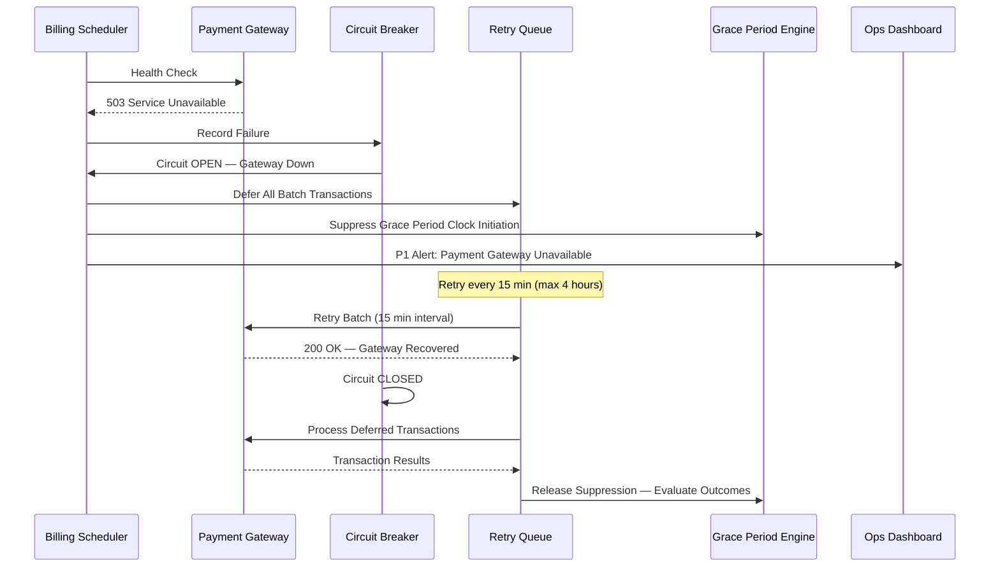
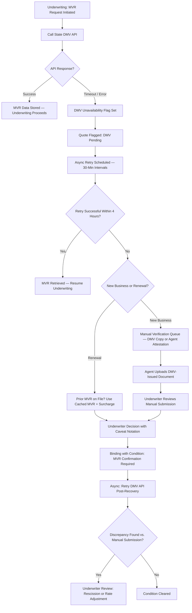
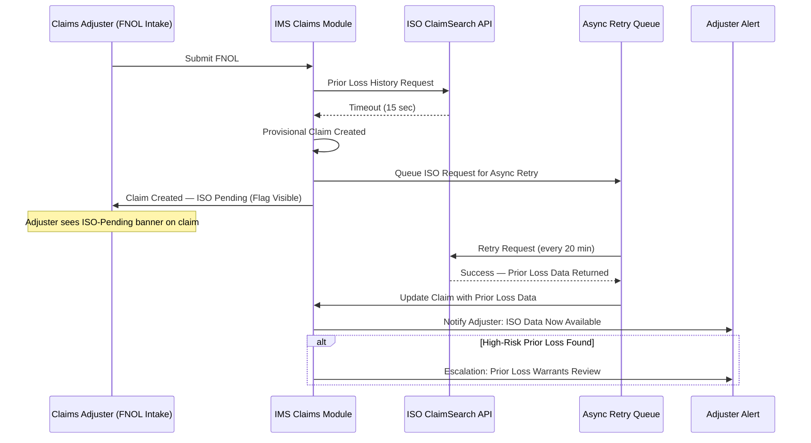
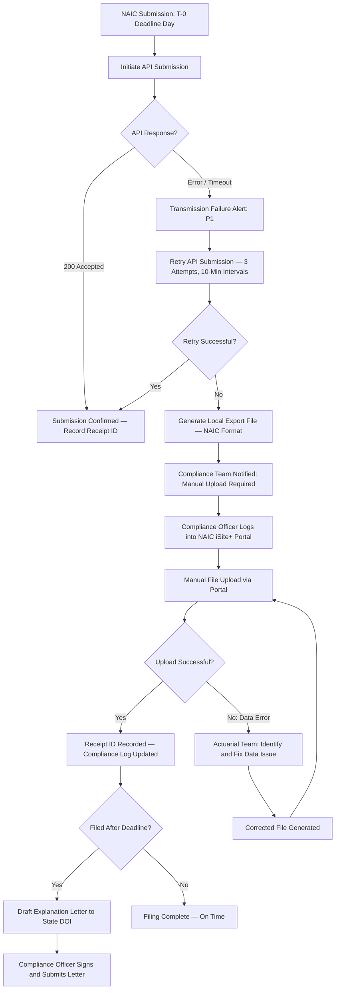
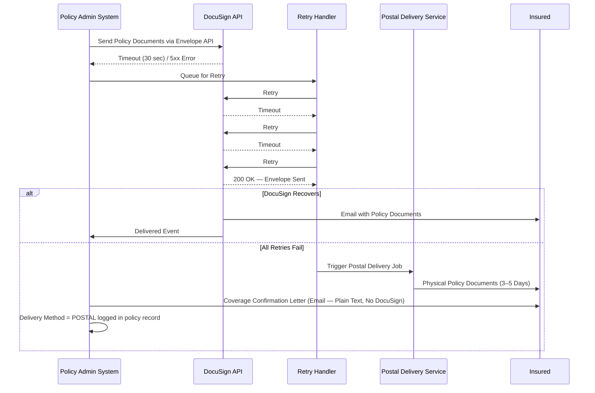

# API & UI — Edge Cases

Domain: P&C Insurance SaaS | Module: Integrations & External APIs

---

## Payment Gateway Downtime

### Scenario
The payment gateway (Stripe, Braintree, or direct ACH processor) becomes unavailable during a scheduled nightly premium collection batch run. Scheduled autopay transactions fail to process, potentially triggering erroneous payment failure events that could start grace period clocks inappropriately. Real-time pay-by-phone and online portal payments also fail, impacting insureds trying to prevent a lapse.

### Detection
- **Gateway health check**: A pre-batch health check pings the gateway's status endpoint before initiating the batch; an unhealthy response aborts the batch and raises a P1 alert
- **Transaction failure rate monitor**: If the rolling 5-minute failure rate on payment API calls exceeds 20%, the circuit breaker opens and a gateway-down incident is created
- **Status page subscription**: The platform subscribes to the payment processor's status page via webhook; a degradation or outage event automatically suppresses grace period clock initiation for the affected batch window

### System Response

- **Grace period suppression**: No grace period clock is started for policies whose autopay was deferred due to gateway downtime; the billing engine only starts the grace clock when a payment failure is confirmed through a completed transaction attempt — not a deferred one
- **Retry queue**: Deferred transactions are held in a durable queue (not in-memory) so they survive any application restarts during the outage window
- **Carrier notification**: The operations dashboard sends an automated notification to the carrier's billing team and, if the outage exceeds 2 hours, a status communication is sent to the broker portal

### Manual Steps
1. **Billing team override** — If the gateway outage exceeds the retry window (4 hours), billing team manually extends the collection deadline for the affected batch by one business day
2. **Carrier finance notification** — The CFO is notified of the expected cash flow impact if a large batch (e.g., quarterly or semi-annual payments) is deferred beyond the business day
3. **Grace period review** — After gateway recovery, billing reviews any policies where grace periods were close to expiring; manual extension is applied where needed
4. **Gateway failover evaluation** — Engineering evaluates whether a secondary gateway (Stripe → Braintree failover) can be activated for the remainder of the recovery period

### Prevention
- Dual-gateway architecture: primary (Stripe) and secondary (Braintree or Adyen) with automated failover configured
- Batch jobs scheduled to avoid peak gateway load hours (3–5 AM ET preferred vs. 9–11 PM when international gateways are busiest)
- Pre-batch health checks are mandatory and non-skippable in the batch job configuration

### SLA Impact
- **RTO**: 4 hours (retry queue holds transactions; grace periods suppressed)
- **RPO**: 0 — no transaction data is lost; deferred transactions are durably queued
- Breach of the 4-hour RTO triggers a P0 escalation and manual batch resubmission; finance department is notified of same-day cash posting implications

---

## State DMV API Unavailable

### Scenario
During the auto underwriting workflow, the policy administration system attempts to verify driver license validity, MVR (Motor Vehicle Record) history, and vehicle registration via the state DMV API. The DMV API times out, returns an error, or is under scheduled maintenance. Without this data, the underwriter cannot make a complete coverage decision, and binding cannot proceed for that risk.

### Detection
- **API timeout**: The DMV API call has a 10-second timeout; a timeout response triggers the DMV unavailability handler
- **State DMV status feed**: Some states publish planned maintenance windows; the system ingests these and pre-stages the unavailability handler before the maintenance window begins
- **Error rate threshold**: If DMV API errors exceed 15% of requests in a 10-minute window across all states, a system-wide DMV degradation alert fires

### System Response

- **Cached MVR**: For renewals, the prior-term MVR is cached; the system can bind with a cached MVR plus a precautionary surcharge, which is reversed if the fresh MVR shows no adverse changes
- **Manual verification queue**: For new business, agents or brokers are prompted to upload a state-issued driving record or provide a signed attestation; the application is held in a "bind pending MVR" status
- **Conditional binding**: The policy is bound with a coverage condition that requires MVR confirmation within 10 business days; if adverse information surfaces, underwriting retains the right to re-rate or cancel per the policy conditions

### Manual Steps
1. **Agent outreach** — For new business in the hold queue, an automated message is sent to the agent/broker portal explaining the DMV delay and requesting the manual document upload
2. **Underwriter risk review** — For higher-risk vehicle types or youthful operators, the underwriter may require a more stringent manual review before conditional binding
3. **Post-recovery MVR sweep** — After DMV API recovery, all policies bound under the manual verification fallback are automatically re-queried; discrepancies trigger an underwriter alert

### Prevention
- Cache state DMV responses for renewals (subject to state regulations on MVR data retention)
- Maintain direct relationships with third-party MVR providers (LexisNexis, Verisk) as fallback for states where their data is available
- Publish DMV maintenance windows in the agent portal so agents can set expectations with applicants

### SLA Impact
- New business bind time SLA: 15 minutes standard → 4-hour hold during DMV unavailability for new applicants
- Renewal processing unaffected if cached MVR is available; otherwise same 4-hour hold
- Extended holds beyond 4 hours must be communicated to the agent/broker with an estimated resolution time

---

## ISO Claims Database Timeout

### Scenario
During FNOL intake, the system queries the ISO ClaimSearch database to retrieve the claimant's prior loss history — a critical fraud detection and coverage history input. If the ISO ClaimSearch API times out or returns an error, the claims adjuster proceeds without complete prior loss information, which may lead to duplicate coverage payments or undetected fraud patterns being missed.

### Detection
- **API timeout monitor**: ISO ClaimSearch requests have a 15-second timeout; a timeout response activates the provisional claim path
- **ISO service health dashboard**: ISO publishes a service health status page; a webhook subscription triggers the platform's ISO-unavailability handler
- **Retry failure rate**: If ISO requests fail for more than 5 consecutive attempts across different claims, a systemic ISO outage is confirmed and the async retry queue is activated for all pending requests

### System Response

- **Provisional claim**: The claim is created immediately with an "ISO Pending" flag; the adjuster can proceed with initial intake steps (contact insured, request documentation) while the ISO data is retrieved asynchronously
- **Adjuster alert**: Once ISO data is retrieved, the adjuster receives an in-app notification and email; if the data reveals a high-risk prior loss pattern, the alert is escalated to a supervisor
- **Payment hold**: No claim payment is released while the ISO flag is outstanding on claims above a defined payment threshold (e.g., $5,000)

### Manual Steps
1. **Manual ISO query** — If the async retry fails after 24 hours, the adjuster or SIU analyst can submit a manual ISO request via the ISO web portal; results are manually uploaded to the claim record
2. **Prior carrier outreach** — For complex claims, the adjuster may directly contact the prior carrier identified in the insured's policy history to verify prior loss details
3. **Supervisor notification** — If ISO data remains unavailable at 72 hours, the claim supervisor is notified and makes a judgment call on whether to proceed with payment pending ISO confirmation

### Prevention
- Maintain an ISO ClaimSearch batch pull option as a fallback; rather than real-time API calls, a nightly batch pull for all new FNOLs ensures data is available even when the real-time API is down
- Negotiate API uptime SLAs with ISO directly (target 99.9%); include financial penalties for chronic underperformance
- Cache ISO responses for known claimants (with appropriate data retention controls) to reduce real-time API dependency

### SLA Impact
- Standard FNOL acknowledgment SLA (24 hours) is unaffected — the provisional claim path ensures the clock starts on time
- Payment release SLA is extended by the ISO pending period for claims above the payment threshold; adjusters must communicate the delay reason to the claimant
- ISO outages exceeding 48 hours are escalated to the CTO and vendor management team for contractual remedies

---

## NAIC Reporting API Failure

### Scenario
NAIC quarterly statistical report submission (e.g., Schedule P, Schedule F, or state statistical agent report) fails at the regulatory deadline because the NAIC receiving API returns an error, the submission portal is unavailable, or a data validation error is discovered in the submission file only at the point of transmission. Missing a NAIC or state DOI filing deadline can result in penalties.

### Detection
- **Pre-submission validation**: An automated pre-submission validation job runs 48 hours before the deadline; it validates the file against the NAIC schema and flags any data quality issues for resolution before submission
- **Transmission failure alert**: If the submission API call fails, the reporting module immediately raises a P1 alert to the actuarial and compliance teams
- **Deadline tracker**: A regulatory calendar tracks all NAIC and state DOI filing deadlines; a countdown alert fires at T-7 days, T-3 days, and T-0 (deadline day) to ensure appropriate team availability

### System Response

- **Local export fallback**: The system can generate a valid NAIC submission file in the required format (XML, flat file) for manual upload via the NAIC iSite+ portal, independent of the API
- **Deadline extension request**: If a data quality issue cannot be resolved before deadline, the compliance officer submits a pre-emptive extension request to the state DOI with a root cause description
- **Data quality hot-fix**: The actuarial data team has a dedicated fast-track workflow for correcting statistical data issues under a filing deadline; changes require actuarial sign-off before resubmission

### Manual Steps
1. **Actuarial review** — Actuary validates the corrected data before the manual upload to ensure the fix resolves the NAIC validation error without introducing new inconsistencies
2. **DOI communication** — If filing is late, the compliance officer contacts the state DOI directly (phone + written communication) before the DOI issues a penalty notice
3. **Post-incident review** — Root cause analysis of the API failure or data quality issue; corrective action plan documented for the next filing cycle

### Prevention
- Pre-submission validation running at T-7 days (not just T-2 days) to allow adequate time for data quality resolution
- Maintain a designated NAIC portal account with active credentials for manual submission fallback
- Test the API submission in a staging environment 2 weeks before each quarterly deadline with real data

### SLA Impact
- On-time filing maintains clean regulatory standing; late filings may result in monetary penalties (typically $100–$1,000/day depending on state)
- Repeated late filings increase risk of a market conduct examination trigger
- Some states have zero-tolerance policies for late CAT-related reporting; the deadline tracker must flag these separately with elevated alert priority

---

## DocuSign Timeout on Policy Delivery

### Scenario
When a new policy is bound or a renewal is processed, the policy documents are sent to the policyholder via DocuSign for e-delivery and, where required, e-signature. If DocuSign's API times out, returns an error, or the policyholder's email address is invalid, the policy documents are not delivered. In some states, coverage does not formally attach until the policy is delivered; in others, a failure to deliver on time is a market conduct issue.

### Detection
- **DocuSign envelope status webhook**: DocuSign sends envelope status events (sent, delivered, completed, failed, bounced); a `failed` or `bounced` event triggers an immediate delivery failure alert
- **Delivery timeout monitor**: If an envelope status is not received within 30 minutes of submission (for synchronous delivery confirmation), a timeout handler fires
- **Bounce detection**: Email bounces on the policy delivery address are flagged; the contact data validation workflow is initiated to find the correct delivery address

### System Response

- **Retry with exponential backoff**: Three retries at 5, 15, and 30 minutes; if all retries fail, the postal delivery fallback is automatically triggered
- **Coverage confirmation letter**: An immediate plain-text email (not requiring DocuSign) is sent to the insured confirming coverage is in effect, the policy number, effective dates, and coverage limits; this serves as interim proof of insurance
- **Postal fallback**: The document generation service outputs a PDF that is sent to a print-and-mail fulfillment service (e.g., Lob.com); tracking is integrated into the policy delivery record
- **State-specific delivery rules**: The delivery rules engine checks whether the state requires a signed acknowledgment of delivery; if so, the postal delivery path includes a return receipt card request

### Manual Steps
1. **Contact data correction** — If the email bounced, the agent is contacted to verify the insured's correct email address; the envelope is resent once corrected
2. **Underwriting hold review** — If the policy requires an insured signature (e.g., named driver exclusion, flood waiver), the missing signature is tracked as an open policy condition; the underwriter monitors the 30-day completion window
3. **Agent download** — For urgent situations (e.g., insured needs proof of insurance for a closing), the agent can download the policy documents directly from the agent portal and hand-deliver them to the insured

### Prevention
- Email address validation (syntax + domain MX record check) at quote and application stage before policy issuance
- DocuSign webhook endpoint health check included in the platform's daily integration health check suite
- Maintain a pre-negotiated SLA with the print-and-mail vendor (next-business-day processing) to ensure postal fallback meets state delivery deadlines

### SLA Impact
- Most states require policy delivery within 30 days of binding; the postal fallback path (3–5 day delivery) satisfies this requirement even when DocuSign fails
- Some states (NY, CA) require e-delivery consent to be on file before e-delivery is attempted; the absence of consent means postal delivery is the primary path, not a fallback
- Market conduct examiners may review delivery confirmation records; all delivery attempts, methods, and timestamps must be logged in the policy record with immutable audit trail entries
