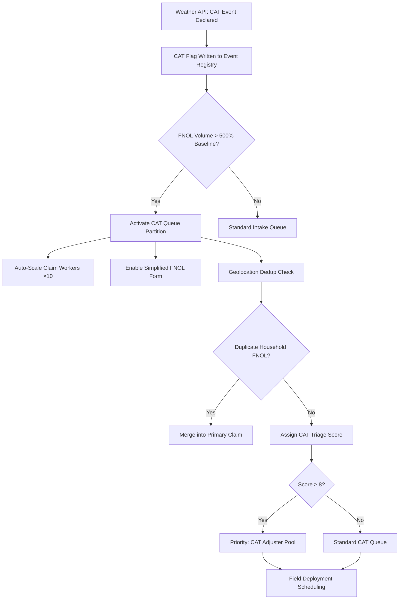
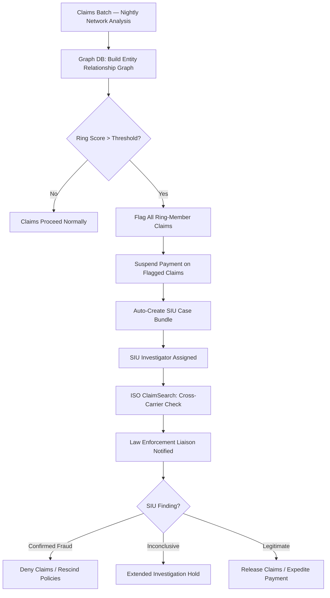
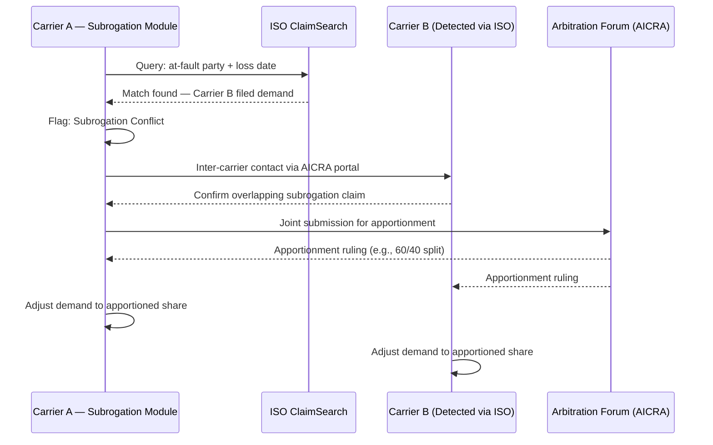
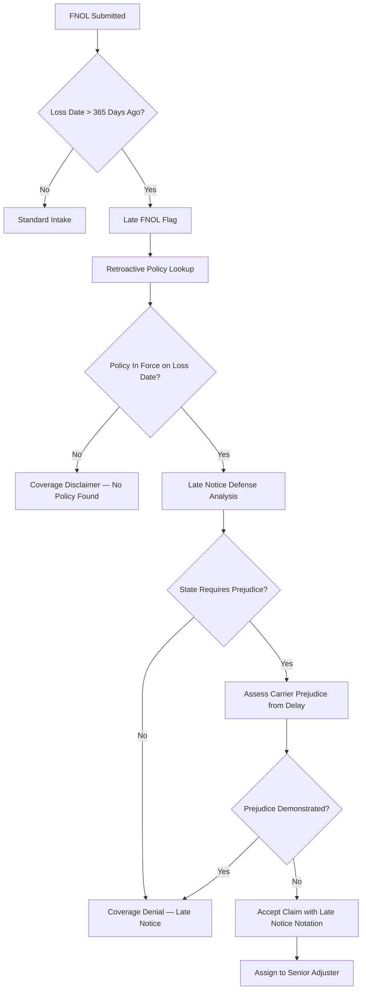
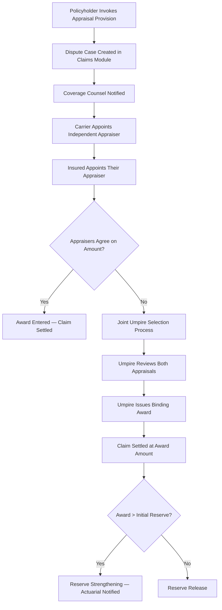

# Claims Processing — Edge Cases

Domain: P&C Insurance SaaS | Module: Claims Lifecycle Management

---

## Catastrophic Event Mass Claims

### Scenario
A Category 4 hurricane or major wildfire triggers thousands of simultaneous First Notice of Loss (FNOL) submissions within hours. Standard claim intake queues are overwhelmed, adjusters cannot be reached, and the policy lookup service approaches saturation. Claim deduplication becomes difficult when multiple household members submit separate FNOLs for the same loss event.

### Detection
- **CAT event flag**: Weather service API (e.g., CoreLogic, Verisk) pushes a CAT code into the platform the moment a declared catastrophe is confirmed
- **FNOL surge threshold**: If FNOLs exceed 500% of the daily rolling average within a 2-hour window, the CAT response protocol fires automatically
- **Geographic clustering**: Claims geolocation heatmap clusters inside the declared disaster zone; outlier claims outside the zone are separated for individual investigation

### System Response

- **CAT queue partition**: Isolates CAT claims from standard work queues so routine claims are not blocked
- **Simplified FNOL**: Reduces form fields to contact info, property address, loss description, and consent for inspection; detailed questions are deferred
- **Triage scoring engine** assigns a 1–10 score based on estimated loss severity, insured vulnerability (elderly, disabled flagged via policy notes), and property type (total loss vs. partial)
- **CAT adjuster pool**: Pre-contracted independent adjusters are paged via the vendor portal; proximity to disaster zone determines first assignments
- **Drone / aerial imagery** requests are auto-submitted to imagery providers (Nearmap, EagleView) for total-loss triage before any adjuster arrives on site

### Manual Steps
1. **CAT Command Center activation** — Claims VP opens the CAT Command Center dashboard and reviews live queue depth, adjuster deployment map, and estimated reserve exposure
2. **Adjuster surge contracts** — Procurement executes pre-negotiated IA (Independent Adjuster) surge agreements; credentials are batch-uploaded to the adjuster portal
3. **Policyholder communication blast** — Marketing Operations sends state-specific CAT communication (SMS + email) with claim filing instructions, expected response SLAs, and emergency hotline
4. **Reserve adequacy review** — Actuarial sets initial bulk CAT reserves within 24 hours; IBNR estimates are logged to the reinsurance module for treaty notification

### Prevention
- Maintain pre-executed IA surge contracts refreshed annually
- Conduct semi-annual CAT simulation drills testing queue auto-scaling up to 50,000 FNOLs
- Keep a pre-approved simplified FNOL form per state to avoid last-minute regulatory approval delays during an event
- Subscribe to NOAA/NWS severe weather webhooks for advance CAT pre-staging (12–24 hours before landfall)

### Regulatory & Compliance Notes
- Most states require acknowledgment of FNOL within **10 days** and a coverage decision within **30–45 days**; CAT extensions (typically +30 days) must be filed with the state DOI **before** the standard deadline expires
- NAIC Catastrophe Response Model Act provisions may mandate proactive outreach to known policyholders in the disaster zone even before FNOL is submitted
- Claims data must feed into NAIC CAT reporting (Schedule F supplements) within the applicable quarterly reporting period
- Some states (FL, LA, TX) have specific hurricane claim statutes with stricter timelines and penalty provisions for carrier delays

---

## Fraud Ring Detection

### Scenario
A coordinated group of claimants submits multiple related claims across a short timeframe. They share common addresses, phone numbers, repair shops, medical providers, and attorneys. Individual claim scores may appear normal, but the network-level pattern reveals orchestrated fraud. This is common in auto (staged accidents) and homeowners (contractor fraud rings).

### Detection
- **Network link analysis**: Graph database query identifies shared entities (IP address, phone, address, attorney, repair shop) across claims filed within a rolling 90-day window
- **Velocity check**: More than 3 claims linking to the same third-party entity within 30 days triggers a ring alert
- **ML fraud model**: Ensemble model incorporates network centrality score alongside individual claim features; a combined score above 85 triggers SIU referral

### System Response

- **Graph database** (Neo4j or Amazon Neptune) maintains a live entity graph; nightly batch jobs and real-time FNOL hooks both write to it
- **Claim suspension** is applied to all claims in the ring cluster — payment is paused but investigation clock does not toll (state law permitting)
- **SIU case bundle** aggregates all related claims, evidence, and entity links into a single investigator workbench view
- **Cross-carrier check** via ISO ClaimSearch identifies if the same ring is operating against other insurers

### Manual Steps
1. **SIU investigator review** — Reviews entity graph, orders social media OSINT, interviews claimants separately
2. **Recorded statements** — Each claimant is scheduled for a separate recorded statement; inconsistencies are documented
3. **Law enforcement referral** — If evidence threshold is met, a referral is made to the state Insurance Fraud Bureau and/or FBI (if threshold for federal mail/wire fraud is crossed)
4. **Coverage counsel engagement** — Reservation of Rights letters issued to all ring-member policyholders pending investigation outcome

### Prevention
- Real-time entity resolution during FNOL intake to surface ring connections before claim assignment
- Third-party fraud data consortium membership (NICB, ISO) for cross-industry intelligence sharing
- Broker/agent monitoring for unusual policy concentration from single entities (sign of policy procurement fraud pre-loss)

### Regulatory & Compliance Notes
- All states require insurers to report suspected fraud to the state Insurance Fraud Bureau; deadlines range from **immediately** (AR, FL) to **within 30 days** of reasonable suspicion
- Claims held for fraud investigation must comply with state prompt payment statutes; a valid reservation of rights or statutory fraud hold must be documented in the claim file
- NICB membership and active data sharing may be required under state market conduct guidelines

---

## Subrogation Conflict

### Scenario
Two carriers each independently pursue subrogation against the same at-fault third party following the same loss event (e.g., a multi-vehicle accident). Without coordination, duplicate demands are filed, the at-fault party's carrier is confused, and settlement proceeds may be double-collected — exposing both pursuing carriers to legal liability.

### Detection
- **ISO ClaimSearch cross-reference**: When a subrogation demand is created, ISO is queried for existing demands against the same at-fault party/vehicle/event
- **Duplicate demand alert**: If a matching demand from another carrier is found, the system raises a subrogation conflict flag before the demand letter is transmitted

### System Response

- **AICRA arbitration** (Arbitration Forums Inter-Company Arbitration) is the standard mechanism for resolving inter-carrier subrogation disputes
- **Demand hold**: No demand letter is transmitted while conflict resolution is pending; the statutory subrogation deadline is tracked and an escalation is raised if resolution is not achieved 30 days before expiry
- **Apportionment engine**: Once arbitration ruling is received, the system automatically adjusts the demand amount and updates the subrogation recovery ledger

### Manual Steps
1. **Subrogation counsel coordination** — Outside counsel for both carriers may be engaged to present at AICRA arbitration
2. **Prorated recovery posting** — Finance posts the apportioned recovery against the original paid loss; any overpayment is reversed
3. **At-fault carrier negotiation** — If arbitration is waived, direct negotiation between carriers' subrogation teams resolves the split

### Prevention
- ISO ClaimSearch query is mandatory at subrogation demand creation (not optional)
- Pre-loss data sharing agreements with top-10 market share carriers to flag potential conflicts earlier
- Subrogation deadline calendar integrates with state statutes of limitations (2–6 years depending on state) and fires escalation 60/30/7 days before expiry

### Regulatory & Compliance Notes
- Violation of anti-subrogation rules (e.g., subrogating against own insured's fault share) is a market conduct violation in most states
- AICRA membership and participation in arbitration may be mandated by state law for certain personal lines disputes below a dollar threshold

---

## Late FNOL Reporting

### Scenario
A policyholder reports a claim several years after the loss event — e.g., a bodily injury claim arising from a slip-and-fall that was initially not reported, or a long-latency environmental claim. The policy may have lapsed, renewed multiple times, or the carrier may have changed. Coverage determination is highly complex.

### Detection
- **Incident date vs. report date delta**: System flags any FNOL where the loss date is more than 365 days before the report date for enhanced review
- **Policy-in-force verification**: System performs a retroactive policy history lookup to confirm whether coverage was active on the alleged loss date
- **Statute of limitations check**: Legal rules engine compares the loss date against the applicable state SOL for the claim type

### System Response

- **Late notice defense** varies by state: some states allow denial purely on late notice; others (majority) require the carrier to demonstrate actual prejudice from the delay
- **Policy reconstruction**: If records are archived, the system retrieves the policy image from cold storage (S3 Glacier) and restores it to the active claim record
- **Senior adjuster assignment**: Late FNOLs are automatically routed to senior adjusters or coverage counsel due to complexity

### Manual Steps
1. **Coverage counsel review** — Mandatory legal review of late notice defense viability under the applicable state law
2. **Reservation of Rights** — ROR letter issued while coverage investigation is ongoing
3. **Witness and evidence preservation** — Given the time lapse, efforts to locate witnesses, records, and physical evidence are documented in the claim file as mitigation

### Prevention
- Annual policyholder reminder communications encouraging prompt loss reporting
- Policy documents include bold-text late-notice provisions to support defense
- Proactive statute of limitations monitoring for known but unreported potential claims (e.g., after major events)

### Regulatory & Compliance Notes
- Denial solely on late notice grounds without prejudice analysis is a common market conduct violation finding
- State statutes of repose (separate from SOL) may bar claims entirely regardless of notice — the legal rules engine must track both
- Proper documentation of the late notice defense rationale is mandatory for market conduct examination defense

---

## Coverage Dispute

### Scenario
After a significant loss (e.g., a disputed roof damage claim or a business interruption claim), the policyholder and insurer disagree on coverage scope, cause of loss, or valuation. The policyholder invokes the appraisal provision in the policy. Both parties must appoint independent appraisers; an umpire is appointed if they disagree.

### Detection
- **Policyholder dispute flag**: Insured submits a written coverage dispute or invokes the appraisal clause in the policy
- **File scoring**: Claims file review by QA identifies significant gap between insured's demand and carrier's offer (>40% differential flags for dispute management workflow)

### System Response

- **Appraisal case tracking**: A dedicated dispute sub-case is linked to the parent claim; all appraisal communications, appointments, and awards are logged with timestamps
- **Umpire registry**: The system maintains a qualified umpire registry; both appraisers can use the in-platform selection tool to jointly agree on an umpire
- **Award enforcement**: Once a binding appraisal award is entered, the payment workflow is triggered automatically unless coverage issues (separate from valuation) remain outstanding

### Manual Steps
1. **Coverage counsel strategy session** — Determines whether to contest coverage separate from appraisal (appraisal addresses amount, not coverage)
2. **Document production** — All policy records, adjuster notes, photos, and engineering reports are compiled for the appraiser
3. **Reserve update** — Finance and actuarial review the final award and update IBNR reserves accordingly

### Prevention
- Proactive supplemental estimates and engineering reports reduce disputes at the outset
- Senior adjuster review required before any claim denial or coverage disclaimer on claims above the authority threshold
- Regular QA audits of coverage letters for clarity, accuracy, and policy citation accuracy

### Regulatory & Compliance Notes
- Some states prohibit carriers from refusing to participate in appraisal once properly invoked — refusal can constitute bad faith
- Appraisal awards are generally binding and non-appealable on valuation, but courts have split on whether coverage defenses survive an appraisal award
- Bad faith exposure increases significantly once appraisal is invoked; all internal communications become potentially discoverable
