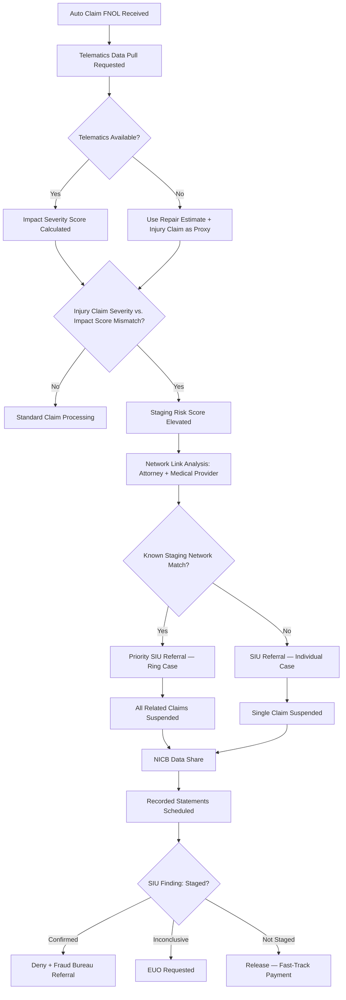
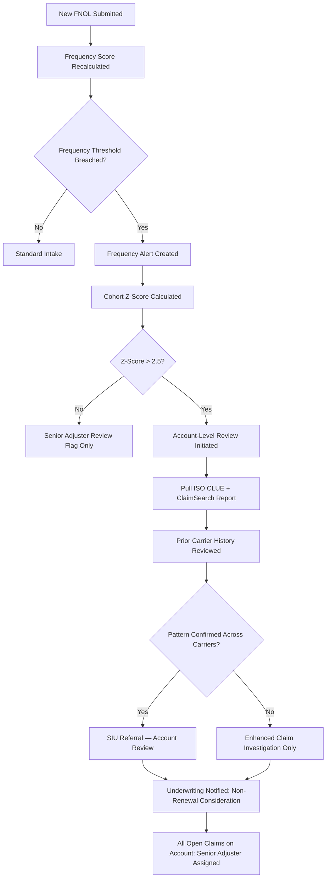
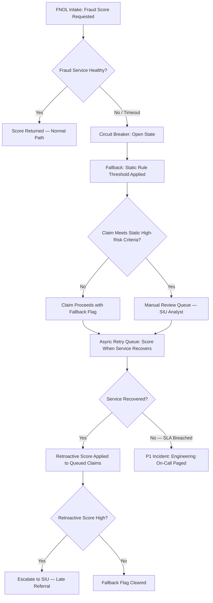
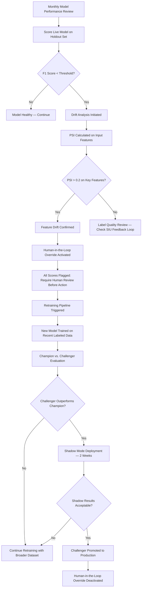
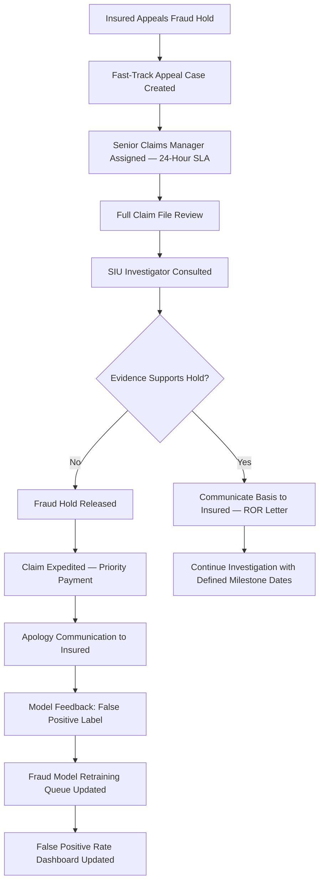

# Fraud Detection — Edge Cases

Domain: P&C Insurance SaaS | Module: SIU & Fraud Analytics

---

## Staged Accident

### Scenario
A coordinated group executes a pre-planned collision — typically a "swoop and squat" (vehicle cuts off another and brakes suddenly), a side-swipe, or a t-bone at a low-speed intersection — with multiple recruited participants who all file injury and property damage claims. Telemetry data, witness statements, and accident reconstruction often reveal inconsistencies that a standard claims review misses.

### Detection Mechanism
- **Telematics/OBD data**: If the insured vehicle has a telematics device or the carrier has access to in-vehicle data via a connected-car API, acceleration/braking profiles are retrieved; a staged collision often shows anomalous low-speed impact combined with high injury severity claims
- **Network link analysis**: Graph database surfaces connections between the claimant, their attorney, medical provider, and repair shop — common staging rings repeatedly use the same network
- **Accident reconstruction scoring**: AI-assisted reconstruction model evaluates the physics plausibility of reported injuries against the impact data; a score below the plausibility threshold flags the claim
- **Witness inconsistency detection**: NLP model applied to recorded statement transcripts identifies internal contradictions and inconsistencies across multiple statements from the same incident

### System Response

- **Examination Under Oath (EUO)**: If SIU cannot confirm or deny staging after recorded statements, an EUO is a more formal legal tool; refusal to submit to EUO (where policy requires it) is grounds for coverage denial in most states
- **NICB data share**: The National Insurance Crime Bureau receives flagged claim data; their cross-industry database may surface the same ring operating against other carriers

### Manual Steps
1. **SIU investigator surveillance** — Physical surveillance at the injury treatment clinic and repair shop to confirm the participants' ongoing involvement with the ring
2. **Police report verification** — Obtain and analyze the original police report; compare officer's description of the accident scene to claimant statements
3. **Social media OSINT** — Investigator reviews social media profiles of all claimants for evidence of pre-existing relationships or posts inconsistent with claimed injuries
4. **Law enforcement referral** — State Insurance Fraud Bureau and, if a multi-state ring, the FBI are notified with the evidence package

### Model Governance Notes
- The staging risk score model must be retrained at least annually using confirmed staging cases as positive labels
- Model decisions must be explainable; a human-readable factor breakdown is required in the SIU referral for every automated flag
- Model performance metrics (precision, recall, F1 at the SIU referral threshold) are tracked in the ML governance dashboard and reviewed quarterly

### Regulatory Compliance
- All states with fraud statutes require reporting of suspected fraud to the state Insurance Fraud Bureau within defined timeframes (10–30 days of reasonable suspicion)
- Automated fraud flags alone are insufficient basis for claim denial; documented SIU investigation is required before denial
- Recorded statement procedures must comply with state laws on consent and recording disclosure

---

## Suspicious Claim Frequency

### Scenario
An insured policyholder or a commercial account submits an unusually high number of claims within a policy period — for example, five glass claims, three separate theft claims, or repeated water damage claims. Each individual claim may appear legitimate, but the pattern across the account is anomalous relative to the risk class and policyholder cohort.

### Detection Mechanism
- **Frequency scoring engine**: Rolling 12-month claim count and total paid amount are calculated per insured at every new FNOL; scores are compared against the insured's risk segment benchmark (state, line, construction type, territory)
- **Threshold triggers**: Configurable thresholds (e.g., 3+ claims of the same peril type in 12 months; total paid > 2× annual premium) fire an automated frequency alert
- **Cohort comparison**: The insured's claim frequency is benchmarked against a peer cohort; a Z-score > 2.5 standard deviations from the mean triggers enhanced review
- **Prior policy history**: ISO ClaimSearch and CLUE report are pulled at threshold breach to check if the pattern exists across prior carriers

### System Response

- **Account-level hold**: No claim payments are released on the account while the account-level review is active; individual claims may be completed by investigative findings
- **Underwriting feedback loop**: The underwriting module receives a frequency alert flag; the underwriter can initiate a non-renewal review or a premium surcharge analysis at next renewal

### Manual Steps
1. **Account-level adjuster review** — A senior adjuster reviews all claims on the account chronologically, looking for escalating patterns, similar loss descriptions, or repeated service providers
2. **Underwriter consultation** — Underwriting evaluates whether the account's premium adequately reflects the demonstrated loss experience; actuarial may be consulted for experience rating adjustment
3. **Policyholder interview** — A claims manager may request a meeting with the commercial policyholder to review their risk management practices and loss control

### Model Governance Notes
- Frequency thresholds are calibrated per line of business and territory to avoid disparate impact on certain risk classes or geographies with legitimately higher event frequency (e.g., hail-prone states)
- Model threshold review is performed annually by actuarial and SIU jointly
- False positive rate (legitimate high-frequency accounts incorrectly flagged) is tracked; if above 15%, thresholds are recalibrated

### Regulatory Compliance
- Enhanced investigation based on frequency alone must not cross into discriminatory claims handling; documentation must show objective risk-based criteria
- Any claim held during an account-level review must comply with state prompt payment statutes — investigation holds must be explicitly authorized under state law or the policy's cooperation clause

---

## SIU Referral System Failure

### Scenario
The external fraud scoring microservice (or the internal SIU referral workflow engine) becomes unavailable during claim intake — due to a service outage, network partition, or dependency failure. Claims that would normally be scored and potentially referred to SIU before payment are processed without fraud screening, exposing the carrier to undetected fraud losses.

### Detection Mechanism
- **Health check monitor**: The claims intake service performs a health check against the fraud scoring service at intake time; a timeout or 5xx response triggers an automatic fallback path
- **Circuit breaker**: A circuit breaker pattern wraps the fraud scoring API call; after three consecutive failures, the circuit opens and all requests route to the fallback queue for a configurable period
- **SLA breach monitor**: An operational monitor tracks the percentage of claims processed without a fraud score; if this exceeds 5% of intake volume in any hour, a P1 alert fires

### System Response

- **Static rule fallback**: A pre-configured set of deterministic rules (claim amount > $25K, same-day FNOL, prior claims in last 90 days, new policy < 60 days old) acts as a basic fraud screen when the ML model is unavailable
- **Retroactive scoring queue**: Every claim processed under the fallback path is queued for retroactive scoring once the fraud service recovers; the queue is processed in FIFO order with payment holds checked before release
- **Late SIU referral**: If a retroactive score is high-risk, a late SIU referral is created even if payment has already been made; SIU investigates for potential recovery

### Manual Steps
1. **SIU analyst queue monitoring** — During the outage, SIU analysts manually review claims in the manual review queue and apply expert judgment as a substitute for model scoring
2. **Engineering escalation** — The on-call engineering team investigates the fraud service outage; runbook specifies rollback steps, dependency checks, and escalation contacts
3. **Post-recovery audit** — After service recovery, a post-incident review audits all claims processed under fallback path; any high-risk retroactive scores with released payments are flagged for recovery review

### Model Governance Notes
- The static rule fallback must be reviewed annually to ensure it reflects current fraud patterns and does not become outdated as fraud techniques evolve
- A/B testing of the fallback vs. ML model on historical data validates that the fallback does not dramatically increase false negative rates
- All claims processed under fallback path are excluded from model performance metrics (they lack a real-time model score) to avoid polluting training data

### Regulatory Compliance
- Service outages do not excuse carriers from their obligation to investigate suspicious claims before payment; the manual review queue and retroactive scoring process must be documented in the SIU plan filed with the state DOI
- SIU plans filed with state DOIs must describe the fallback procedures for technology failures; failure to have and follow a plan is a market conduct finding

---

## Fraud Model Drift

### Scenario
The ML fraud detection model was trained on historical data, but over time the distribution of incoming claims shifts — due to new fraud schemes, changes in claim demographics, economic conditions, or the model itself inadvertently suppressing certain claim patterns. Model accuracy degrades without detection, causing either increased fraud losses (false negatives) or increased legitimate claim delays (false positives).

### Detection Mechanism
- **Data drift monitor**: A statistical monitor (Population Stability Index, Kullback-Leibler divergence) compares the distribution of input features on current claims against the training data distribution; a PSI > 0.2 triggers a drift alert
- **Performance monitoring**: Monthly labeled holdout sets (confirmed fraud / confirmed legitimate from resolved claims) are scored against the live model; F1 score below threshold triggers retraining
- **SIU feedback loop**: SIU investigators provide outcome labels (fraud confirmed, legitimate) on closed investigations; these labels update the model performance tracker in near-real-time

### System Response

- **Human-in-the-loop override**: When drift is detected, no claim is automatically approved or denied based on the model score alone; a human reviewer must validate every action recommended by the model until the new model is deployed
- **Champion-challenger framework**: The retrained model runs in shadow mode alongside the production model for 2 weeks; shadow mode outputs are compared to actual outcomes before promotion
- **Model registry**: Every model version is logged in the ML model registry with training data cutoff, feature set, performance metrics, and deployment history; audit trail is maintained for regulatory review

### Manual Steps
1. **ML engineer investigation** — Root cause analysis of drift: identify which features drifted and whether new fraud schemes introduced novel patterns not in training data
2. **Actuarial and SIU sign-off** — The retrained model must be reviewed and approved by the SIU director and actuarial before production promotion
3. **Threshold recalibration** — The SIU referral threshold may be temporarily lowered during the drift period to compensate for reduced model precision
4. **Regulatory documentation** — If the model is filed with any state DOI as part of claims automation, any material change to the model may require a regulatory filing update

### Model Governance Notes
- Model governance policy mandates monthly performance reviews; models with sustained F1 below target for 2 consecutive months must be retrained regardless of business impact
- Training data must include recent SIU confirmed outcomes; stale training data is a leading cause of model drift in insurance fraud detection
- Fairness metrics (disparate impact across demographic groups) must be re-evaluated with every retraining

### Regulatory Compliance
- AI/ML models used in claims decisions are subject to growing regulatory scrutiny; several states (CO, CA) have issued guidance on algorithmic decision-making in insurance
- Model documentation, including training data description, performance metrics, and drift monitoring procedures, must be available for regulatory examination
- Adverse actions (claim holds, SIU referrals) driven by model output require documented human review to satisfy regulatory requirements in most states

---

## False Positive Fraud Flag

### Scenario
A legitimate claim — often from a long-tenure, high-value policyholder — is incorrectly flagged as high-risk by the fraud scoring model or static rule engine. The claim is suspended, the insured receives an unexplained delay, and if not resolved quickly, the insured files a DOI complaint or initiates bad faith litigation.

### Detection Mechanism
- **Insured appeal submission**: Insured or their attorney submits a written protest of the investigation hold; the claim file is immediately tagged for fast-track appeal review
- **QA sampling**: Random QA review of SIU-referred claims identifies cases where the referral score was borderline and the evidence is thin; these are escalated for immediate re-review
- **DOI complaint trigger**: A DOI complaint filed by the insured automatically triggers a management-level review of the claim file

### System Response

- **24-hour SLA**: Fast-track appeal reviews must be completed within 24 hours of receipt; escalation to the VP of Claims if not completed on time
- **Priority payment**: Once the hold is released, the claim is placed in the priority payment queue; payment is made within 1 business day
- **Model feedback loop**: The confirmed false positive is labeled and fed back into the model retraining pipeline; if false positive rate exceeds the governance threshold, the SIU referral threshold is raised

### Manual Steps
1. **Senior manager review** — Claims VP or senior manager personally reviews the file to ensure the release is appropriate and that there is no actual fraud risk being dismissed
2. **Insured relationship management** — For high-value or long-tenure policyholders, the account manager contacts the insured directly to explain the situation and apologize for the delay
3. **DOI response** — If a DOI complaint was filed, the compliance team prepares a response documenting the release, the expedited payment, and the process improvements being made

### Model Governance Notes
- False positive rate is a primary governance KPI alongside false negative rate; an acceptable false positive rate is defined in the SIU plan (e.g., no more than 8% of SIU referrals should be confirmed false positives)
- Confirmed false positives are weighted more heavily in model retraining than unconfirmed cases to directly address the precision problem
- Threshold tuning to reduce false positives must be balanced against the risk of increasing false negatives; actuarial models the expected fraud loss impact of any threshold change

### Regulatory Compliance
- Unexplained claim holds without a documented basis are a bad faith exposure; every hold must have a written investigation basis documented in the file within 24 hours of the hold being placed
- State unfair claims settlement practices acts prohibit compelling policyholders to institute litigation to recover amounts clearly owed; a confirmed false positive hold that forced litigation is a serious regulatory violation
- Regulatory remediation plans may require carriers to audit all fraud holds over a look-back period to quantify the false positive population and pay interest on delayed payments
