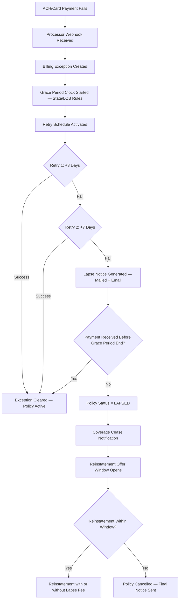
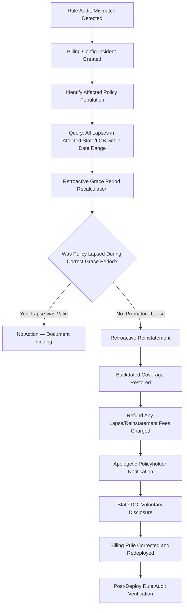
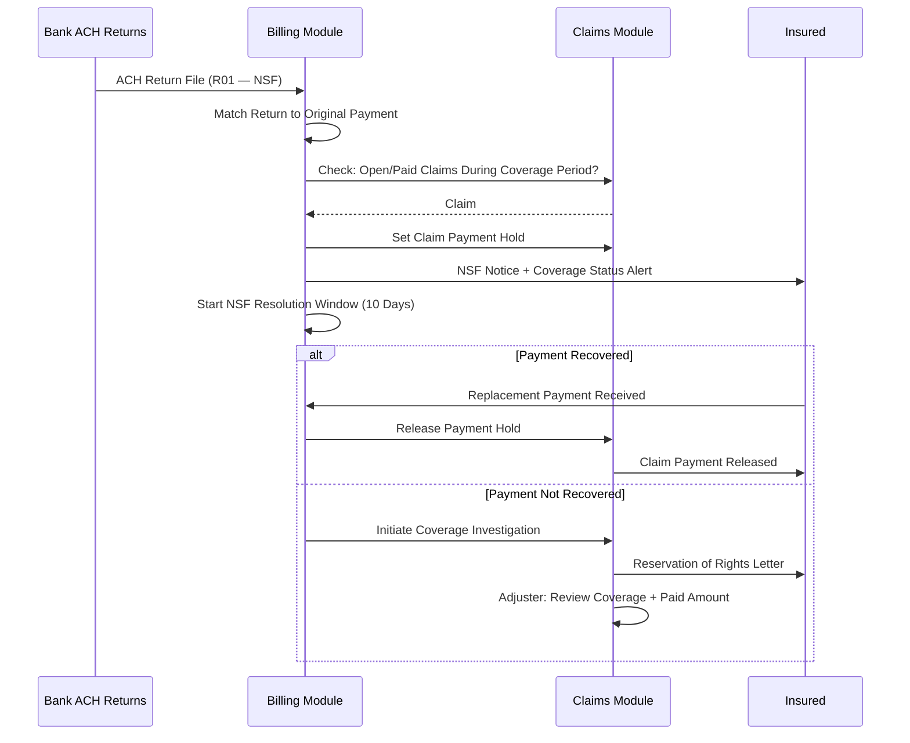
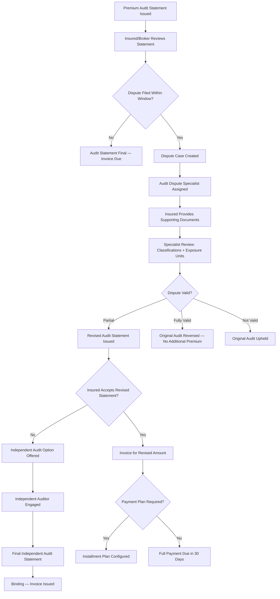
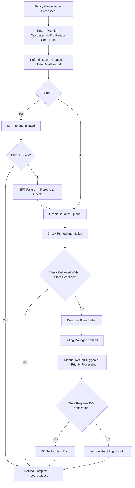

# Premium Collection — Edge Cases

Domain: P&C Insurance SaaS | Module: Billing & Premium Management

---

## Payment Failure Causing Policy Lapse

### Scenario
A scheduled ACH debit or credit card charge for a premium installment fails — due to insufficient funds, an expired card, or a bank-side decline. If the failure is not detected and resolved within the applicable grace period, the policy lapses, leaving the insured without coverage. A lapsed policy that has an open claim creates a compounding problem (covered under "NSF Chargeback After Claim" below).

### Detection
- **Payment processor webhook**: Stripe, Braintree, or direct ACH processor sends a failure event (e.g., `payment_intent.payment_failed`, ACH return code R01/R08) within minutes of the failed transaction
- **Batch reconciliation**: Nightly batch job reconciles expected premium receipts against actual postings; any unmatched billing item triggers a billing exception alert
- **Grace period clock**: Upon payment failure, the system automatically starts the grace period countdown based on the state-specific and line-of-business-specific rules in the billing rules engine

### System Response

- **Retry schedule**: Three automated retry attempts are made at configurable intervals (Day 0, Day 3, Day 7) before escalating to lapse notice generation
- **State-specific grace periods**: The billing rules engine stores grace periods per state per LOB (e.g., 10 days for auto in TX, 30 days for life in most states, 10–30 days for homeowners varies by state); the correct rule is applied at runtime
- **Lapse notice**: Automatically generated in the state-mandated format; sent via the insured's preferred communication channel and simultaneously to any lienholder/mortgagee listed on the policy
- **Reinstatement window**: Configurable per policy type; health may require no lapse in coverage, while P&C may allow reinstatement with a statement of no loss

### Manual Steps
1. **Billing team outreach** — If automated retries fail, a billing specialist calls or emails the insured with payment options (new card, EFT, pay-by-phone)
2. **Hardship review** — For long-tenure policyholders or commercial accounts, the billing manager can authorize a one-time extended grace period (documented and flagged for actuary review)
3. **Lienholder coordination** — If a mortgagee or vehicle lienholder is on the policy, the billing team coordinates notification so the lienholder can force-place coverage
4. **Reinstatement underwriting** — For lapses exceeding 30 days, the policy is re-underwritten at reinstatement; new rates and any changed risk factors are applied

### Prevention
- Pre-expiry card update reminders sent 60, 30, and 7 days before card expiry
- Integration with Visa/Mastercard Account Updater for automatic card number refresh
- Autopay enrollment incentives (premium discount) to reduce manual payment failures
- Bank account validation (Plaid or similar) at enrollment to catch incorrect routing numbers before first debit

### Regulatory Notes
- State regulations strictly define the minimum grace period; applying a shorter grace period is a market conduct violation — the billing rules engine must be audited at every state rule change
- Lapse notices must use DOI-approved language and delivery methods; some states require certified mail for cancellations
- Some states prohibit lapsing a policy mid-term for first-time payment failure without a written installment agreement default process

---

## Grace Period Calculation Error

### Scenario
A software defect or misconfigured rule in the billing engine applies an incorrect grace period duration for a specific state (e.g., applying a 10-day grace period when the state requires 20 days). Policies may be erroneously lapsed or cancelled before the legally required grace period expires, creating coverage gaps for affected policyholders.

### Detection
- **Rule audit job**: A nightly rule-audit job cross-references the billing rules engine configuration against the authoritative state regulation database (updated by the compliance team quarterly)
- **Market conduct examination finding**: A state DOI examination discovers that lapse notices were sent before the mandated grace period; this triggers a look-back investigation
- **Policyholder complaint**: Policyholders who received a lapse notice before the legal grace period expired file complaints with the DOI or directly with the insurer

### System Response

- **Look-back query**: The system can run a parameterized query returning all lapse transactions for a given state, LOB, and date range — essential for rapid impact assessment
- **Retroactive reinstatement**: The policy administration module supports retroactive reinstatement with backdated effective dates; associated claims during the unintended lapse gap are reopened for coverage review
- **Regulatory disclosure**: Voluntary disclosure to the DOI typically results in a corrective action plan (CAP) rather than a penalty, provided the disclosure is timely and remediation is complete

### Manual Steps
1. **Compliance officer sign-off** — Retroactive reinstatements above a defined dollar threshold require the Chief Compliance Officer's approval
2. **Actuary review** — Assess any claims filed during the incorrect lapse period; reserves are reinstated and claims are re-evaluated
3. **DOI communication** — Draft and submit a voluntary disclosure letter with root cause analysis, remediation plan, and affected population statistics
4. **Audit trail documentation** — Every retroactive reinstatement is logged with a reason code `GRACE_PERIOD_CORRECTION` for exam file defensibility

### Prevention
- Immutable regulatory database maintained by the compliance team with change-controlled update workflow
- Any billing rule change requires dual approval (billing engineering + compliance) and an automated regression test comparing output against known state-specific test cases
- Quarterly automated compliance checks compare rule engine settings against the regulatory database and alert the compliance team to any divergence

### Regulatory Notes
- DOI market conduct examiners routinely test grace period accuracy; a systemic error affecting a large policyholder population may result in a consent order and financial penalty
- Retroactive reinstatement documentation must be retained for the full market conduct look-back period (typically 3–5 years)

---

## NSF Chargeback After Claim

### Scenario
A premium payment clears initially, but the bank subsequently returns it as NSF (Non-Sufficient Funds) via an ACH chargeback — after a claim has already been filed and potentially paid. This creates a scenario where the carrier has paid a claim under a policy for which premium was never actually received.

### Detection
- **ACH return file processing**: The bank sends an ACH return file (typically within 2–5 business days for R01/R09 returns); the billing module processes this file and matches returns to original transactions
- **Claim-payment correlation**: When an NSF return is posted, the system checks whether any claims were filed during the period covered by the returned payment; a claim-payment hold flag is raised if a match is found

### System Response

- **Coverage investigation**: If payment is not recovered, the claims team investigates whether coverage was actually in force at the time of loss — this turns on whether the specific state treats NSF as voiding coverage retroactively or prospectively
- **Recovery workflow**: Billing pursues the insured for the returned premium separately from the claims investigation; some carriers send the matter to collections

### Manual Steps
1. **Coverage counsel review** — Determine state-specific rules on whether NSF retroactively voids coverage (most states do not allow retroactive voidance after payment cleared, even if NSF)
2. **Claim payment recovery** — If coverage is voided, the carrier must seek return of the claim payment through legal action if the insured refuses
3. **Policy cancellation** — If premium is not recovered, a cancellation notice is issued for non-payment with proper state notice requirements

### Prevention
- Pre-note verification (micro-deposit or instant bank verification) for all new ACH enrollments
- Require certified funds (cashier's check, money order, wire) for reinstatements and large-premium policies
- Flag accounts with prior NSF history for enhanced payment monitoring

### Regulatory Notes
- Most states prohibit retroactive coverage denial after an initial payment clears, even if that payment is subsequently returned — legal counsel must review per state
- NSF fees charged to insureds must comply with state consumer protection laws (some states cap NSF fees)

---

## Premium Audit Dispute (Commercial Lines)

### Scenario
At the end of a commercial policy term (Workers' Comp, General Liability, Commercial Auto), the premium audit determines that the insured's actual payroll, revenue, or fleet size was higher than the original estimate. The insured disputes the audit findings, claiming the auditor used incorrect classification codes, included ineligible employees, or double-counted exposure units.

### Detection
- **Audit completion webhook**: The audit management system notifies the billing module when a final audit statement is generated; the billing module presents the additional premium due
- **Dispute flag**: Insured or broker submits a written dispute within the dispute window (typically 30–60 days after audit statement delivery)

### System Response

- **Document vault**: Insured uploads payroll records, 941s, subcontractor certificates, and fleet schedules directly to the dispute case; the auditor reviews and annotates them
- **Independent audit**: If the insured still disputes after internal review, an independent CPA firm or audit firm is engaged; the cost may be split between carrier and insured per the policy conditions
- **Payment plan**: For audit bills exceeding a threshold (e.g., $10,000), billing can configure a 3–12 month installment plan subject to underwriter approval

### Manual Steps
1. **Classification code review** — The audit specialist validates NCCI or state workers' comp classification codes against the insured's actual operations
2. **Subcontractor certificate verification** — Certificates of insurance from subcontractors are verified; properly insured subs are excluded from the insured's payroll base
3. **Underwriter consultation** — If the dispute involves rating methodology questions, the underwriter who wrote the policy is consulted

### Prevention
- Mid-term exposure updates from insured (self-reported quarterly) reduce end-of-term audit surprise
- Clear audit instructions and classification code explanations provided to insured at policy inception
- Auditor training and quality review to reduce erroneous classification placements

### Regulatory Notes
- Some states regulate the premium audit dispute process and require carriers to acknowledge disputes within a specified timeframe
- Workers' Comp audit disputes must comply with NCCI or state rating bureau rules; deviations require bureau approval
- Carriers must retain audit worksheets and dispute documentation for DOI examination purposes (typically 5–7 years)

---

## Refund Processing Failure

### Scenario
When a policy is cancelled mid-term (either by the insured or the carrier), a return premium refund is owed to the policyholder. A processing error — such as a stale bank account number, a failed EFT, or a system exception in the refund workflow — causes the refund to not be delivered within the state-mandated timeframe.

### Detection
- **Refund workflow monitor**: A daily job checks all pending refund records against their SLA deadline (state-mandated + 5-day internal buffer); overdue refunds trigger an alert
- **EFT failure webhook**: If the refund EFT fails, the processor sends a return notification; the refund is rerouted to check issuance automatically if the EFT failure is due to account issues
- **Reconciliation mismatch**: Nightly financial reconciliation flags any cancellation transaction with return premium calculated but no corresponding outbound payment posted

### System Response

- **State deadline tracking**: Refund SLA deadlines are stored per state (e.g., CA requires return premium within 25 days of cancellation; TX within 15 days for carrier-initiated cancellations)
- **Escalation chain**: Alerts escalate from billing analyst → billing manager → VP of Operations based on time past deadline
- **DOI notification**: Some states (CA, FL, NY) require affirmative notification to the DOI if refunds are not processed within the statutory deadline; the system generates a pre-filled notification form

### Manual Steps
1. **Locate correct payee address** — For returned checks, the billing team locates the current address via policy records or skip tracing
2. **Priority reissuance** — A priority check reissuance bypasses the standard weekly check run and is processed same-day
3. **DOI complaint response** — If a policyholder files a DOI complaint about a delayed refund, the compliance team prepares a response demonstrating the payment was made and explaining the delay

### Prevention
- Validate EFT information at policy inception (micro-deposit confirmation or instant bank verification)
- Automated refund processing within 24 hours of cancellation effective date; do not batch refunds to weekly runs
- Regular testing of the refund workflow in staging to catch edge cases (zero-premium refunds, financed policies, multi-vehicle refunds)

### Regulatory Notes
- Late return premium is a top-cited market conduct violation; state penalties can include interest on the overdue amount (some states mandate 18%+ annual interest on late refunds)
- Financed premiums have special refund routing requirements — refund must go to the premium finance company, not the insured, if an outstanding loan balance exists
- Some states require the return premium calculation method (pro rata vs. short rate) to be disclosed in the cancellation notice; misapplication of the method is a separate market conduct issue
