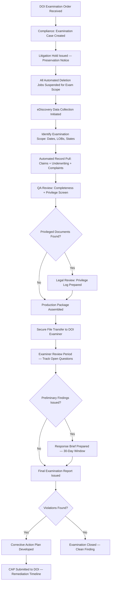
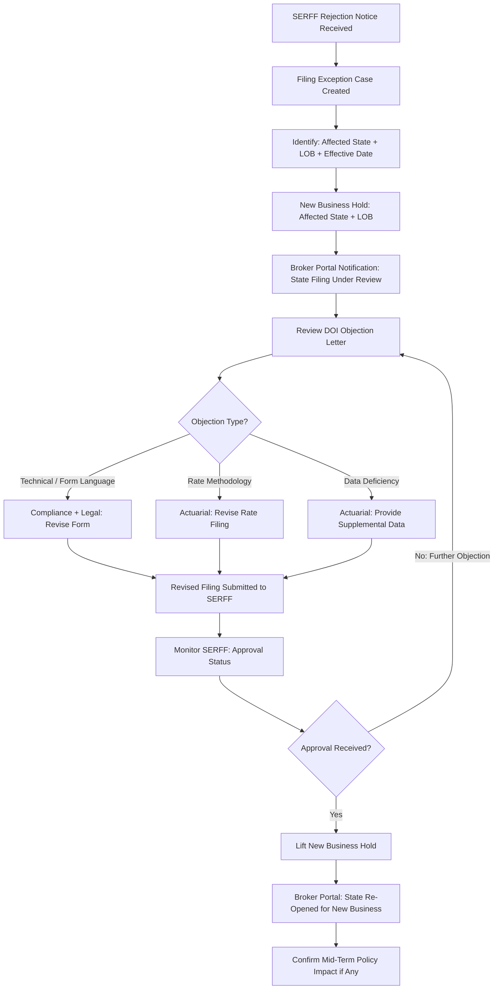
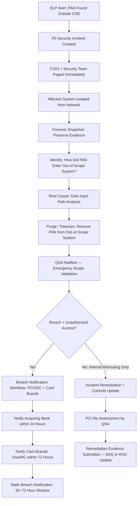
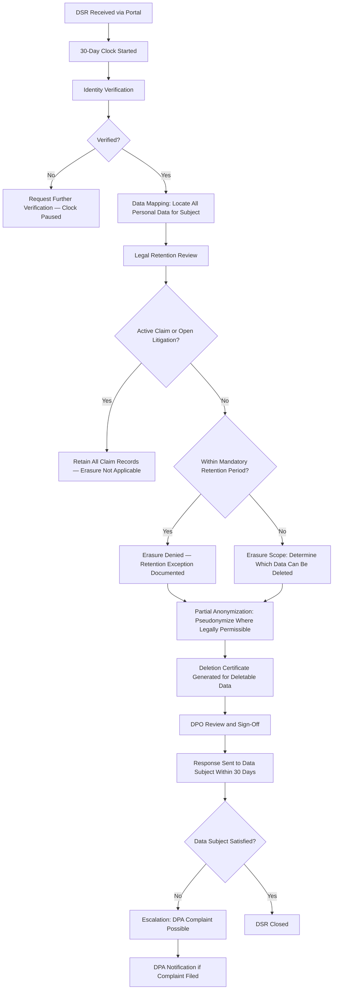
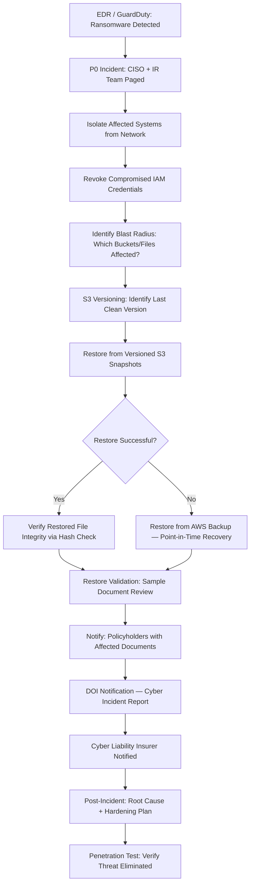

# Security & Compliance — Edge Cases

Domain: P&C Insurance SaaS | Module: Security, Privacy & Regulatory Compliance

---

## NAIC Market Conduct Examination

### Scenario
A state Department of Insurance (DOI) issues a formal Market Conduct Examination order, requiring the insurer to produce claim files, underwriting records, policy files, producer records, and complaints for a defined examination period (typically the prior 3 years). The examination may be routine or triggered by complaint ratios, financial metrics, or a whistleblower allegation. Failure to produce records promptly or completely is itself a market conduct violation.

### Detection
- **Examination order receipt**: The DOI sends a formal written examination order to the insurer's registered agent and compliance officer; the compliance module creates an examination case immediately upon receipt
- **Regulatory calendar alert**: Proactive monitoring of the DOI's examination schedule (published quarterly in most states) provides advance warning of scheduled exams
- **Complaint ratio trigger**: If the insurer's complaint ratio reported to the NAIC UCAA exceeds state benchmarks by a defined threshold, the compliance team raises an internal pre-examination readiness review

### System Response

- **Litigation hold**: An automated litigation hold notice is sent to all custodians (claims adjusters, underwriters, IT) whose records are within the examination scope; automated deletion policies for examination-scope data are suspended
- **eDiscovery collection**: The platform's eDiscovery module can export structured data (claim records, policy records, audit logs) and unstructured data (email, notes, documents) in standard production formats (TIFF, native, load file)
- **Access log audit**: All access to examination-scope records during the production period is logged; the audit log itself becomes part of the production package to demonstrate chain of custody
- **Privilege review**: Legal counsel reviews all records before production; attorney-client privileged materials are withheld and logged in a privilege log per standard eDiscovery practice

### Manual Steps
1. **Examination coordinator appointment** — A dedicated compliance officer is assigned as the single point of contact for the examination; all examiner communications are routed through this individual
2. **Examiner kickoff meeting** — The compliance team meets with the examiners to confirm scope, format requirements, and production timeline
3. **Document custodian interviews** — Key staff (claims managers, underwriting leads) may be interviewed by examiners; legal counsel prepares them for the process
4. **CAP development** — If violations are found, the compliance team works with operations to develop a corrective action plan with specific milestones and responsible owners

### Prevention
- Annual internal market conduct self-audit using the NAIC Market Conduct Annual Statement (MCAS) metrics as a benchmark
- Claims file quality review program ensuring every file has required documentation (coverage decisions, reserve justification, communication records)
- Automated archiving of all claim and policy records in searchable, exportable format to ensure eDiscovery readiness at all times

### Regulatory Notification Timeline
- Production of records: typically required within **30 days** of examination order
- Response to preliminary findings: typically **30 days** from receipt of preliminary report
- CAP submission: typically **30–60 days** from final examination report
- Violations may result in civil penalties ($500–$10,000 per violation per day in most states); willful violations may result in license suspension

---

## State Insurance Filing Rejection

### Scenario
A rate or form filing submitted to a state DOI (via SERFF — System for Electronic Rate and Form Filings) is rejected, either immediately on technical grounds or after a review period. The rejection may affect new policy forms, rating algorithms, endorsements, or revised rates. New business cannot be written on the rejected form or rate in the affected state until a corrected filing is approved.

### Detection
- **SERFF webhook**: The SERFF integration module subscribes to filing status webhooks; a rejection status event fires immediately and creates a filing exception case
- **Filing review calendar**: The compliance team monitors all pending SERFF filings against their expected review timelines; an overdue filing without disposition is escalated for status inquiry

### System Response

- **New business hold**: A state-specific, LOB-specific hold flag is set in the product configuration; agents attempting to quote or bind in the affected state receive an in-portal message explaining the delay and expected resolution timeframe
- **Broker portal notification**: Affected agents and brokers receive an automated notification explaining that the state is temporarily unavailable for new business due to a regulatory filing action; no confidential regulatory details are disclosed
- **Mid-term policy review**: If the rejected filing affects in-force policies (e.g., a form change that is required to be issued on renewal), the compliance team determines whether mid-term endorsements are required or whether the change applies only at renewal

### Manual Steps
1. **DOI liaison call** — The compliance officer contacts the DOI rate/form analyst directly to understand the specific objection and expedite the resolution timeline
2. **Actuarial revision** — If rates are rejected, actuarial develops a revised rate indication with the supporting loss cost data requested by the DOI
3. **Competitive impact assessment** — Product management assesses the competitive impact of the hold; if a high-volume state is affected, expedited filing is prioritized

### Prevention
- Pre-filing compliance review by external insurance regulatory counsel before SERFF submission to catch common objection grounds
- Maintain a library of state-specific approved form language to accelerate corrections
- Monitor DOI bulletins and legislative changes proactively to anticipate filing requirements before they become objection grounds

### Regulatory Notification Timeline
- DOI response to most filings: **30–90 days** (prior approval states) or **use and file** states may allow immediate use with a concurrent filing
- Corrective filing after rejection: best practice is to submit within **15 business days** to minimize new business hold period
- Failure to comply with a filing requirement may result in a market conduct exam referral or a cease-and-desist order for writing business on unapproved forms

---

## PCI-DSS Scope Breach

### Scenario
A security scan, penetration test, or data loss prevention (DLP) alert discovers payment card data (PANs, CVVs, or cardholder names) stored in a system component that is outside the defined PCI-DSS cardholder data environment (CDE) scope — for example, in a claim notes field, an email archive, a log file, or an unencrypted S3 bucket. This constitutes a PCI scope breach and requires immediate action under PCI-DSS requirements.

### Detection
- **DLP scanner**: An automated DLP tool (Forcepoint, Symantec, AWS Macie) scans data stores, email, and log files for patterns matching PAN (credit card number) regex; a hit outside the CDE triggers a P0 security alert
- **PCI scope audit**: Annual PCI scope review by a Qualified Security Assessor (QSA) may identify data outside the CDE boundary during their scoping exercise
- **Penetration test finding**: The annual penetration test includes checks for cardholder data outside the CDE; a finding triggers a scope breach response

### System Response

- **Immediate isolation**: The affected system is quarantined from the network within minutes of confirmation to prevent further data access or exfiltration; read-only forensic access is preserved for investigation
- **Tokenization remediation**: PANs found in out-of-scope systems are tokenized or truncated; raw PAN data is deleted from all non-CDE locations and a deletion certificate is generated
- **Card brand notification**: If unauthorized access is confirmed, the acquiring bank and card brands (Visa, Mastercard) must be notified per PCI-DSS requirements; card brand forensic investigators (PFI) may be engaged

### Manual Steps
1. **Forensic investigation** — A PCI Forensic Investigator (PFI) conducts a forensic investigation to determine whether the PANs were accessed, exfiltrated, or only misrouted due to an application bug
2. **Legal and privacy counsel engagement** — External privacy counsel assesses notification obligations under state breach notification laws and GLBA
3. **Cardholder notification** — If cardholder data is confirmed to have been accessed by unauthorized parties, affected cardholders must be notified; the card brands may mandate reissuance

### Prevention
- Strict CDE boundary enforcement: all payment card data flows through the tokenization service (Stripe, Braintree) before entering any internal system; raw PANs should never appear in application logs or notes fields
- Input validation on all free-text fields to reject PAN-pattern input
- Annual PCI-DSS assessment and quarterly vulnerability scans as required by PCI-DSS standards

### Regulatory Notification Timeline
- Acquiring bank: **within 24 hours** of confirmed breach
- Card brands (Visa/MC): **within 72 hours**
- State attorney general / DOI: **30–72 hours** depending on state breach notification law
- Affected cardholders: **as expeditiously as possible** per state law, typically within **30–45 days** of confirmation
- PCI-DSS remediation report to card brands: **within 30 days** of containment

---

## GDPR Data Subject Request

### Scenario
An EU-based policyholder (covered under GDPR or UK GDPR) submits a Subject Access Request (SAR) or a Right to Erasure ("Right to Be Forgotten") request. The insurer must respond within 30 days. However, insurance records are subject to mandatory retention requirements for regulatory purposes (typically 7+ years for claims files, 5+ years for policy files) — creating a conflict between GDPR erasure rights and legal retention obligations.

### Detection
- **DSR portal**: The platform's data subject request portal receives and timestamps the request; the 30-day GDPR response clock starts automatically
- **Identity verification**: The portal requires the requestor to verify their identity before any data is disclosed or deleted; the verification workflow is logged in the DSR case
- **Backlog monitor**: A DSR backlog dashboard tracks all open requests against their 30-day deadline; requests approaching day 25 are escalated to the DPO

### System Response

- **Data mapping**: The platform maintains a data map (Record of Processing Activities — ROPA) that identifies all locations where a policyholder's personal data is stored; the DSR workflow queries each location automatically
- **Partial anonymization**: Where full deletion is blocked by retention obligations, personal identifiers (name, address, date of birth) may be pseudonymized in historical records, replacing them with a unique reference ID, while preserving the actuarial and claims data required for regulatory purposes
- **DPO sign-off**: All erasure responses (both full and partial) require Data Protection Officer review before the response is sent to the data subject

### Manual Steps
1. **DPO legal analysis** — The DPO determines the applicable retention schedule for each category of data in the subject's record; this analysis is documented in the DSR case
2. **Backup purge coordination** — Deletion from production systems is not sufficient; the data must also be purged from backup systems (or the backup must be noted as containing data subject to retention hold)
3. **DPA communication** — If the data subject escalates to the data protection authority (e.g., ICO in the UK, a EU supervisory authority), the DPO coordinates the response with external privacy counsel

### Prevention
- Privacy-by-design architecture: minimize PII collection to only what is necessary; data that is never collected does not need to be deleted
- Automated data retention and deletion schedules tied to the ROPA ensure that data is purged automatically when retention periods expire, reducing the DSR workload
- Clear retention schedule documentation enables fast, defensible responses to erasure requests

### Regulatory Notification Timeline
- DSR response: **within 30 days** (extendable by 2 months for complex requests with notice to the data subject)
- DPA notification if a complaint is filed: the DPA sets the response timeline (typically 3 months for initial response)
- If the DSR reveals a past data breach, a separate breach notification obligation may arise under GDPR Article 33 (**72 hours** to the DPA)

---

## Ransomware on Policy Documents

### Scenario
A ransomware attack encrypts files in the document storage system (S3 buckets, on-premises NAS, or shared file shares) where policy documents, claim files, and correspondence are stored. Policy issuance, claims processing, and regulatory reporting are all disrupted. The attacker may demand payment; the insurer's cyber incident response plan is activated.

### Detection
- **Endpoint detection and response (EDR)**: The EDR platform (CrowdStrike, SentinelOne) detects anomalous file encryption activity and triggers an immediate P0 alert
- **S3 event monitoring**: CloudTrail + GuardDuty detect mass PutObject or DeleteObject API calls inconsistent with normal access patterns; an anomaly triggers isolation of the affected IAM role or EC2 instance
- **Canary files**: Known "honeypot" files are placed in document storage; any modification to these files triggers an immediate ransomware alarm before significant encryption occurs

### System Response

- **Isolation procedure**: Affected EC2 instances or ECS tasks are immediately isolated (security group rules removing all outbound access except to the IR team's investigation subnet); no shutdown occurs until forensic snapshot is taken
- **S3 versioning recovery**: S3 Object Versioning and S3 Object Lock (WORM for compliance buckets) ensure that encrypted or overwritten files can be restored to the last clean version; recovery is executed via AWS CLI by the cloud security team
- **RTO/RPO**: Target RTO for document storage restoration is 4 hours for critical claim and policy documents; RPO is less than 24 hours (based on snapshot frequency)
- **Policyholder notification**: Policyholders whose documents were encrypted and may have been exfiltrated before encryption are notified with details of what information may have been exposed

### Manual Steps
1. **IR retainer activation** — The cyber incident response retainer (Mandiant, CrowdStrike Services, etc.) is activated; the IR firm assists with forensics, containment, and evidence preservation
2. **Law enforcement notification** — FBI Cyber Division and IC3 are notified; the insurer does not pay ransom without legal counsel review and law enforcement consultation
3. **Business continuity** — Claims and underwriting teams activate manual procedures (paper-based, offline tools) while document systems are restored; a triage list of the highest-priority files for recovery is maintained

### Prevention
- S3 Object Lock (WORM compliance mode) on all regulatory document buckets prevents ransomware from overwriting or deleting files even if credentials are compromised
- Immutable S3 versioning enabled on all production document buckets; retention locks configured for the applicable regulatory retention period
- Privileged access management (PAM): document storage IAM roles follow least privilege; no single compromised credential can encrypt the entire document store
- Employee security training on phishing (primary ransomware vector) conducted quarterly with simulated phishing campaigns

### Regulatory Notification Timeline
- State DOI cyber incident notification: requirements vary; most states require notification within **3–10 days** of a material cyber incident affecting policyholder data (NAIC Insurance Data Security Model Law adopted in 24+ states)
- State attorney general breach notification (if PII exfiltrated): **30–72 hours** per state breach notification law
- NAIC Annual Statement cyber risk disclosure: must accurately reflect the incident in the annual filing
- Cyber liability insurer: notification per policy conditions, typically **within 72 hours** of discovery
