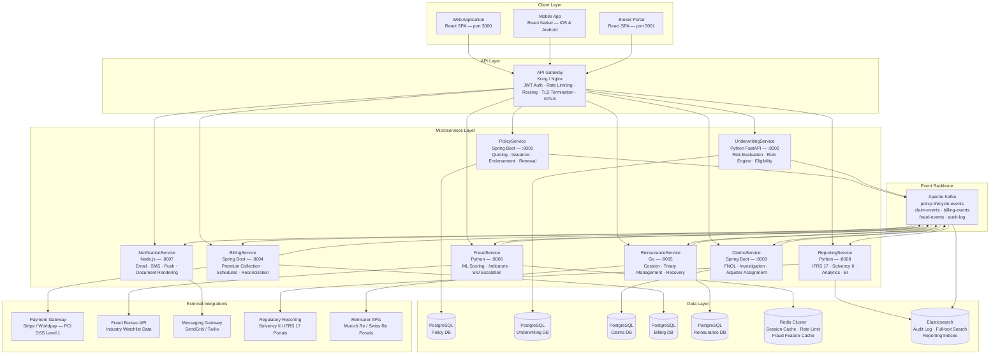

# Architecture Diagram — Insurance Management System

## Architecture Overview

The Insurance Management System is built on a **domain-driven microservices architecture** with
an **event-driven communication backbone**. Each bounded context in the insurance domain is
encapsulated in an independently deployable service with its own dedicated data store, enabling
teams to develop, deploy, and scale services autonomously without shared database coupling.

**Apache Kafka** serves as the central message broker, decoupling event producers from consumers
and providing durable, replayable event streams. This is critical for insurance workloads that
require regulatory audit trails (Solvency II, IFRS 17), eventual consistency across aggregate
boundaries, and the ability to reconstruct domain state from event history for actuarial analysis.

**API Gateway** (Kong or Nginx) provides a unified ingress surface for all client applications
and third-party integrations. It handles JWT/OAuth2 token validation, mTLS for service-to-service
calls, rate limiting to protect downstream services, request routing, and TLS termination. The
gateway eliminates the need for individual services to implement cross-cutting authentication
concerns.

Each microservice owns a dedicated **PostgreSQL** database, enforcing strict data sovereignty per
domain. This prevents the shared-schema anti-pattern that creates deployment coupling in monolithic
insurance platforms. Services communicate exclusively through well-defined async Kafka events or
synchronous REST/gRPC calls via the API Gateway for request-response interactions.

---

## System Architecture Diagram

---

## Microservice Catalogue

| Service | Responsibility | Tech Stack | Database | Key Events Published | Key Events Consumed |
|---|---|---|---|---|---|
| **PolicyService** | Manages the full policy lifecycle: quote creation, policy issuance, endorsements, riders, and renewal orchestration | Spring Boot 3, Java 21, REST + Kafka | PostgreSQL (Policy DB) | `PolicyQuoted`, `PolicyIssued`, `PolicyEndorsed`, `PolicyRenewed`, `PolicyLapsed`, `PolicyCancelled` | `PaymentCollected` (from BillingService), `ReinsuranceCessionCreated` |
| **UnderwritingService** | Executes underwriting rule evaluation, risk scoring, and eligibility determination for new business and renewals | Python 3.12, FastAPI, Drools rule engine via REST | PostgreSQL (Underwriting DB) | `UnderwritingDecisionMade`, `RuleSetUpdated` | `PolicyApplicationReceived`, `RenewalEvaluationRequested` |
| **ClaimsService** | Handles FNOL intake, coverage verification, adjuster assignment, claim investigation tracking, and settlement initiation | Spring Boot 3, Java 21, REST + Kafka | PostgreSQL (Claims DB) | `ClaimFNOLReceived`, `ClaimAssigned`, `ClaimAssessed`, `SettlementApproved`, `ClaimDeclined` | `FraudScoreReturned` (from FraudService), `PolicyCoverageVerified` |
| **BillingService** | Manages premium schedules, executes daily collection jobs, handles payment retries, lapse triggering, and reconciliation reporting | Spring Boot 3, Java 21, Quartz Scheduler | PostgreSQL (Billing DB) | `PremiumCollected`, `PaymentFailed`, `PolicyLapseTriggered`, `CollectionReportGenerated` | `PolicyIssued` (schedule creation), `PolicyRenewed` (new schedules) |
| **ReinsuranceService** | Manages reinsurance treaties, evaluates cession thresholds on settled claims, submits bordereau, and records recoveries | Go 1.22, Gin HTTP, Kafka consumer | PostgreSQL (Reinsurance DB) | `ReinsuranceCessionCreated`, `RecoveryReceived`, `BordereauSubmitted` | `SettlementApproved` (from ClaimsService), `PolicyIssued` (facultative check) |
| **FraudService** | Runs real-time ML fraud scoring on FNOL submissions, maintains the fraud indicator library, integrates with Fraud Bureau, and triggers SIU escalations | Python 3.12, FastAPI, scikit-learn / XGBoost, Redis feature cache | Redis (feature cache) + PostgreSQL (indicator store) | `FraudScoreReturned`, `SIUReferralTriggered`, `WatchlistMatchFound` | `ClaimFNOLReceived` (for async scoring), `ClaimDocumentUploaded` |
| **NotificationService** | Delivers all customer, broker, and operational notifications via email, SMS, and push channels; renders policy and claim documents from templates | Node.js 20, TypeScript, Handlebars templating, Bull queue | Redis (job queue) | `NotificationSent`, `DocumentRendered`, `DeliveryFailed` | `PolicyIssued`, `ClaimFNOLReceived`, `PremiumCollected`, `PaymentFailed`, `PolicyLapsed`, `PolicyRenewed`, `SettlementApproved` |
| **ReportingService** | Produces regulatory reports (IFRS 17, Solvency II SCR), management information dashboards, actuarial loss triangles, and broker performance analytics | Python 3.12, FastAPI, Pandas, Apache Superset integration | Elasticsearch (reporting indices) | `ReportGenerated`, `RegulatorySubmissionCompleted` | All domain events from Kafka (event log consumer) |

---

## Inter-Service Communication Patterns

### Synchronous (REST via API Gateway)
Used for request-response interactions requiring an immediate answer before the calling service
can proceed:
- `PolicyService → UnderwritingService`: underwriting evaluation during quote creation
- `PolicyService → BillingService`: renewal premium collection initiation
- `ClaimsService → PolicyService`: coverage verification during FNOL intake
- `ClaimsService → FraudService`: synchronous fraud scoring for low-value claims (< $50K)

### Asynchronous (Apache Kafka)
Used for domain event broadcasting, workflows that can tolerate eventual consistency, and
fan-out patterns where multiple consumers need the same event:
- `PolicyService` publishes `PolicyIssuedEvent` → consumed by `BillingService`
  (create premium schedules), `ReinsuranceService` (facultative check), and
  `NotificationService` (dispatch documents)
- `ClaimsService` publishes `SettlementApprovedEvent` → consumed by `ReinsuranceService`
  (evaluate cession), `NotificationService` (payment advice), and `ReportingService` (loss stats)
- All services publish to `audit-log` topic → consumed exclusively by `ReportingService`
  for Elasticsearch indexing, providing a complete tamper-evident audit trail

---

## Architecture Decision Records

### ADR-001: Microservices over Monolith
**Decision:** Decompose the IMS into bounded-context microservices.

**Rationale:** Insurance systems have distinct bounded contexts (underwriting, claims, billing,
reinsurance) with different teams, release cadences, scaling profiles, and technology
requirements. The `UnderwritingService` requires Python for ML model integration; the
`ReinsuranceService` is write-optimised with a Go-based high-throughput event consumer;
`PolicyService` and `ClaimsService` benefit from the Spring ecosystem for transaction management.
A monolith would prevent technology heterogeneity and create deployment coupling across teams
with different SLAs.

**Trade-off:** Increased operational complexity; mitigated by Kubernetes-based deployment,
centralised logging (Elasticsearch), and distributed tracing (OpenTelemetry + Jaeger).

---

### ADR-002: Event-Driven Architecture with Apache Kafka
**Decision:** Use Apache Kafka as the central event backbone for cross-service communication.

**Rationale:** Insurance workflows are naturally event-driven (policy issued → billing schedules
created; claim settled → reinsurance recovery initiated). Kafka provides durable, replayable
event logs that satisfy audit requirements under IFRS 17 (which mandates a complete history of
contract measurements) and Solvency II (which requires reproducible capital calculations).
Kafka's consumer group model allows the `ReportingService` to maintain an independent read
model without impacting transactional services.

**Trade-off:** Eventual consistency between services requires careful handling of
at-least-once delivery and idempotent consumers; all Kafka consumers implement idempotency
keys and deduplication logic.

---

### ADR-003: Database per Service (PostgreSQL)
**Decision:** Each microservice owns a dedicated PostgreSQL instance; no cross-service schema
sharing is permitted.

**Rationale:** Shared databases create implicit coupling that defeats the purpose of service
decomposition—a schema change in one service can break another service at runtime without a
deployment change. Dedicated PostgreSQL instances allow each service to optimise its schema
for its own query patterns (e.g., `ClaimsService` uses JSONB for flexible ClaimDocument
metadata; `BillingService` uses partitioned tables on `dueDate` for efficient daily collection
queries).

**Trade-off:** Cross-service queries require data replication via events or API calls rather than
SQL joins. Reporting aggregations are materialised in Elasticsearch by the `ReportingService`,
which consumes all domain events and maintains denormalised reporting views.

---

### ADR-004: Redis for FraudService Feature Cache
**Decision:** `FraudService` uses Redis for its ML feature cache rather than PostgreSQL.

**Rationale:** Fraud scoring must complete within 300ms for synchronous FNOL processing.
Redis provides sub-millisecond read latency for feature vectors (recent claim counts, average
claim amounts, behavioural scores) that the ML model requires at inference time. PostgreSQL
query times for complex analytical aggregations across claims history would exceed the SLA.
Feature vectors are pre-computed and refreshed by a background pipeline that consumes
`claim-events` from Kafka.

---

*Document version: 1.0 | Domain: Insurance Management System | Classification: Internal Architecture Reference*
