# C4 Architecture Diagrams — Insurance Management System

## Overview

This document presents the C4 Model diagrams for the Insurance Management System (IMS) at the
Context and Container levels. The C4 Model (Context, Containers, Components, Code) provides a
hierarchical set of architecture diagrams that communicate at different levels of abstraction to
different audiences—from business stakeholders to platform engineers.

- **Level 1 — System Context**: Shows the IMS as a single box in relation to its users and
  external systems. Audience: business stakeholders, architects, compliance officers.
- **Level 2 — Container**: Zooms into the IMS boundary to show the deployable units (applications,
  services, databases, message brokers) and how they communicate. Audience: engineering teams,
  DevOps, security reviewers.

Diagrams use Mermaid `graph TD` syntax with colour-coded styling conventions:
- **Blue boxes** — Internal containers within the IMS boundary
- **Grey boxes** — External systems and actors outside the IMS boundary
- **Green boxes** — Data stores
- **Orange boxes** — Message infrastructure

---

## Diagram 1: C4 Level 1 — System Context Diagram

The Context Diagram presents the Insurance Management System as a single bounded system and shows
all the people (users) and external software systems that interact with it. It answers the
question: *"What is this system, who uses it, and what does it integrate with?"*

```mermaid
graph TD
    classDef person fill:#08427b,color:#fff,stroke:#052e56
    classDef system fill:#1168bd,color:#fff,stroke:#0b4884
    classDef external fill:#6b6b6b,color:#fff,stroke:#4a4a4a
    classDef extsystem fill:#999999,color:#fff,stroke:#6b6b6b

    Customer["👤 Customer / Policyholder\n─────────────────────\nIndividual or business that\npurchases insurance policies,\nmakes premium payments,\nand files claims"]:::person

    Broker["👔 Broker / Agent\n─────────────────────\nLicensed intermediary that\nsells policies, manages client\nportfolios, and earns commission\non premiums written"]:::person

    Underwriter["🔍 Underwriter\n─────────────────────\nInsurance professional that\nreviews referred applications\nand makes manual risk\neligibility decisions"]:::person

    ClaimsAdjuster["📋 Claims Adjuster\n─────────────────────\nLicensed professional that\ninvestigates claims, assesses\nloss quantum, and recommends\nsettlement amounts"]:::person

    SystemAdmin["⚙ System Administrator\n─────────────────────\nConfigures underwriting rules,\nproduct catalogue, commission\nstructures, and rate tables"]:::person

    IMS["⚡ Insurance Management System\n──────────────────────────────────────────\nCore platform managing the full insurance\nvalue chain: product configuration,\nquoting, policy issuance, endorsements,\nrenewal, premium billing, claims FNOL,\nadjustment, settlement, reinsurance\ncession, fraud detection, and regulatory\nreporting (IFRS 17, Solvency II)"]:::system

    PaymentGateway["💳 Payment Gateway\n─────────────────────\nPCI-DSS Level 1 provider\nStripe / Worldpay\nCard and bank payment\nprocessing"]:::extsystem

    FraudBureau["🔍 Fraud Bureau\n─────────────────────\nIndustry fraud intelligence\nplatform providing watchlist\ndata and cross-carrier\nfraud signals"]:::extsystem

    RegulatoryPortal["🏛 Regulatory Portal\n─────────────────────\nGovernment / regulatory\nbody portals for Solvency II\nQRT submission and IFRS 17\ndisclosure filing"]:::extsystem

    ReinsurerAPIs["🔄 Reinsurer APIs\n─────────────────────\nExternal reinsurer systems\n(Munich Re, Swiss Re) for\ntreaty management and\nbordereau submission"]:::extsystem

    MessagingGateway["📧 Messaging Gateway\n─────────────────────\nEmail and SMS delivery\ninfrastructure (SendGrid /\nTwilio) for customer and\nbroker communications"]:::extsystem

    Customer -->|"Submits applications, pays premiums,\nfiles FNOL, reviews claim status"| IMS
    IMS -->|"Policy documents, receipts,\nclaim updates, renewal notices"| Customer

    Broker -->|"Submits client applications,\nrequests endorsements,\nreviews commission statements"| IMS
    IMS -->|"Policy confirmations, renewal packs,\ncommission statements, analytics"| Broker

    Underwriter -->|"Reviews referred applications,\nupdates underwriting rules\nand risk factor weights"| IMS
    IMS -->|"Referral queue, applicant risk profiles,\nrule evaluation results"| Underwriter

    ClaimsAdjuster -->|"Submits investigation reports,\nrecords adjustment findings,\nrecommends settlement amounts"| IMS
    IMS -->|"Claim assignments, loss details,\npolicy coverage information"| ClaimsAdjuster

    SystemAdmin -->|"Configures products, rates,\nrules, user access, integrations"| IMS

    IMS -->|"Payment charge and refund requests"| PaymentGateway
    PaymentGateway -->|"Authorization results,\npayment confirmations"| IMS

    IMS -->|"Fraud scoring requests, claimant data"| FraudBureau
    FraudBureau -->|"Fraud scores, watchlist matches,\nindustry alert data"| IMS

    IMS -->|"Solvency II QRTs, IFRS 17 disclosures,\nAML reports"| RegulatoryPortal

    IMS -->|"Cession schedules, bordereau data,\nclaim recovery requests"| ReinsurerAPIs
    ReinsurerAPIs -->|"Treaty confirmations,\nrecovery payments"| IMS

    IMS -->|"Email, SMS, push notification\nrequests with rendered content"| MessagingGateway
    MessagingGateway -->|"Delivery status, bounce reports"| IMS
```

**Key context boundaries:**
- Everything inside the IMS boundary is owned and operated by the insurer's engineering teams.
- The Payment Gateway, Fraud Bureau, Regulatory Portal, Reinsurer APIs, and Messaging Gateway
  are third-party systems with contractual SLAs; the IMS integrates via published REST APIs.
- Brokers and Agents access the system through a dedicated Broker Portal (see Container diagram).
- All external data exchanges are encrypted in transit (TLS 1.3) and subject to data processing
  agreements per GDPR and local data protection legislation.

---

## Diagram 2: C4 Level 2 — Container Diagram

The Container Diagram zooms into the IMS system boundary and shows the individual deployable units
(applications, microservices, databases, and message infrastructure). It answers: *"What are the
high-level technology choices, and how do the containers communicate?"*

```mermaid
graph TD
    classDef webapp fill:#1168bd,color:#fff,stroke:#0b4884
    classDef service fill:#1168bd,color:#fff,stroke:#0b4884
    classDef db fill:#2e7d32,color:#fff,stroke:#1b5e20
    classDef queue fill:#e65100,color:#fff,stroke:#bf360c
    classDef external fill:#6b6b6b,color:#fff,stroke:#4a4a4a
    classDef gateway fill:#4a148c,color:#fff,stroke:#2d0060

    subgraph Clients["Client Applications"]
        WebApp["🌐 Web Application\n──────────────────\nReact SPA\nPort 3000\nCustomer self-service:\nquoting, policy mgmt,\nclaim filing, payments"]:::webapp
        MobileApp["📱 Mobile App\n──────────────────\nReact Native\niOS & Android\nPolicy wallet, FNOL\nsubmission with photo\ncapture, claim tracking"]:::webapp
        BrokerPortal["🏢 Broker Portal\n──────────────────\nReact SPA\nPort 3001\nClient portfolio mgmt,\nbulk submissions,\ncommission reporting"]:::webapp
    end

    subgraph API["API Layer"]
        APIGateway["🔀 API Gateway\n──────────────────\nKong / Nginx\nJWT & OAuth2 auth\nRate limiting\nRequest routing\nTLS termination\nmTLS for services"]:::gateway
    end

    subgraph Services["Microservices"]
        PolicySvc["📄 PolicyService\n──────────────────\nSpring Boot 3 / Java 21\nPort 8001\nQuoting, issuance,\nendorsements, riders,\nrenewal orchestration"]:::service
        UnderwritingSvc["📊 UnderwritingService\n──────────────────\nPython FastAPI\nPort 8002\nRule engine, risk scoring,\neligibility decisions,\nRiskFactor evaluation"]:::service
        ClaimsSvc["📋 ClaimsService\n──────────────────\nSpring Boot 3 / Java 21\nPort 8003\nFNOL intake, coverage\nverification, adjuster\nassignment, settlement"]:::service
        BillingSvc["💰 BillingService\n──────────────────\nSpring Boot 3 / Java 21\nPort 8004\nPremium scheduling,\ndaily collection jobs,\nretry logic, lapse mgmt"]:::service
        ReinsuranceSvc["🔄 ReinsuranceService\n──────────────────\nGo 1.22 / Gin\nPort 8005\nTreaty management,\ncession evaluation,\nbordereau submission"]:::service
        FraudSvc["🔍 FraudService\n──────────────────\nPython FastAPI\nPort 8006\nML fraud scoring,\nXGBoost classifier,\nwatchlist integration"]:::service
        NotificationSvc["🔔 NotificationService\n──────────────────\nNode.js 20 / TypeScript\nPort 8007\nEmail, SMS, push,\ndocument rendering,\nHandlebars templates"]:::service
        ReportingSvc["📈 ReportingService\n──────────────────\nPython FastAPI\nPort 8008\nIFRS 17 reports,\nSolvency II QRTs,\nBI and analytics"]:::service
    end

    subgraph Messaging["Event Infrastructure"]
        Kafka["⚡ Apache Kafka\n──────────────────\nMessage Broker\nTopics:\npolicy-lifecycle-events\nclaim-events\nbilling-events\nfraud-events\naudit-log"]:::queue
    end

    subgraph Databases["Data Stores"]
        PolicyDB[("🗄 Policy DB\nPostgreSQL 16\nPolicies, Quotes,\nEndorsements, Riders\nPremium Schedules")]:::db
        UnderwritingDB[("🗄 Underwriting DB\nPostgreSQL 16\nUnderwriting Rules\nRisk Factors\nDecision Log")]:::db
        ClaimsDB[("🗄 Claims DB\nPostgreSQL 16\nClaims, ClaimLines\nDocuments, LossEvents\nAdjustments, Settlements")]:::db
        BillingDB[("🗄 Billing DB\nPostgreSQL 16\nPremium Schedules\nPayment Records\nCollection Reports")]:::db
        ReinsuranceDB[("🗄 Reinsurance DB\nPostgreSQL 16\nTreaties, Cessions\nRecoveries\nBordereau Records")]:::db
        RedisCluster[("⚡ Redis Cluster\nCache Store\nSession tokens\nRate limit counters\nFraud feature vectors")]:::db
        ElasticSearch[("🔎 Elasticsearch\nAudit & Search\nAudit log indices\nFull-text claim search\nReporting aggregations")]:::db
    end

    subgraph External["External Systems"]
        PayGW["💳 Payment Gateway\nStripe / Worldpay"]:::external
        FraudAPI["🔍 Fraud Bureau API\nWatchlist Service"]:::external
        MsgGW["📧 Messaging Gateway\nSendGrid / Twilio"]:::external
        RegPortal["🏛 Regulatory Portal\nSolvency II / IFRS 17"]:::external
        ReinAPI["🔄 Reinsurer APIs\nMunich Re / Swiss Re"]:::external
    end

    %% Client to Gateway
    WebApp & MobileApp & BrokerPortal --> APIGateway

    %% Gateway to Services
    APIGateway --> PolicySvc & UnderwritingSvc & ClaimsSvc & BillingSvc
    APIGateway --> ReinsuranceSvc & FraudSvc & NotificationSvc & ReportingSvc

    %% Services to Kafka (publish)
    PolicySvc --> Kafka
    UnderwritingSvc --> Kafka
    ClaimsSvc --> Kafka
    BillingSvc --> Kafka
    ReinsuranceSvc --> Kafka
    FraudSvc --> Kafka

    %% Kafka to Services (consume)
    Kafka --> NotificationSvc
    Kafka --> ReportingSvc
    Kafka --> BillingSvc
    Kafka --> ReinsuranceSvc
    Kafka --> FraudSvc
    Kafka --> ClaimsSvc
    Kafka --> ElasticSearch

    %% Services to Databases
    PolicySvc --> PolicyDB
    UnderwritingSvc --> UnderwritingDB
    ClaimsSvc --> ClaimsDB
    BillingSvc --> BillingDB
    ReinsuranceSvc --> ReinsuranceDB
    FraudSvc --> RedisCluster
    NotificationSvc --> RedisCluster
    ReportingSvc --> ElasticSearch
    APIGateway --> RedisCluster

    %% External integrations
    BillingSvc --> PayGW
    FraudSvc --> FraudAPI
    NotificationSvc --> MsgGW
    ReportingSvc --> RegPortal
    ReinsuranceSvc --> ReinAPI
```

---

## Container Descriptions

### Web Application (React SPA — Port 3000)
The customer-facing single-page application providing self-service capabilities for individual
and SME policyholders. Key features include: insurance product browsing and quote initiation,
policy application submission, policy document access and download, premium payment management,
FNOL claim submission with photo and document upload, real-time claim status tracking, renewal
acceptance, and account profile management. Communicates exclusively with the API Gateway via
HTTPS. Authentication is handled via JWT tokens issued by the OAuth2 authorization server
fronted by the API Gateway.

---

### Mobile App (React Native — iOS & Android)
The native mobile application targeting personal lines customers. Optimised for on-the-go
interactions: FNOL submission with device camera integration for loss photography, policy wallet
storing active policy documents offline, premium payment via Apple Pay / Google Pay, claim status
push notifications, and virtual insurance card display. Uses the same REST API surface as the
Web Application. Supports biometric authentication (Face ID / fingerprint) backed by device
keystore with JWT tokens for API authorisation.

---

### Broker Portal (React SPA — Port 3001)
A dedicated portal for licensed brokers and their agents to manage their client portfolios.
Provides: bulk policy submission for commercial accounts, renewal pipeline management and bulk
approval workflows, commission statement access and reconciliation, client FNOL submission on
behalf of policyholders, performance analytics dashboards, and rate comparison tools across
available products. Brokers authenticate via separate OAuth2 client credentials with role-based
access control enforced at the API Gateway.

---

### API Gateway (Kong / Nginx)
The single unified ingress point for all inbound traffic to the IMS. Responsibilities:
JWT and OAuth2 token validation (delegating to an identity provider), mTLS enforcement for
service-to-service calls, rate limiting (per client ID and per route), request routing to the
appropriate downstream microservice, TLS termination, request/response logging to the audit
pipeline, and CORS enforcement. The gateway also handles API versioning (URL path versioning:
`/api/v1/`, `/api/v2/`) to enable non-breaking upgrades.

---

### PolicyService (Spring Boot 3 / Java 21 — Port 8001)
The core domain service responsible for the policy lifecycle. Manages Quote entities through
their full status workflow (`PENDING → QUOTED → ACCEPTED → EXPIRED`), orchestrates policy
issuance by coordinating with UnderwritingService and PricingEngine (embedded), manages
PolicyEndorsement and PolicyRider records, and orchestrates the renewal workflow. Persists all
data to the dedicated Policy DB. Publishes `PolicyIssued`, `PolicyRenewed`, `PolicyLapsed`, and
`PolicyCancelled` events to Kafka. Exposes REST APIs consumed by the API Gateway and other services.

---

### UnderwritingService (Python FastAPI — Port 8002)
Encapsulates all underwriting logic, isolating it from the policy management concerns. Maintains
the UnderwritingRule library and RiskFactor definitions. Exposes a `/evaluate` endpoint accepting
applicant profiles and returning eligibility decisions with risk scores, loadings, and exclusions.
Uses a Drools-compatible rule expression format stored in the Underwriting DB, allowing rule
updates without code deployment. Publishes `UnderwritingDecisionMade` events for audit. Python
was chosen for native ML library integration to support future actuarial model embedding.

---

### ClaimsService (Spring Boot 3 / Java 21 — Port 8003)
Manages the complete claims lifecycle from FNOL receipt to settlement. Handles FNOL intake and
validation, delegates coverage verification to PolicyService, receives fraud scores from
FraudService, orchestrates adjuster assignment via the embedded assignment algorithm, manages
ClaimLine and ClaimDocument records, drives claim status transitions, and initiates settlement
records. Integrates with an object storage service (AWS S3 / GCS) for ClaimDocument storage.
Publishes `ClaimFNOLReceived`, `ClaimAssigned`, `SettlementApproved` events to Kafka.

---

### BillingService (Spring Boot 3 / Java 21 — Port 8004)
Manages all premium billing operations. Generates PremiumSchedule records on `PolicyIssued`
events. Runs the daily collection job (Quartz Scheduler at 06:00 UTC) processing due
PremiumSchedule records against the Payment Gateway. Implements configurable retry logic with
exponential back-off and grace period management. Triggers `PolicyLapseTriggered` events on
retry exhaustion. Maintains daily collection reconciliation reports. Provides the reinstatement
payment collection endpoint for lapsed policies recovering outstanding balances.

---

### ReinsuranceService (Go 1.22 / Gin — Port 8005)
Manages the insurer's reinsurance programme, including Quota Share, Surplus, Excess of Loss,
and Stop Loss treaty configurations. Consumes `SettlementApproved` events and evaluates each
settlement against applicable treaty cession thresholds. Submits cession data to external
reinsurer APIs (Munich Re, Swiss Re portals) in ACORD XML and JSON bordereau formats. Records
recovery receipts and notifies the ClaimsService. Go was selected for its high throughput in
event-driven processing of bordereau batches and its low-latency treaty evaluation logic.

---

### FraudService (Python FastAPI — Port 8006)
Provides real-time and near-real-time fraud risk scoring for claims. Exposes a synchronous
`/fraud/score` endpoint returning a composite fraud score (0.0–1.0) and a list of flagged
FraudIndicators within 300ms for FNOL processing. The scoring engine uses an XGBoost gradient
boosted classifier trained on historical claims data with 47 input features. Feature vectors are
pre-computed from recent claim history and cached in Redis for sub-millisecond lookup. Integrates
with the external Fraud Bureau API for watchlist checks. Triggers `SIUReferralTriggered` events
for scores above the configurable threshold (default: 0.75).

---

### NotificationService (Node.js 20 / TypeScript — Port 8007)
Handles all outbound communications to customers, brokers, adjusters, and internal operations
teams. Consumes domain events from Kafka and renders email, SMS, and push notification content
using Handlebars templates. Manages a Bull queue (backed by Redis) for reliable, retry-capable
message delivery. Integrates with SendGrid for transactional email and Twilio for SMS. Supports
PDF document rendering (policy schedules, claim acknowledgments, settlement advice) using
Puppeteer. Tracks delivery status and surfaces bounce/failure metrics to the ReportingService.

---

### ReportingService (Python FastAPI — Port 8008)
Produces all regulatory, management, and actuarial reports. Consumes the `audit-log` Kafka topic
to maintain a comprehensive, queryable event log in Elasticsearch. Generates Solvency II
Quantitative Reporting Templates (QRTs), IFRS 17 insurance contract measurement reports, loss
development triangles for actuarial reserve adequacy assessment, broker performance scorecards,
and executive dashboard data. Submits regulatory reports to government portals via scheduled
batch submission. Provides API endpoints for Apache Superset BI integration for interactive
analytics.

---

### Apache Kafka (Message Broker)
The central event backbone providing durable, replayable publish-subscribe messaging. Key topics:
`policy-lifecycle-events` (all policy state transitions), `claim-events` (FNOL through
settlement), `billing-events` (payment collection outcomes), `fraud-events` (scoring results
and SIU escalations), `audit-log` (all system events for compliance). Kafka's consumer group
model allows each consuming service to maintain its own independent offset, enabling the
ReportingService to rebuild its Elasticsearch indices by replaying the full event history.

---

### Redis Cluster (Cache Store)
Shared in-memory data store serving multiple roles: API Gateway rate limit counters (per-client
request count windows), session token cache (JWT revocation list for immediate logout), FraudService
feature vector cache (pre-computed claim history features for ML inference), and NotificationService
Bull job queue (reliable async notification delivery with retry). Redis Cluster mode provides
horizontal scaling and automatic failover with no single point of failure.

---

### PostgreSQL (Per-Service Databases)
Each transactional microservice owns a dedicated PostgreSQL 16 instance, enforcing data
sovereignty per bounded context. Key design decisions: `ClaimsDB` uses JSONB columns for flexible
ClaimDocument metadata; `BillingDB` uses table partitioning on `dueDate` for the PremiumSchedule
table to support efficient daily collection queries; `PolicyDB` implements optimistic locking on
the Policy aggregate to prevent concurrent endorsement conflicts; all databases have logical
replication enabled for point-in-time recovery and read replica support.

---

### Elasticsearch (Audit Log & Search)
Centralised search and analytics store receiving all domain events via the `audit-log` Kafka
topic. Serves three primary functions: immutable audit trail for regulatory examination
(Solvency II Article 44 requires a complete audit log of all underwriting and claims decisions);
full-text search across claims notes, adjuster reports, and policy endorsement descriptions;
and pre-aggregated reporting indices consumed by the ReportingService for IFRS 17 measurement
calculations and BI dashboards.

---

*Document version: 1.0 | Domain: Insurance Management System | Classification: Internal Architecture Reference*
