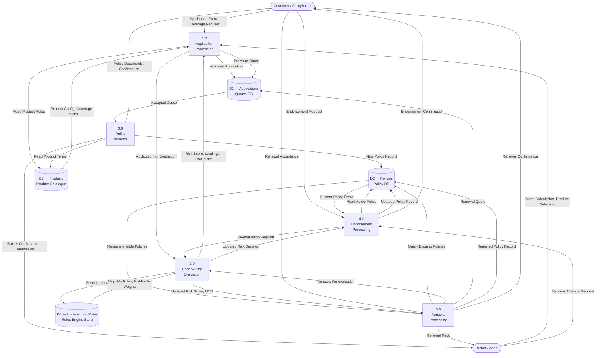
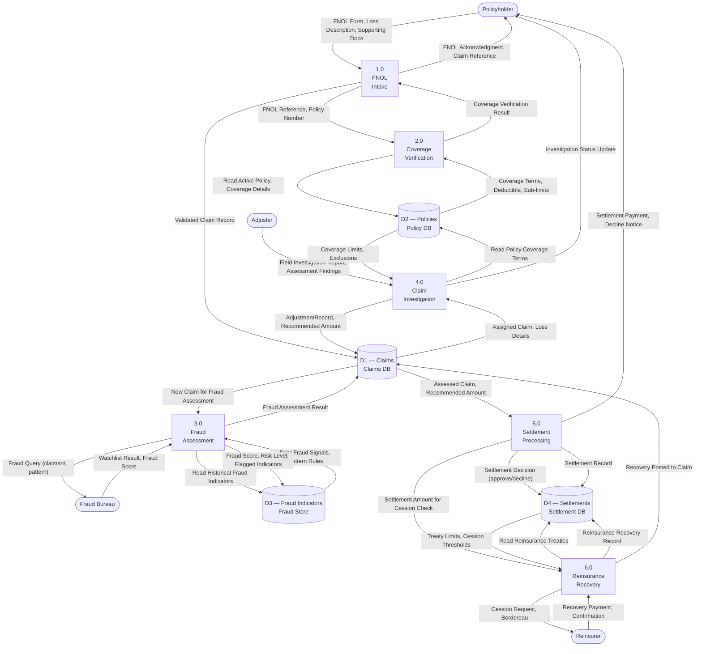

# Data Flow Diagrams — Insurance Management System

## Overview

This document presents the Data Flow Diagrams (DFDs) for the Insurance Management System (IMS)
at two levels of abstraction. The Level 0 Context Diagram shows the system as a single process
in relation to all external actors and data exchanges. The Level 1 diagrams decompose the two
primary operational domains—Policy Lifecycle and Claims Processing—into constituent processes,
data stores, and the data flows that connect them.

DFDs follow Yourdon-DeMarco notation conventions adapted for Mermaid flowchart rendering:
- **Rounded rectangles** — External entities (actors outside the system boundary)
- **Rectangles** — Internal processes
- **Cylinders** — Data stores
- **Arrows with labels** — Named data flows

---

## DFD Level 0 — System Context Diagram

The context diagram presents the Insurance Management System as a single bounded process.
All external entities that interact with the system are shown at the boundary, with labeled
data flows indicating what information moves in each direction. This diagram establishes the
system boundary and the full set of external dependencies at the highest level of abstraction.

```mermaid
flowchart TD
    Customer(["👤 Customer / Policyholder"])
    Broker(["🏢 Broker / Agent"])
    Regulator(["🏛 Regulatory Authority"])
    PayNet(["💳 Payment Network"])
    Reinsurer(["🔄 Reinsurer"])
    FraudBureau(["🔍 Fraud Bureau"])

    IMS["⚡ Insurance Management System"]

    Customer -->|"Application Data, Coverage Requirements"| IMS
    Customer -->|"Premium Payments, Payment Method"| IMS
    Customer -->|"FNOL Submission, Claim Evidence"| IMS
    Customer -->|"Renewal Acceptance / Declination"| IMS
    IMS -->|"Policy Documents, Certificate of Insurance"| Customer
    IMS -->|"Payment Receipts, Premium Notices"| Customer
    IMS -->|"Claim Status Updates, Settlement Payments"| Customer
    IMS -->|"Renewal Quotes, Lapse Notifications"| Customer

    Broker -->|"Policy Submissions, Client Applications"| IMS
    Broker -->|"Endorsement Requests, Mid-term Changes"| IMS
    Broker -->|"Claims Referrals, FNOL on behalf of Client"| IMS
    IMS -->|"Commission Statements, Brokerage Reports"| Broker
    IMS -->|"Policy Confirmations, Quote Responses"| Broker
    IMS -->|"Renewal Packs, Non-renewal Notices"| Broker

    IMS -->|"Solvency II Capital Returns"| Regulator
    IMS -->|"IFRS 17 Insurance Contract Disclosures"| Regulator
    IMS -->|"Claims Statistics, Loss Ratios"| Regulator
    IMS -->|"Anti-Money Laundering Reports"| Regulator
    Regulator -->|"Regulatory Guidance, Rate Approvals"| IMS

    IMS -->|"Payment Charge Requests, Refund Instructions"| PayNet
    PayNet -->|"Payment Authorizations, Settlement Confirmations"| IMS
    PayNet -->|"Decline Codes, Failure Notifications"| IMS

    IMS -->|"Cession Schedules, Bordereau Data"| Reinsurer
    IMS -->|"Claim Recovery Requests"| Reinsurer
    Reinsurer -->|"Treaty Confirmations, Acceptance Notices"| IMS
    Reinsurer -->|"Recovery Payments, Settlement Advice"| IMS

    IMS -->|"Fraud Query Requests, Claimant Details"| FraudBureau
    FraudBureau -->|"Fraud Scores, Watchlist Matches"| IMS
    FraudBureau -->|"Industry Fraud Alert Data"| IMS
```

**Notes:**
- The Payment Network interaction is always outbound for charge/refund requests and inbound for
  authorization responses; raw card data never enters the IMS (vault tokenization is handled at
  the gateway boundary).
- Regulatory reporting flows are scheduled (monthly, quarterly, annual) and driven by the
  `ReportingService` consuming the audit event stream from Elasticsearch.
- The Fraud Bureau integration is bidirectional: the IMS submits suspected fraud cases and
  receives industry-wide watchlist data in return to enrich the `FraudService` model feature store.

---

## DFD Level 1 — Policy Lifecycle

This Level 1 diagram decomposes the Policy Lifecycle domain into its constituent processes.
It shows how application data flows from external submission through underwriting and issuance,
and how the policy record evolves through endorsement and renewal. Data stores represent the
persistent repositories maintained by the relevant microservices.

**Data Store Descriptions:**
| Store | Owner Service | Key Contents |
|---|---|---|
| D1 — Applications / Quotes DB | PolicyService | Quote records, underwriting inputs, pricing outputs, acceptance status |
| D2 — Policies DB | PolicyService | Policy entities, endorsements, riders, premium schedules, status history |
| D3 — Products DB | PolicyService | Product definitions, ProductCoverage configs, pricing rate tables |
| D4 — Underwriting Rules Store | UnderwritingService | UnderwritingRule expressions, RiskFactor definitions, rule priority order |

**Notes:**
- Process 2.0 (Underwriting Evaluation) is shared across Application Processing, Endorsement
  Processing, and Renewal Processing, reflecting its role as a reusable domain service.
- The Products Catalogue (D3) is owned by the `PolicyService` and is read-only for all other
  services; changes to products require a product versioning workflow with effectivity dates.
- Policy status transitions are event-sourced: every status change generates an immutable event
  appended to the `policy-lifecycle-events` Kafka topic, ensuring a complete audit trail.

---

## DFD Level 1 — Claims Processing

This Level 1 diagram decomposes the Claims Processing domain into its core processes. It shows
how FNOL data flows from initial submission through coverage verification, fraud assessment, field
investigation, settlement, and reinsurance recovery. Data stores represent the persistent
repositories maintained by the ClaimsService, PolicyService, and ReinsuranceService.

**Data Store Descriptions:**
| Store | Owner Service | Key Contents |
|---|---|---|
| D1 — Claims DB | ClaimsService | Claim, ClaimLine, ClaimDocument, LossEvent, AdjustmentRecord entities |
| D2 — Policies DB | PolicyService | Policy terms, coverage details, endorsements (read-only to ClaimsService) |
| D3 — Fraud Indicators Store | FraudService | FraudIndicator records, fraud scoring model feature store, watchlist cache (Redis) |
| D4 — Settlements DB | ClaimsService / ReinsuranceService | Settlement records, reinsurance cession records, treaty reference data |

**Notes:**
- Process 3.0 (Fraud Assessment) runs asynchronously for high-value claims using an enriched
  ML pipeline; results are written back to the Claim record when available, potentially triggering
  a status escalation to `SIU_REFERRAL` if the score exceeds the configured threshold.
- Coverage Verification (Process 2.0) is a synchronous call to the `PolicyService`; the claims
  flow does not proceed until coverage is confirmed to prevent reserve creation on uncovered losses.
- Reinsurance Recovery (Process 6.0) is initiated automatically by the `ReinsuranceService`
  consuming `SettlementCompletedEvents` from Kafka and checking each settlement against applicable
  treaty cession thresholds without manual intervention.
- All process outputs are appended to the Elasticsearch audit index via the `claim-events` Kafka
  topic, providing a complete, tamper-evident history for regulatory examination.

---

*Document version: 1.0 | Domain: Insurance Management System | Classification: Internal Architecture Reference*
