# Domain Model — Insurance Management System

## Overview

The domain model captures the core entities, their attributes, and their relationships across the
Insurance Management System (IMS). The model spans the complete insurance value chain: product
configuration, broker/agent distribution, policy lifecycle (quoting, issuance, endorsement,
renewal), premium billing, claims management, underwriting, reinsurance, and fraud detection.

This model is technology-agnostic and serves as the canonical reference for all service data
contracts, database schema design, and API payload specifications. It is aligned with industry
standards including the ACORD Insurance Data Standards and IFRS 17 measurement model concepts.

---

## Class Diagram

```mermaid
classDiagram
    class Insurer {
        +String insurerId
        +String legalName
        +String licenseNumber
        +String jurisdiction
        +String solvencyRating
        +InsurerStatus status
    }

    class Broker {
        +String brokerId
        +String brokerName
        +String licenseNumber
        +String brokerType
        +String contactEmail
        +BrokerStatus status
    }

    class Agent {
        +String agentId
        +String firstName
        +String lastName
        +String licenseNumber
        +String specialization
        +AgentStatus status
    }

    class PolicyHolder {
        +String holderId
        +String firstName
        +String lastName
        +String nationalId
        +Date dateOfBirth
        +String contactEmail
    }

    class Beneficiary {
        +String beneficiaryId
        +String fullName
        +Decimal sharePercentage
        +String relationship
        +String contactPhone
        +BeneficiaryType type
    }

    class Product {
        +String productId
        +String productName
        +ProductLine lineOfBusiness
        +String productCode
        +Decimal minCoverageAmount
        +Decimal maxCoverageAmount
    }

    class ProductCoverage {
        +String coverageId
        +String coverageName
        +CoverageType coverageType
        +Decimal defaultLimit
        +Decimal defaultDeductible
        +Boolean mandatory
    }

    class Quote {
        +String quoteId
        +String quoteNumber
        +QuoteStatus status
        +Decimal totalPremium
        +Date validUntil
        +Date submittedAt
    }

    class Policy {
        +String policyId
        +String policyNumber
        +PolicyStatus status
        +Date effectiveDate
        +Date expiryDate
        +Decimal coverageAmount
    }

    class PolicyEndorsement {
        +String endorsementId
        +String endorsementNumber
        +EndorsementType type
        +String description
        +Decimal premiumAdjustment
        +Date effectiveDate
    }

    class PolicyRider {
        +String riderId
        +String riderCode
        +String riderName
        +Decimal additionalPremium
        +Date attachedDate
        +RiderStatus status
    }

    class Premium {
        +String premiumId
        +Decimal grossPremium
        +Decimal tax
        +Decimal netPremium
        +PremiumFrequency frequency
        +Date calculatedAt
    }

    class PremiumSchedule {
        +String scheduleId
        +Date dueDate
        +Decimal amountDue
        +PremiumScheduleStatus status
        +Integer retryCount
        +Date lastRetryAt
    }

    class PaymentRecord {
        +String paymentId
        +Decimal amountPaid
        +PaymentMethod method
        +PaymentStatus status
        +String transactionReference
        +Date paidAt
    }

    class Claim {
        +String claimId
        +String claimNumber
        +ClaimStatus status
        +Decimal claimedAmount
        +Date lossDate
        +Date fnolReceivedAt
    }

    class ClaimLine {
        +String claimLineId
        +String coverageType
        +Decimal claimedAmount
        +Decimal approvedAmount
        +String description
        +ClaimLineStatus status
    }

    class ClaimDocument {
        +String documentId
        +String documentType
        +String fileName
        +String storageUrl
        +Date uploadedAt
        +DocumentStatus status
    }

    class LossEvent {
        +String eventId
        +String eventType
        +Date eventDate
        +String eventLocation
        +String description
        +Decimal estimatedLoss
    }

    class Adjuster {
        +String adjusterId
        +String fullName
        +String licenseNumber
        +String specialization
        +String region
        +Integer currentCaseload
    }

    class AdjustmentRecord {
        +String recordId
        +Date assessmentDate
        +Decimal recommendedAmount
        +String findings
        +String decision
        +AdjustmentStatus status
    }

    class Settlement {
        +String settlementId
        +Decimal settlementAmount
        +Date settledDate
        +SettlementMethod method
        +String referenceNumber
        +SettlementStatus status
    }

    class Reinsurance {
        +String reinsuranceId
        +String reinsurerId
        +ReinsuranceType type
        +Decimal cessionAmount
        +Decimal recoveryAmount
        +String treatyReference
    }

    class UnderwritingRule {
        +String ruleId
        +String ruleName
        +String ruleExpression
        +Integer priority
        +RuleAction action
        +Boolean active
    }

    class RiskFactor {
        +String factorId
        +String factorName
        +String factorCategory
        +Decimal weightingScore
        +String evaluationMethod
        +Boolean mandatory
    }

    class FraudIndicator {
        +String indicatorId
        +String indicatorType
        +Decimal score
        +String description
        +String detectionSource
        +Date flaggedAt
    }

    %% Insurer and distribution
    Insurer "1" --> "*" Product : offers
    Broker "1" --> "*" Agent : employs

    %% Product configuration
    Product "1" --> "*" ProductCoverage : includes
    Product "1" --> "*" UnderwritingRule : governed by
    UnderwritingRule "1" --> "*" RiskFactor : evaluates

    %% Quoting
    Quote "*" --> "1" Product : references
    Quote "*" --> "1" PolicyHolder : submitted by
    PolicyHolder "1" --> "*" Beneficiary : designates

    %% Policy lifecycle
    Policy "*" --> "1" Quote : issued from
    Policy "*" --> "1" PolicyHolder : held by
    Policy "*" --> "1" Broker : managed by
    Policy "1" --> "*" PolicyEndorsement : amended by
    Policy "1" --> "*" PolicyRider : extended by

    %% Billing
    Policy "1" --> "*" Premium : billed via
    Premium "1" --> "*" PremiumSchedule : scheduled in
    PremiumSchedule "1" --> "*" PaymentRecord : tracked by

    %% Claims
    Policy "1" --> "*" Claim : generates
    Claim "1" --> "1" LossEvent : triggered by
    Claim "1" --> "*" ClaimLine : itemized in
    Claim "1" --> "*" ClaimDocument : supported by
    Claim "*" --> "1" Adjuster : assigned to
    Adjuster "1" --> "*" AdjustmentRecord : authors
    Claim "1" --> "*" AdjustmentRecord : assessed via
    Claim "1" --> "0..1" Settlement : resolved by

    %% Reinsurance and fraud
    Settlement "*" --> "0..1" Reinsurance : recovered via
    Claim "*" --> "*" FraudIndicator : flagged with
```

---

## Entity Descriptions

### Insurer
The **Insurer** is the licensed insurance carrier that underwrites and bears the ultimate financial
risk of policies. It holds the regulatory license, maintains the solvency margin required by
Solvency II, and owns the product catalogue. An insurer may operate across multiple jurisdictions,
each with its own license and regulatory obligations. The `solvencyRating` reflects the carrier's
financial strength rating assigned by agencies such as AM Best or Standard & Poor's.

---

### Broker
A **Broker** is a licensed intermediary that represents the policyholder's interests in the
placement of insurance. Brokers hold distribution agreements with one or more insurers and are
responsible for sourcing quotes, managing policy renewals, and supporting claims on behalf of
clients. Brokers earn commission recorded in the `Premium` entity and are subject to FCA or
equivalent regulatory licensing requirements. A broker may employ multiple `Agent` records for
day-to-day client servicing.

---

### Agent
An **Agent** is an individual authorised to sell and service insurance products on behalf of a
`Broker`. Agents carry individual licenses tied to their specialization (life, general, commercial)
and geographic jurisdiction. Agent performance metrics—conversion rates, premium written, and
renewal retention—feed the broker portal analytics dashboard.

---

### PolicyHolder
The **PolicyHolder** is the legal owner of an insurance policy and the party responsible for
premium payment. In personal lines (life, health, auto, home), the policyholder is typically an
individual; in commercial lines, it is a business entity. The `nationalId` field stores the
government-issued identifier used for KYC (Know Your Customer) compliance and duplicate policy
detection.

---

### Beneficiary
A **Beneficiary** is a person or entity designated by the `PolicyHolder` to receive the policy's
death benefit or claim proceeds in the event of the insured's death or incapacity. Multiple
beneficiaries may be designated with proportional `sharePercentage` values that must sum to 100%.
Beneficiaries are primarily associated with life and critical illness products.

---

### Product
A **Product** represents an insurable risk package offered by the `Insurer`, such as Term Life,
Comprehensive Auto, Homeowners, Commercial General Liability, or Group Health. Each product is
assigned a `lineOfBusiness` classification used for regulatory reporting and actuarial segmentation.
Products define the minimum and maximum coverage amounts, the set of available `ProductCoverage`
options, and the `UnderwritingRule` set governing eligibility.

---

### ProductCoverage
**ProductCoverage** defines an individual insurable peril or benefit within a `Product`. For
example, a Homeowners product may include coverages for Dwelling, Personal Property, Liability,
and Additional Living Expenses. Each coverage has a `defaultLimit` and `defaultDeductible` that
can be customised at quote time, and a `mandatory` flag indicating whether the coverage is
required to bind the policy.

---

### Quote
A **Quote** represents a personalised premium and coverage offer generated for a `PolicyHolder`
for a specific `Product`. It captures the underwriting inputs, risk factors, and pricing outputs
at a point in time. Quotes are valid for a configurable period (stored in `validUntil`) and may
be accepted, declined, or allowed to expire. Accepted quotes produce a `Policy` record.

---

### Policy
A **Policy** is the executed insurance contract binding the `Insurer` and `PolicyHolder` to the
agreed terms. It is the central entity in the domain, linking to coverage details (via the
originating `Quote`), billing (`Premium`, `PremiumSchedule`), changes (`PolicyEndorsement`,
`PolicyRider`), and loss management (`Claim`). Policy status transitions include:
`PENDING_ISSUANCE → ACTIVE → GRACE_PERIOD → LAPSED → EXPIRED / CANCELLED`.

---

### PolicyEndorsement
A **PolicyEndorsement** represents a mid-term modification to an active `Policy`, such as a change
in sum insured, addition of a named driver, or territorial extension. Each endorsement carries a
`premiumAdjustment` (positive or negative) and an `effectiveDate`. Endorsements are numbered
sequentially and form an immutable audit trail of policy changes for regulatory inspection.

---

### PolicyRider
A **PolicyRider** is an optional benefit that can be attached to a base `Policy` to extend or
enhance coverage. Common riders include Waiver of Premium, Accidental Death Benefit, Critical
Illness Accelerator, and Income Protection. Riders carry an `additionalPremium` that is added to
the base premium at the next billing cycle after attachment.

---

### Premium
The **Premium** entity records the calculated premium for a `Policy` at a specific point in time.
It captures the gross premium, applicable taxes (IPT, GST, stamp duty depending on jurisdiction),
broker commission, and net payable amount. Premiums may be recalculated on endorsement or renewal.
The `frequency` field (monthly, quarterly, semi-annual, annual) drives the generation of
`PremiumSchedule` records.

---

### PremiumSchedule
A **PremiumSchedule** record represents a single instalment in the payment plan for a `Policy`.
Each schedule entry has a `dueDate` and `amountDue`. The `BillingService` processes all schedule
records with `status=PENDING` on their due dates. Failed collections increment `retryCount` and
schedule retry attempts per the product's grace period configuration.

---

### PaymentRecord
A **PaymentRecord** captures the outcome of a single payment attempt against a `PremiumSchedule`
entry. It records the amount, payment method (card, bank transfer, direct debit), transaction
reference from the Payment Gateway, and final status (`COMPLETED`, `FAILED`, `REFUNDED`). Multiple
payment records may exist per schedule entry if retries are made.

---

### Claim
A **Claim** is the formal demand by a `PolicyHolder` (or third-party claimant) for indemnification
under the terms of a `Policy` following a covered loss. Claims progress through a defined status
workflow: `FNOL_RECEIVED → UNDER_INVESTIGATION → ADJUSTER_ASSIGNED → ASSESSMENT_COMPLETE →
SETTLEMENT_PENDING → SETTLED / DECLINED / WITHDRAWN`. The `claimedAmount` is the amount requested
at FNOL; the approved amount is resolved through `AdjustmentRecord` entries.

---

### ClaimLine
A **ClaimLine** represents an individual coverage-level component within a `Claim`. A single claim
may involve multiple coverage types—for example, a home claim may have separate lines for Dwelling
damage, Personal Property loss, and Additional Living Expenses. Each line has an independently
approved amount, enabling partial settlement across coverages.

---

### ClaimDocument
A **ClaimDocument** is any supporting file attached to a `Claim`, including loss photographs, police
reports, repair estimates, medical certificates, invoices, and adjuster field reports. Documents
are stored in a cloud object store (S3/GCS) with access URLs recorded in `storageUrl`. Document
status (`PENDING_REVIEW`, `VERIFIED`, `REJECTED`) drives the claims investigation workflow.

---

### LossEvent
A **LossEvent** describes the physical occurrence that gave rise to a `Claim`—for example, a road
traffic collision, a house fire, a theft, or an illness diagnosis. It records the date, location,
event type, and initial estimated loss amount. A single `LossEvent` may give rise to multiple
claims across different policies (e.g., a multi-vehicle accident involving several insured parties).

---

### Adjuster
An **Adjuster** is a licensed claims professional responsible for investigating a `Claim`,
quantifying the insured's loss, and recommending a settlement amount. Adjusters carry individual
licenses tied to their specialization (property, casualty, marine, life) and region. The
`currentCaseload` field is used by the `AdjusterAssignmentService` to enforce workload caps and
ensure equitable case distribution.

---

### AdjustmentRecord
An **AdjustmentRecord** is the formal output of an adjuster's investigation of a `Claim`. It
documents the findings, evidence reviewed, coverage determination, and the recommended settlement
amount. Multiple adjustment records may exist per claim (initial assessment, supplemental
assessment, re-inspection) forming an immutable audit trail.

---

### Settlement
A **Settlement** records the agreed resolution of a `Claim`, specifying the final amount paid,
settlement date, and payment method (bank transfer, cheque, repair authorization, voucher).
Settlement status transitions include: `PENDING_APPROVAL → APPROVED → PAYMENT_INITIATED →
COMPLETED`. Settlements above treaty cession thresholds trigger `Reinsurance` recovery records.

---

### Reinsurance
The **Reinsurance** entity records the cession of a claim's financial exposure to a reinsurance
counterparty under a treaty or facultative arrangement. It captures the cession amount (portion
transferred to the reinsurer), the expected recovery amount, and the treaty or certificate
reference. Reinsurance types include Quota Share, Surplus, Excess of Loss (XL), and Stop Loss.

---

### UnderwritingRule
An **UnderwritingRule** is a configurable business rule evaluated during the underwriting process
to determine applicant eligibility and risk classification. Rules may decline an application
(action: `DECLINE`), modify coverage terms (action: `EXCLUDE`), apply a premium loading (action:
`LOAD`), or refer for manual review (action: `REFER`). Rules reference `RiskFactor` evaluations
and are ordered by `priority`.

---

### RiskFactor
A **RiskFactor** is an individual data point or computed metric used as input to one or more
`UnderwritingRule` evaluations. Examples include applicant age band, claims history score, credit
tier, property construction type, vehicle usage category, and geographic flood risk zone. Each
factor carries a `weightingScore` used by the `PricingEngine` to adjust the base premium.

---

### FraudIndicator
A **FraudIndicator** is a fraud signal associated with a `Claim`, generated by the `FraudService`
during FNOL processing or subsequent investigation. Indicators may be rule-based (e.g., claim
submitted within 30 days of policy inception) or ML-derived (e.g., anomalous claim pattern).
Multiple indicators aggregate into a composite `fraudScore` that determines whether a claim is
routed to standard adjustment or escalated to the Special Investigations Unit (SIU).

---

*Document version: 1.0 | Domain: Insurance Management System | Classification: Internal Architecture Reference*
