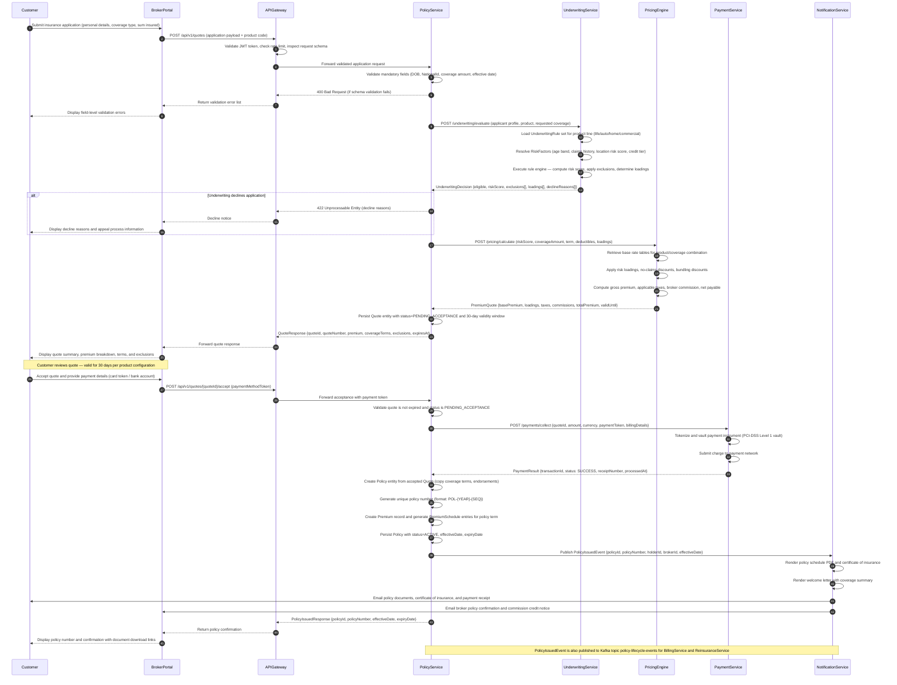
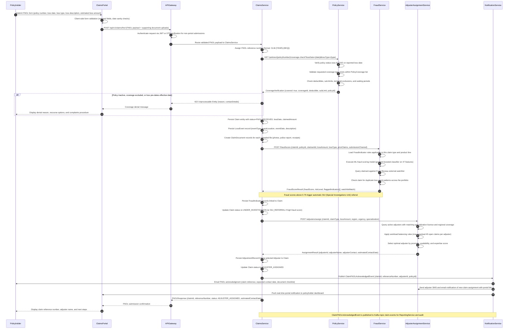
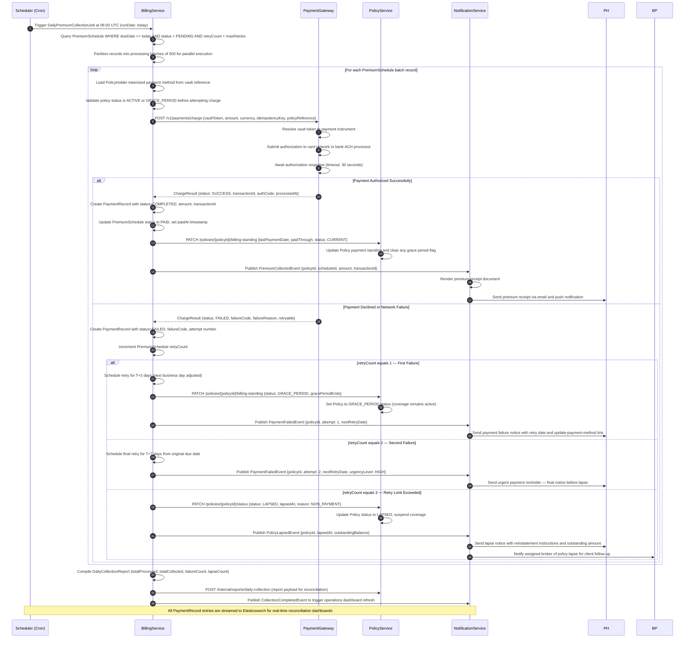
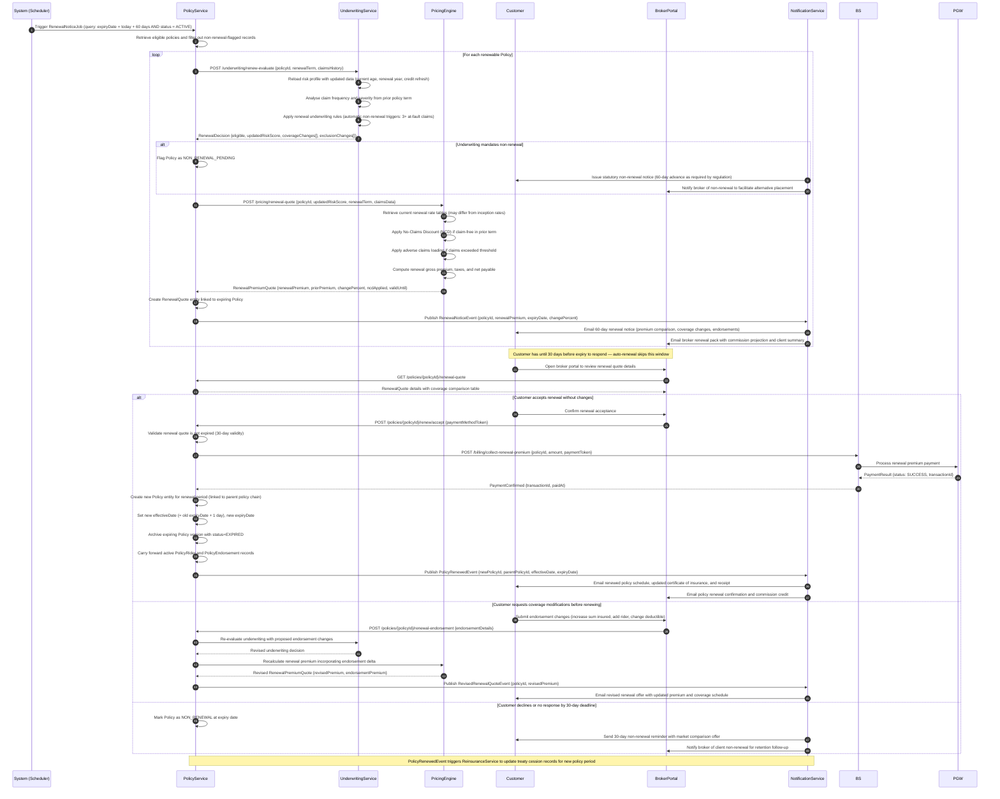

# System Sequence Diagrams — Insurance Management System

This document presents the key system sequence diagrams for the Insurance Management System (IMS).
Each diagram captures the interaction between actors and services for a critical business flow,
illustrating message passing, service orchestration, and event propagation across the platform.
These diagrams serve as the authoritative reference for API contract design, integration testing,
and onboarding documentation for engineering teams.

---

## Diagram 1: Quote-to-Policy Issuance Flow

The Quote-to-Policy flow covers the complete journey from a customer submitting an insurance
application through a broker portal, through underwriting evaluation and risk pricing, to the
issuance of a bound policy. This flow spans multiple microservices and ensures that only eligible
applicants receive coverage at actuarially appropriate premium rates. The underwriting decision
incorporates real-time risk factor evaluation, and payment collection is completed before the
policy record reaches an `ACTIVE` state.

**Key observations:**
- The underwriting evaluation is synchronous for standard personal lines; complex commercial lines trigger an asynchronous manual underwriting workflow requiring a human underwriter decision.
- Quote validity (default 30 days) is configurable per product and jurisdiction in the `Product` entity.
- Payment failure at collection rolls back the Quote to `PENDING_ACCEPTANCE` and triggers a `PaymentFailedEvent`; the customer may retry with a different payment method.
- The `PolicyIssuedEvent` on Kafka enables the `ReinsuranceService` to check if the policy exceeds cession thresholds and automatically create `Reinsurance` records.

---

## Diagram 2: Claims First Notice of Loss (FNOL) Flow

The First Notice of Loss flow is initiated when a policyholder reports an insured loss event.
The system verifies active policy coverage for the reported loss date, scores the claim for
potential fraud using the ML-backed FraudService, assigns a qualified adjuster based on
specialization and geographic proximity, and dispatches acknowledgment communications.
Accurate FNOL capture is critical for claims reserve estimation and regulatory reporting under
Solvency II requirements.

**Key observations:**
- FNOL may be submitted via web portal, mobile app, broker portal, or inbound call centre (IVR to agent transcription); all channels converge at the API Gateway.
- The fraud scoring model runs synchronously for claims under $50,000; claims above this threshold invoke an async enrichment pipeline that collects additional data from third-party data providers before scoring.
- SIU referrals bypass standard adjuster assignment and route directly to the Special Investigations Unit queue; the policyholder is notified that additional information is required without revealing the SIU investigation.
- All FNOL events feed the `ClaimReserveService` (part of `ClaimsService`) which establishes initial IBNR (Incurred But Not Reported) reserves for Solvency II capital adequacy calculations.

---

## Diagram 3: Scheduled Premium Collection Flow

Premium collection is a system-initiated process triggered by the BillingService on each billing
due date. The service retrieves all `PremiumSchedule` records due for collection, processes
payments via the Payment Gateway, updates policy payment standing, and dispatches receipts or
failure notices. Retry logic and lapse management are governed by product-level grace period
configurations and statutory requirements per jurisdiction.

**Key observations:**
- Grace periods are product and jurisdiction specific; life insurance products in regulated markets require minimum 30-day grace periods by statute before a policy may be lapsed.
- Raw card data never enters the IMS; all payment instruments are referenced by opaque vault tokens managed by the PCI-DSS Level 1 compliant Payment Gateway.
- The `idempotencyKey` on each charge request prevents duplicate charges if the BillingService retries due to a network timeout after a successful gateway charge.
- Lapsed policies enter a reinstatement workflow where the `PolicyService` accepts backdated premium payment and restores `ACTIVE` status within the reinstatement window (configurable, typically 90 days).

---

## Diagram 4: Policy Renewal Flow

Policy renewal is initiated 60 days before expiry through a system-scheduled job. The system
re-underwrites the policy using updated risk data, generates a renewal premium quote incorporating
claims history adjustments (no-claims discounts or adverse claims loadings), and notifies the
customer and broker. The policyholder may accept, request modifications, or allow the policy to
lapse. Auto-renewal with pre-authorized payment is supported for policyholders who opt in at
inception.

**Key observations:**
- Auto-renewal with pre-authorized payment bypasses the explicit acceptance step; the customer receives a notification rather than a quote awaiting response, with a cancellation window of 14 days post-renewal.
- Renewal premium increases exceeding 20% above the prior year's premium trigger a mandatory broker review workflow before the notice is dispatched to the customer.
- No-Claims Discount (NCD) is tracked on the `Policy` entity as a running field and transferred to the renewal quote automatically by the `PricingEngine`.
- All renewal lifecycle events are published to Kafka topic `policy-lifecycle-events` for consumption by the `ReportingService` for IFRS 17 contract boundary and premium allocation calculations.

---

*Document version: 1.0 | Domain: Insurance Management System | Classification: Internal Architecture Reference*
