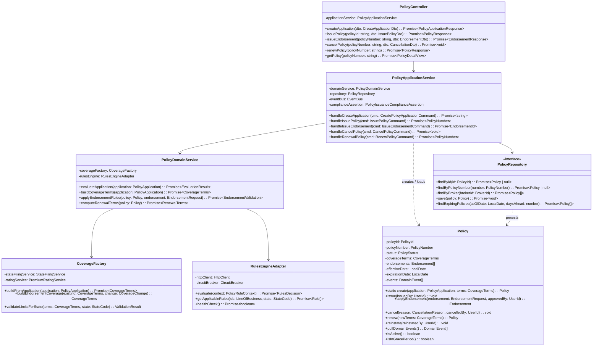
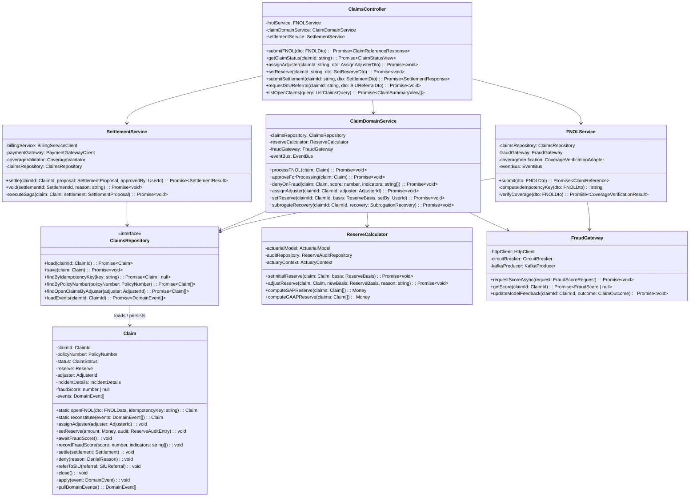
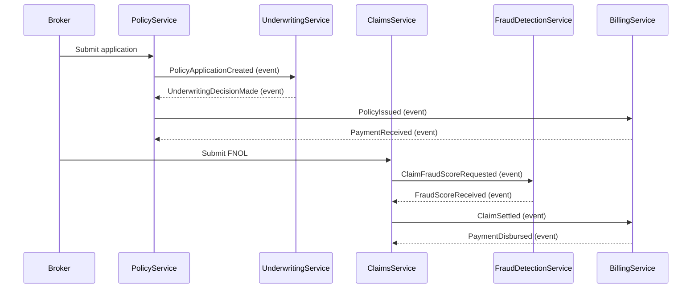

# C4 Code-Level Diagram — PolicyService & ClaimsService

This document contains C4 Level 4 (code-level) diagrams for the two core services of the Insurance Management System. Each diagram shows internal class structure, method signatures, package layout, inter-service event contracts, and dependency injection wiring.

---

## PolicyService — Code-Level Diagram

### Package Structure

```
policy-service/
├── api/
│   └── PolicyController.ts
├── application/
│   ├── PolicyApplicationService.ts
│   ├── commands/
│   │   ├── CreatePolicyApplicationCommand.ts
│   │   ├── IssuePolicyCommand.ts
│   │   ├── IssueEndorsementCommand.ts
│   │   └── CancelPolicyCommand.ts
│   └── queries/
│       ├── GetPolicyQuery.ts
│       └── ListPoliciesByBrokerQuery.ts
├── domain/
│   ├── model/
│   │   ├── Policy.ts                  ← aggregate root
│   │   ├── PolicyNumber.ts            ← value object
│   │   ├── CoverageTerms.ts           ← value object
│   │   ├── Endorsement.ts             ← entity
│   │   └── PolicyStatus.ts            ← enum
│   ├── service/
│   │   └── PolicyDomainService.ts
│   ├── factory/
│   │   └── CoverageFactory.ts
│   ├── repository/
│   │   └── PolicyRepository.ts        ← interface
│   └── events/
│       ├── PolicyIssuedEvent.ts
│       ├── EndorsementAppliedEvent.ts
│       └── PolicyCancelledEvent.ts
├── infrastructure/
│   ├── persistence/
│   │   └── PostgresPolicyRepository.ts
│   ├── adapters/
│   │   └── RulesEngineAdapter.ts
│   └── messaging/
│       └── PolicyEventPublisher.ts
└── config/
    └── PolicyServiceModule.ts         ← DI wiring
```

### Class Diagram



### Events Published by PolicyService

| Event | Trigger | Payload |
|---|---|---|
| `PolicyApplicationCreated` | Application submitted | `applicationId`, `policyNumber`, `applicantId`, `lob`, `stateCode` |
| `PolicyIssued` | Policy bound | `policyNumber`, `effectiveDate`, `expirationDate`, `premium`, `coverageTerms` |
| `EndorsementApplied` | Endorsement approved | `policyNumber`, `endorsementId`, `changeType`, `premiumImpact`, `effectiveDate` |
| `PolicyCancelled` | Policy cancelled | `policyNumber`, `cancellationReason`, `cancellationDate`, `returnPremium` |
| `PolicyRenewed` | Renewal issued | `oldPolicyNumber`, `newPolicyNumber`, `newExpirationDate`, `newPremium` |
| `PolicyLapsed` | Grace period expired | `policyNumber`, `lapseDate` |

### Events Consumed by PolicyService

| Event | Source | Purpose |
|---|---|---|
| `UnderwritingDecisionMade` | UnderwritingService | Advance application to issuance if approved |
| `PaymentReceived` | BillingService | Trigger policy activation on first payment |
| `GracePeriodExpired` | BillingService | Mark policy lapsed |
| `ReinstatementApproved` | BillingService | Restore active status |

---

## ClaimsService — Code-Level Diagram

### Package Structure

```
claims-service/
├── api/
│   └── ClaimsController.ts
├── application/
│   ├── FNOLService.ts
│   ├── commands/
│   │   ├── SubmitFNOLCommand.ts
│   │   ├── AssignAdjusterCommand.ts
│   │   ├── SetReserveCommand.ts
│   │   ├── SettleClaimCommand.ts
│   │   └── ReferToSIUCommand.ts
│   └── queries/
│       ├── GetClaimQuery.ts
│       └── ListOpenClaimsQuery.ts
├── domain/
│   ├── model/
│   │   ├── Claim.ts                   ← aggregate root (event-sourced)
│   │   ├── ClaimId.ts                 ← value object
│   │   ├── Reserve.ts                 ← value object
│   │   ├── Settlement.ts              ← entity
│   │   └── ClaimStatus.ts             ← enum
│   ├── service/
│   │   └── ClaimDomainService.ts
│   ├── repository/
│   │   └── ClaimsRepository.ts        ← interface
│   └── events/
│       ├── FNOLOpenedEvent.ts
│       ├── ReserveSetEvent.ts
│       ├── ClaimSettledEvent.ts
│       └── ClaimDeniedEvent.ts
├── infrastructure/
│   ├── persistence/
│   │   ├── EventStoreClaimsRepository.ts
│   │   └── ReserveAuditRepository.ts
│   ├── adapters/
│   │   ├── FraudGateway.ts
│   │   └── CoverageVerificationAdapter.ts
│   └── messaging/
│       └── ClaimsEventPublisher.ts
├── settlement/
│   └── SettlementService.ts
└── config/
    └── ClaimsServiceModule.ts         ← DI wiring
```

### Class Diagram



### Events Published by ClaimsService

| Event | Trigger | Payload |
|---|---|---|
| `FNOLSubmitted` | FNOL accepted | `claimId`, `policyNumber`, `incidentDate`, `incidentType`, `claimantId` |
| `ClaimFraudScoreRequested` | Post-FNOL async | `claimId`, `requestId`, `requestedAt` |
| `ClaimApprovedForProcessing` | Low fraud score | `claimId`, `fraudScore`, `adjusterAssigned` |
| `ReserveSet` | Reserve established | `claimId`, `reserveAmount`, `reserveBasis`, `setBy`, `timestamp` |
| `ReserveAdjusted` | Reserve changed | `claimId`, `priorReserve`, `newReserve`, `adjustmentReason` |
| `ClaimSettled` | Settlement disbursed | `claimId`, `settlementAmount`, `paymentRef`, `settledDate` |
| `ClaimDenied` | Denied (fraud/coverage) | `claimId`, `denialReason`, `denialCode`, `deniedBy` |
| `SIUReferralCreated` | High fraud score | `claimId`, `fraudScore`, `indicators`, `referredAt` |
| `SubrogationRecoveryRecorded` | Recovery identified | `claimId`, `recoveryAmount`, `thirdPartyId` |

### Events Consumed by ClaimsService

| Event | Source | Purpose |
|---|---|---|
| `PolicyIssued` | PolicyService | Seed coverage verification cache |
| `PolicyCancelled` | PolicyService | Flag claims on lapsed policies |
| `FraudScoreReceived` | FraudDetectionService | Route claim post-FNOL |
| `PaymentDisbursed` | BillingService | Confirm settlement payment completion |
| `ReinsuranceCessionCreated` | ReinsuranceService | Link large losses to treaty |

---

## Inter-Service Event Flow



---

## Dependency Injection Wiring

### PolicyService Module (NestJS)

```typescript
@Module({
  imports: [
    TypeOrmModule.forFeature([PolicyEntity, EndorsementEntity]),
    HttpModule,
    CqrsModule,
  ],
  controllers: [PolicyController],
  providers: [
    // Application layer
    PolicyApplicationService,
    // Domain layer
    PolicyDomainService,
    CoverageFactory,
    PolicyIssuanceComplianceAssertion,
    // Infrastructure
    {
      provide: PolicyRepository,       // interface token
      useClass: PostgresPolicyRepository,
    },
    {
      provide: RulesEngineAdapter,
      useFactory: (httpClient: HttpClient, config: ConfigService) =>
        new RulesEngineAdapter(httpClient, config.get('RULES_ENGINE_URL')),
      inject: [HttpClient, ConfigService],
    },
    PolicyEventPublisher,
    StateFilingService,
    BrokerLicenseService,
  ],
  exports: [PolicyApplicationService],
})
export class PolicyServiceModule {}
```

### ClaimsService Module (NestJS)

```typescript
@Module({
  imports: [
    EventStoreModule.forFeature([ClaimEvent]),
    TypeOrmModule.forFeature([ReserveAuditEntity]),
    KafkaModule,
    HttpModule,
    CqrsModule,
  ],
  controllers: [ClaimsController],
  providers: [
    // Application layer
    FNOLService,
    ClaimDomainService,
    SettlementService,
    // Domain layer
    ReserveCalculator,
    ActuarialModel,
    // Infrastructure
    {
      provide: ClaimsRepository,       // interface token
      useClass: EventStoreClaimsRepository,
    },
    {
      provide: FraudGateway,
      useFactory: (kafkaProducer: KafkaProducer, httpClient: HttpClient) =>
        new FraudGateway(kafkaProducer, httpClient),
      inject: [KafkaProducer, HttpClient],
    },
    ReserveAuditRepository,
    ClaimsEventPublisher,
    CoverageVerificationAdapter,
  ],
  exports: [ClaimDomainService, FNOLService],
})
export class ClaimsServiceModule {}
```

### Wiring Notes

- `PolicyRepository` and `ClaimsRepository` are always bound to their interface tokens. Tests swap in in-memory implementations by rebinding the token in the test module.
- `RulesEngineAdapter` wraps the external rules engine with a circuit breaker (Opossum). When the circuit is open, `evaluate()` returns a `MANUAL_REVIEW` decision rather than throwing.
- `FraudGateway` publishes to Kafka for score requests and falls back to synchronous HTTP if Kafka is unavailable (detected via health check at startup).
- `ReserveCalculator` injects `ActuaryContext` as a request-scoped provider so that the logged-in actuary's identity is captured in every audit trail entry without being passed explicitly through every method call.
- All `EventBus` bindings use the shared `@insurance/events` package types to ensure schema consistency across services.
