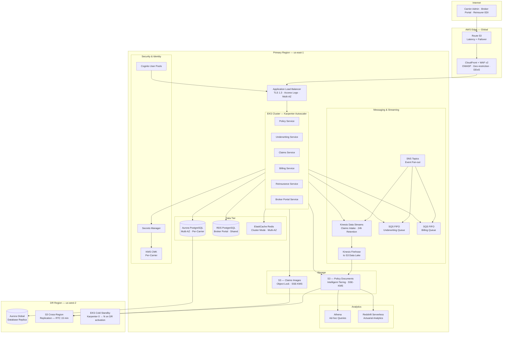
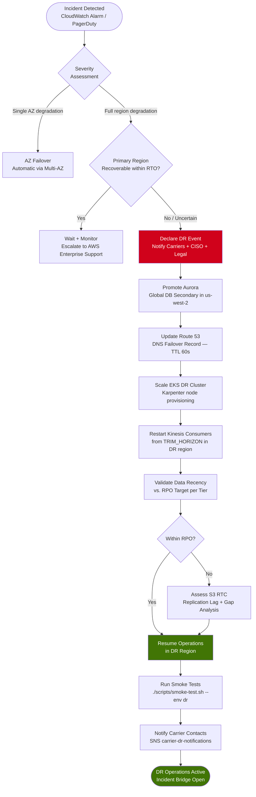

# Cloud Architecture

## Overview

The Insurance Management System runs on AWS with a multi-tenant SaaS architecture tailored for P&C carriers. The platform enforces carrier-level data isolation, meets NAIC data residency requirements, and targets PCI-DSS and SOC 2 Type II compliance. Core design objectives: RPO ≤ 1 minute and RTO ≤ 15 minutes for Tier 1 services, with cross-region active-passive DR for regulatory continuity.

---

## AWS Services Catalog

| Service | Purpose | Configuration | Tier |
|---|---|---|---|
| CloudFront + WAF v2 | CDN, TLS offload, DDoS mitigation, OWASP rule groups | Geo-restriction, custom cache policies, managed rule groups | All |
| Route 53 | DNS, health-check–driven failover routing | Latency + failover records, 30-second health check interval | All |
| Application Load Balancer (ALB) | L7 load balancing, TLS 1.3 termination | Multi-AZ, access logs to S3, connection draining | Tier 1 |
| Amazon EKS | Container orchestration for all microservices | v1.29, Managed Node Groups, Karpenter autoscaler | Tier 1 |
| Amazon Aurora PostgreSQL | Per-carrier transactional DB (policies, claims, billing) | Multi-AZ cluster, up to 15 read replicas, v15, gp3 | Tier 1 |
| Amazon RDS PostgreSQL | Shared broker portal relational DB | Multi-AZ standby, gp3 storage, automated backups | Tier 2 |
| Amazon ElastiCache Redis | Session cache, rate factor cache, API rate limiting | Cluster mode, 3 shards × 2 replicas, TLS + AUTH | Tier 1 |
| Amazon S3 | Policy documents, claims images, reinsurance bordereaux, audit logs | Intelligent-Tiering, SSE-KMS, Object Lock (compliance) | Tier 1 |
| Amazon Kinesis Data Streams | Real-time claims event ingestion stream | 24-hour retention, auto-scaling shards | Tier 1 |
| Amazon SQS (FIFO) | Async job queues: underwriting batch, renewals, billing cycles | DLQ per queue, SSE-KMS, visibility timeout tuned per job type | Tier 1/2 |
| Amazon SNS | Event notifications: claim filed, policy issued, payment failed | Fan-out to SQS + Lambda; topic-based per domain | All |
| Kinesis Data Firehose | Stream claims events to S3 data lake | Buffer 5 min / 128 MB, Parquet conversion via Glue schema | Tier 2 |
| AWS Lambda | Document processing, NAIC report triggers, webhook delivery | x86_64, 3 GB max RAM, Provisioned Concurrency on critical paths | Tier 2/3 |
| Amazon Cognito | Carrier admin + broker portal identity, MFA enforcement | User pool per tenant, SAML federation, app clients per service | All |
| AWS Secrets Manager | DB credentials, API keys, reinsurer EDI secrets | Automatic rotation every 30 days, VPC endpoint | All |
| AWS KMS | Envelope encryption for all PII and financial data | Customer-managed CMK per carrier, automatic annual key rotation | All |
| AWS WAF v2 | OWASP Top 10, SQL injection, rate limiting | Managed rule groups + custom rate-based rules on claim endpoints | All |
| Amazon Macie | PII discovery and classification in S3 buckets | Automated sensitive data discovery, weekly full scans | Tier 1 |
| AWS Security Hub | Aggregate security findings across accounts | CIS AWS Foundations Benchmark v1.4, auto-suppression workflow | All |
| Amazon Inspector v2 | Container image vulnerability scanning | ECR scan-on-push, EKS runtime monitoring | Tier 1 |
| AWS Config | Resource configuration compliance tracking | Conformance packs: PCI-DSS, CIS, NAIC data residency custom rules | All |
| Amazon CloudWatch | Metrics, logs, alarms, composite dashboards | Log retention 1 year, anomaly detection on claims stream lag | All |
| AWS X-Ray | Distributed tracing for microservices | 5% sampling baseline, 100% trace on 5xx errors | Tier 1/2 |
| Amazon ECR | Container image registry | Immutable tags, scan-on-push, lifecycle: keep last 10 images | Tier 1 |
| AWS Backup | Centralized backup orchestration | Daily/weekly/monthly plans, cross-region vault copy to us-west-2 | Tier 1/2 |
| Amazon Athena | Ad-hoc queries on S3 claims data and audit logs | Per-carrier workgroup, Glue Data Catalog, query result encryption | Tier 2/3 |
| AWS Glue | ETL for actuarial data lake, NAIC reporting extracts | Spark-based jobs, catalog crawler, job bookmark enabled | Tier 2 |
| Amazon Redshift Serverless | Actuarial analytics, loss triangle computation | RPU-based billing, per-carrier namespace, VPC isolated | Tier 2 |

---

## Multi-Tenancy Strategy

### Database-per-Carrier Isolation

Each insurance carrier receives a dedicated Aurora PostgreSQL cluster. This architecture provides:

- **Regulatory compliance** — NAIC state filings require carrier data to be logically and physically separable for examination.
- **Performance isolation** — a claims surge at one carrier does not degrade query performance for others.
- **Simplified audit** — point-in-time restore and audit log export are scoped entirely to a single carrier cluster.
- **Schema extensibility** — carriers can adopt line-of-business–specific schema extensions on their own migration cadence.

```
Carrier A — ACME Insurance              Carrier B — Summit Mutual
┌─────────────────────────────┐         ┌─────────────────────────────┐
│ Aurora Cluster: acme-prod   │         │ Aurora Cluster: summit-prod │
│   DB: policies, claims,     │         │   DB: policies, claims,     │
│       billing, reinsurance  │         │       billing, reinsurance  │
│   KMS CMK: acme-cmk         │         │   KMS CMK: summit-cmk       │
│   Secrets: /acme/db/...     │         │   Secrets: /summit/db/...   │
└─────────────────────────────┘         └─────────────────────────────┘
        ▲                                        ▲
        └───────────── EKS PgBouncer ────────────┘
                  (carrier-scoped connection pool)
```

Carrier identity is resolved at the API gateway layer via a `X-Carrier-ID` header, verified against the Cognito JWT `carrier_id` claim. The EKS service mesh routes connections to the appropriate PgBouncer sidecar, which holds per-carrier credentials fetched from Secrets Manager.

### Shared Infrastructure for the Broker Portal

The broker portal aggregates submissions across multiple carriers. It uses:

- **Shared RDS PostgreSQL** with row-level security (RLS) enforcing `carrier_id` isolation at the database layer.
- **Shared Cognito User Pool** with broker identity; carrier-scoped JWT claims restrict data access.
- Cross-carrier read queries are prohibited by policy; brokers see only submissions tied to their NPN.

```sql
-- Row-level security enforced for all broker portal queries
ALTER TABLE submissions ENABLE ROW LEVEL SECURITY;

CREATE POLICY submissions_broker_rls ON submissions
    FOR ALL
    TO broker_app_role
    USING (broker_npn = current_setting('app.current_broker_npn')::TEXT);
```

---

## Architecture Diagram



---

## High Availability Design

### RPO / RTO Targets by Tier

| Tier | Services | RPO | RTO | HA Mechanism |
|---|---|---|---|---|
| Tier 1 — Critical | Policy issuance, Claims intake, Premium billing | ≤ 1 minute | ≤ 15 minutes | Aurora Global DB, Multi-AZ EKS, Route 53 health-check failover |
| Tier 2 — Important | Underwriting scoring, Renewals, Broker portal | ≤ 15 minutes | ≤ 1 hour | Aurora PITR, RDS Multi-AZ standby, SQS message retention |
| Tier 3 — Standard | Actuarial reporting, NAIC extracts, Analytics | ≤ 24 hours | ≤ 4 hours | Daily snapshot + Glue job reprocessing from S3 raw data |

### Multi-AZ Configuration

- **Aurora PostgreSQL** — writer in `us-east-1a`, reader replicas in `us-east-1b` and `us-east-1c`. Automatic failover in < 30 seconds. `AuroraReplicaLagMaximum` alarm fires at 1-second threshold.
- **EKS Node Groups** — topology spread constraints enforce one-third of pods per AZ (`topologyKey: topology.kubernetes.io/zone`, `maxSkew: 1`).
- **ElastiCache Redis** — cluster mode, 3 shards × 2 replicas, Multi-AZ with auto-failover enabled.
- **ALB** — spans all three AZs; cross-zone load balancing enabled; deregistration delay 30 seconds.

### Cross-Region DR

The DR region (`us-west-2`) maintains a continuously replicated standby:

- **Aurora Global Database** — typical replication lag < 1 second; managed promotion in < 1 minute for Tier 1 RPO compliance.
- **S3 Replication Time Control (RTC)** — 99.99% of objects replicated within 15 minutes; CloudWatch `ReplicationLatency` metric alarmed at 10 minutes.
- **EKS Cold Standby** — cluster pre-provisioned with zero worker nodes; Karpenter provisions from pre-staged AMIs in < 10 minutes on DR activation.
- **Route 53 Health Checks** — active-passive routing; three consecutive 30-second interval failures trigger automatic DNS cutover to DR endpoint.

---

## Compliance Architecture

### PCI-DSS Scope Boundary

Payment card data is handled exclusively by the Billing Service. PCI scope is minimized through tokenization and network isolation:

- Billing Service runs in dedicated EKS namespace `pci-scope` with Kubernetes NetworkPolicy restricting all ingress except ALB and all egress except the payment processor endpoint on port 443.
- No PANs are stored in Aurora or S3 — the carrier's premium payment flow delegates to a PCI-DSS Level 1 certified processor (Stripe / Braintree) via tokenization.
- A dedicated KMS CMK (`billing-pci-cmk`) is used for billing data encryption; IAM policy restricts key usage to the billing service IAM role exclusively.

```
PCI-DSS Scope Boundary
┌────────────────────────────────────────────────┐
│  EKS Namespace: pci-scope                      │
│  ┌──────────────────────┐                      │
│  │  Billing Service     │ ──HTTPS──► Stripe /  │
│  │  (token storage only)│           Braintree  │
│  └──────────────────────┘           (Level 1)  │
│  NetworkPolicy: deny all ingress except ALB    │
│  NetworkPolicy: deny all egress except :443    │
└────────────────────────────────────────────────┘
  ✗ No PAN data flows to Aurora, ElastiCache, or S3
```

### SOC 2 Controls Mapping

| Trust Service Criteria | AWS Control | Implementation |
|---|---|---|
| CC6.1 — Logical access | Cognito + IAM + RBAC | MFA enforced for all users; least-privilege IAM roles; Cognito app clients scoped per service |
| CC6.3 — Access removal | IAM Access Analyzer + SCPs | Automated unused-access findings; quarterly entitlement review workflow |
| CC7.1 — System monitoring | CloudWatch + Security Hub | Real-time anomaly detection on all Tier 1 metrics; Security Hub findings → PagerDuty P1/P2 |
| CC8.1 — Change management | GitHub Actions + Terraform | All infrastructure via IaC; PR approval gate; plan output attached to PR |
| A1.2 — Availability | Multi-AZ + Aurora Global DB | Documented RPO/RTO; quarterly DR tests with results stored in audit S3 bucket |
| PI1.5 — Privacy | Macie + KMS CMK | Macie weekly scans; all PII encrypted at rest; Macie findings trigger SNS alert to CISO |

### NAIC Data Residency Requirements

NAIC Model Bulletin on Cybersecurity requires insurance data to reside within the United States:

- All Aurora clusters provisioned in `us-east-1` and `us-west-2` only; no replicas permitted outside these regions.
- S3 bucket policy denies `s3:PutObject` requests from non-US regions via `aws:RequestedRegion` condition key.
- CloudFront uses Origin Access Control (OAC); no edge caching of claim PII or policy documents.
- AWS Config custom rule `insurance-restricted-regions` alerts on any resource provisioned outside the two approved regions.

---

## Auto-Scaling Policies

### Catastrophe Claims Surge

During catastrophe events (hurricane landfall, severe convective storms), claims intake can spike 20–50× within minutes. Scaling must be pre-emptive when CAT alerts are received.

```yaml
# Karpenter NodePool — on-demand capacity for claims surge
apiVersion: karpenter.sh/v1beta1
kind: NodePool
metadata:
  name: claims-surge
spec:
  template:
    spec:
      nodeClassRef:
        name: al2-claims
      requirements:
        - key: karpenter.sh/capacity-type
          operator: In
          values: ["on-demand"]   # on-demand only — no interruption risk during CAT
        - key: node.kubernetes.io/instance-type
          operator: In
          values: ["c6i.4xlarge", "c6i.8xlarge", "c6i.16xlarge"]
  limits:
    cpu: "1000"
  disruption:
    consolidationPolicy: WhenEmpty
    consolidateAfter: 30m
```

HPA for Claims Service scales on Kinesis stream consumer lag:

```yaml
apiVersion: autoscaling/v2
kind: HorizontalPodAutoscaler
metadata:
  name: claims-service-hpa
spec:
  scaleTargetRef:
    apiVersion: apps/v1
    kind: Deployment
    name: claims-service
  minReplicas: 3
  maxReplicas: 100
  metrics:
    - type: External
      external:
        metric:
          name: kinesis_claims_stream_consumer_lag_records
        target:
          type: AverageValue
          averageValue: "1000"   # scale up when > 1000 records behind per pod
```

### Underwriting Batch Processing

Nightly renewal scoring batches (up to 500K policies) run on Spot Instances via AWS Batch to minimize cost while tolerating 2-hour completion windows:

```json
{
  "jobQueue": "underwriting-batch-spot",
  "computeEnvironment": {
    "type": "SPOT",
    "instanceTypes": ["c6i", "c5", "m6i"],
    "bidPercentage": 80,
    "spotIamFleetRole": "arn:aws:iam::ACCOUNT_ID:role/AmazonEC2SpotFleetRole"
  },
  "retryStrategy": { "attempts": 3, "evaluateOnExit": [{ "onStatusReason": "Host EC2*terminated", "action": "RETRY" }] },
  "timeout": { "attemptDurationSeconds": 14400 }
}
```

### Renewal Season Spikes

Renewal processing peaks at 3–4× baseline during Q1 and Q4 policy renewal seasons:

- **Aurora read replicas** — auto-scaling policy adds up to 5 additional reader instances when `CPUUtilization > 70%` sustained for 5 minutes. Scale-in cooldown 15 minutes.
- **ElastiCache** — online shard addition triggered when `CacheHits < 85%` for 10 consecutive minutes.
- **SQS-driven HPA** — Underwriting and Billing pods scale when `ApproximateNumberOfMessagesVisible > 500` on their respective FIFO queues.

---

## Cost Optimization

### Compute Strategy

| Workload | Instance Strategy | Estimated Saving |
|---|---|---|
| EKS core services (24/7 baseline) | 3-year Compute Savings Plan | ~40% vs. on-demand |
| Actuarial batch (nightly) | Spot Instances via AWS Batch | ~70% vs. on-demand |
| CAT claims surge capacity | On-demand (Karpenter, short duration) | Burst only — minimal waste |
| Lambda event handlers | Pay-per-invocation | Inherently cost-optimized |
| Redshift Serverless (actuarial) | RPU-based — zero cost when idle | No reserved capacity required |

### Storage Tiering

- **S3 Intelligent-Tiering** applied to all policy documents and claims images. Objects not accessed for 30 days move to Infrequent Access; 90 days → Archive Instant Access; 180 days → Deep Archive (regulatory retention).
- **Aurora storage** auto-scales from 100 GiB to 128 TiB with zero downtime and no manual provisioning.
- **EBS gp3** on all EKS node volumes — 20% lower cost than gp2 with 3,000 IOPS baseline included at no charge.

### Network Cost Controls

- **VPC endpoints** for S3, Secrets Manager, KMS, SQS, and SNS eliminate NAT Gateway data transfer costs for all intra-VPC service traffic.
- **CloudFront** caches broker portal static assets and API responses where cacheable, reducing ALB and Aurora origin traffic by ~60%.

### Reserved Capacity Estimates

```
Aurora Reserved Instances — 1-year partial upfront (per carrier cluster):
  2× db.r6g.2xlarge (writer + primary reader)
  Estimated annual saving: ~$18,000 per carrier cluster

ElastiCache Reserved Nodes — 1-year partial upfront:
  6× cache.r6g.xlarge (3 shards × 2 replicas)
  Estimated annual saving: ~$7,200

Total per carrier (compute + cache + storage) at 1-year reservation:
  Estimated 35–42% reduction vs. fully on-demand
```

---

## Disaster Recovery Runbook

### DR Activation Decision Tree



### RTO / RPO by Service Tier

| Service | RPO | RTO | DR Mechanism | Test Cadence |
|---|---|---|---|---|
| Policy Issuance | 1 min | 15 min | Aurora Global DB promotion + Route 53 failover | Quarterly |
| Claims Intake (Kinesis) | 0 (stream replay) | 15 min | Kinesis 24h retention; DR consumers restart from `TRIM_HORIZON` | Quarterly |
| Premium Billing | 1 min | 30 min | Aurora Global DB + payment processor redundancy | Semi-annual |
| Broker Portal | 15 min | 1 hour | RDS PITR to DR region + EKS scale-up | Semi-annual |
| Actuarial Reporting | 24 hours | 4 hours | S3 CRR + Glue job reprocess from raw Parquet | Annual |
| NAIC Reporting Extracts | 24 hours | 8 hours | S3 CRR + Athena re-query against replicated data catalog | Annual |

### Step-by-Step Recovery Procedures

**Step 1 — Promote Aurora Global DB Secondary (Target: < 5 min)**

```bash
aws rds promote-read-replica-db-cluster \
  --db-cluster-identifier insurance-dr-cluster \
  --region us-west-2
```

**Step 2 — Update Route 53 DNS Failover (Target: < 2 min)**

```bash
# Shift 100% of traffic weight to DR endpoint
aws route53 change-resource-record-sets \
  --hosted-zone-id Z1234567890ABC \
  --change-batch file://scripts/dr-dns-failover.json
```

**Step 3 — Scale EKS DR Cluster (Target: < 10 min)**

```bash
KUBECONFIG=~/.kube/dr-us-west-2.yaml

kubectl scale deployment claims-service     --replicas=10 -n production
kubectl scale deployment policy-service     --replicas=6  -n production
kubectl scale deployment billing-service    --replicas=4  -n production
kubectl scale deployment underwriting-service --replicas=4 -n production
```

**Step 4 — Restart Kinesis Consumers in DR Region (Target: < 5 min)**

```bash
# Claims intake consumer group — replay from start of 24h retention window
aws kinesis update-shard-count \
  --stream-name claims-intake-dr \
  --target-shard-count 10 \
  --scaling-type UNIFORM_SCALING \
  --region us-west-2
```

**Step 5 — Validate and Communicate**

```bash
# Run full smoke test suite against DR environment
./scripts/smoke-test.sh --env dr --carriers acme,summit --verbose
```

- Page all on-call engineers via PagerDuty incident: severity P1, runbook linked
- Notify carrier contacts via pre-configured SNS topic `carrier-dr-notifications`
- Open AWS Support case (Business / Enterprise tier): "Region degradation — P&C SaaS platform DR activation"
- Update carrier status page: `https://status.insuranceplatform.io`

### DR Activation Checklist

- [ ] Incident declared with severity classification (P1 / P2)
- [ ] Aurora Global DB secondary promoted in us-west-2
- [ ] Route 53 DNS failover record updated; TTL propagation confirmed
- [ ] EKS DR cluster nodes provisioned to baseline capacity
- [ ] PgBouncer connection pools re-pointed to promoted Aurora writer
- [ ] Secrets Manager: DR region credential rotation verified
- [ ] Kinesis consumer groups restarted in DR region from `TRIM_HORIZON`
- [ ] ElastiCache DR cluster warmed (cold start acceptable per Tier 2 RTO)
- [ ] Smoke tests passed: policy create, claim intake, billing cycle end-to-end
- [ ] Carrier notifications transmitted via SNS
- [ ] Incident log opened in SIEM; AWS TAM engaged
- [ ] DR test results archived to `s3://insurance-audit-logs/dr-tests/`

---

*Document version 1.0 — Insurance Management System · Cloud Architecture*
