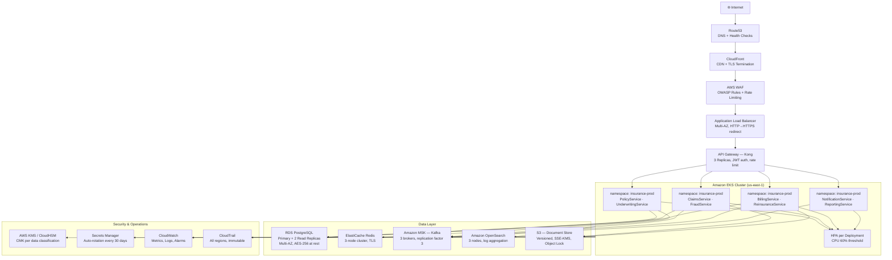

# Deployment Architecture

## Deployment Philosophy

The Insurance Management System is built on a cloud-native, Kubernetes-first deployment model.
All workloads run on Amazon EKS across multiple Availability Zones to eliminate single points of
failure. Infrastructure is provisioned exclusively through Terraform (IaC), with GitOps-driven
continuous delivery via ArgoCD. No manual changes are made to production environments; every
change is traceable to a pull request and passes automated compliance gates before reaching live
traffic.

Key principles:
- **Immutable infrastructure**: pods are replaced, never patched in-place
- **Declarative state**: cluster state is always reconciled from Git
- **Least-privilege compute**: workload identity via IRSA (IAM Roles for Service Accounts)
- **Zero-downtime deploys**: rolling updates with pod disruption budgets enforced
- **Compliance by default**: encryption at rest and in transit for all data stores

---

## Environment Tiers

| Environment | Purpose                  | Region                              | Scale        |
|-------------|--------------------------|-------------------------------------|--------------|
| dev         | Developer testing        | us-east-1 (single AZ)               | Minimal      |
| staging     | QA and UAT               | us-east-1 (multi-AZ)                | Medium       |
| production  | Live traffic             | us-east-1 + eu-west-1 (multi-region)| Full         |
| DR          | Disaster recovery        | us-west-2                           | Warm standby |

- **dev**: Single-node EKS, shared RDS instance, no replication. Spot instances throughout.
- **staging**: Multi-AZ EKS, RDS Multi-AZ enabled, Kafka 1 broker, mirrors production topology at
  reduced scale. Used for integration testing, performance baselines, and UAT sign-off.
- **production**: Full high-availability configuration documented in this file. Two active AWS
  regions with Route53 latency-based routing and GDPR data-residency enforcement.
- **DR**: Warm standby in us-west-2. RDS read replica promoted on activation. RTO 4 hours,
  RPO 1 hour. Health checks run every 30 seconds via Route53.

---

## Production Deployment Topology



---

## Kubernetes Deployment Details

### Namespace Strategy

| Namespace          | Contents                                              |
|--------------------|-------------------------------------------------------|
| insurance-prod     | All eight application microservices                   |
| insurance-kafka    | MSK access proxies, Schema Registry, Kafka Connect    |
| insurance-data     | Database migration jobs, ETL pipelines, backup agents |
| insurance-monitor  | Prometheus, Grafana, Loki, Jaeger                     |
| insurance-ingress  | Kong API Gateway, cert-manager, external-dns          |

Namespace-level NetworkPolicies enforce that application pods can only reach their declared
dependencies. Cross-namespace traffic is denied by default and explicitly opened via policy.

### Resource Quotas per Service

| Service               | CPU Request | CPU Limit | Memory Request | Memory Limit |
|-----------------------|-------------|-----------|----------------|--------------|
| PolicyService         | 500m        | 2000m     | 512Mi          | 2Gi          |
| UnderwritingService   | 500m        | 2000m     | 512Mi          | 2Gi          |
| ClaimsService         | 1000m       | 4000m     | 1Gi            | 4Gi          |
| BillingService        | 500m        | 2000m     | 512Mi          | 2Gi          |
| ReinsuranceService    | 250m        | 1000m     | 256Mi          | 1Gi          |
| FraudService          | 1000m       | 4000m     | 2Gi            | 8Gi          |
| NotificationService   | 250m        | 1000m     | 256Mi          | 1Gi          |
| ReportingService      | 500m        | 4000m     | 1Gi            | 4Gi          |

### Horizontal Pod Autoscaler Configuration

| Service               | Min Replicas | Max Replicas | CPU Threshold | Memory Threshold |
|-----------------------|-------------|--------------|---------------|-----------------|
| PolicyService         | 3           | 20           | 60%           | 80%             |
| UnderwritingService   | 2           | 15           | 65%           | 80%             |
| ClaimsService         | 3           | 25           | 60%           | 75%             |
| BillingService        | 2           | 15           | 60%           | 80%             |
| ReinsuranceService    | 2           | 10           | 65%           | 80%             |
| FraudService          | 3           | 20           | 55%           | 70%             |
| NotificationService   | 2           | 30           | 50%           | 75%             |
| ReportingService      | 2           | 10           | 70%           | 85%             |

Scale-down stabilization window: 300 seconds. Scale-up stabilization window: 30 seconds.
Burst capacity is pre-warmed at renewal periods (January, quarterly) via scheduled scaling.

### Pod Disruption Budgets

All production deployments declare a PodDisruptionBudget requiring at minimum 50% of replicas
remain available during voluntary disruptions (node upgrades, cluster scaling events). High-traffic
services (ClaimsService, PolicyService, NotificationService) require at least 2 pods available
at all times regardless of replica count.

```yaml
# Example PDB — ClaimsService
apiVersion: policy/v1
kind: PodDisruptionBudget
metadata:
  name: claims-service-pdb
  namespace: insurance-prod
spec:
  minAvailable: 2
  selector:
    matchLabels:
      app: claims-service
```

---

## Database High-Availability Configuration

### RDS Multi-AZ

PostgreSQL 15 runs on RDS with Multi-AZ synchronous replication enabled. The standby replica
resides in a separate AZ and is promoted automatically within 60–120 seconds on primary failure.
CNAME failover is transparent to applications using the cluster endpoint.

- **Primary**: `rds-primary.insurance.internal` — writes and strong-read queries
- **Read Replica 1**: `rds-read-1.insurance.internal` — reporting queries, ReportingService
- **Read Replica 2**: `rds-read-2.insurance.internal` — analytics, FraudService ML features

### Read Replica Configuration

Replicas use asynchronous replication with a typical lag under 100ms. Applications that tolerate
eventual consistency (reporting, analytics, audit log reads) are routed to read replicas at the
connection-pool level (PgBouncer). Write-then-read patterns in PolicyService and BillingService
always use the primary endpoint.

### Point-in-Time Recovery

Automated backups are enabled with continuous transaction log archiving to S3. Any database can
be restored to any second within the backup retention window. PITR is tested monthly as part of
the DR drill program.

### Backup Retention Policy

| Environment | Retention Period | Backup Window (UTC) | Snapshot Frequency |
|-------------|-----------------|--------------------|--------------------|
| production  | 35 days         | 03:00–04:00        | Daily automated    |
| staging     | 7 days          | 04:00–05:00        | Daily automated    |
| dev         | 3 days          | 05:00–06:00        | Daily automated    |

Manual snapshots taken before every major schema migration and retained for 90 days.

---

## Disaster Recovery

### Objectives

| Metric | Target  | Measurement Method              |
|--------|---------|----------------------------------|
| RTO    | 4 hours | Time from incident declaration to full traffic restoration |
| RPO    | 1 hour  | Maximum data loss window, validated by PITR gap analysis  |

### Warm Standby — us-west-2

The DR region maintains a warm standby stack:
- RDS read replica receiving continuous replication from us-east-1 primary
- EKS cluster with all application images pre-pulled, deployments scaled to 1 replica
- ElastiCache and MSK clusters running but at reduced capacity
- S3 buckets with cross-region replication enabled

On DR activation, the runbook promotes the RDS replica, scales EKS deployments to full capacity,
and updates Route53 records. Estimated manual steps take under 30 minutes; remaining RTO budget
covers smoke-testing and regulatory notification.

### Route53 Health Checks and Failover

Route53 health checks probe the `/health` endpoint of the primary ALB every 30 seconds from
multiple AWS edge locations. If 3 consecutive checks fail, Route53 automatically switches the
DNS record to the DR ALB (failover routing policy). TTL is set to 60 seconds to minimize
propagation delay during a failover event.

Health check alarm is integrated with PagerDuty for immediate on-call notification. The on-call
engineer follows the DR runbook stored in the internal wiki and versioned in the `runbooks/`
directory of this repository.
