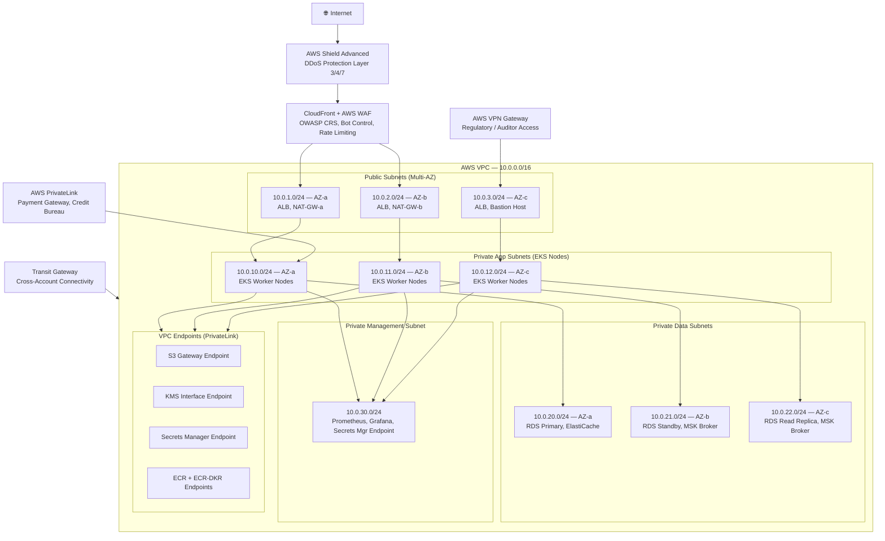

# Network Infrastructure

## Network Design Principles

The Insurance Management System network is designed around three foundational principles that
reflect regulatory obligations and the sensitivity of insurance data:

1. **Zero Trust**: No implicit trust is granted to any network peer, internal or external. Every
   service-to-service call carries a mutual TLS certificate and a short-lived service-account
   token. Network adjacency is never treated as authorization.

2. **Defense in Depth**: Traffic passes through multiple independent security controls — AWS
   Shield, WAF, Security Groups, Network ACLs, and Kubernetes NetworkPolicies — before reaching
   application logic. Compromise of one layer does not expose the data plane.

3. **PCI-DSS / HIPAA Segmentation**: Payment card data and protected health information (PHI)
   flow exclusively through dedicated subnets and private endpoints. The cardholder data
   environment (CDE) is isolated at the subnet level with restrictive NACLs and never traverses
   shared network segments.

These principles are enforced by policy-as-code (AWS Config rules) and reviewed quarterly by
the security team. Any deviation triggers an automated alert and a change-management ticket.

---

## Network Topology



---

## Security Groups Specification

All security groups follow an explicit-allow, deny-all-else model. Rules are defined at the
resource level and reference other security group IDs rather than CIDR ranges wherever possible
to avoid stale IP-based rules after infrastructure changes.

| SG Name          | Inbound Rules                                       | Outbound Rules                        | Purpose                        |
|------------------|-----------------------------------------------------|---------------------------------------|--------------------------------|
| sg-alb           | TCP 443 from 0.0.0.0/0; TCP 80 (redirect to 443)   | TCP 8080 to sg-eks-nodes              | Application Load Balancer      |
| sg-eks-nodes     | TCP 8080 from sg-alb; all ports from sg-eks-nodes   | All TCP to VPC CIDR; TCP 443 to internet | EKS worker nodes            |
| sg-rds           | TCP 5432 from sg-eks-nodes                          | None (stateful reply only)            | PostgreSQL databases           |
| sg-redis         | TCP 6379 from sg-eks-nodes                          | None (stateful reply only)            | Redis cluster                  |
| sg-kafka         | TCP 9092 from sg-eks-nodes; TCP 9093 (TLS) from sg-eks-nodes | None (stateful reply only) | Kafka brokers (MSK)          |
| sg-elasticsearch | TCP 9200 from sg-eks-nodes; TCP 9300 from sg-elasticsearch | None                        | OpenSearch cluster             |
| sg-bastion       | TCP 22 from VPN CIDR (10.200.0.0/16) only           | TCP 22 to APP subnets; TCP 22 to DATA subnets | Bastion host          |
| sg-mgmt          | TCP 9090/3000/5601 from sg-bastion                  | TCP 443 to AWS endpoints              | Monitoring stack               |

Security group rules are managed exclusively through Terraform. Manual console changes are
detected by AWS Config rule `SECURITY_GROUP_CHANGES` and create a high-severity finding in
Security Hub within 5 minutes.

---

## Network Access Control Lists — Data Subnet

NACLs provide a stateless second layer of defense for the data subnets. Because NACLs are
stateless, both inbound and outbound rules must explicitly permit return traffic.

| Rule # | Direction | Protocol | Port Range  | Source / Destination        | Action |
|--------|-----------|----------|-------------|----------------------------- |--------|
| 100    | Inbound   | TCP      | 5432        | 10.0.10.0/24 (App AZ-a)    | ALLOW  |
| 110    | Inbound   | TCP      | 5432        | 10.0.11.0/24 (App AZ-b)    | ALLOW  |
| 120    | Inbound   | TCP      | 5432        | 10.0.12.0/24 (App AZ-c)    | ALLOW  |
| 130    | Inbound   | TCP      | 6379        | 10.0.10.0/24 – 10.0.12.0/24| ALLOW  |
| 140    | Inbound   | TCP      | 9092–9093   | 10.0.10.0/24 – 10.0.12.0/24| ALLOW  |
| 150    | Inbound   | TCP      | 1024–65535  | 10.0.10.0/24 – 10.0.12.0/24| ALLOW  |
| 900    | Inbound   | All      | All         | 0.0.0.0/0                   | DENY   |
| 100    | Outbound  | TCP      | 1024–65535  | 10.0.10.0/24 – 10.0.12.0/24| ALLOW  |
| 900    | Outbound  | All      | All         | 0.0.0.0/0                   | DENY   |

The data subnets have no outbound internet path. All AWS API calls from the data plane (e.g.,
RDS publishing enhanced monitoring) route through VPC interface endpoints.

---

## Private Endpoint Configuration

### Payment Gateway — PCI Scope Reduction

BillingService communicates with the payment processor exclusively through an AWS PrivateLink
endpoint. Traffic never traverses the public internet, which materially reduces the PCI-DSS
scope surface. The PrivateLink endpoint is restricted to sg-eks-nodes in the BillingService
namespace. All other namespaces have no route to the payment endpoint by NACL and NetworkPolicy.

### Credit Bureau API — PrivateLink

UnderwritingService calls the credit bureau via a dedicated PrivateLink connection. DNS for
`api.creditbureau.internal` resolves to the endpoint NIC IP within the VPC. This prevents DNS
rebinding attacks and ensures traffic is audited through VPC Flow Logs.

### Medical Data Channel — HIPAA Isolation

PHI (Protected Health Information) received from health underwriting flows through a dedicated
private channel in the `10.0.20.0/24` subnet. This segment is isolated by a separate NACL that
denies all non-PHI-service traffic. Access logs are retained for 6 years per HIPAA requirements.
Encryption in transit uses TLS 1.3 with FIPS 140-2 validated cipher suites.

---

## DNS and Certificate Management

### Route53 Private Hosted Zone

All internal service discovery uses the private hosted zone `insurance.internal`. Each
microservice registers an alias record pointing to its Kubernetes Service ClusterIP via
external-dns. Example records:

```
policy-service.insurance.internal      → 10.0.10.45
claims-service.insurance.internal      → 10.0.10.62
billing-service.insurance.internal     → 10.0.11.18
fraud-service.insurance.internal       → 10.0.10.77
```

DNS resolution is handled by CoreDNS within the EKS cluster and forwards to Route53 Resolver
for non-cluster domains. Split-horizon DNS ensures internal names never leak to public resolvers.

### ACM Certificate Management

All external TLS certificates are managed by AWS Certificate Manager with DNS validation.
Certificates auto-renew 60 days before expiry. A CloudWatch alarm triggers if any certificate
has fewer than 30 days remaining. Wildcard certificates are issued for `*.insurance-platform.com`
and `*.api.insurance-platform.com`.

Internal mTLS certificates for service-to-service communication are issued and rotated by
cert-manager (running in the `insurance-ingress` namespace) backed by an AWS Private CA. Leaf
certificates have a 24-hour validity to limit blast radius of credential compromise.

### Certificate Pinning

High-security APIs — specifically the payment gateway endpoint and the regulatory reporting
submission endpoint — enforce certificate pinning in the application layer. The pinned
certificate fingerprint is stored in Secrets Manager and refreshed as part of the certificate
rotation runbook, ensuring no service disruption during rotation.

---

## Network Monitoring and Logging

### VPC Flow Logs

VPC Flow Logs are enabled at the VPC level (all traffic, not just rejected) and stream to a
dedicated CloudWatch Log Group with a 90-day retention policy. After 90 days, logs are
automatically archived to S3 (Glacier Instant Retrieval tier) for a further 7 years to satisfy
GDPR and Solvency II audit requirements. Athena queries against the S3 archive support forensic
investigation without requiring log group restoration.

Flow log data is also fed into the OpenSearch cluster for near-real-time search, enabling the
security team to pivot from an alert to full session reconstruction within minutes.

### AWS Config Compliance

AWS Config continuously evaluates network resources against a rule set that maps to PCI-DSS and
SOC2 controls. Evaluated rules include:

- `RESTRICTED_INCOMING_TRAFFIC` — no security group allows unrestricted inbound on sensitive ports
- `VPC_DEFAULT_SECURITY_GROUP_CLOSED` — default SG has no rules
- `VPC_FLOW_LOGS_ENABLED` — all VPCs have flow logs active
- `NACL_NO_UNRESTRICTED_SSH_RDP` — NACLs block SSH/RDP from 0.0.0.0/0
- `INTERNET_GATEWAY_AUTHORIZED_VPC_ONLY` — no unauthorized IGW attachments

Non-compliant resources generate findings in Security Hub at CRITICAL severity and notify the
on-call security engineer via PagerDuty.

### GuardDuty Network Anomaly Detection

Amazon GuardDuty analyzes VPC Flow Logs, DNS query logs, and CloudTrail events to establish a
network baseline and detect anomalies. High-confidence findings are automatically quarantined:
the affected pod is evicted and its node is cordoned pending investigation. Findings are
enriched with MITRE ATT&CK tactic labels before routing to the security operations workflow.
