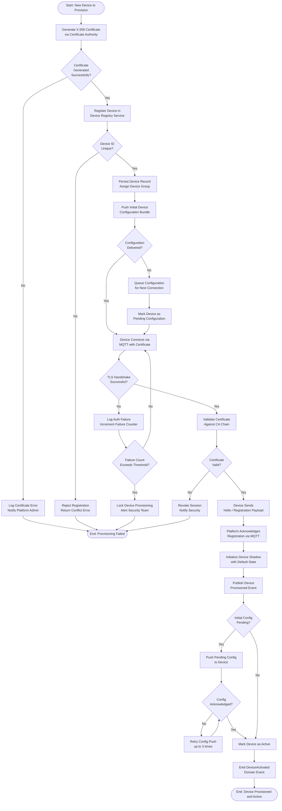
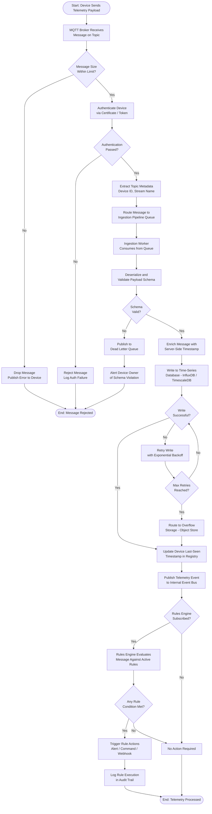
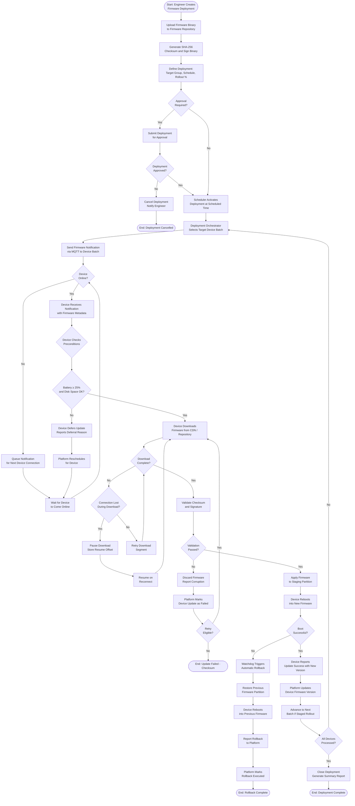
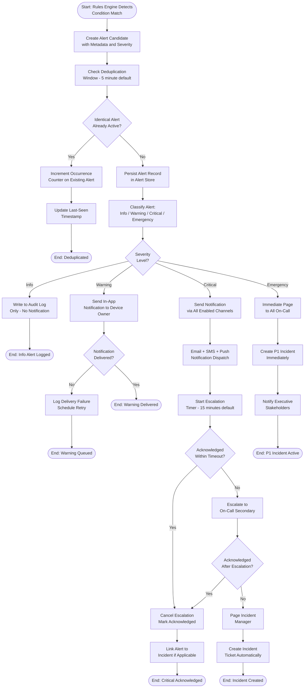
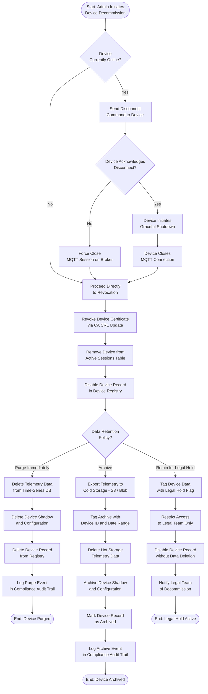

# Activity Diagrams

Activity diagrams model the dynamic flow of actions within key platform processes. Each diagram represents the sequence of steps, decision points, parallel activities, and exception paths that govern a major operational workflow in the IoT Device Management Platform.

---

## Device Provisioning Activity

Device provisioning is the process by which a new physical device gains a verified, trusted identity within the platform and establishes its first authenticated connection. The activity spans certificate generation, device registration, configuration push, connectivity validation, and final activation.

The provisioning activity is designed to be idempotent at each stage. If the platform receives a duplicate provisioning request for an already-registered device with identical certificate fingerprint, the existing record is returned rather than raising an error, allowing safe retry from devices that lose connectivity during provisioning.

---

## Telemetry Ingestion Activity

Telemetry ingestion handles the continuous stream of sensor readings, status messages, and diagnostic payloads from connected devices. The pipeline must process messages durably, route them to the appropriate storage and processing systems, and trigger rules evaluation in near real-time.

The ingestion pipeline is designed for horizontal scalability. Multiple consumer workers operate in parallel, partitioned by device group or geographic region, ensuring that a telemetry surge from one device class does not affect ingestion latency for other device groups.

---

## OTA Firmware Update Activity

Over-the-air firmware updates are one of the most complex and risk-sensitive operations in the platform. The activity covers the full lifecycle from deployment creation through device reporting, including validation, rollback, and failure handling.

The staged rollout mechanism is critical for large device fleets. Deployments begin with a canary batch (typically 1–5% of targets), and the platform automatically pauses rollout if the failure rate in the canary batch exceeds a configured threshold, preventing mass failures across the entire fleet.

---

## Alert Processing Activity

Alert processing translates raw rules engine trigger events into actionable notifications, applying deduplication, severity escalation, and multi-channel delivery. The activity ensures that alert fatigue is minimized while guaranteeing that critical conditions are never silently dropped.

Alert deduplication is stateful and window-based. The platform maintains an in-memory bloom filter seeded from the persistent alert store to perform sub-millisecond deduplication checks during high-volume alert storms. Alerts for the same device and same rule within the deduplication window are collapsed into a single record with an occurrence count.

---

## Device Decommissioning Activity

Device decommissioning permanently removes a device from the platform, revoking its credentials, purging or archiving its data according to retention policy, and ensuring no orphaned state remains in any subsystem.

Decommissioning is an irreversible operation that requires confirmation from a platform administrator with the `device:decommission` permission. The system enforces a 24-hour soft-delete window during which the decommission can be cancelled, after which the process becomes permanent. All decommissioning actions are recorded in the immutable compliance audit trail with the initiating user's identity and timestamp.

---

## Summary

These activity diagrams capture the control flow and decision logic for the five most operationally significant workflows in the IoT Device Management Platform. Each diagram is designed to be traceable to the corresponding sequence diagrams and state machine diagrams in the detailed design, providing multiple complementary views of the same underlying system behavior.

| Activity | Primary Actors | Key Risk Points |
|---|---|---|
| Device Provisioning | Platform, CA, Device | Certificate issuance, auth failures |
| Telemetry Ingestion | Device, Broker, Pipeline, Rules Engine | Schema violations, write failures |
| OTA Firmware Update | Engineer, Orchestrator, Device | Boot failure, corrupted firmware |
| Alert Processing | Rules Engine, Alert Manager, On-Call | Alert fatigue, escalation failures |
| Device Decommissioning | Admin, CA, Storage | Data residency, orphaned state |
