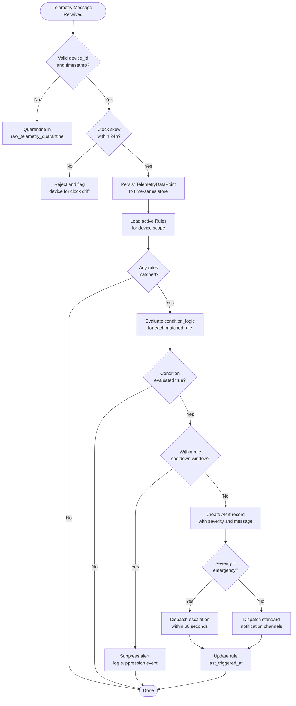

# Business Rules

## Introduction

This document defines the enforceable business rules for the IoT Device Management Platform. These rules govern device lifecycle, security posture, OTA update policies, telemetry handling, alerting, and operator overrides. Each rule is assigned a unique identifier (BR-XX) and specifies the enforcement layer, actors involved, and consequences of violation.

Rules are classified by enforcement layer:
- **Database Layer** — enforced via constraints, triggers, or check clauses.
- **Service Layer** — enforced in application code before any persistence operation.
- **API Gateway Layer** — enforced via middleware, rate limiting, or authentication checks.
- **Device/Edge Layer** — enforced by the device SDK or firmware logic.

All rules in this document are considered binding. Deviations require a formal exception as described in the Exception and Override Handling section.

---

## Enforceable Rules

The following table enumerates all platform business rules with their enforcement layers and violation consequences.

| Rule ID | Category | Rule Summary | Enforcement Layer | Violation Consequence |
|---|---|---|---|---|
| BR-01 | Authentication | A device must complete certificate-based (x509) or PSK authentication before receiving any commands or configuration updates | Service Layer, MQTT Broker | Connection rejected; event logged to AuditLog |
| BR-02 | Authentication | Device credentials (x509 certs and PSKs) must not be shared across devices; each device receives a unique credential | Service Layer | Provisioning request rejected with HTTP 409 |
| BR-03 | Authentication | Revoked or expired credentials must be denied at the MQTT broker level within 60 seconds of revocation | API Gateway, MQTT Broker | Immediate disconnect; certificate added to CRL |
| BR-04 | Provisioning | A device may only be provisioned into one organization at a time | Database Layer | Unique constraint violation; HTTP 409 returned |
| BR-05 | Provisioning | Device serial numbers must be unique within an organization; cross-organization reuse is permitted | Database Layer | Unique constraint on (organization_id, serial_number) |
| BR-06 | Fleet Management | A device can only belong to one fleet (device group) at a time | Service Layer, Database Layer | Existing fleet assignment must be cleared before new assignment |
| BR-07 | Fleet Management | Deleting a fleet with active devices requires explicit reassignment or decommission of all member devices | Service Layer | HTTP 409 with list of blocking device IDs |
| BR-08 | OTA Updates | OTA firmware packages must carry a valid cryptographic signature verified against the organization's trusted signing key | Service Layer | Firmware upload rejected; signature mismatch logged |
| BR-09 | OTA Updates | Devices must verify the firmware checksum (SHA-256) before installing an OTA update | Device/Edge Layer | Installation aborted; failure status reported to OTAJob |
| BR-10 | OTA Updates | OTA jobs with `auto_rollback = true` must automatically revert to the previous firmware version if the failure rate exceeds `failure_threshold_pct` | Service Layer | Rollback job created; OTAJob status set to `failed` |
| BR-11 | OTA Updates | A device must not have more than one active OTA update job at a time | Service Layer | New job creation rejected with HTTP 409 |
| BR-12 | Telemetry | Telemetry data points must include a valid `device_id` and a `device_timestamp` within accepted clock skew bounds | Service Layer, Ingestion Pipeline | Data point quarantined in `raw_telemetry_quarantine` |
| BR-13 | Telemetry | `device_timestamp` must not be more than 24 hours in the future relative to server ingestion time | Ingestion Pipeline | Data point rejected; device flagged for clock drift |
| BR-14 | Telemetry | Telemetry streams must not exceed the configured `retention_days`; data older than retention period is purged | Database Layer, Retention Job | Automated purge via scheduled job; no API action required |
| BR-15 | Certificates | Certificate expiry must trigger an automatic renewal workflow 30 days before the `expires_at` timestamp | Service Layer, Background Job | Renewal job created; operator notified via alert |
| BR-16 | Certificates | Revocation of a certificate must propagate to the CRL within 60 seconds and disconnect any active MQTT sessions using that certificate | Service Layer, MQTT Broker | Active sessions terminated; CRL updated |
| BR-17 | Alerting | A rule with `cooldown_seconds > 0` must not generate more than one alert for the same device within the cooldown window | Service Layer | Duplicate alert suppressed; suppression logged |
| BR-18 | Alerting | Alerts of severity `emergency` must be escalated to all configured escalation channels within 60 seconds of triggering | Service Layer, Notification Worker | Escalation failure generates a platform-level incident |
| BR-19 | Commands | Commands with TTL expired before dispatch must be marked `timeout` and never sent to the device | Service Layer | Command status updated to `timeout`; device not contacted |
| BR-20 | Data Governance | All write operations to auditable entities (devices, certificates, ota_jobs, rules, organizations) must produce an immutable AuditLog entry | Service Layer | Write operation rolled back if AuditLog insert fails |

---

## Core Business Rule Statements

The following numbered statements represent the canonical expression of platform-critical rules in plain language.

1. A device must complete certificate-based authentication before receiving commands.
2. Telemetry data points must include a valid device_id and timestamp.
3. OTA updates must be cryptographically signed and verified before installation.
4. Certificate expiry must trigger automatic renewal 30 days before expiration.
5. A device can only belong to one fleet at a time.
6. Revoked credentials must be invalidated at the broker within 60 seconds of revocation.
7. OTA jobs with auto-rollback enabled must revert firmware when the failure threshold is exceeded.
8. Commands that expire before dispatch must be marked as timeout and discarded.
9. Emergency alerts must be escalated to all configured channels within 60 seconds.
10. All writes to auditable entities must produce an immutable audit log entry.
11. A device may not have more than one active OTA job concurrently.
12. Telemetry timestamps that are more than 24 hours in the future are rejected.
13. Deleting a fleet requires all member devices to be reassigned or decommissioned first.
14. Device serial numbers must be unique within their owning organization.
15. Alert cooldown windows prevent duplicate alerts for the same rule-device pair.

---

## Rule Evaluation Pipeline

The following flowchart describes the end-to-end pipeline for evaluating business rules when a telemetry event is received and potentially triggers an alert.

### Pipeline Stage Descriptions

**Stage 1 — Ingestion Validation**: The ingestion pipeline validates that each incoming message contains a resolvable `device_id` and a `device_timestamp` within clock-skew bounds. Messages failing this check are quarantined and never reach the main data store.

**Stage 2 — Persistence**: Valid data points are written to the time-series store. The write is atomic; failure at this stage causes the message to be requeued for retry up to three times before being sent to the dead-letter queue.

**Stage 3 — Rule Loading**: The rules engine loads all enabled rules applicable to the device's organization, fleet, and device scope. Rules are cached in memory with a 30-second TTL to reduce database pressure.

**Stage 4 — Condition Evaluation**: Each rule's `condition_logic` JSON expression is evaluated against the incoming data point using the platform's condition DSL engine. Evaluation is stateless and must complete within 100 ms per rule.

**Stage 5 — Cooldown Check**: Before generating an alert, the engine checks whether the last trigger time for the same rule-device pair is within the rule's `cooldown_seconds` window. Suppressed alerts are logged for audit purposes.

**Stage 6 — Alert Dispatch**: Alerts passing the cooldown gate are persisted and routed to the appropriate notification channels. Emergency alerts enter a priority escalation queue.

---

## Exception and Override Handling

Certain operational scenarios require temporary deviations from enforced business rules. The platform provides a governed exception mechanism to accommodate these cases while preserving audit integrity.

### Exception Categories

**Category A — Planned Maintenance Exceptions**
Operators may suspend specific rules (BR-17 cooldown, BR-18 escalation) during planned maintenance windows. Suspension is time-bounded and requires approval from an organization administrator. A maintenance window record is created with a start and end timestamp; all suppressed alerts during the window are tagged with the maintenance window ID.

**Category B — Emergency Override**
In cases of critical infrastructure failure, a platform administrator may issue an emergency override to bypass BR-03 (credential revocation propagation delay) or BR-11 (concurrent OTA job restriction). Emergency overrides are subject to the following controls:
- Must be authorized by two platform administrators (four-eyes principle).
- Are valid for a maximum of 4 hours.
- Generate immutable AuditLog entries at creation, use, and expiry.
- Are automatically revoked at expiry; manual extension requires re-authorization.

**Category C — Bulk Provisioning Exception**
During large-scale device fleet onboarding, the service-layer uniqueness checks for BR-04 and BR-05 may be replaced with a bulk import mode that uses database-level constraint enforcement only. Bulk import mode is available only to organization administrators and is rate-limited to 10,000 devices per import job.

### Override Audit Requirements

All exceptions and overrides must satisfy the following audit requirements regardless of category:
- The exception record must reference the specific BR-XX rule being overridden.
- The authorizing actor's `user_id` and role must be recorded.
- The business justification must be non-empty (minimum 20 characters).
- All actions taken during the exception window are tagged with the exception ID in the AuditLog.
- Post-exception, a reconciliation check runs automatically to verify that no data integrity violations occurred during the exception window.

### Rule Conflict Resolution

When two or more rules produce conflicting outcomes for the same device event, the following precedence order applies:

1. **Security rules** (BR-01, BR-02, BR-03, BR-08, BR-09, BR-16) always take precedence over operational rules.
2. **Device-scoped rules** take precedence over fleet-scoped rules, which take precedence over organization-scoped rules.
3. **Higher severity** alert outcomes take precedence when two rules would generate alerts of different severity for the same event.
4. In cases of equal precedence, the rule with the lower BR-XX identifier number is applied first.

### Graceful Degradation Policy

If the rules evaluation engine becomes unavailable (e.g., cache service outage), the platform falls back to the following safe defaults:
- Telemetry ingestion continues uninterrupted; rule evaluation is queued for replay.
- No new alerts are generated during the outage window.
- OTA job dispatching is paused until the rules engine recovers.
- All commands with TTL greater than 300 seconds are held in the dispatch queue.
- A platform-level incident is automatically opened when the outage exceeds 60 seconds.
