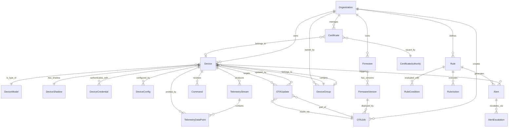

# Data Dictionary

## Core Entities

Entity descriptions and attribute tables for the IoT Device Management Platform.

### Entity: Organization
| Attribute | Type | Nullable | Description | Validation |
|---|---|---|---|---|
| id | UUID | No | Unique organization identifier | Must be UUID v4 |
| name | VARCHAR(255) | No | Organization display name | Min 2, max 255 chars |
| slug | VARCHAR(100) | No | URL-safe unique identifier | Lowercase alphanumeric with hyphens |
| plan_tier | ENUM | No | Subscription plan level | One of: free, starter, professional, enterprise |
| max_devices | INTEGER | No | Maximum allowed devices | Must be positive integer |
| created_at | TIMESTAMPTZ | No | Creation timestamp | ISO 8601, UTC |
| updated_at | TIMESTAMPTZ | No | Last modification timestamp | ISO 8601, UTC |
| status | ENUM | No | Organization operational status | One of: active, suspended, deactivated |

### Entity: Device
| Attribute | Type | Nullable | Description | Validation |
|---|---|---|---|---|
| id | UUID | No | Unique device identifier | Must be UUID v4 |
| organization_id | UUID | No | Owning organization | Must reference organizations.id |
| device_model_id | UUID | No | Associated device model | Must reference device_models.id |
| fleet_id | UUID | Yes | Assigned fleet/group | Must reference device_groups.id |
| serial_number | VARCHAR(255) | No | Hardware serial number | Unique within organization |
| name | VARCHAR(255) | No | Human-readable device name | Min 1, max 255 chars |
| status | ENUM | No | Device lifecycle status | One of: provisioning, active, inactive, offline, decommissioned |
| firmware_version | VARCHAR(50) | Yes | Currently installed firmware | Semantic version format |
| last_seen_at | TIMESTAMPTZ | Yes | Last connectivity timestamp | ISO 8601, UTC |
| ip_address | INET | Yes | Last known IP address | Valid IPv4 or IPv6 |
| location_lat | DECIMAL(9,6) | Yes | GPS latitude | -90.0 to 90.0 |
| location_lon | DECIMAL(9,6) | Yes | GPS longitude | -180.0 to 180.0 |
| tags | JSONB | Yes | Key-value metadata tags | Valid JSON object |
| created_at | TIMESTAMPTZ | No | Provisioning timestamp | ISO 8601, UTC |
| updated_at | TIMESTAMPTZ | No | Last modification timestamp | ISO 8601, UTC |

### Entity: DeviceModel
| Attribute | Type | Nullable | Description | Validation |
|---|---|---|---|---|
| id | UUID | No | Unique model identifier | Must be UUID v4 |
| organization_id | UUID | No | Owning organization | Must reference organizations.id |
| manufacturer | VARCHAR(255) | No | Hardware manufacturer name | Non-empty string |
| model_name | VARCHAR(255) | No | Model designation | Non-empty string |
| model_version | VARCHAR(50) | No | Hardware version | Semantic version format |
| connectivity_protocols | VARCHAR[] | No | Supported connection protocols | Array of: mqtt, coap, https, amqp |
| power_source | ENUM | No | Primary power type | One of: battery, wired, solar, harvesting |
| cpu_arch | VARCHAR(50) | Yes | Processor architecture | e.g., arm64, x86_64, rv32 |
| flash_kb | INTEGER | Yes | Flash storage in kilobytes | Must be positive |
| ram_kb | INTEGER | Yes | RAM in kilobytes | Must be positive |
| created_at | TIMESTAMPTZ | No | Record creation timestamp | ISO 8601, UTC |

### Entity: DeviceCredential
| Attribute | Type | Nullable | Description | Validation |
|---|---|---|---|---|
| id | UUID | No | Unique credential identifier | Must be UUID v4 |
| device_id | UUID | No | Associated device | Must reference devices.id |
| credential_type | ENUM | No | Authentication method | One of: x509, psk, jwt_secret |
| thumbprint | VARCHAR(128) | Yes | Certificate SHA-256 thumbprint | Hex string for x509 type |
| psk_identity | VARCHAR(255) | Yes | PSK identity string | Required for psk type |
| psk_value_hash | VARCHAR(255) | Yes | Hashed PSK value | Bcrypt hash, never stored plaintext |
| status | ENUM | No | Credential validity status | One of: active, revoked, expired |
| issued_at | TIMESTAMPTZ | No | Credential issuance time | ISO 8601, UTC |
| expires_at | TIMESTAMPTZ | Yes | Expiry timestamp | Must be after issued_at |

### Entity: DeviceShadow
| Attribute | Type | Nullable | Description | Validation |
|---|---|---|---|---|
| id | UUID | No | Shadow record identifier | Must be UUID v4 |
| device_id | UUID | No | Associated device (unique) | Must reference devices.id, UNIQUE |
| desired_state | JSONB | No | Operator-set target state | Valid JSON object, max 64 KB |
| reported_state | JSONB | No | Device-reported actual state | Valid JSON object, max 64 KB |
| delta | JSONB | Yes | Diff of desired minus reported | Computed field, may be null if in sync |
| desired_version | BIGINT | No | Optimistic lock version for desired | Monotonically increasing |
| reported_version | BIGINT | No | Optimistic lock version for reported | Monotonically increasing |
| last_sync_at | TIMESTAMPTZ | Yes | Last successful sync timestamp | ISO 8601, UTC |
| updated_at | TIMESTAMPTZ | No | Last modification timestamp | ISO 8601, UTC |

### Entity: DeviceConfig
| Attribute | Type | Nullable | Description | Validation |
|---|---|---|---|---|
| id | UUID | No | Unique config identifier | Must be UUID v4 |
| device_id | UUID | No | Associated device | Must reference devices.id |
| config_key | VARCHAR(255) | No | Configuration parameter name | Alphanumeric with underscores |
| config_value | TEXT | No | Configuration value | Max 4096 chars |
| data_type | ENUM | No | Value data type | One of: string, integer, float, boolean, json |
| source | ENUM | No | Config origin | One of: platform, device, template, override |
| applied_at | TIMESTAMPTZ | Yes | When device acknowledged config | ISO 8601, UTC |
| created_at | TIMESTAMPTZ | No | Record creation timestamp | ISO 8601, UTC |

### Entity: Firmware
| Attribute | Type | Nullable | Description | Validation |
|---|---|---|---|---|
| id | UUID | No | Unique firmware package identifier | Must be UUID v4 |
| organization_id | UUID | No | Owning organization | Must reference organizations.id |
| device_model_id | UUID | No | Target device model | Must reference device_models.id |
| name | VARCHAR(255) | No | Firmware package name | Non-empty string |
| description | TEXT | Yes | Release notes and description | Max 8192 chars |
| created_at | TIMESTAMPTZ | No | Package creation timestamp | ISO 8601, UTC |

### Entity: FirmwareVersion
| Attribute | Type | Nullable | Description | Validation |
|---|---|---|---|---|
| id | UUID | No | Unique version identifier | Must be UUID v4 |
| firmware_id | UUID | No | Parent firmware package | Must reference firmware.id |
| version | VARCHAR(50) | No | Semantic version string | Must match semver regex |
| artifact_url | TEXT | No | Signed S3/GCS download URL | Valid HTTPS URL |
| checksum_sha256 | CHAR(64) | No | SHA-256 hash of binary | 64-char hex string |
| signature | TEXT | No | Cryptographic signature | Base64-encoded signature |
| size_bytes | BIGINT | No | Binary size in bytes | Must be positive |
| min_version | VARCHAR(50) | Yes | Minimum upgrade-from version | Must match semver if provided |
| release_status | ENUM | No | Release lifecycle stage | One of: draft, testing, release_candidate, released, deprecated |
| released_at | TIMESTAMPTZ | Yes | Public release timestamp | ISO 8601, UTC |
| created_at | TIMESTAMPTZ | No | Record creation timestamp | ISO 8601, UTC |

### Entity: OTAJob
| Attribute | Type | Nullable | Description | Validation |
|---|---|---|---|---|
| id | UUID | No | Unique OTA job identifier | Must be UUID v4 |
| organization_id | UUID | No | Owning organization | Must reference organizations.id |
| firmware_version_id | UUID | No | Target firmware version | Must reference firmware_versions.id |
| name | VARCHAR(255) | No | Human-readable job name | Non-empty string |
| status | ENUM | No | Job lifecycle state | One of: created, scheduled, in_progress, paused, completed, failed, cancelled |
| deployment_strategy | ENUM | No | Rollout strategy | One of: all_at_once, staged_percentage, canary, manual |
| target_type | ENUM | No | Scope of target devices | One of: all_devices, fleet, device_group, specific_devices |
| target_ids | UUID[] | Yes | Specific target device/group IDs | Required if target_type is specific |
| rollout_percentage | INTEGER | Yes | Staged rollout percentage | 1-100, required for staged strategy |
| timeout_seconds | INTEGER | No | Per-device update timeout | Must be 60-86400 |
| retry_count | INTEGER | No | Maximum retry attempts | 0-5 |
| auto_rollback | BOOLEAN | No | Rollback on failure threshold | Default true |
| failure_threshold_pct | INTEGER | No | Failure rate triggering rollback | 1-100, default 10 |
| scheduled_at | TIMESTAMPTZ | Yes | Scheduled start time | ISO 8601, UTC, future date |
| started_at | TIMESTAMPTZ | Yes | Actual start timestamp | ISO 8601, UTC |
| completed_at | TIMESTAMPTZ | Yes | Completion timestamp | ISO 8601, UTC |
| created_at | TIMESTAMPTZ | No | Job creation timestamp | ISO 8601, UTC |

### Entity: TelemetryStream
| Attribute | Type | Nullable | Description | Validation |
|---|---|---|---|---|
| id | UUID | No | Unique stream identifier | Must be UUID v4 |
| device_id | UUID | No | Source device | Must reference devices.id |
| stream_name | VARCHAR(255) | No | Logical stream name | Alphanumeric with hyphens |
| schema_version | VARCHAR(20) | No | Payload schema version | Semantic version |
| retention_days | INTEGER | No | Data retention period | 1-3650 days |
| compression | ENUM | No | Data compression algorithm | One of: none, gzip, lz4, zstd |
| created_at | TIMESTAMPTZ | No | Stream creation timestamp | ISO 8601, UTC |

### Entity: TelemetryDataPoint
| Attribute | Type | Nullable | Description | Validation |
|---|---|---|---|---|
| id | BIGSERIAL | No | Auto-increment row identifier | Positive integer |
| device_id | UUID | No | Source device | Must reference devices.id |
| stream_id | UUID | No | Associated telemetry stream | Must reference telemetry_streams.id |
| metric_name | VARCHAR(255) | No | Measurement name | Alphanumeric with underscores |
| value_numeric | DOUBLE PRECISION | Yes | Numeric metric value | Null if non-numeric |
| value_text | TEXT | Yes | String metric value | Null if numeric |
| value_boolean | BOOLEAN | Yes | Boolean metric value | Null if not boolean |
| unit | VARCHAR(50) | Yes | Unit of measurement | e.g., celsius, percent, rpm |
| device_timestamp | TIMESTAMPTZ | No | Device-reported measurement time | ISO 8601, must not be future |
| ingested_at | TIMESTAMPTZ | No | Platform ingestion timestamp | ISO 8601, UTC |
| quality | SMALLINT | No | Data quality score | 0-100 |

### Entity: Rule
| Attribute | Type | Nullable | Description | Validation |
|---|---|---|---|---|
| id | UUID | No | Unique rule identifier | Must be UUID v4 |
| organization_id | UUID | No | Owning organization | Must reference organizations.id |
| name | VARCHAR(255) | No | Human-readable rule name | Non-empty string |
| description | TEXT | Yes | Rule purpose description | Max 4096 chars |
| scope | ENUM | No | Rule evaluation scope | One of: device, fleet, organization |
| scope_id | UUID | Yes | Specific scope target ID | Required if scope is not organization |
| condition_logic | JSONB | No | Structured condition expression | Valid condition DSL JSON |
| is_enabled | BOOLEAN | No | Rule active status | Default true |
| cooldown_seconds | INTEGER | No | Minimum time between triggers | 0-86400, default 300 |
| created_at | TIMESTAMPTZ | No | Rule creation timestamp | ISO 8601, UTC |
| updated_at | TIMESTAMPTZ | No | Last modification timestamp | ISO 8601, UTC |

### Entity: Alert
| Attribute | Type | Nullable | Description | Validation |
|---|---|---|---|---|
| id | UUID | No | Unique alert identifier | Must be UUID v4 |
| organization_id | UUID | No | Owning organization | Must reference organizations.id |
| rule_id | UUID | No | Triggering rule | Must reference rules.id |
| device_id | UUID | No | Affected device | Must reference devices.id |
| severity | ENUM | No | Alert urgency level | One of: info, warning, critical, emergency |
| status | ENUM | No | Alert lifecycle state | One of: triggered, acknowledged, resolved, suppressed |
| title | VARCHAR(255) | No | Short alert description | Non-empty string |
| message | TEXT | No | Detailed alert message | Non-empty string |
| triggered_at | TIMESTAMPTZ | No | Alert trigger timestamp | ISO 8601, UTC |
| acknowledged_at | TIMESTAMPTZ | Yes | Acknowledgment timestamp | ISO 8601, UTC, after triggered_at |
| resolved_at | TIMESTAMPTZ | Yes | Resolution timestamp | ISO 8601, UTC, after triggered_at |
| acknowledged_by | UUID | Yes | User who acknowledged | Must reference users.id |

### Entity: Command
| Attribute | Type | Nullable | Description | Validation |
|---|---|---|---|---|
| id | UUID | No | Unique command identifier | Must be UUID v4 |
| organization_id | UUID | No | Owning organization | Must reference organizations.id |
| device_id | UUID | No | Target device | Must reference devices.id |
| command_type | VARCHAR(100) | No | Command operation type | Non-empty, registered command type |
| payload | JSONB | Yes | Command parameters | Valid JSON, max 16 KB |
| status | ENUM | No | Command execution state | One of: queued, dispatched, acknowledged, executing, completed, failed, timeout, cancelled |
| priority | SMALLINT | No | Dispatch priority level | 1 (highest) to 10 (lowest) |
| issued_by | UUID | No | Issuing user or service | Must reference users or service accounts |
| ttl_seconds | INTEGER | No | Time-to-live for queued command | 60-604800, default 3600 |
| dispatched_at | TIMESTAMPTZ | Yes | MQTT dispatch timestamp | ISO 8601, UTC |
| acknowledged_at | TIMESTAMPTZ | Yes | Device acknowledgment timestamp | ISO 8601, UTC |
| completed_at | TIMESTAMPTZ | Yes | Completion timestamp | ISO 8601, UTC |
| created_at | TIMESTAMPTZ | No | Command creation timestamp | ISO 8601, UTC |

### Entity: Certificate
| Attribute | Type | Nullable | Description | Validation |
|---|---|---|---|---|
| id | UUID | No | Unique certificate identifier | Must be UUID v4 |
| organization_id | UUID | No | Owning organization | Must reference organizations.id |
| device_id | UUID | Yes | Associated device if device cert | Must reference devices.id |
| ca_id | UUID | Yes | Issuing certificate authority | Must reference certificate_authorities.id |
| subject_dn | TEXT | No | Certificate subject distinguished name | Valid X.500 DN format |
| thumbprint_sha256 | CHAR(64) | No | SHA-256 fingerprint (unique) | 64-char hex string |
| serial_number | VARCHAR(40) | No | Certificate serial number | Hex string |
| status | ENUM | No | Certificate validity status | One of: active, revoked, expired, pending_renewal |
| issued_at | TIMESTAMPTZ | No | Certificate issuance time | ISO 8601, UTC |
| expires_at | TIMESTAMPTZ | No | Certificate expiry time | ISO 8601, must be after issued_at |
| revoked_at | TIMESTAMPTZ | Yes | Revocation timestamp | ISO 8601, UTC, set on revocation |
| revocation_reason | VARCHAR(100) | Yes | CRL revocation reason code | e.g., keyCompromise, superseded |
| pem | TEXT | No | PEM-encoded certificate | Valid PEM format, stored encrypted |

## Canonical Relationship Diagram

The following entity-relationship diagram illustrates the core data model and referential relationships across all platform entities.

## Data Quality Controls

The IoT Device Management Platform enforces the following data quality rules at the database, service, and ingestion layers.

### Referential Integrity
- All foreign key relationships are enforced at the database level with `ON DELETE RESTRICT` unless explicitly documented otherwise.
- Cascade deletes are only permitted for child records with no independent audit value (e.g., `DeviceConfig` rows when a device is hard-deleted during testing environments).
- Soft-delete patterns (`deleted_at` column) are preferred over hard deletes for auditable entities.

### Timestamp Validation
- All timestamps must be stored in UTC using `TIMESTAMPTZ`.
- `device_timestamp` in `TelemetryDataPoint` must not be more than 24 hours in the future relative to ingestion time.
- `device_timestamp` values older than the configured stream retention period are rejected at the ingestion boundary.
- Ordering timestamps must satisfy: `issued_at <= activated_at <= expires_at` for certificates.

### Uniqueness Constraints
| Entity | Unique Constraint |
|---|---|
| Organization | `slug` globally unique |
| Device | `(organization_id, serial_number)` unique |
| DeviceShadow | `device_id` unique — one shadow per device |
| Certificate | `thumbprint_sha256` globally unique |
| FirmwareVersion | `(firmware_id, version)` unique |
| TelemetryStream | `(device_id, stream_name)` unique |

### Data Type and Range Validation
- `location_lat` must be in range [-90.0, 90.0]; `location_lon` must be in range [-180.0, 180.0].
- `quality` in `TelemetryDataPoint` must be in range [0, 100].
- `rollout_percentage` in `OTAJob` must be in range [1, 100] when `deployment_strategy = staged_percentage`.
- `failure_threshold_pct` must be in range [1, 100].
- `priority` in `Command` must be in range [1, 10].

### Payload Size Limits
| Entity / Field | Maximum Size |
|---|---|
| DeviceShadow.desired_state | 64 KB |
| DeviceShadow.reported_state | 64 KB |
| Command.payload | 16 KB |
| TelemetryDataPoint.value_text | 4 KB |
| DeviceConfig.config_value | 4 KB |
| MQTT telemetry message | 256 KB |

### Enumeration Validation
- All `ENUM` columns are validated at the application service layer before reaching the database, returning HTTP 422 with field-level error details on invalid values.
- Unknown enum values from device firmware (reported via MQTT) are quarantined in the `raw_telemetry_quarantine` table for operator review.

### Null Safety Rules
- `Device.firmware_version` may be null only while `Device.status = 'provisioning'`. After first successful activation, firmware version must be present.
- `DeviceShadow.delta` is computed and may be null only when `desired_state` and `reported_state` are identical.
- `Certificate.revoked_at` and `Certificate.revocation_reason` must both be null or both be non-null.
- `OTAJob.target_ids` must be non-null when `target_type` is `specific_devices`.

### Audit Logging Requirements
- Every write operation to `devices`, `certificates`, `ota_jobs`, `rules`, and `organizations` tables generates an immutable `AuditLog` record.
- AuditLog records are append-only and cannot be modified or deleted via any API endpoint.
- Audit records include: `actor_id`, `actor_type`, `action`, `entity_type`, `entity_id`, `before_state`, `after_state`, `ip_address`, `timestamp`.
