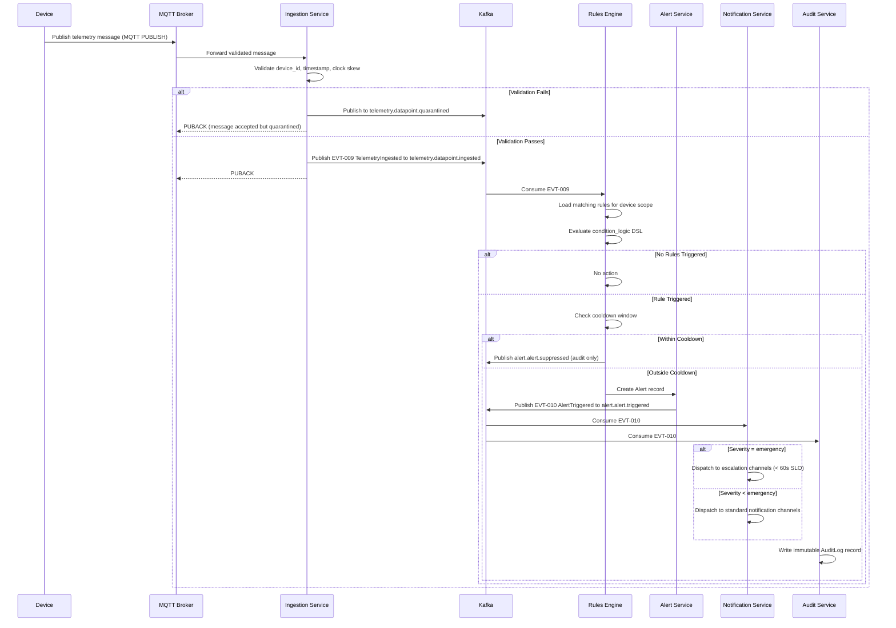
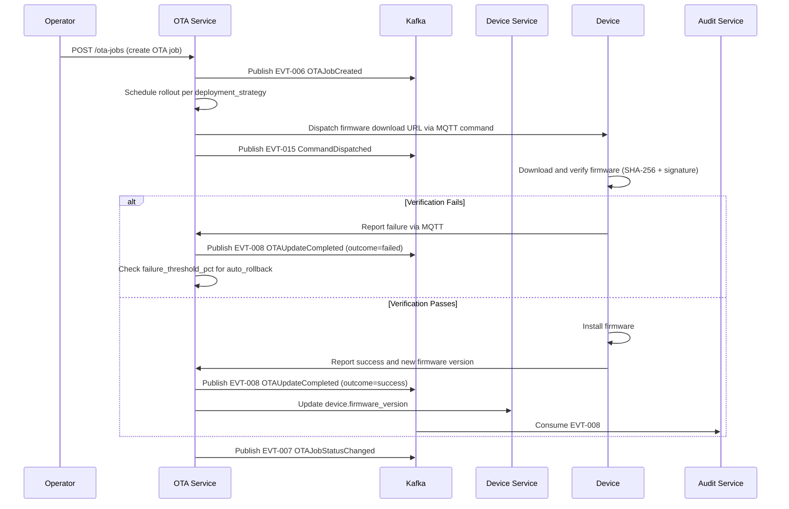

# Event Catalog

## Introduction

This document is the authoritative event catalog for the IoT Device Management Platform. It defines every domain event produced by platform services, the channels on which they are published, their producers and consumers, payload schemas, and the operational SLOs that govern delivery guarantees.

The platform uses an event-driven architecture built on a durable message broker (Apache Kafka). All domain events conform to the envelope schema defined in the Contract Conventions section. Consumers subscribe to typed topic channels and must handle events idempotently.

This catalog is versioned alongside the platform API. Breaking changes to any event schema require a version increment and a deprecation notice period of no less than 90 days.

---

## Contract Conventions

### Event Envelope Schema

Every event published by the platform is wrapped in a standard envelope regardless of domain. The envelope guarantees that consumers can route, deduplicate, and trace events without parsing domain-specific payloads.

```json
{
  "envelope_version": "1.0",
  "event_id": "<UUID v4>",
  "event_name": "<string>",
  "event_version": "<semver>",
  "schema_version": "<semver>",
  "occurred_at": "<ISO 8601 UTC timestamp>",
  "ingested_at": "<ISO 8601 UTC timestamp>",
  "producer": "<service-name>",
  "organization_id": "<UUID>",
  "correlation_id": "<UUID>",
  "causation_id": "<UUID or null>",
  "payload": { }
}
```

### Envelope Field Descriptions

| Field | Type | Required | Description |
|---|---|---|---|
| envelope_version | string | Yes | Schema version of the envelope itself; current value is "1.0" |
| event_id | UUID | Yes | Globally unique event identifier; used for deduplication |
| event_name | string | Yes | Fully qualified event name matching the Domain Events table |
| event_version | semver | Yes | Version of this specific event type's payload schema |
| schema_version | semver | Yes | Alias for event_version; retained for backward compatibility |
| occurred_at | TIMESTAMPTZ | Yes | Timestamp when the domain action occurred, in UTC |
| ingested_at | TIMESTAMPTZ | Yes | Timestamp when the broker received and persisted the event |
| producer | string | Yes | Name of the producing service (e.g., device-service) |
| organization_id | UUID | Yes | Tenant identifier; used for consumer-side filtering |
| correlation_id | UUID | Yes | End-to-end request trace identifier; links related events |
| causation_id | UUID | No | event_id of the event that caused this event; null for root events |
| payload | object | Yes | Domain-specific event payload conforming to the event's schema |

### Event Versioning Rules

1. **Backward-compatible changes** (adding optional fields, adding enum values) are released as a PATCH or MINOR version increment. Existing consumers must continue to function without modification.
2. **Breaking changes** (removing fields, changing field types, renaming fields) require a MAJOR version increment and a deprecation period of at least 90 days.
3. During the deprecation period, both the old and new event versions are published simultaneously on the same topic with different `event_version` values.
4. Consumers must filter on `event_version` to handle schema evolution; consumers ignoring unknown fields are inherently forward-compatible.
5. Event schemas are registered in the platform's Schema Registry. Producers must validate payloads against the registered schema before publishing.

### Topic Naming Convention

Topics follow the pattern: `<domain>.<entity>.<action>` in lowercase with dots as separators.

- `domain` — the bounded context (e.g., `device`, `firmware`, `alert`, `telemetry`, `command`).
- `entity` — the primary entity involved (e.g., `device`, `otajob`, `certificate`).
- `action` — the past-tense event verb (e.g., `provisioned`, `updated`, `expired`).

Examples: `device.device.provisioned`, `firmware.otajob.completed`, `alert.alert.triggered`.

### Delivery and Ordering Guarantees

- **At-least-once delivery**: All events are published with at-least-once semantics. Consumers must implement idempotency using `event_id`.
- **Per-partition ordering**: Events are partitioned by `organization_id` to ensure ordering within a tenant. Cross-tenant ordering is not guaranteed.
- **Retention**: All topics retain events for a minimum of 7 days. Long-term archival topics retain events for 1 year.

---

## Domain Events

The following table enumerates all domain events published by the IoT Device Management Platform.

| Event ID | Event Name | Topic/Channel | Producer | Consumer(s) | Trigger | Payload Fields |
|---|---|---|---|---|---|---|
| EVT-001 | DeviceProvisioned | device.device.provisioned | Device Service | Fleet Service, Audit Service, Notification Service | Device completes provisioning workflow | device_id, org_id, model_id, serial_number, provisioned_at |
| EVT-002 | DeviceStatusChanged | device.device.status_changed | Device Service | Alert Service, Shadow Service, Audit Service | Device lifecycle status transitions | device_id, org_id, previous_status, new_status, changed_at, reason |
| EVT-003 | DeviceLastSeenUpdated | device.device.last_seen_updated | Connectivity Service | Fleet Service, Shadow Service | Device sends heartbeat or telemetry | device_id, org_id, last_seen_at, ip_address |
| EVT-004 | DeviceDecommissioned | device.device.decommissioned | Device Service | Certificate Service, Command Service, OTA Service, Audit Service | Device is decommissioned by operator | device_id, org_id, decommissioned_at, decommissioned_by |
| EVT-005 | FirmwareVersionReleased | firmware.version.released | Firmware Service | OTA Service, Notification Service | Firmware version status changes to released | firmware_id, version_id, version, model_id, org_id, released_at |
| EVT-006 | OTAJobCreated | firmware.otajob.created | OTA Service | Notification Service, Audit Service | New OTA job is created | job_id, org_id, firmware_version_id, target_type, deployment_strategy, created_at |
| EVT-007 | OTAJobStatusChanged | firmware.otajob.status_changed | OTA Service | Notification Service, Alert Service, Audit Service | OTA job transitions between lifecycle states | job_id, org_id, previous_status, new_status, changed_at, failure_count, success_count |
| EVT-008 | OTAUpdateCompleted | firmware.otaupdate.completed | OTA Service | Device Service, Shadow Service, Audit Service | Individual device OTA update finishes (success or failure) | update_id, job_id, device_id, org_id, firmware_version, outcome, completed_at, error_code |
| EVT-009 | TelemetryIngested | telemetry.datapoint.ingested | Ingestion Service | Rules Engine, Analytics Service, Shadow Service | Telemetry data point successfully persisted | device_id, stream_id, org_id, metric_name, value_numeric, value_text, device_timestamp, quality |
| EVT-010 | AlertTriggered | alert.alert.triggered | Rules Engine | Notification Service, Escalation Service, Audit Service | Rule condition evaluates to true | alert_id, rule_id, device_id, org_id, severity, title, message, triggered_at |
| EVT-011 | AlertAcknowledged | alert.alert.acknowledged | Alert Service | Notification Service, Audit Service | Operator acknowledges an alert | alert_id, org_id, device_id, acknowledged_by, acknowledged_at |
| EVT-012 | AlertResolved | alert.alert.resolved | Alert Service | Notification Service, Audit Service | Alert is marked resolved | alert_id, org_id, device_id, resolved_by, resolved_at, resolution_note |
| EVT-013 | CertificateExpiringSoon | certificate.certificate.expiring_soon | Certificate Service | Notification Service, Renewal Service | Certificate is within 30 days of expiry | cert_id, device_id, org_id, thumbprint_sha256, expires_at, days_remaining |
| EVT-014 | CertificateRevoked | certificate.certificate.revoked | Certificate Service | MQTT Broker, Audit Service, Notification Service | Certificate is revoked by operator or automated policy | cert_id, device_id, org_id, revoked_at, revocation_reason |
| EVT-015 | CommandDispatched | command.command.dispatched | Command Service | Device Service, Audit Service | Command is dispatched via MQTT to device | command_id, device_id, org_id, command_type, dispatched_at, ttl_seconds |
| EVT-016 | CommandCompleted | command.command.completed | Command Service | Audit Service, Notification Service | Device reports command execution outcome | command_id, device_id, org_id, outcome, completed_at, error_message |
| EVT-017 | DeviceShadowDeltaDetected | shadow.shadow.delta_detected | Shadow Service | OTA Service, Config Service | Delta between desired and reported shadow state is non-null | device_id, org_id, delta_keys, desired_version, reported_version, detected_at |
| EVT-018 | DeviceConfigApplied | config.config.applied | Config Service | Shadow Service, Audit Service | Device acknowledges and applies a configuration change | config_id, device_id, org_id, config_key, new_value, applied_at |

---

### Event Payload Details

#### EVT-001: DeviceProvisioned

Published when a device successfully completes the provisioning workflow, including credential issuance and first registration.

```json
{
  "device_id": "uuid",
  "org_id": "uuid",
  "model_id": "uuid",
  "serial_number": "string",
  "provisioned_at": "ISO 8601 timestamp"
}
```

#### EVT-009: TelemetryIngested

Published for every successfully persisted telemetry data point. High-volume; consumers must implement backpressure handling.

```json
{
  "device_id": "uuid",
  "stream_id": "uuid",
  "org_id": "uuid",
  "metric_name": "string",
  "value_numeric": "number or null",
  "value_text": "string or null",
  "device_timestamp": "ISO 8601 timestamp",
  "quality": "integer 0-100"
}
```

#### EVT-010: AlertTriggered

Published when the rules engine evaluates a condition to true and creates an alert record.

```json
{
  "alert_id": "uuid",
  "rule_id": "uuid",
  "device_id": "uuid",
  "org_id": "uuid",
  "severity": "info | warning | critical | emergency",
  "title": "string",
  "message": "string",
  "triggered_at": "ISO 8601 timestamp"
}
```

---

## Publish and Consumption Sequence

The following sequence diagram illustrates the complete event flow from device telemetry ingestion through rule evaluation, alert creation, and notification dispatch.



### OTA Update Event Flow



---

## Operational SLOs

The following SLOs govern the reliability and latency characteristics of the event pipeline.

### Delivery SLOs

| Event Category | Max End-to-End Latency (p99) | Min Availability | Retention Period | Dead Letter Policy |
|---|---|---|---|---|
| Telemetry Ingestion (EVT-009) | 500 ms | 99.9% | 7 days (standard), 1 year (archive) | Retry x3, then DLQ |
| Alert Triggered (EVT-010) | 2 seconds | 99.95% | 30 days | Retry x5, then page on-call |
| Emergency Alert Escalation | 60 seconds | 99.99% | 90 days | Immediate incident creation |
| OTA Status Events (EVT-006, EVT-007, EVT-008) | 5 seconds | 99.9% | 30 days | Retry x3, then DLQ |
| Certificate Events (EVT-013, EVT-014) | 10 seconds | 99.99% | 1 year | Retry x5, then page on-call |
| Command Events (EVT-015, EVT-016) | 2 seconds | 99.9% | 30 days | Retry x3, then DLQ |
| Audit Events (all) | 30 seconds | 99.99% | 7 years | No loss tolerated; synchronous write path |

### Throughput SLOs

| Metric | Target | Alert Threshold |
|---|---|---|
| Telemetry ingestion rate | Up to 500,000 data points/second (burst) | Alert if sustained rate > 80% of partition capacity |
| Rule evaluations per second | Up to 100,000 evaluations/second | Alert if rule engine queue depth > 10,000 |
| Alert dispatch latency (non-emergency) | Under 5 seconds p95 | Alert if p95 > 10 seconds |
| OTA job progress event lag | Under 30 seconds | Alert if consumer lag > 1,000 messages |
| Dead-letter queue depth | Near zero | Alert if DLQ depth > 100 unprocessed messages |

### Consumer SLO Requirements

All event consumers subscribed to platform topics must meet the following minimum requirements:

1. **Idempotency**: Consumers must handle duplicate delivery of any event identified by `event_id` without producing duplicate side effects.
2. **Backward compatibility**: Consumers must not fail on receiving unknown fields in the event payload.
3. **Processing latency**: Consumers must acknowledge receipt within 30 seconds; processing must complete within 5 minutes for non-telemetry events.
4. **Error handling**: Processing failures must be published to the consumer's own dead-letter topic following the naming convention `<original-topic>.dlq`.
5. **Monitoring**: Consumers must expose consumer group lag metrics to the platform's monitoring stack.

### SLO Violation Response Procedures

**P1 — Emergency Alert Escalation Breach**: If an emergency alert (EVT-010 with severity=emergency) is not dispatched within 60 seconds, the Notification Service automatically creates a platform incident and pages the on-call engineer via PagerDuty integration.

**P2 — Telemetry Pipeline Outage**: If EVT-009 delivery drops below 99.9% availability for more than 5 minutes, the on-call engineer is paged and the Data Engineering team is notified. Affected devices are flagged in the device dashboard with a data gap indicator.

**P3 — Certificate Event Delivery Failure**: Any failure in EVT-013 (CertificateExpiringSoon) or EVT-014 (CertificateRevoked) delivery triggers an immediate P2 incident given the security implications.

**P4 — Audit Event Loss**: Loss of any audit event is treated as a compliance incident. The Compliance team is notified within 1 hour and a root-cause analysis is required within 5 business days.
