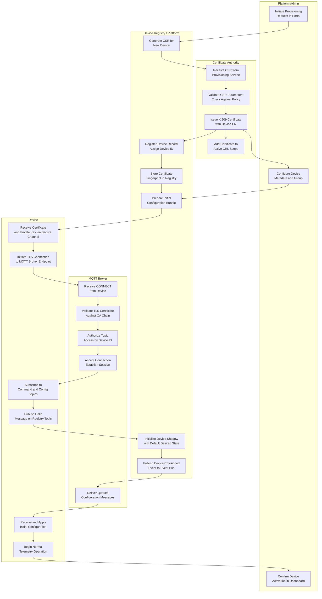
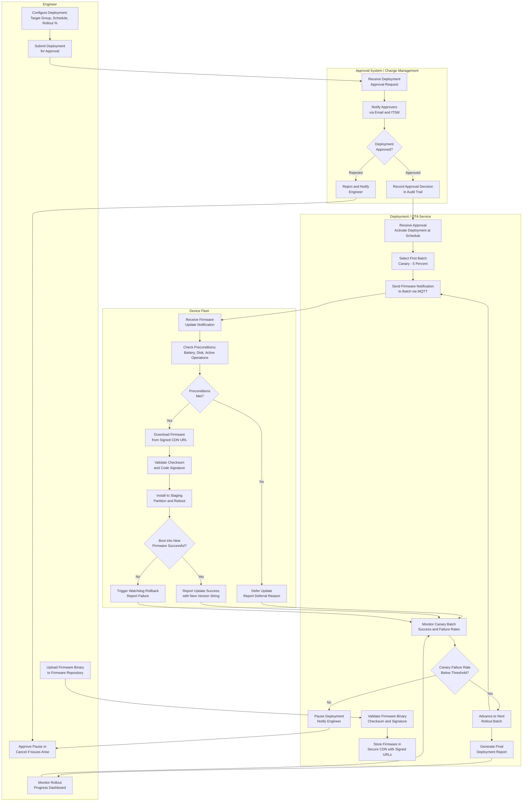
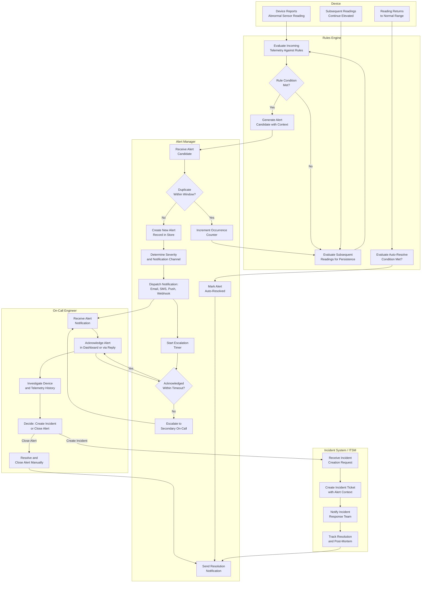
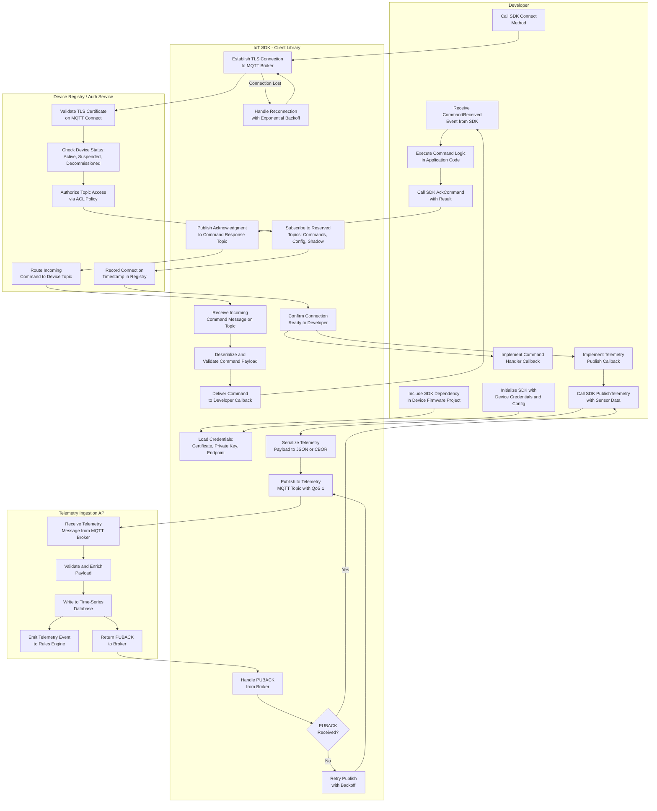

# Swimlane Diagrams

Swimlane diagrams illustrate the responsibilities and handoffs between actors or system components during key cross-cutting workflows. Each lane represents a distinct participant, and the flow of control between lanes represents integration points, API calls, events, and service boundaries.

---

## Device Provisioning Swimlane

This swimlane covers the end-to-end provisioning flow across four participants: the Platform Administrator who initiates the process, the physical Device being onboarded, the Certificate Authority that issues trust credentials, and the MQTT Broker that hosts the secure communication channel.

**Handoff Summary:**
- The Platform Admin triggers certificate issuance but the CA operates autonomously once the CSR arrives.
- The Device receives credentials via a secure out-of-band channel (typically a manufacturing-time injection or secure bootstrap API), not over MQTT.
- The MQTT Broker enforces per-device topic authorization so that device `abc123` cannot publish or subscribe to topics belonging to `abc124`.
- The DeviceProvisioned event is published to the internal event bus so that downstream services (billing, analytics) can react without coupling to the provisioning flow.

---

## Firmware Update Approval and Rollout Swimlane

This swimlane models the firmware update lifecycle from an engineer submitting a firmware package through the approval gate, orchestrated deployment to a device fleet, and per-device execution. Four lanes participate: the Engineer, the Approval System (change management), the Deployment Service, and the Device Fleet.

**Handoff Summary:**
- The Approval System acts as a gate that decouples engineering intent from fleet execution, enabling change management compliance.
- Signed CDN URLs prevent unauthorized firmware downloads and ensure that only the Deployment Service can authorize access to specific firmware versions.
- The canary batch analysis is automated; the Deployment Service evaluates the success rate against a configurable threshold before advancing the rollout.
- An engineer can always manually pause or cancel a deployment regardless of automated decisions.

---

## Alert Lifecycle Swimlane

This swimlane traces an alert from its origin in raw telemetry data through rules evaluation, alert management, on-call notification, and incident creation. Five lanes participate: the Device generating telemetry, the Rules Engine evaluating conditions, the Alert Manager handling deduplication and notifications, the On-Call Engineer responding, and the Incident System tracking resolution.

**Handoff Summary:**
- The Rules Engine is stateless per evaluation cycle but the Alert Manager maintains statefulness for deduplication, acknowledgment tracking, and escalation timers.
- Auto-resolution occurs when the telemetry condition that triggered the rule no longer holds for a configurable persistence window, preventing alert noise when conditions briefly normalize and then recur.
- Escalation bypasses the primary on-call responder if acknowledgment does not occur within the SLO window, typically 15 minutes for critical alerts and 5 minutes for emergency severity.

---

## SDK Usage by Developer Swimlane

This swimlane illustrates how a developer integrating the platform SDK interacts with platform services to register a device, publish telemetry, and issue a remote command. Four lanes participate: the Developer writing application code, the SDK handling protocol and retry logic, the Device Registry authenticating and managing device state, and the Telemetry API receiving the data stream.

**Handoff Summary:**
- The SDK abstracts all MQTT protocol details, QoS semantics, and retry logic from the developer, exposing a simple callback-driven interface.
- QoS 1 guarantees at-least-once delivery for telemetry, which means the ingestion pipeline must be idempotent to handle potential duplicate messages from retried publishes.
- The SDK manages its own reconnection loop with exponential backoff and jitter to prevent retry storms when many devices lose connectivity simultaneously.
- The developer's command handler callback receives a strongly-typed command object deserialized by the SDK, shielding application code from raw message format changes between SDK versions.

---

## Summary

These swimlane diagrams expose the cross-cutting concerns and integration contracts between system components and external actors. They complement the sequence diagrams in `detailed-design/sequence-diagrams.md` by emphasizing ownership and responsibility boundaries rather than temporal message ordering.

| Swimlane | Lanes | Primary Integration Risk |
|---|---|---|
| Device Provisioning | Admin, CA, Platform, Broker, Device | Credential delivery, cert chain validation |
| Firmware Approval & Rollout | Engineer, Approval, Deployment, Fleet | Approval bypass, canary monitoring |
| Alert Lifecycle | Device, Rules Engine, Alert Mgr, On-Call, ITSM | Escalation failures, alert fatigue |
| SDK Developer Usage | Developer, SDK, Registry, Telemetry API | Retry storms, QoS semantics |
