# System Context Diagram

The system context diagram provides the highest-level view of the IoT Device Management Platform, showing the platform as a single system and identifying all external actors, systems, and services that interact with it. This diagram establishes the system boundary and documents the nature and direction of each data flow across that boundary.

---

## C4 System Context Diagram

```mermaid
C4Context
    title System Context: IoT Device Management Platform

    Person(platformAdmin, "Platform Administrator", "Configures platform settings, manages device groups, monitors fleet health, and oversees provisioning operations.")
    Person(deviceOwner, "Device Owner / Operator", "Monitors assigned devices, acknowledges alerts, issues remote commands, and reviews telemetry dashboards.")
    Person(developer, "Application Developer", "Integrates platform APIs and SDKs into device firmware, mobile applications, and enterprise system connectors.")
    Person(securityAuditor, "Security Auditor", "Reviews audit trails, compliance reports, and access logs for regulatory and internal security requirements.")

    System(iotPlatform, "IoT Device Management Platform", "Core platform for device provisioning, telemetry ingestion, OTA firmware updates, alert rules engine, remote command execution, and SDK-based device integration.")

    System_Ext(physicalDevices, "Physical IoT Devices", "Edge nodes, sensors, actuators, and embedded controllers that connect over MQTT/AMQP/HTTPS, publish telemetry, receive commands, and accept OTA firmware updates.")
    System_Ext(mobileApp, "Mobile Application", "Native iOS/Android application for field technicians and device owners to monitor device status, receive push alerts, issue commands, and view telemetry in real time.")
    System_Ext(developerPortal, "Developer Portal", "Self-service portal exposing SDK downloads, API reference documentation, interactive API explorer, webhook configuration, and credential management for developers.")
    System_Ext(analyticsSystem, "Third-Party Analytics Systems", "External BI platforms, data warehouses, and analytics engines (e.g., Grafana, Tableau, Databricks) that consume telemetry exports and device event streams for advanced analysis.")
    System_Ext(cloudProvider, "Cloud Provider Services", "Managed cloud infrastructure services including AWS IoT Core or Azure IoT Hub for device connectivity offloading, object storage for firmware binaries and telemetry archives, and managed certificate services.")
    System_Ext(siemSystem, "SIEM / Security System", "Security Information and Event Management platform that ingests security-relevant events from the IoT platform, correlates threat indicators, and triggers security incident workflows.")
    System_Ext(enterpriseSystems, "Enterprise Systems (ERP / CMMS)", "Enterprise Resource Planning and Computerized Maintenance Management Systems that consume device asset data, maintenance alerts, and operational telemetry for asset lifecycle tracking.")
    System_Ext(certificateAuthority, "Certificate Authority", "Internal or third-party PKI service (e.g., HashiCorp Vault PKI, AWS ACM, DigiCert) that issues, renews, and revokes X.509 device certificates used for mutual TLS authentication.")
    System_Ext(notificationGateways, "Notification Gateways", "Third-party notification delivery services including email providers (SendGrid, SES), SMS gateways (Twilio), and push notification platforms (FCM, APNS) for alert delivery to human operators.")
    System_Ext(itsmSystem, "ITSM / Incident System", "IT Service Management platform (e.g., PagerDuty, ServiceNow, Jira Service Management) that receives automated incident creation requests from the alert engine and manages on-call escalation workflows.")

    Rel(platformAdmin, iotPlatform, "Manages fleet, configures rules, reviews health", "HTTPS/REST, Browser")
    Rel(deviceOwner, iotPlatform, "Monitors devices, issues commands, views dashboards", "HTTPS/REST, Browser")
    Rel(developer, iotPlatform, "Registers devices, configures webhooks, accesses API", "HTTPS/REST, gRPC")
    Rel(securityAuditor, iotPlatform, "Reviews audit logs, compliance exports", "HTTPS/REST, Browser")
    Rel(physicalDevices, iotPlatform, "Publishes telemetry, receives commands and firmware updates", "MQTT/TLS, AMQP, HTTPS")
    Rel(iotPlatform, physicalDevices, "Sends commands, firmware notifications, configuration updates", "MQTT/TLS")
    Rel(mobileApp, iotPlatform, "Queries device state, acknowledges alerts, sends commands", "HTTPS/REST, WebSocket")
    Rel(iotPlatform, mobileApp, "Pushes real-time alerts and device state changes", "WebSocket, Push Notification")
    Rel(developer, developerPortal, "Downloads SDK, reads API documentation", "HTTPS/Browser")
    Rel(developerPortal, iotPlatform, "Proxies API requests, manages credentials", "HTTPS/REST")
    Rel(iotPlatform, analyticsSystem, "Exports telemetry streams and device event data", "Kafka/Event Stream, S3 Export, REST")
    Rel(iotPlatform, cloudProvider, "Leverages managed MQTT, object storage, certificate services", "Cloud SDK, HTTPS API")
    Rel(iotPlatform, siemSystem, "Forwards security events, auth failures, anomaly signals", "Syslog, Webhook, SIEM API")
    Rel(iotPlatform, enterpriseSystems, "Pushes device asset records, maintenance alerts, telemetry summaries", "REST API, Webhook, Event Stream")
    Rel(certificateAuthority, iotPlatform, "Issues and revokes device certificates, delivers CRL/OCSP", "HTTPS/ACME, PKI API")
    Rel(iotPlatform, certificateAuthority, "Requests certificate issuance and revocation", "HTTPS/PKI API")
    Rel(iotPlatform, notificationGateways, "Dispatches email, SMS, and push notifications for alerts", "HTTPS/REST")
    Rel(iotPlatform, itsmSystem, "Creates incidents, updates on-call schedules", "HTTPS/REST, Webhook")
```

---

## External Actor Descriptions

### Physical IoT Devices

Physical IoT devices are the primary data producers and command consumers of the platform. They encompass a wide range of hardware form factors including industrial sensors, medical monitoring equipment, agricultural telemetry nodes, consumer electronics, and autonomous edge computing nodes. Devices communicate with the platform using the MQTT protocol over TLS (port 8883), AMQP for enterprise devices requiring transactional message semantics, or HTTPS for devices with limited protocol stack support.

Each device is uniquely identified by a `deviceId` and authenticates using a device-specific X.509 certificate in a mutual TLS handshake. Devices publish telemetry on structured MQTT topics (`iot/devices/{deviceId}/telemetry/{stream}`) and subscribe to topics for command delivery, configuration updates, and OTA firmware notifications. The platform issues remote commands to devices over MQTT and tracks command acknowledgment status.

### Mobile Application

The mobile application provides field technicians, device operators, and on-call engineers with a portable interface for real-time device monitoring and control. It connects to the platform's REST API over HTTPS for data queries and uses a persistent WebSocket connection for real-time event delivery. The application receives push notifications via FCM (Android) or APNS (iOS) for critical alert events that require immediate operator attention.

Key operations supported by the mobile application include viewing device connection status and recent telemetry, acknowledging and resolving alerts, issuing pre-defined remote commands, and initiating device reboot or configuration refresh. The mobile application operates under the same RBAC model as the web portal, with device owners seeing only their assigned device groups.

### Developer Portal

The Developer Portal is the primary self-service interface for software developers integrating the IoT platform. It provides downloadable SDK packages for C/C++, Python, Go, Java, and JavaScript environments, interactive API documentation generated from the OpenAPI specification, an API explorer with authentication support, and webhook endpoint configuration for event-driven integrations. The portal also exposes a sandbox environment where developers can test device integrations without provisioning physical devices, using simulated device instances.

The Developer Portal itself is a thin frontend that proxies authenticated API requests to the core platform, with its own application-level credential management for developer API keys distinct from device credentials.

### Third-Party Analytics Systems

External analytics platforms consume the platform's telemetry data for advanced visualization, historical trend analysis, machine learning, and business intelligence. The integration pattern is typically an event stream export (Kafka topic mirroring or Kinesis stream) for real-time analytics use cases, or a periodic bulk export to object storage (S3, Azure Blob) in Parquet format for batch analytics workloads.

The analytics systems are read-only consumers and do not write back to the IoT platform. Data exported to analytics systems is governed by the platform's data export policies, which support field-level masking for personally identifiable telemetry before it leaves the platform boundary.

### Cloud Provider Services

The platform leverages managed cloud infrastructure services rather than operating all components from scratch. This includes AWS IoT Core or Azure IoT Hub as optional high-scale MQTT broker backends for device connectivity in specific regional deployments, cloud-native object storage for firmware binary hosting and telemetry archiving, managed time-series database services, and cloud certificate management services for automated certificate renewal.

The relationship with cloud providers is primarily infrastructure-level: the platform's application services communicate with cloud APIs via official SDKs, and all credentials for cloud service access are managed via instance roles and secrets management (HashiCorp Vault, AWS Secrets Manager) rather than embedded in application configuration.

### SIEM / Security System

The SIEM integration enables security operations teams to monitor the IoT platform as part of their broader threat detection posture. The platform forwards security-relevant events including device authentication failures, certificate revocations, unusual telemetry volume anomalies, admin privilege escalations, and failed API authorization attempts to the SIEM in real time.

The SIEM system is a one-way consumer of security events from the platform. Security analysts use the SIEM to correlate IoT platform events with signals from other infrastructure components, detect coordinated attack patterns across many devices, and trigger automated response playbooks (such as isolating a compromised device group or revoking a batch of certificates).

### Enterprise Systems (ERP / CMMS)

Enterprise systems integrate the IoT platform's operational data into broader business processes. A Computerized Maintenance Management System (CMMS) might consume predictive maintenance alerts from the platform to automatically schedule work orders when a monitored asset's telemetry indicates impending failure. An ERP system might synchronize the platform's device asset registry with the enterprise asset ledger to track the physical lifecycle of devices alongside procurement, warranty, and depreciation records.

Integration with enterprise systems is typically event-driven via webhook callbacks or periodic REST API polling, with the platform serving as the authoritative source of device operational state and the enterprise system serving as the authoritative source of asset ownership and business classification.

### Certificate Authority

The Certificate Authority (CA) is the root of trust for all device identities on the platform. It issues device-specific X.509 certificates signed by a dedicated IoT device CA intermediate, maintaining separation from the platform's own TLS server certificates. The CA exposes an API for certificate issuance (CSR submission and certificate delivery), certificate revocation (updating the Certificate Revocation List and OCSP responder), and certificate renewal.

The platform periodically polls the CA's CRL endpoint to refresh its local revocation cache, and queries the OCSP responder for on-demand certificate status validation during high-security operations such as firmware deployment authorization.

### Notification Gateways

Notification gateways are third-party services that handle the last-mile delivery of alert notifications to human operators. The platform integrates with email delivery services (SendGrid, Amazon SES), SMS gateways (Twilio), and mobile push notification platforms (Firebase Cloud Messaging, Apple Push Notification Service). The platform is responsible for generating the notification content and determining the appropriate channel and recipient based on alert severity and user notification preferences; the gateways are responsible only for reliable delivery to end-user devices.

The platform tracks delivery status through gateway delivery receipts and retries failed deliveries through an alternative channel when a primary channel reports a persistent failure.

### ITSM / Incident System

The ITSM integration closes the loop between automated alert detection and human incident management. When the Alert Manager determines that an alert requires incident tracking—typically for critical or emergency severity alerts that are not acknowledged within the escalation timeout—it automatically creates an incident ticket in the configured ITSM system with the alert context, affected device information, and a deep link to the telemetry dashboard.

The integration is bidirectional: the platform creates incidents via the ITSM API, and the ITSM system can send webhook callbacks to the platform when an incident is resolved, triggering the corresponding alert to be closed automatically.

---

## System Boundary Explanation

The IoT Device Management Platform system boundary encompasses all services, databases, and components that are owned, deployed, and operated by the platform team. This includes the Device Registry Service, MQTT Broker cluster, Telemetry Ingestion Pipeline, Time-Series Database, Rules Engine, OTA Deployment Service, Command Service, Alert Manager, and all supporting API gateways and web frontends.

Everything outside this boundary—physical devices, mobile apps, external analytics systems, cloud provider infrastructure, the Certificate Authority, notification gateways, enterprise systems, and ITSM platforms—is an external system. The platform defines explicit API contracts and integration patterns for each external system and is not responsible for the availability or behavior of external systems beyond its own retry and fallback policies.

---

## Key Data Flows

**Telemetry Inbound Flow:** Physical devices publish telemetry messages over MQTT/TLS to the platform's MQTT broker. The broker routes messages to the ingestion pipeline, which validates, enriches, and writes data to the time-series database. The rules engine evaluates each message against active alert rules and dispatches notifications or commands when conditions are met.

**Command Outbound Flow:** Platform operators or automated rules dispatch remote commands to devices via the Command Service. Commands are queued in a per-device command queue and delivered over MQTT when the device is online. The device acknowledges command receipt and execution, and the platform tracks command state through its lifecycle.

**Firmware Distribution Flow:** Firmware binaries are uploaded to a secure firmware repository hosted in cloud object storage. The OTA Deployment Service distributes signed download URLs to targeted devices via MQTT. Devices download firmware directly from the CDN/object storage using pre-signed URLs, reducing load on the platform's application servers.

**Security Event Outbound Flow:** Authentication failures, certificate events, and anomalous access patterns are forwarded to the SIEM in near real-time using a dedicated security event stream, enabling security operations teams to detect threats without polling the platform's operational databases.

**Enterprise Integration Flow:** Device asset data, maintenance alerts, and operational telemetry summaries are pushed to enterprise systems via webhook callbacks and periodic scheduled exports, ensuring that business processes in ERP and CMMS systems remain synchronized with the operational state of the physical device fleet.
