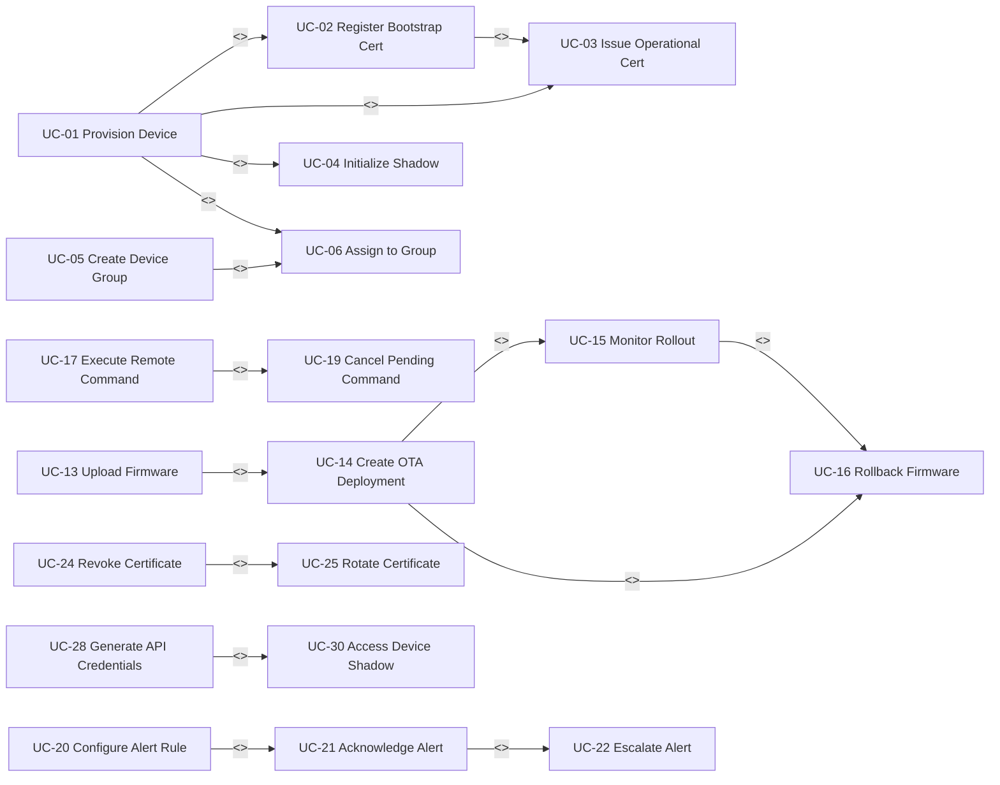

# Use Case Diagram — IoT Device Management Platform

## Overview

This document presents the functional scope of the IoT Device Management Platform through use case diagrams. The platform spans eight major subsystems, each serving a distinct set of actors. Use case boundaries are drawn around business capabilities rather than technical components, so that actors map directly to platform roles and the diagrams remain meaningful to both product owners and architects.

The six primary actors are:

| Actor | Role Summary |
|---|---|
| **Device Operator** | Day-to-day technician who provisions, monitors, and troubleshoots individual devices in the field |
| **Fleet Manager** | Manages logical device groups, schedules OTA rollouts, and defines operational policies for fleets |
| **Platform Admin** | Administers tenants, quotas, user accounts, platform health, and global configuration |
| **Developer/Integrator** | Consumes the REST/MQTT/WebSocket APIs to build upstream applications, dashboards, and integrations |
| **Security Officer** | Owns PKI policy, certificate lifecycle, audit trails, and IEC 62443 compliance reporting |
| **Operations Engineer** | Monitors platform infrastructure, responds to alerts, manages Kafka/InfluxDB/EMQX health |

Two secondary actors participate in automated system interactions:

| Actor | Role Summary |
|---|---|
| **Device Hardware** | Physical or virtual edge device that initiates provisioning, publishes telemetry, and receives commands |
| **Certificate Authority** | External or internal PKI service that signs X.509 certificates during device provisioning |

---

## Primary Use Case Diagram

The diagram below organises use cases into eight subsystem subgraphs. Actors appear as rounded nodes on the left and right margins. An arrow from an actor to a use case denotes participation. `include` and `extend` relationships are shown with dashed edges and stereotype labels.

```mermaid
flowchart TD
    %% ── Actors ──────────────────────────────────────────────────────────────
    DO([Device Operator])
    FM([Fleet Manager])
    PA([Platform Admin])
    DI([Developer/Integrator])
    SO([Security Officer])
    OE([Operations Engineer])
    DH([Device Hardware])
    CA([Certificate Authority])

    %% ── Subsystem: Device Provisioning ──────────────────────────────────────
    subgraph DP ["Device Provisioning"]
        UC01[Provision Device]
        UC02[Register Bootstrap Certificate]
        UC03[Issue Operational Certificate]
        UC04[Initialize Device Shadow]
    end

    %% ── Subsystem: Fleet Management ─────────────────────────────────────────
    subgraph FL ["Fleet Management"]
        UC05[Create Device Group]
        UC06[Assign Device to Group]
        UC07[Set Fleet Policy]
        UC08[View Fleet Health Dashboard]
    end

    %% ── Subsystem: Telemetry & Monitoring ───────────────────────────────────
    subgraph TM ["Telemetry & Monitoring"]
        UC09[Monitor Telemetry Dashboard]
        UC10[Query Historical Telemetry]
        UC11[Export Telemetry Data]
        UC12[Define Custom Metric]
    end

    %% ── Subsystem: OTA Firmware ──────────────────────────────────────────────
    subgraph OTA ["OTA Firmware"]
        UC13[Upload Firmware Binary]
        UC14[Create OTA Deployment]
        UC15[Monitor Rollout Progress]
        UC16[Rollback Firmware]
    end

    %% ── Subsystem: Remote Commands ───────────────────────────────────────────
    subgraph RC ["Remote Commands"]
        UC17[Execute Remote Command]
        UC18[View Command History]
        UC19[Cancel Pending Command]
    end

    %% ── Subsystem: Alerting ──────────────────────────────────────────────────
    subgraph AL ["Alerting"]
        UC20[Configure Alert Rule]
        UC21[Acknowledge Alert]
        UC22[Escalate Alert]
        UC23[View Alert History]
    end

    %% ── Subsystem: Certificate Management ───────────────────────────────────
    subgraph CM ["Certificate Management"]
        UC24[Revoke Device Certificate]
        UC25[Rotate Device Certificate]
        UC26[View Certificate Inventory]
        UC27[Configure CRL/OCSP Policy]
    end

    %% ── Subsystem: SDK & Integration ─────────────────────────────────────────
    subgraph SI ["SDK & Integration"]
        UC28[Generate API Credentials]
        UC29[Subscribe to Webhook Events]
        UC30[Access Device Shadow via API]
        UC31[Stream Telemetry via WebSocket]
    end

    %% ── Actor → Use Case edges ───────────────────────────────────────────────
    DO --> UC01
    DO --> UC06
    DO --> UC17
    DO --> UC21
    DO --> UC18

    FM --> UC05
    FM --> UC07
    FM --> UC08
    FM --> UC14
    FM --> UC15
    FM --> UC16
    FM --> UC20

    PA --> UC01
    PA --> UC07
    PA --> UC27
    PA --> UC13

    DI --> UC28
    DI --> UC29
    DI --> UC30
    DI --> UC31
    DI --> UC12

    SO --> UC24
    SO --> UC25
    SO --> UC26
    SO --> UC27
    SO --> UC23

    OE --> UC08
    OE --> UC09
    OE --> UC22
    OE --> UC23
    OE --> UC11

    DH --> UC01
    DH --> UC04
    DH --> UC17

    CA --> UC03

    %% ── include / extend edges ───────────────────────────────────────────────
    UC01 -.->|include| UC02
    UC01 -.->|include| UC03
    UC01 -.->|include| UC04
    UC14 -.->|include| UC13
    UC14 -.->|extend| UC16
    UC20 -.->|include| UC22
    UC17 -.->|extend| UC19
    UC09 -.->|extend| UC10
```

---

## Actor-to-Use-Case Mapping Table

| Use Case | ID | DO | FM | PA | DI | SO | OE | DH | CA |
|---|---|:---:|:---:|:---:|:---:|:---:|:---:|:---:|:---:|
| Provision Device | UC-01 | ✓ | | ✓ | | | | ✓ | |
| Register Bootstrap Certificate | UC-02 | | | ✓ | | ✓ | | ✓ | |
| Issue Operational Certificate | UC-03 | | | | | ✓ | | | ✓ |
| Initialize Device Shadow | UC-04 | | | | | | | ✓ | |
| Create Device Group | UC-05 | | ✓ | ✓ | | | | | |
| Assign Device to Group | UC-06 | ✓ | ✓ | | | | | | |
| Set Fleet Policy | UC-07 | | ✓ | ✓ | | | | | |
| View Fleet Health Dashboard | UC-08 | | ✓ | | | | ✓ | | |
| Monitor Telemetry Dashboard | UC-09 | ✓ | ✓ | | | | ✓ | | |
| Query Historical Telemetry | UC-10 | ✓ | ✓ | | ✓ | | ✓ | | |
| Export Telemetry Data | UC-11 | | ✓ | | ✓ | | ✓ | | |
| Define Custom Metric | UC-12 | | ✓ | | ✓ | | | | |
| Upload Firmware Binary | UC-13 | | | ✓ | | | | | |
| Create OTA Deployment | UC-14 | | ✓ | | | | | | |
| Monitor Rollout Progress | UC-15 | | ✓ | | | | ✓ | | |
| Rollback Firmware | UC-16 | | ✓ | ✓ | | | ✓ | | |
| Execute Remote Command | UC-17 | ✓ | | | ✓ | | | ✓ | |
| View Command History | UC-18 | ✓ | ✓ | | ✓ | SO | ✓ | | |
| Cancel Pending Command | UC-19 | ✓ | ✓ | | | | | | |
| Configure Alert Rule | UC-20 | | ✓ | ✓ | ✓ | | | | |
| Acknowledge Alert | UC-21 | ✓ | ✓ | | | | ✓ | | |
| Escalate Alert | UC-22 | | ✓ | | | | ✓ | | |
| View Alert History | UC-23 | | ✓ | | | ✓ | ✓ | | |
| Revoke Device Certificate | UC-24 | | | ✓ | | ✓ | | | |
| Rotate Device Certificate | UC-25 | ✓ | ✓ | | | ✓ | | | |
| View Certificate Inventory | UC-26 | | | ✓ | | ✓ | | | |
| Configure CRL/OCSP Policy | UC-27 | | | ✓ | | ✓ | | | |
| Generate API Credentials | UC-28 | | | ✓ | ✓ | | | | |
| Subscribe to Webhook Events | UC-29 | | ✓ | | ✓ | | | | |
| Access Device Shadow via API | UC-30 | ✓ | ✓ | | ✓ | | | | |
| Stream Telemetry via WebSocket | UC-31 | | ✓ | | ✓ | | ✓ | | |

---

## Use Case Dependency, Inclusion, and Extension Diagram

The diagram below captures structural relationships among use cases. `<<include>>` means the base use case always invokes the included one. `<<extend>>` means the extending use case conditionally adds behaviour. `<<precedes>>` captures temporal ordering constraints.

---

## Detailed Actor Descriptions

### Device Operator

The Device Operator is typically a field technician or on-site engineer responsible for the physical installation, initial power-on provisioning, and first-line troubleshooting of edge devices. They interact with the platform primarily through the web portal's device detail view and through the mobile application. They require the ability to provision individual devices using a serial-number-based workflow, execute targeted remote commands (reboot, self-test, log capture), and acknowledge operational alerts. Device Operators are constrained to their assigned organizational unit and cannot modify fleet-level policies or OTA rollout schedules.

### Fleet Manager

The Fleet Manager owns the logical grouping of devices into fleets and bears responsibility for device lifecycle policy, OTA firmware strategy, and fleet-level alerting thresholds. They interact with the platform to create and modify device groups, define firmware deployment schedules with canary percentages and automatic rollback triggers, and review fleet health dashboards showing connectivity rates, telemetry freshness, and firmware version distribution. Fleet Managers can initiate OTA deployments but must upload firmware binaries through the Platform Admin role.

### Platform Admin

The Platform Admin holds elevated privileges across the entire tenant. They manage tenant onboarding, user provisioning, quota enforcement (device count limits, message rate limits, storage retention policies), and global configuration such as MQTT broker ACL templates and supported firmware signing algorithms. They are responsible for uploading signed firmware binaries to Object Storage and maintaining the EMQX broker authentication plugin configuration.

### Developer/Integrator

The Developer/Integrator builds external applications that consume platform capabilities through the REST API (port 443, JSON/HAL+JSON), the MQTT API (port 8883, TLS 1.3), the WebSocket streaming endpoint (port 443, `/ws/v1/telemetry`), and webhook event push. They generate long-lived API keys or OAuth 2.0 client credentials, register webhook endpoints with HMAC-SHA256 signed payloads, and interact with the Device Shadow API to read desired/reported state without needing to understand the underlying Kafka topics.

### Security Officer

The Security Officer is responsible for the platform's PKI posture under IEC 62443-2-1. They manage the Certificate Authority trust chain, configure CRL distribution points and OCSP responder URLs, set certificate validity periods (default: 365 days for operational certificates, 30 days for bootstrap certificates), enforce rotation policies, and investigate audit logs for certificate anomalies. They have read access to all audit records and write access to certificate revocation workflows.

### Operations Engineer

The Operations Engineer monitors platform infrastructure health: EMQX broker cluster status (node count, message rates, connection counts on port 8883/8084), Kafka consumer group lag across telemetry ingestion topics, InfluxDB/TimescaleDB disk usage and query latency, and overall API gateway response times. They respond to platform-level alerts, perform on-call escalations, and have access to the infrastructure monitoring dashboards but not to device-level configuration.

---

## Use Case Summary Table

| ID | Name | Primary Actor | Secondary Actors | Priority | Complexity |
|---|---|---|---|---|---|
| UC-01 | Provision Device | Device Operator | Device Hardware, CA, Platform Admin | High | High |
| UC-02 | Register Bootstrap Certificate | Platform Admin | Security Officer, Device Hardware | High | Medium |
| UC-03 | Issue Operational Certificate | Security Officer | Certificate Authority | High | Medium |
| UC-04 | Initialize Device Shadow | Device Hardware | Device Service | High | Low |
| UC-05 | Create Device Group | Fleet Manager | Platform Admin | High | Low |
| UC-06 | Assign Device to Group | Device Operator | Fleet Manager | High | Low |
| UC-07 | Set Fleet Policy | Fleet Manager | Platform Admin | Medium | Medium |
| UC-08 | View Fleet Health Dashboard | Fleet Manager | Operations Engineer | High | Medium |
| UC-09 | Monitor Telemetry Dashboard | Device Operator | Operations Engineer | High | Medium |
| UC-10 | Query Historical Telemetry | Device Operator | Developer/Integrator | Medium | Medium |
| UC-11 | Export Telemetry Data | Operations Engineer | Developer/Integrator | Medium | Low |
| UC-12 | Define Custom Metric | Developer/Integrator | Fleet Manager | Low | High |
| UC-13 | Upload Firmware Binary | Platform Admin | Security Officer | High | Medium |
| UC-14 | Create OTA Deployment | Fleet Manager | Platform Admin | High | High |
| UC-15 | Monitor Rollout Progress | Fleet Manager | Operations Engineer | High | Medium |
| UC-16 | Rollback Firmware | Fleet Manager | Operations Engineer | High | High |
| UC-17 | Execute Remote Command | Device Operator | Developer/Integrator | Medium | Medium |
| UC-18 | View Command History | Device Operator | Security Officer | Low | Low |
| UC-19 | Cancel Pending Command | Device Operator | Fleet Manager | Low | Low |
| UC-20 | Configure Alert Rule | Fleet Manager | Developer/Integrator | High | Medium |
| UC-21 | Acknowledge Alert | Device Operator | Operations Engineer | High | Low |
| UC-22 | Escalate Alert | Operations Engineer | Fleet Manager | Medium | Low |
| UC-23 | View Alert History | Security Officer | Operations Engineer | Medium | Low |
| UC-24 | Revoke Device Certificate | Security Officer | Platform Admin | High | Medium |
| UC-25 | Rotate Device Certificate | Security Officer | Device Operator | High | High |
| UC-26 | View Certificate Inventory | Security Officer | Platform Admin | Medium | Low |
| UC-27 | Configure CRL/OCSP Policy | Security Officer | Platform Admin | High | High |
| UC-28 | Generate API Credentials | Developer/Integrator | Platform Admin | High | Low |
| UC-29 | Subscribe to Webhook Events | Developer/Integrator | Fleet Manager | Medium | Low |
| UC-30 | Access Device Shadow via API | Developer/Integrator | Device Operator | High | Medium |
| UC-31 | Stream Telemetry via WebSocket | Developer/Integrator | Operations Engineer | Medium | High |

---

## Subsystem Boundary Notes

### Device Provisioning Boundary

The provisioning boundary encompasses all interactions from first device power-on through successful registration in the Device Registry and initialisation of the Device Shadow. The boundary explicitly excludes ongoing telemetry ingestion; provisioning is a one-time lifecycle transition. The EMQX broker's built-in `emqx_auth_http` plugin enforces that only devices holding a valid bootstrap certificate (signed by the Tenant Bootstrap CA) can connect to the provisioning topic `$platform/provision/{serialNumber}`.

### Fleet Management Boundary

Fleet management use cases operate on logical constructs (groups, policies) rather than individual device state. All fleet operations are tenant-scoped and enforced at the REST API gateway layer via JWT claims containing `tenant_id` and `role`. Group membership changes propagate asynchronously via the `platform.fleet.membership.changed` Kafka topic (partition key: `device_id`).

### Telemetry & Monitoring Boundary

Telemetry ingestion enters through EMQX on topic pattern `dt/{tenantId}/{deviceId}/telemetry` and exits to InfluxDB (real-time queries, 30-day retention) and TimescaleDB (long-term analytics, 2-year retention with continuous aggregate hypertables). The monitoring boundary includes near-real-time WebSocket streaming (sub-500 ms latency) and historical query (Flux/PromQL-compatible API).

### OTA Firmware Boundary

The OTA boundary covers binary management in S3-compatible object storage, deployment job lifecycle state machine (CREATED → SCHEDULED → IN_PROGRESS → COMPLETED/ROLLED_BACK), per-device update state tracking, and MQTT-based notification delivery to devices on topic `cmd/{tenantId}/{deviceId}/ota`. Firmware binary integrity is enforced through ECDSA-P256 signature verification at both upload time (platform) and at install time (device).

### Certificate Management Boundary

Certificate operations are the sole responsibility of the Certificate Service microservice, which exposes an internal gRPC interface (port 50051) to other platform services and an HTTPS management API to the Security Officer. The Certificate Authority integration supports both the ACME v2 protocol (RFC 8555) for public CAs and a custom SCEP/EST endpoint for enterprise internal PKIs.

### SDK & Integration Boundary

The SDK boundary encompasses all machine-to-machine interfaces: the REST API (OpenAPI 3.1 specification), MQTT device API (custom topic schema documented in `event-catalog.md`), WebSocket streaming API, and outbound webhook push. OAuth 2.0 client credentials flow (RFC 6749 §4.4) is the required authentication mechanism for all Developer/Integrator interactions.
