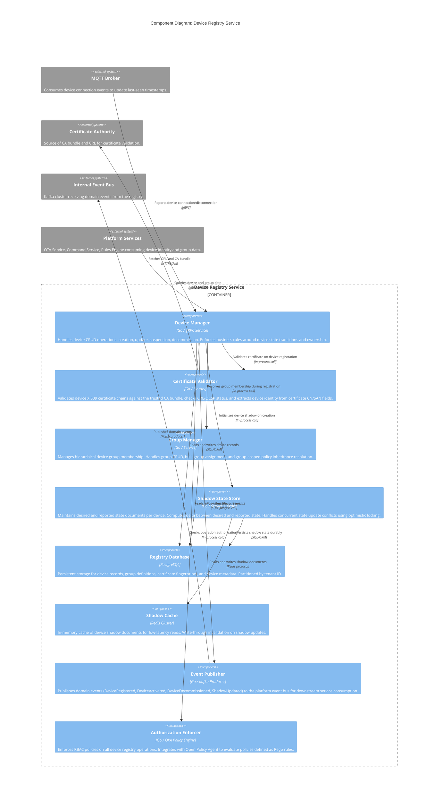
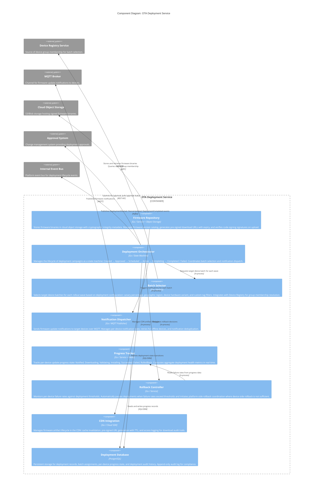

# C4 Component Diagrams

C4 Component diagrams decompose each container service into its internal logical components, revealing how responsibilities are distributed within a service boundary. These diagrams are one level below the container diagrams in `high-level-design/c4-diagrams.md` and one level above the class diagrams in `detailed-design/class-diagrams.md`.

---

## Device Registry Service Components

The Device Registry Service is the authoritative source of truth for device identity, lifecycle state, group membership, certificate fingerprints, and shadow (desired/reported) state. It exposes REST and gRPC interfaces to other services and acts as the authorization gatekeeper for device-level operations.



**Component Responsibilities:**

- **Device Manager** is the primary orchestrator within the registry. It coordinates between the certificate validator, group manager, shadow store, and event publisher to execute each device lifecycle operation atomically (using database transactions) and durably (persisting before publishing events).
- **Certificate Validator** is a library-level component that performs chain-of-trust validation, CRL checking, and identity extraction. It caches the CA bundle and CRL in memory with a configurable TTL to avoid round trips to the CA on every operation.
- **Group Manager** supports hierarchical group structures where a device can belong to a leaf group that inherits policies from parent groups. Policy resolution traverses the group tree and merges inherited and local policies with defined precedence rules.
- **Shadow State Store** implements the device twin/shadow pattern: each device has a `desired` state (set by operators or automation) and a `reported` state (set by the device). The store computes and publishes a `delta` document when these states diverge, which is delivered to the device on its next connection.
- **Authorization Enforcer** uses Open Policy Agent (OPA) to evaluate fine-grained access control policies, enabling attribute-based access control (ABAC) rules such as "device owners can read telemetry for their own devices but not update group policies."

---

## Telemetry Ingestion Service Components

The Telemetry Ingestion Service is the high-throughput data pathway responsible for accepting device telemetry from the MQTT broker, validating and enriching messages, writing to the time-series database, and publishing enriched events to downstream processors including the rules engine.

```mermaid
C4Component
    title Component Diagram: Telemetry Ingestion Service

    Container_Boundary(ingestionService, "Telemetry Ingestion Service") {
        Component(mqttAdapter, "MQTT Adapter", "Go / MQTT Client", "Subscribes to device telemetry topics on the MQTT broker using a shared subscription pattern for horizontal scaling. Batches incoming messages for efficient downstream processing.")
        Component(protocolHandler, "Protocol Handler", "Go / Codec Library", "Deserializes incoming payloads from multiple formats: JSON, CBOR, Protocol Buffers, and MessagePack. Normalizes all payloads into a canonical internal TelemetryMessage format.")
        Component(messageRouter, "Message Router", "Go / Service", "Routes normalized messages to the appropriate pipeline branches based on stream name, device type, and ingestion policy. Applies per-device and per-stream sampling and rate-limiting rules.")
        Component(schemaValidator, "Schema Validator", "Go / JSON Schema", "Validates normalized messages against device-type-specific schemas registered in the schema registry. Routes invalid messages to the dead-letter queue with a validation error report.")
        Component(enrichmentProcessor, "Enrichment Processor", "Go / Service", "Adds server-side timestamp, device group membership, geographic region tag, and firmware version metadata to each message. Performs unit conversion if device-reported units differ from canonical units.")
        Component(timeSeriesWriter, "Time-Series Writer", "Go / DB Client", "Writes enriched telemetry to the time-series database (InfluxDB / TimescaleDB). Implements batched writes with configurable flush interval and batch size for throughput optimization.")
        Component(streamProcessor, "Stream Processor", "Go / Kafka Producer", "Publishes enriched telemetry messages to the internal event bus for consumption by the rules engine, analytics export service, and real-time dashboard WebSocket service.")
        Component(dlqHandler, "Dead Letter Queue Handler", "Go / Service", "Manages messages that fail validation or ingestion. Records failure reason, retries transient failures with backoff, and alerts on persistent DLQ accumulation.")
        Component(metricsCollector, "Ingestion Metrics Collector", "Go / Prometheus", "Tracks ingestion rate, per-device message count, schema validation failure rate, write latency, and DLQ depth. Exposes Prometheus metrics endpoint.")
    }

    System_Ext(mqttBrokerExt, "MQTT Broker", "Source of telemetry messages from connected devices.")
    System_Ext(schemaRegistry, "Schema Registry", "Confluent Schema Registry or custom registry storing device-type schemas.")
    System_Ext(tsdb, "Time-Series Database", "InfluxDB or TimescaleDB storing all device telemetry.")
    System_Ext(kafkaBus, "Internal Event Bus", "Kafka cluster for downstream event distribution.")
    System_Ext(dlqStorage, "Dead Letter Queue", "Kafka DLQ topic or object storage for failed messages.")

    Rel(mqttAdapter, mqttBrokerExt, "Subscribes to telemetry topics", "MQTT shared subscription")
    Rel(mqttAdapter, protocolHandler, "Passes raw messages for deserialization", "In-process")
    Rel(protocolHandler, messageRouter, "Sends canonical messages", "In-process")
    Rel(messageRouter, schemaValidator, "Routes messages for validation", "In-process")
    Rel(messageRouter, dlqHandler, "Sends rate-limited excess to DLQ", "In-process")
    Rel(schemaValidator, schemaRegistry, "Fetches and caches device schemas", "HTTP REST")
    Rel(schemaValidator, enrichmentProcessor, "Passes valid messages for enrichment", "In-process")
    Rel(schemaValidator, dlqHandler, "Routes invalid messages to DLQ", "In-process")
    Rel(enrichmentProcessor, timeSeriesWriter, "Sends enriched messages for DB write", "In-process")
    Rel(enrichmentProcessor, streamProcessor, "Sends enriched messages to event bus", "In-process")
    Rel(timeSeriesWriter, tsdb, "Writes batched telemetry data", "InfluxDB line protocol / JDBC")
    Rel(streamProcessor, kafkaBus, "Publishes telemetry events", "Kafka producer")
    Rel(dlqHandler, dlqStorage, "Writes failed messages with metadata", "Kafka / S3")
    Rel(metricsCollector, ingestionService, "Collects internal metrics", "In-process instrumentation")
```

**Component Responsibilities:**

- **MQTT Adapter** uses MQTT shared subscriptions (`$share/ingestion-workers/iot/devices/+/telemetry/#`) so that multiple ingestion service instances divide the message load without receiving duplicate messages, enabling horizontal scaling without coordinator overhead.
- **Protocol Handler** supports multiple wire formats to accommodate heterogeneous device fleets. CBOR is preferred for constrained devices to minimize payload size; JSON is used for developer-friendly integrations; Protocol Buffers are used for high-throughput devices where serialization performance matters.
- **Message Router** implements per-device rate limiting using a token bucket algorithm, rejecting or sampling messages from devices that exceed their configured ingestion quota. This protects the time-series database from a single misbehaving device monopolizing write capacity.
- **Time-Series Writer** uses write batching to achieve high throughput. It accumulates messages in an in-memory buffer and flushes to the database either when the batch reaches a configured size (e.g., 5,000 points) or when a flush interval expires (e.g., 500ms), whichever comes first.

---

## OTA Deployment Service Components

The OTA Deployment Service manages the full lifecycle of firmware deployment campaigns: from firmware validation and secure storage through orchestrated rollout to device fleets, progress tracking, and rollback management.



**Component Responsibilities:**

- **Firmware Repository** performs two critical security checks on every firmware upload: it verifies the SHA-256 checksum against the expected value provided by the uploader, and it validates the code-signing signature against the platform's firmware signing certificate. Unsigned or tampered binaries are rejected before storage.
- **Deployment Orchestrator** implements the staged rollout policy as a state machine, ensuring that each deployment wave is atomic and that transitions between waves are conditioned on the success rate of the previous wave meeting the configured threshold.
- **Rollback Controller** distinguishes between device-initiated rollback (triggered by the device's watchdog when the new firmware fails to boot) and platform-initiated rollback (triggered when the deployment failure rate exceeds the threshold). Platform-initiated rollback publishes a rollback command to affected devices, instructing them to revert to their previous firmware version.
- **Progress Tracker** uses Redis for low-latency aggregation of per-device progress counters, enabling real-time deployment health dashboards without querying the relational database on every status request.

---

## Rules Engine Service Components

The Rules Engine evaluates incoming telemetry events against configured alert rules, executes defined actions when rule conditions are met, and manages deduplication to prevent alert fatigue. It is designed for high-throughput, low-latency evaluation with sub-second trigger-to-notification latency.

```mermaid
C4Component
    title Component Diagram: Rules Engine Service

    Container_Boundary(rulesEngine, "Rules Engine Service") {
        Component(ruleParser, "Rule Parser", "Go / DSL Compiler", "Parses and compiles rule definitions from the rule DSL (JSON-based or SQL-like syntax) into an optimized internal AST (Abstract Syntax Tree) representation for efficient evaluation. Validates rule syntax and semantic correctness.")
        Component(ruleCache, "Rule Cache", "Go / In-Memory + Redis", "Maintains an in-memory cache of compiled rule ASTs, keyed by device group and stream name, refreshed on rule change events. Eliminates repeated parsing overhead during high-volume evaluation.")
        Component(conditionEvaluator, "Condition Evaluator", "Go / Expression Engine", "Evaluates compiled rule conditions against incoming telemetry messages. Supports threshold comparisons, statistical aggregations (average, max over a time window), pattern matching, and cross-stream joins within a configurable evaluation window.")
        Component(windowAggregator, "Window Aggregator", "Go / Service + Redis", "Maintains rolling time-window aggregations per device per stream for rules that evaluate against aggregated values (e.g., average temperature over 5 minutes). Uses Redis sorted sets for time-windowed data retention.")
        Component(actionDispatcher, "Action Dispatcher", "Go / Service", "Executes rule actions when conditions are met: publishing alerts to the Alert Manager, dispatching commands to the Command Service, invoking webhook callbacks to external systems, or triggering automated device configuration updates.")
        Component(deduplicationEngine, "Deduplication Engine", "Go / Bloom Filter + Redis", "Prevents duplicate alerts from the same rule and device within a configurable deduplication window. Uses a time-decaying bloom filter backed by Redis for sub-millisecond deduplication checks under high load.")
        Component(ruleMetrics, "Rule Metrics Collector", "Go / Prometheus", "Tracks rule evaluation count, condition match rate, action execution latency, deduplication hit rate, and evaluation lag. Provides SLO monitoring data for the rules engine evaluation lag SLO.")
    }

    System_Ext(kafkaBusExt, "Internal Event Bus", "Source of enriched telemetry events for rules evaluation.")
    System_Ext(alertManagerExt, "Alert Manager Service", "Destination for triggered alert notifications.")
    System_Ext(commandServiceExt, "Command Service", "Destination for automated command dispatch actions.")
    System_Ext(webhookServiceExt, "Webhook Service", "Destination for external webhook action callbacks.")
    System_Ext(ruleStoreExt, "Rule Store / API", "REST API for rule CRUD, source of rule change events.")

    Rel(ruleParser, ruleCache, "Stores compiled rule ASTs", "In-process")
    Rel(ruleCache, ruleStoreExt, "Fetches rule definitions on cache miss or change event", "REST / Kafka consumer")
    Rel(conditionEvaluator, ruleCache, "Reads compiled rules for evaluation", "In-process")
    Rel(conditionEvaluator, windowAggregator, "Reads rolling aggregations for time-window rules", "In-process")
    Rel(conditionEvaluator, actionDispatcher, "Triggers action dispatch on condition match", "In-process")
    Rel(conditionEvaluator, deduplicationEngine, "Checks deduplication before action dispatch", "In-process")
    Rel(windowAggregator, kafkaBusExt, "Consumes telemetry events to update aggregations", "Kafka consumer")
    Rel(actionDispatcher, alertManagerExt, "Publishes triggered alerts", "gRPC / Kafka")
    Rel(actionDispatcher, commandServiceExt, "Dispatches automated commands", "gRPC")
    Rel(actionDispatcher, webhookServiceExt, "Invokes external webhooks", "HTTP REST")
    Rel(deduplicationEngine, kafkaBusExt, "Consumes rule trigger events", "Kafka consumer")
    Rel(ruleMetrics, rulesEngine, "Collects evaluation metrics", "Prometheus instrumentation")
```

**Component Responsibilities:**

- **Rule Parser** compiles rule definitions at write time (when a rule is created or updated) rather than at evaluation time, ensuring that evaluation remains at constant cost regardless of rule complexity. Compiled ASTs are stored and distributed across engine instances via the rule cache.
- **Condition Evaluator** supports both simple threshold rules (`temperature > 85.0`) and complex temporal rules (`average(temperature, 5m) > 80.0 AND max(humidity, 5m) > 90`). Complex rules leverage the Window Aggregator's pre-computed aggregations.
- **Deduplication Engine** uses a probabilistic data structure (bloom filter) for the hot path to achieve sub-millisecond deduplication checks. False positives are acceptable (a real alert is occasionally suppressed for one evaluation cycle); false negatives are prevented by the time-decay property of the filter.

---

## Command Service Components

The Command Service manages the bidirectional command protocol between platform operators and physical devices. It ensures at-least-once command delivery, tracks acknowledgment and execution status, and handles the semantics of commands issued to offline devices.

```mermaid
C4Component
    title Component Diagram: Command Service

    Container_Boundary(commandService, "Command Service") {
        Component(commandAPI, "Command API", "Go / REST + gRPC", "Exposes REST and gRPC endpoints for operators and automated services to submit commands to devices or device groups. Validates command schema, checks operator permissions, and returns command tracking IDs.")
        Component(commandQueue, "Command Queue", "Go / Service + Redis Streams", "Manages a per-device durable command queue using Redis Streams. Ensures commands are retained for offline devices and delivered in order when the device reconnects. Implements command TTL for auto-expiry of stale commands.")
        Component(commandDispatcher, "Device Command Dispatcher", "Go / MQTT Publisher", "Delivers pending commands to online devices via MQTT. Monitors device presence via the connection status cache and dispatches queued commands immediately when a device comes online.")
        Component(responseHandler, "Response Handler", "Go / MQTT Subscriber", "Subscribes to device command response topics. Processes acknowledgment messages, validates response payload against expected schema, and updates command execution state.")
        Component(presenceCache, "Device Presence Cache", "Redis", "Maintains a real-time cache of device online/offline status, updated by the MQTT broker via connection event callbacks. Used by the Command Dispatcher to route commands appropriately.")
        Component(commandStore, "Command Store", "PostgreSQL", "Persistent storage for command records, execution history, and audit trail. Supports querying command history by device ID, time range, status, and initiating operator.")
        Component(commandMetrics, "Command Metrics", "Go / Prometheus", "Tracks command delivery rate, per-device queue depth, acknowledgment latency, timeout rate, and failure rate. Provides operational visibility into command delivery health.")
    }

    System_Ext(operatorPortal, "Operator Portal / API Gateway", "Source of command submissions from human operators.")
    System_Ext(rulesEngineExt, "Rules Engine", "Source of automated command dispatches triggered by rule actions.")
    System_Ext(mqttBrokerExt, "MQTT Broker", "Channel for command delivery to devices and response receipt.")
    System_Ext(deviceRegistryExt, "Device Registry", "Source of device presence events and authorization checks.")
    System_Ext(eventBusExt, "Internal Event Bus", "Destination for CommandExecuted and CommandFailed domain events.")

    Rel(commandAPI, commandQueue, "Enqueues new commands", "In-process")
    Rel(commandAPI, commandStore, "Persists command records", "SQL/ORM")
    Rel(commandAPI, deviceRegistryExt, "Checks device existence and authorization", "gRPC")
    Rel(commandDispatcher, commandQueue, "Dequeues pending commands for online devices", "Redis Streams")
    Rel(commandDispatcher, presenceCache, "Checks device online status", "Redis")
    Rel(commandDispatcher, mqttBrokerExt, "Publishes commands to device topics", "MQTT")
    Rel(responseHandler, mqttBrokerExt, "Subscribes to command response topics", "MQTT subscription")
    Rel(responseHandler, commandStore, "Updates command execution state", "SQL/ORM")
    Rel(responseHandler, eventBusExt, "Publishes CommandExecuted events", "Kafka")
    Rel(presenceCache, deviceRegistryExt, "Refreshed by device connection events", "Kafka consumer / gRPC")
    Rel(rulesEngineExt, commandAPI, "Submits automated commands", "gRPC")
    Rel(commandMetrics, commandService, "Collects service metrics", "Prometheus instrumentation")
```

**Component Responsibilities:**

- **Command Queue** uses Redis Streams with consumer groups to provide durable, ordered, at-least-once command delivery. Commands for offline devices are retained in the stream until the device comes online or until the command's TTL expires. The TTL prevents stale commands (e.g., "open valve") from executing long after the operational context that prompted them has changed.
- **Device Command Dispatcher** subscribes to device connection events from the Device Registry and uses these events as triggers to drain the command queue for newly connected devices, minimizing the latency between a device coming online and receiving its pending commands.
- **Response Handler** validates command responses against the expected response schema defined when the command type was registered. Unexpected or malformed responses are flagged but do not cause the command to be retried (to avoid executing a side-effecting command twice), instead triggering an operator alert.

---

## Component Interaction Summary

| Service | Key Internal Components | Critical Interfaces |
|---|---|---|
| Device Registry | Device Manager, Cert Validator, Shadow Store | gRPC (inbound from all services), Kafka (outbound events) |
| Telemetry Ingestion | MQTT Adapter, Schema Validator, Time-Series Writer | MQTT (inbound), InfluxDB/TimescaleDB (write), Kafka (outbound) |
| OTA Deployment | Deployment Orchestrator, Rollback Controller, CDN Integration | REST (inbound), MQTT (notifications), Object Storage (firmware) |
| Rules Engine | Condition Evaluator, Window Aggregator, Deduplication Engine | Kafka (inbound telemetry), gRPC (outbound alerts/commands) |
| Command Service | Command Queue, Command Dispatcher, Response Handler | REST/gRPC (inbound), MQTT (device delivery), Redis Streams (queue) |
